# ROS机器狗动作编辑课程

## 1. 上位机功能说明

### 1.1 启动上位机

(1) **采用桌面图标启动（初学者推荐）**

① 双击桌面图标。

② 在弹出的提示窗口处单击"Execute"选项，即可打开上位机。


(2) **采用命令行形式启动**

① 点击系统桌面左上角的图标，打开Terminator终端。

② 输入指令，并按下回车，打开上位机。

```commandline
python3 software/puppypi_control/PuppyPi.py
```

### 1.2 上位机界面分布

上位机包含两种控制模式：普通模式、坐标模式。


<p id="anchor_1_2_1"></p>

(1) **普通模式**

普通模式的界面可分为舵机操控区域、动作详情列表、动作组设置区域和偏差设置区域。

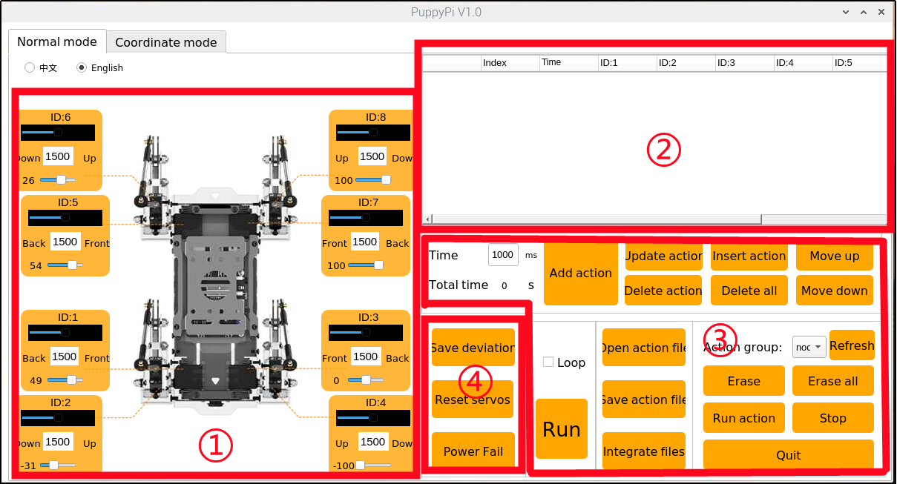

① **舵机操控区域**

可通过调整对应舵机的数值，对PuppyPi机器狗的姿态进行调整。

| **图标** | **功能说明** |
|----|----|
|  | 舵机ID编号。 |
|  | 用于调整舵机的角度位置，取值范围是500至2500。 |
|  | 用于调整舵机偏差，取值范围是-100至100。 |

② **动作详情列表**

可在动作详情列表内查看动作的执行时间及舵机参数。


| **图标** | **功能说明** |
|----|----|
|  | 动作编号。 |
|  | 动作运行时间，即执行该动作所用时间。 |
|  | 对应ID舵机的角度数值，可双击数值进行修改。 |
|  | 运行当前选择动作。 |

③ **动作组设置区域**

| **图标** | **功能说明** |
|----|----|
|  | 运行单个动作所需的时间，可直接在方框内修改数值。 |
|  | 运行完整动作组所需的时间。 |
|  | 将当前舵机操控区域的舵机数值作为一个动作，添加至动作详情列表的最后一行。 |
|  | 将动作详情列表内选择动作的舵机参数替换为当前舵机操控区域的数值，动作运行时间替换为"动作时间"的设定值。 |
|  | 在动作详情列表内选择动作的上方插入一个动作，舵机参数取舵机操控区域的数值，动作时间取"动作时间"的设定值。 |
|  | 将动作详情列表内的选择动作与其上一个动作进行位置交换。 |
|  | 删除动作详情列表内的选择动作。 |
|  | 删除动作详情列表内的所有动作。 |
|  | 将动作详情列表内的选择动作与其下一个动作进行位置交换。 |
|  | 运行一次动作详情列表内的动作，勾选"循环"代表循环运行动作。 |
|  | 打开所需的动作组文件。 |
|  | 将动作详情列表内的动作保存至指定位置。 |
|  | 通过按键"打开动作文件"打开一个动作组后，点击此按键打开另一个动作组，可将两者串联。 |
|  | 可在上位机中显示已保存的动作组。 |
|  | 刷新选择的动作组。 |
|  | 删除当前选择的动作组文件。 |
|  | （慎点）删除所有动作组文件。 |
|  | 执行一次选择的动作组。 |
|  | 停止正在运行的动作组。 |
|  | 退出上位机操作界面。 |

:::{Note}
动作组文件统一保存至Docker容器中的 "**/home/ubuntu/software/puppypi_control/ActionGroups**"
:::


④ **偏差设置区域（PuppyPi机器狗出厂前已调好偏差，此区域功能按键仅做了解）**

| **图标** | **功能说明** |
|----|----|
|  | 将调整后的偏差保存至PuppyPi机器狗。 |
|  | 将舵机操控区域内所有舵机的数值恢复至1500。 |
|  | 点击后，可手动调整舵机转动角度。 |

(2) **坐标模式**

坐标模式的界面可分为坐标控制区域、动作详情列表和动作组设置区域。


① **坐标控制区域**

可通过调整PuppyPi机器狗的关节坐标，对其姿态进行调整。

| **图标** | **功能说明** |
|:--:|:--:|
|  | X轴坐标用于调整PuppyPi机器狗的髋关节转动角度，取值范围是-15至15。数值越大，髋关节朝前转动的幅度越大。 |
|  | Z轴坐标用于调整PuppyPi机器狗的膝关节伸展幅度，取值范围是-15至-1。以-10为临界点，坐标值大于临界点时，膝关节向上抬起，小于临界点时则向下伸展。 |

② **动作详情列表**

可在动作详情列表内查看动作的执行时间及各关节的坐标值。

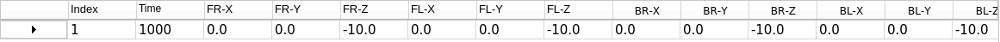

:::{Note}
下表的说明皆以PuppyPi机器狗为第一视角
:::

| **图标** | **功能说明** |
|:--:|:--:|
|  | 动作编号。 |
|  | 动作运行时间，即执行该动作所用时间。 |
|  | 机器狗右前足的髋关节对应的X轴坐标，可双击数值进行修改。 |
|  | 机器狗右前足的膝关节对应的Z轴坐标，可双击数值进行修改。 |
|  | 机器狗左前足的髋关节对应的X轴坐标，可双击数值进行修改。 |
|  | 机器狗左前足的膝关节对应的Z轴坐标，可双击数值进行修改。 |
|  | 机器狗右后足的髋关节对应的X轴坐标，可双击数值进行修改。 |
|  | 机器狗右后足的膝关节对应的Z轴坐标，可双击数值进行修改。 |
|  | 机器狗左后足的髋关节对应的X轴坐标，可双击数值进行修改。 |
|  | 机器狗左后足的膝关节对应的Z轴坐标，可双击数值进行修改。 |
|  | 运行当前选择动作。 |

③ **动作组设置区域**

坐标模式的动作组设置区域与普通模式的十分相似，除按键"**复位坐标**"外，其他按键与普通模式的对应按键具有相同功能，此处不再做过多说明，可到"[**1.2 上位机界面分布\ 普通模式**](#anchor_1_2_1)"查看具体的按键说明。

| **图标** | **功能说明** |
|:--:|:--:|
|  | 将坐标控制区域内所有的X轴坐标值恢复至0，Z轴坐标值恢复至-11。 |

## 2. 动作调用教学

### 2.1 实现目标

本节主要通过PuppyPi 上位机，对内置动作组进行调用。

### 2.2 动作组调用

(1)  将设备开机，并参照课程资料的"[远程工具安装及容器进入方法\1. 远程工具安装与连接](https://docs.hiwonder.com/projects/PuppyPi/en/latest/docs/8_remote_tool.html#id2)"内容，通过VNC远程连接工具连接。


(2)  双击，选择"执行"打开上位机。

(3)  点击"**打开动作文件**"将本文同路径下的动作组文件打开。


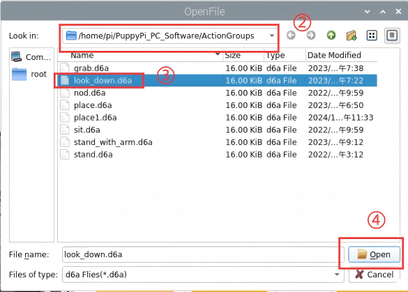

(4)  此时动作详情列表会显示已打开的动作组。


(5)  点击"运行"即可。


(6)  也可点击动作组的下拉按钮，选择要运行的动作组，再点击动作组运行即可。


## 3. 动作编辑教学

### 3.1 实现目标

PuppyPi机器狗的上位机软件分为两种操作模式：普通模式、坐标模式。普通模式，即通过调整机器狗的舵机参数，对其姿态进行调整。

本节课会在普通模式下编辑一个让PuppyPi机器狗"招手"的动作组，完成对动作编辑的举例说明，该动作组包含13个独立动作。

### 3.2 动作设计

(1)  双击桌面图标，打开上位机，选择"**普通模式**"。


(2)  **动作1**：点击偏差调节区域的"**复位舵机**"按键，令PuppyPi机器狗恢复初始姿态。将动作时间修改为500ms，并点击动作编辑区域的"**添加动作**"按钮，将该动作添加到动作列表。


在动作列表区域可以查看到动作的具体参数。


:::{Note}
后续每编辑一个动作，都需要将其添加至动作列表内。
:::

(3)  拖动滑杆，将1号舵机的参数调整为1000。


(4)  **动作2**：参考下图修改其他舵机参数，使PuppyPi机器狗仰起前半身，将该动作添加到动作列表。


(5)  **动作3**：对舵机参数进行调整，增大机器狗仰起的幅度，将该动作添加到动作列表。


(6)  **动作4**：重复动作3，让此动作过渡得更加自然。将时间修改为300ms，点击"**添加动作**"按钮。


(7)  **动作5**：按照下图红框内所示数值调整舵机，令机器狗右前足的髋关节朝前摆动。将时间修改为400ms，点击"**添加动作**"按钮，将该动作添加到动作列表。


(8)  **动作6**：更改舵机参数，令机器狗右前足的膝关节朝上摆动，将该动作添加到动作列表。


(9)  **动作7**：修改舵机参数，让机器狗右前足的膝关节朝下摆动，将该动作添加到动作列表。

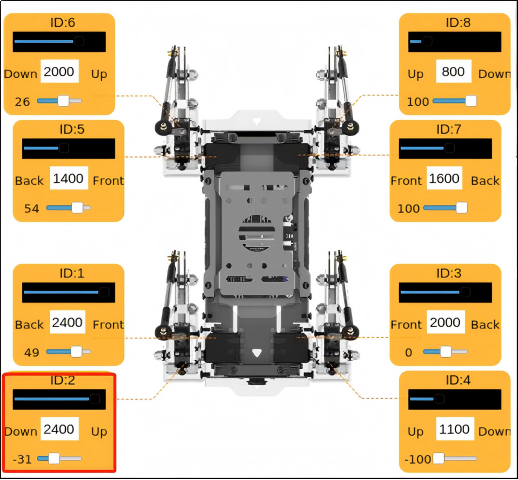

(10) **动作8**：重复动作6，令机器狗右前足的膝关节朝上摆动，将该动作添加到动作列表。


(11) **动作9**：重复动作7，让机器狗右前足的膝关节朝下摆动，将该动作添加到动作列表。


(12) **动作10**：令PuppyPi机器狗恢复至动作3的坐姿。将时间修改为600ms，点击"**添加动作**"按钮，将该动作添加到动作列表。


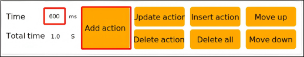

(13) **动作11**：为了令动作衔接更加平缓流畅，此动作与动作10相同。将时间修改为300ms，点击"**添加动作**"按钮，将该动作添加到动作列表。


(14) **动作12**：按照下图更改舵机参数，令机器狗俯身，前面两足着地。将时间修改为600ms，点击"**添加动作**"按钮，将该动作添加到动作列表。


(15) **动作13**：点击"**复位舵机**"，令机器狗恢复初始化动作，并点击"**添加动作**"，将该动作添加至动作列表。

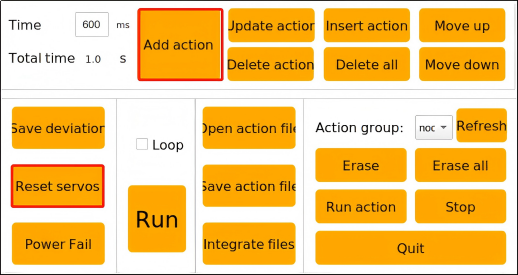

该动作组的全部数值参数如下表所示：


:::{Note}
红色数值为每一步骤中需要调整的时间参数或舵机参数。
:::

### 3.3 动作保存

(1)  为了方便后期的调试和管理，可点击"**保存动作文件**"按钮，将动作组保存起来。

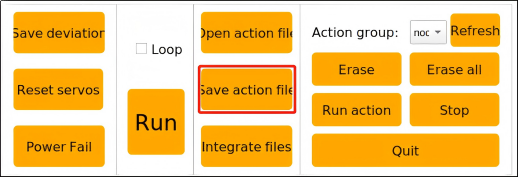

(2)  将保存路径选择为Docker容器中的"**/home/ubuntu/software/puppypi_control/ActionGroups"**，此处将动作组命名为"**sit_wave**"， 随后点击"**Save**"保存即可。


<p id="anchor_4"></p>

## 4. 坐标模式学习

### 4.1 实现目标

PuppyPi机器狗的上位机软件分为两种操作模式：普通模式、坐标模式。坐标模式，即通过调整机器狗的关节对应坐标，对其姿态进行调整。这种设置方法满足了各方向的角度设置，令姿态设置更加直观。

本节课会在坐标模式下编辑一个让机器狗"前俯"的动作组，该动作组包含6个独立动作。

### 4.2 坐标说明

PuppyPi机器狗的关节名称如下图所示：


X轴坐标用于调整PuppyPi机器狗的髋关节转动角度，其取值范围是-15至15。数值越大，对应髋关节朝前转动的幅度越大。反之，则朝后转动的幅度越大。

Z轴坐标用于调整PuppyPi机器狗的膝关节伸缩幅度，其数值的绝对值是机器狗的高度，其取值范围是-15至-1。

以-10为临界点，当Z轴坐标值大于临界点，数值越大，对应膝关节的收缩幅度越大，即大腿与小腿的夹角越小。当坐标值小于临界点，数值越小，对应膝关节的伸展幅度越大，即大腿与小腿的夹角越大。

### 4.3 动作设计

:::{Note}
本节内容以PuppyPi机器狗为第一视角。
:::

(1)  双击桌面图标，打开上位机，选择"**坐标模式**"。

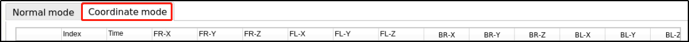

(2)  **动作1**：点击"**复位坐标**"按键，令机器狗恢复初始姿态。将动作时间修改为800ms，点击"**添加动作**"按钮，将该动作添加到动作列表。


在动作列表区域可以查看到动作的具体参数。此时，PuppyPi机器狗四肢坐标皆为（0，0，-10），即机器狗高度为10cm。


:::{Note}
后续每编辑一个动作，都需要将其添加至动作列表内。
:::

(3)  **动作2**：修改机器狗四肢的髋关节对应的Z轴坐标，令机器狗向前俯身。将动作时间修改为500ms，点击"**添加动作**"按钮，将该动作添加到动作列表。


(4)  **动作3**：修改机器狗前面两足的髋关节对应的Z轴坐标，让机器狗抬起前半身，将该动作添加到动作列表。


(5)  **动作4**：重复动作2，让机器狗向前俯身，将该动作添加到动作列表。


(6)  **动作5**：重复动作3，让机器狗抬起前半身，将该动作添加到动作列表。


(7)  **动作6**：点击"**复位坐标**"按钮，令机器狗恢复初始姿态，并点击"**添加动作**"按钮，将该动作添加到动作列表。

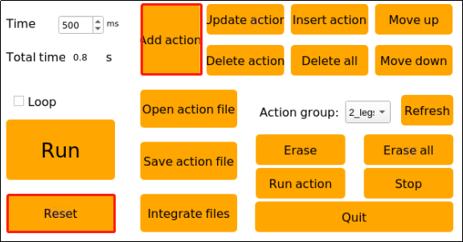

该动作组的全部数值参数如下表所示：


:::{Note}
红色数值为每一步骤中需要调整的时间参数或舵机参数。
:::

### 4.4 动作保存

(1)  点击"**保存动作文件**"按钮，将动作组保存起来。


(2)  将保存路径选择为"**/home/pi/PuppyPi_PC_Software/ActionGroups**"，此处将动作组命名为"**Lean_forward**"，随后点击"**Save**"保存即可。


## 5. 串联动作文件

### 5.1 实现目标

串联动作文件是将两个动作组文件首尾串联起来，组成一个新的动作组文件，这样可实现动作组之间的合并。

本节课会在普通模式下串联动作组"raise_hands"（作揖）和"sit"（坐下），完成对串联动作文件的举例说明。

<p id="anchor_5_2"></p>

### 5.2 普通模式

(1)  连接VNC后，双击桌面图标，打开上位机，选择"**普通模式**"。

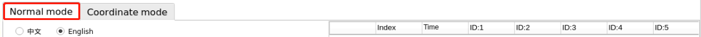

(2)  点击动作组设置区的"**打开动作文件**"按键，并双击打开"**raise_hands**"动作组。


此时，动作组详情列表中可以查看"**raise_hands**"动作组的参数。

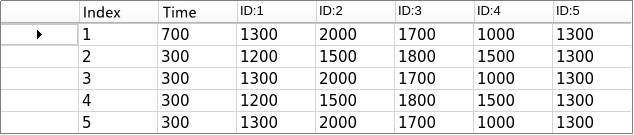

(3)  点击"**串联动作文件**"按键，打开"**sit.d6a**"动作组，完成两个动作组的串联。

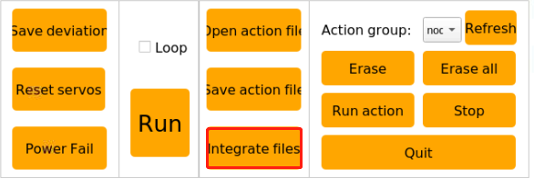


此时，查看动作组详情列表，"**sit**"动作组的参数衔接在"**raise_hands**"动作组的后面。


(4)  点击"**运行**"按键，将从头到尾运行由这两个动作组串联而成的新动作组。


(5)  点击"**保存动作文件**"按键，将动作组命名为"**raise_hands_sit**"，并点击"**Save**"进行保存。


### 5.3 坐标模式

双击桌面图标，打开上位机，选择"**坐标模式**"，其界面如下图所示。


坐标模式与普通模式的按键面板十分相似，串联动作文件的操作流程亦是一致的，此处不做过多说明。如果需要在坐标模式下串联动作文件，可以参考"[5.2 普通模式](#anchor_5_2)"的步骤说明进行操作。

## 6. APP自定义控制

### 6.1 实现目标

此前在"**[4. 坐标模式学习](#anchor_4)**"学习了动作组"Lean_forward"的编辑方法，本节课会通过手机APP的自定义功能来执行该动作组。

<p id="anchor_6_2"></p>

### 6.2 准备工作

(1)  连接VNC后，点击系统桌面左上角的图标，打开Terminator终端。

(2)  输入指令并按下回车，进入目录可查看到当前所有动作组的名称

```commandline
cd software/puppypi_control/ActionGroups
```

```commandline
ls
```


### 6.3 操作步骤

(1)  打开手机APP"**WonderPi**"，连接PuppyPi机器狗，点击进入"**表演模式**"界面。

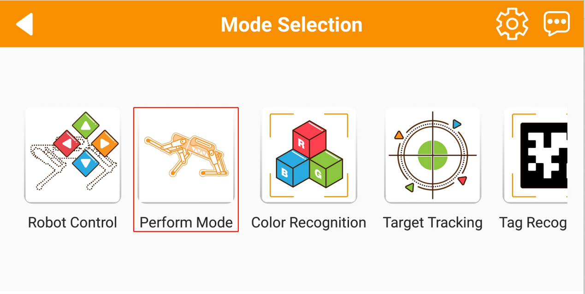

(2)  点击界面下方的"**自定义**"按键。


(3)  点击"**增加**"按键，添加自定义动作。


(4)  填写所需的动作信息，"**动作名称**"一栏填入"**向前倾**"，"**动作文件名**"一栏填入"**Lean_forward**"。填写完成后，点击"**好的**"按键。


```commandline
cd software/puppypi_control/ActionGroups
```

:::{Note}
"动作名称"一栏可随意填写，"动作文件名"一栏需根据PuppyPi机器狗的现有动作组进行填写。如需查看具体的动作组名称，可参考"[6.2 准备工作](#anchor_6_2)"进行操作。
:::

(5)  点击"**自定义**"按键，选择"**向前倾**"动作，PuppyPi机器狗便会执行设定动作。


(6)  如需修改动作，可长按"**向前倾**"字样，并在弹窗内点击"**编辑**"按键，即可修改自定义动作的设定。点击"**删除**"按键，即可删除选择的自定义动作。


