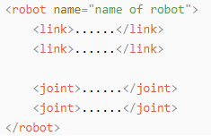
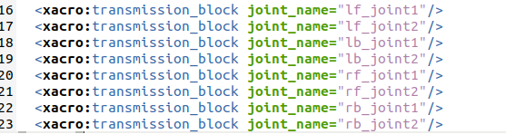
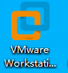
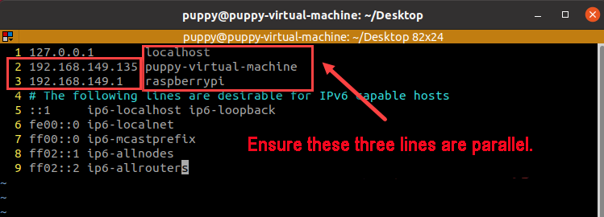

# ROS机器狗仿真课程

## 1. URDF模型简介与入门

### 1.1 URDF模型简介

URDF是一种基于XML规范、用于描述机器人结构的格式。这一格式的目的在于提供一种尽可能通用的机器人描述规范。

机器人通常被建模成由多个连杆和关节组成的结构，连杆可以理解成有质量的刚性物体，关节可以理解成，用于连接和限制两个连杆之间的相对运动。

当多个连杆通过关节相互连接又相互限制，就构成了一个机器人运动模型。URDF文档即描述了这样的一系列关节与连杆的相对关系、惯性属性、几何特点和碰撞模型。

### 1.2 xacro模型与URDF模型比较

URDF模型是比较简单的机器人模型描述文件，它有结构明了，容易理解的特点，若用URDF模型来描述比较复杂的机器人结构时，就会出现描述文件冗长，无法简洁的描述机器人模型。

xacro模型是URDF模型的拓展形式， 本质上两者是一样的。若使用xacro格式来描述机器人，则可以通过更高级的方式来简洁化机器人描述文件，能提高描述代码的复用性，一定程度上解决URDF模型的冗长问题。

例如，我们需要描述一个人形机器人的双腿，若使用URDF模型，我们需要将单腿单独描述，若使用的是xacro模型，则只需要描述单腿，进行复用。

### 1.3 URDF模型基本语法

- #### 1.3.1 XML基础语法

由于URDF模型是基于XML规范编写的，我们需要了解XML格式的基本构成。

- **元素：**

元素可以根据我们想要定义的名字去定义，定义元素的时候我们可以根据下列公式：

```xml
<元素>
</元素>
```

- **属性：**

属性是被包含到元素内部，用于定义一个元素的一些性质和参数，定义元素的时候可以根据下列公式：

```xml
<元素
    属性_1 = "属性值1"
    属性_2 = "属性值2">
</元素>
```

- **注释：**

注释不影响其他属性和元素，定义注释时可以根据下列公式：

```xml
<!-- 注释内容>
```

- #### 1.3.2 连杆的介绍

连杆在URDF模型中以"link"作为标签，它描述了机器人某个刚体部分的外观和物理属性，编写连杆动作会用到下图标签：


- \<visual\>：描述机器人link部分的外观参数，如尺寸、颜色、形状等。

- \<inertial\>：描述link的惯性参数，主要用到机器人动力学的运算部分。

- \<collision\>：描述link的碰撞属性。

每个标签都含相应的子标签和不同的作用，可以参考下表：

| **标签** | **作用** |
|:---|:---|
| origin | 对连杆位姿的描述。内部有两个参数：xyz描述的是连杆在仿真地图中的位姿，rpy描述的是连杆在仿真地图中的姿态。 |
| mess | 描述连杆的质量 |
| inertia | 描述连杆的惯性，由于惯性矩阵的对称性，需要填入六个参数ixx, ixy, ixz, iyy, iyz, izz作为属性。这些参数需要通过计算得到。 |
| geometry | 描述连杆的形状，它有用mesh参数加载纹理文件，用filename参数加载纹理的路径地址。还有三个子标签：box、cylinder、sphere，分别表示矩形、圆柱、球。 |
| material | 描述连杆的材质，参数name为必填项。通过子标签color可以调节颜色和透明度。 |

<p id="anchor_1_3_3"></p>

- #### 1.3.3 关节

关节在URDF模型中以"joint"作为标签，描述机器人关节的运动学和动力学属性，以及运动的位置和速度限制。根据运动的形式，将关节分为下表中六种类型：

|                  **类型和说明**                  |  **标签**  |
|:------------------------------------------------:|:----------:|
|          旋转关节：可以围绕单轴无限旋转          | continuous |
| 旋转关节：类似于continuous，但是有旋转的角度限制 |  revolute  |
|   滑动关节：沿某一轴线移动的关节，带有位置极限   | prismatic  |
|    平面关节：允许在平面正交方向上平移或者旋转    |   planar   |
|         浮动关节：允许进行平移、旋转运动         |  floating  |
|          固定关节：不允许运动的特殊关节          |   fixed    |

编写关节动作会用到下图标签：


- \<parent_link\>：父连杆。

- \<child_link\>：子连杆。

- \<calibration\>：用于校准关节角度。

- \<dynamics\>：描述运动的一些物理属性。

- \<limit\>：描述运动的一些极限值。

每个标签都含相应的子标签和不同的作用，可以参考下表：

| **标签** | **作用** |
|:--:|:--:|
| origin | 对父连杆位姿的描述。内部有两个参数：xyz描述的是连杆在仿真地图中的位姿，rpy描述的是连杆在仿真地图中的姿态。 |
| axis | 设置子连杆对父连杆的XYZ三轴中任意一轴做转动。 |
| limit | 限制子连杆，lower属性和upper属性限制了旋转的弧度范围，effort属性限制的是转动过程中的受力范围。(正负value值，单位为牛或N)，velocity属性限制了转动时的速度，单位为米/秒或m/s。 |
| mimic | 描述该关节与其他关节的关系 |
| safety_controller | 描述安全控制器参数，用于保护机器人的关节运动。 |

- #### 1.3.4 robot标签

完整的机器人最顶层的标签，\<link\>标签和\<joint\>标签必须包含在\<robot\>内，格式如下：



- #### 1.3.5 gazebo标签

配合gazebo仿真器使用，可以设置一些仿真参数，使用此标签引入gazebo插件、gazebo物理属性设置等等。


- #### 1.3.6 编写简单的URDF模型


1. **设置机器人模型名称**

在编写URDF模型最开始时，我们需要设置机器人模型的名字："**\<robot name="机器人模型名称"\>**"。在模型编写的最后输入"**\</robot\>**"，表示该机器人模型编写完成。


2. **设置连杆**

- 1.  编写第一个连杆，用缩进表示此连杆属于此次设置的模型内，然后需要设置连杆的名称："**\<link name="连杆名称"\>**"。在连杆编写的最后需要输入"**\</link\>**"，表示该连杆编写完成。


- 2.  编写连杆描述部分，用缩进表示此描述用于此次设置的连杆内，需要在描述的开头输入"\<**visual**\>"开始描述，在描述结束后输入"**\</visual\>**"。


- 3.  "**\<geometry\>**"是对连杆形状的描述，描述完毕后需要输入"**\</geometry\>**"，在其中，用缩进表示其内部是对连杆外形的具体描述。下图描述了一个连杆外形："**\<cylinder length="0.01"radius="0.2"/\>**"，其中，length="0.01"表示该连杆的长度为0.01米，radius="0.2"该连杆半径为0.2米，是一个圆柱体。


- 4.  "**\<origin\>**"是对连杆位置的描述，用缩进表示对连杆位置的具体描述。下图描述了一个连杆位置："**\<origin rpy="0 0 0" xyz="0 0 0"/\>**"，其中rpy为连杆的角度，xyz为连杆的坐标位置。表示连杆在坐标系中的位置为原点。


- 5.  "**\<material\>**"是对连杆位置的描述，用缩进表示对连杆颜色的具体描述，需要在描述的开头输入"\<**material**\>"开始描述，在描述结束后输入"**\</material\>**"。下图描述了将连杆设置成黄色："**\<color rgba="1 1 0 1"/\>**"，rgba="1 1 0 1"为设置颜色阈值。


**设置关节**

- 1.  编写第一个关节，用缩进表示此关节属于此次设置的模型内，然后需要设置关节的名称和类型："**\<joint name="关节名称" type="关节类型"\>**"。在关节编写的最后需要输入"**\</joint\>**"，表示该关节编写完成。

:::{Note}
关节类型可以前往"[1.3 URDF模型基本语法\ 关节](#anchor_1_3_3)"进行学习。
:::


- 2. 编写关节连接连杆描述部分，用缩进表示此描述用于此次设置的关节内，需要设置parent参数和child参数。可以根据以下公式设置："**\<parent link="父连杆"/\>**"、"**\<child link="子连杆"/\>**"。当关节转动的时候，会以父连杆为支店，转动子连杆。


- 3.  "**\<origin\>**"是对关节位置的描述，用缩进表示对关节位置的具体描述。下图描述了一个关节位置："**\<origin xyz="0 0 0.1"/\>**"，其中，xyz为关节的坐标位置，表示关节在坐标系的具体位置为x=0、y=0、z=0.1。


- 4.  "**\<axis\>**"是对关节位置的描述，用缩进表示对关节姿态的具体描述。下图描述了一个关节姿态："**\<axis xyz="0 0 1"/\>**"，其中，xyz为关节的姿态位置。


- 5.  "**\<limit\>**"是对关节运动进行限制，用缩进表示对关节角度限制的具体描述。下图描述了关节限制了转动关节最大的力不超过300牛，转动弧度的上线为3.14，下限为-3.14。其中，根据以下公式设置:effort="**关节的力度（牛）**"、velocity="**关节运动的速度**"、lower="**弧度下限**"、upper="**弧度上限**"。


- 6.  "**\<dynamics\>**"是对关节位动力学的描述，用缩进表示对关节姿态的具体描述。下图描述了一个关节的动力学参数："\<**dynamics damping="50"friction="1"/\>**"，其中，damping="**阻尼值**"、friction="**摩檫力**"。


## 2. ROS机器狗URDF模型说明

### 2.1 导入虚拟机

- #### 1. 安装虚拟机软件

虚拟机软件的安装可以参考："**[软件工具\2. 虚拟机镜像及虚拟机安装包]()**"中的教程进行安装。

- #### 2. 虚拟机的打开和导入

1.  将同目录下的虚拟机文件解压到任意非中文路径下。

2.  <span class="mark">将产品资料目录"**2软件工具\2.虚拟机镜像及虚拟机安装包\虚拟机镜像**"下的虚拟机文件"**PuppyPi_VM**.zip"解压以后打开客户端。</span>


3.  点击"**打开虚拟机**"。


4.  前往虚拟机解压的路径，选择"**<span class="mark">PuppyPi_VM,.ovf</span>**"，点击"**打开。**


5.  点击"**浏览**"设置虚拟机存放路径，建议存放至固态硬盘，因为存放磁盘的读写速度将会影响虚拟机的速度，最后点击"**导入**"。


6.  点击"**开启此虚拟机。**


### 2.2 打开机器狗URDF模型文件

1)  在VMware虚拟机的Ubuntu系统中按下"Ctrl+Alt+T"打开终端，输入以下指令进入储存URDF模型的文件夹："**cd** **puppy_sim/src/puppy_description/urdf**"


2)  以"**pug.urdf.xacro**"为例，在该目录下输入指令"**vim puppy.urdf.xacro**"，用vim 打开ROSPug机器狗的URDF模型。


3)  出现下图则证明打开了ROSPug机器狗URDF模型文件：


### 2.3 URDF模型分析和理解

- #### 1. URDF模型的结构

ROSPug的URDF模型文件由3个文件组成，分别是：**"puppy.urdf.xacro"、"puppy.gazebo.xacro"、"puppy.transmission.xacro"**，其中puppy.urdf.xacro是整个机器人的主URDF文件，通过include其他2个xacro文件，使整个URDF的各个文件组合在一起，就定义了这个ROSPug的整个机械结构、动力学、仿真等信息。文件之间通过include和宏引用组织在一起，这样可以划分功能模块，便于阅读和维护最终形成一个完整的URDF模型文件。

- #### 2. puppy.urdf.xacro分析

它定义了机器人的基本结构，包括机身、关节、连接等。这个文件中也包含了一些宏定义和属性定义，这些定义在代码中可以被多次使用，以简化代码和避免出现重复的代码。由于代码较长，所以这里将分为3个部分并举例介绍，主要包括以下部分：

1. **模型声明和属性定义**

"**robot**"标签定义了机器人模型的名称为"**puppy**"，"**property**"标签定义了一些属性值，分别代表最大力矩和关节最大速度。

"**include**"引入了两个文件，分别是puppy.transmission.xacro和pug.gazebo.xacro。这些文件包含了机器人传输系统和在Gazebo仿真环境中的一些属性。


2. **连杆的定义**

Link元素表示机器人模型中的一个刚体，它可以包含惯性信息、可视化信息、碰撞信息等。下面是一个Link元素的示例代码，包含了惯性信息、可视化信息和碰撞信息：


3. **关节的定义**

Joint元素表示机器人模型中的一个关节，它连接两个Link，并定义了它们之间的相对运动。下面是一个Joint元素的示例代码，包含了关节的类型、连接的Link、关节轴的方向和关节限制等信息：

- #### 3. puppy.gazebo.xacro分析

主要用于Gazebo仿真器中创建机器人模型。它定义了一个机器人的各个部件的物理特性、关节控制、传感器等信息，以便在Gazebo中进行仿真、控制和测试。由于代码较长，所以这里将分为3个部分并举例介绍，主要包括以下部分：

1. Gazebo插件定义

这个部分定义了一个Gazebo插件"**gazebo_ros_control**"，用于实现机器人的控制。这个插件的具体实现是由"**libgazebo_ros_control.so**"这个库提供的。并对Gazebo仿真类型和命名空间进行设定。


2. 宏定义

这个标签定义了几个Xacro的宏（macro），用于方便地设置机器人模型中各个Link的颜色和物理属性。其中"**model_color**"宏用于设置Link的颜色，"**link_setup_block**"宏用于设置Link的物理属性。

3. 使用宏

使用下述宏来设置机器人模型中各个Link的颜色和物理属性。定义model_color宏来简化连杆颜色的设置。这个宏接受一个link_name参数，并为指定的连杆设置黑色材料和重力开启。

 

- #### 3.4 puppy.transmissions.xacro分析

这个transmissions.xacro文件定义了机器人模型中的传动系统，包括各个关节和电机之间的传动方式。在运行时，ROS会将"**transmissions.xacro**"文件转换为机器人模型中的传动系统。主要包含以下2个部分：

1. xacro宏定义

使用了Xacro宏定义\<xacro:macro\>来定义传动系统的模板。其中，\<transmission\>标签用于定义传动系统的类型和名称，\<joint\>标签用于指定关节驱动器接口，\<actuator\>标签用于指定机械减速比等相关属性。


2. 定义不同的传动类型

调用transmission块xacro宏，为每个joint定义对应的transmission。这样可以通过配置文件统一定义机器人的transmission系统。



## 3. Gazebo简介与入门

### 3.1 Gazebo简介

Gazebo是一款3D动态模拟器，能够在复杂的室内和室外环境中准确有效地模拟机器人。与游戏引擎提供高保真度的视觉模拟功能类似，Gazebo提供高保真度的物理模拟，并提供一整套传感器模型，以及对用户和程序非常友好的交互方式。

1.  Gazebo的典型用途：

- 测试机器人算法
- 设计机器人
- 用现实场景进行回归测试

2.  Gazebo的一些主要特点：

- 包含多个物理引擎
- 包含丰富的机器人模型和环境库
- 包含各种各样的传感器
- 程序设计方便和具有简单的图形界面

3.  Gazebo官方建议，Gazebo目前最好在Ubuntu或者其他的Linux发行版上运行。同时您的计算机需要具有以下功能：

- 专用GPU：Nvidia卡往往在Ubuntu中运行良好
- 至少是Intel I5或同等产品的CPU
- 至少500MB的可用磁盘空间
- 安装尽可能高版本的Ubuntu Trusty

### 3.2 Gazebo的系统结构

Gazebo 使用分布式架构，其中包含用于通信、物理模拟、渲染、传感器生成和用户界面的单独库。此外，gazebo 提供两个用于运行模拟的可执行程序：

1)  服务器 gzserver 用于模拟物理，渲染，和传感器；

2)  客户端 gzclient 提供图形界面以可视化模拟并与模拟交互的；

3)  客户端和服务器使用 Gazebo 通信库进行通信。

Gazebo 的Master类似ros系统通信机制的主节点，不过它是话题（topic），提供topic名字的搜索和topic的管理。一个单独的Master可以管理多个物理环境的仿真、传感器的产生和图形界面。

1)  通信有关的库

这个库充当 Gazebo 的通信和传输机制，目前仅支持发布/订阅。通信有关的库是所有子库实现的基础，一般情况下都会包含这个库。

- 依赖的库：Protobuf 和 boot::ASIO

- 外部接口：支持通过命名主题与 Gazebo 节点通信

- 内部接口：没有

- 广播的话题：没有

- 订阅的话题：没有

2)  物理环境的库

这个物理环境的库为仿真的基本部分提供一个简单和基本的界面，包括刚体、碰撞形状、关节的相关约束。这个接口已经内嵌入四个开源的物理引擎：Open Dynamics Engine(ODE)、Bullet、Simbody、Dynamic Animation and Robottics Toolkit(DART)。

通过SDF格式物理描述模型的xml格式文件能够被这些物理引擎加载。它们提供不同的实现算法和仿真特性。

- 依赖的库：依赖:动力学引擎的库（内部的碰撞检测）

- 外部接口：为物理模拟提供简单通用的接口

- 内部接口：提供第三方动态引擎定义物理库的基本接口

3)  渲染的库

这个解析库使用OGRE提供一个解析三维的场景的简单界面。包括灯光、纹理和天空的仿真，可以为渲染引擎编写插件。

- 依赖的库：OGRE

- 外部接口：允许加载、初始化和场景的创建

- 内部接口：存储用于可视化的元数据，调用 OGRE API实现模型的渲染

4)  传感器数据生成库

这个传感器库能够实现各种类型的传感器从物理环境仿真中监听仿真环境的更新，并根据传感器的特性去产生不同的数据。

- 依赖的库：渲染库和物理环境库

- 外部接口：提供基本的传感器的初始化和传感器的设置

- 内部接口：TBD

5)  GUI

GUI 库使用QT创建图形小部件，供用户模拟交互。用户可以通过 GUI小部件暂停或更改时间步长来控制时间流。用户还可以通过添加、修改或删除模型来修改场景。此外，还有一些用于可视化和记录模拟传感器数据的工具。

- 依赖的库：渲染库和QT

- 外部的接口：无

- 内部的接口：无

### 3.3 Gazebo坐标系

坐标系是进行正、逆运动学分析比不可少的。下面，我们按照ROSPug模型，给大家介绍几种常用的坐标系。

1)  世界坐标系

世界坐标系 (World Coordinate System)是一个位于"地面"上的静止参考坐标系。它不会随着时间的改变发生平移或旋转变化。 当然，这里的"地面"是广义上的"地面"。比如，机器人位于桌面上，那么世界坐标系就位于这个桌子的平面上。

2)  腿部坐标系

腿部坐标系(Joint Coordinate System)顾名思义就是定义在腿部的坐标系。同样，腿部坐标系的建立也遵循右手定则。因此，在下图示例的机器人模型中，红轴为X轴，绿轴为Y轴，蓝轴为Z轴。

腿部坐标系的数量并不固定，它主要和腿的数量相关。所以，大家在建立关节坐标系时需要格外注意。  


## 4. Gazebo仿真及运动规划

:::{Note}

1.  开始仿真前，需确保机器狗有充足的电量，最好是在充满的状态下进行。

2.  注意： 以下操作全部操作需要结合VM虚拟机和机器狗进行，请提前开启机器狗。

3.  该仿真建议将机器人设置在直连模式，以直连模式来体验该玩法。

:::

### 4.1 安装虚拟机

- #### 1. 安装虚拟机软件

虚拟机的安装可以参考"**[软件工具\6.虚拟机安装包与虚拟机镜像]()**"路径下的文档。

- #### 2. 虚拟机的打开和导入

1.  将同目录下的虚拟机文件解压到任意非中文路径下。

2.  将产品资料目录"[软件工具\2.虚拟机镜像及虚拟机安装包\虚拟机镜像]()"下的虚拟机文件"**PuppyPi_VM.zip**"解压以后打开客户端。



3.  点击"**打开虚拟机**"。


4.  前往虚拟机解压的路径，选择"**<span class="mark">PuppyPi_VM,.ovf</span>**"，点击"**打开。**


5.  点击"浏览"设置虚拟机存放路径，建议存放至固态硬盘，因为存放磁盘的读写速度将会影响虚拟机的速度，最后点击"导入"。


### 4.2 配置虚拟机网络

1.  首先启动PuppyPi机器狗，使用上面安装好VMware虚拟机的电脑连接机器狗的热点，热点一般以"**HW-XXXXXXXX**"格式为名，本文以"**HW-84E02404**"为例，密码为：**hiwonder**。


2.  连接成功后返回VMware虚拟机，在软件界面点击"**编辑—\>虚拟机网络配置**"。


3. 在弹出的"**虚拟网络编辑器**"窗口中点击底部的"**更改设置**"按钮。


4.  在"**桥接模式**"处的网卡列表中选择电脑的无线网卡，不同电脑的无线网卡可能不一样，但无线网卡名称中一般会包含"**802.11ac**"文字，选择名称中包含"**802.11ac**"的网卡即可，最后点击确定即可。


5. 点击"**开启此虚拟机**"，等待开机完成即可。


6. 进入 Ubuntu 系统桌面，单击鼠标右键，选择"**Open in Terminal**"打开命令栏。


7. 输入以下指令，并按下回车。红框内为 Ubuntu 系统 IP。

```commandline
ifconfig
```


:::{Note}

如果输入"**ifconfig**"指令后无法找到 **IP** ，则需要检查是否正确连接到 **Puppy** 的热点，确认无误后若还是没有**IP**则可输入"**sudo dhclient ens33**"来手动获取其 **IP**。其中，ens33 默认情况下网卡的名称。

:::

### 4.3 配置系统环境

1. 进入 Ubuntu 系统桌面，单击鼠标右键，选择"**Open in Terminal**"打开命令栏。


2. 在命令栏输入指令,进入配置网络文件。

```commandline
sudo vim /etc/hosts
```

3. 我们将下图所示的2行和3行的IP，分别替换为虚拟机、树莓派的IP。




:::{Note}

1. 在修改 **ip** 的时候，我们要保证缩进与上行的相同。

2. 直连模式下 **PuppyPi** 的 **IP** 默认为 **192.168.149.1**

:::

4. 在命令栏输入指令,更新配置。

```commandline
source ~/.bashrc
```

5. 进入 VNC ，打开命令栏，输入以下指令：**将 PuppyPi 的动作数据传入 gazebo。

```commandline
rosparam set /puppy_control/joint_state_controller_pub_topic true
```


### 4.4 启动Gazebo仿真工具

1. 在虚拟机终端中输入以下指令，开启gazebo仿真，等待服务启动完成，如出现下图所示内容则代表gazebo成功启动。

```commandline
roslaunch puppy_description gazebo.launch
```


2. 点击虚拟机Ubuntu系统页面左侧任务栏的gazebo仿真软件图标即可进入仿真页面，然后gazebo仿真页面下方的启动按钮即可开启gazebo仿真。


### 4.5 Gazebo GUI简介

仿真软件界面如下图：


各个位置具体作用见下表：

|  名称  |                     作用                     |
|:------:|:--------------------------------------------:|
| 菜单栏 | 配置或修改仿真软件的参数，以及一些交互功能。 |
| 工具栏 |     提供一些与模拟器交互时最常用的选项。     |
| 时间戳 |       可以对虚拟空间内的时间进行操作。       |
| 动作栏 |       对模型进行操作，并可以修改参数。       |
|  场景  |   模拟器的主要部分，是仿真模型显示的地方。   |

### 4.6 使用仿真软件

我们以Trot步态为例进行使用

1. 我们回到VNC，在VNC输入指令，查看步态是否为 Trot。

```commandline
rosed puppy_control puppy_demo.py
```


2. 接着再输入指令，并按下回车，启动 Trot 步态。

```commandline
rosrun puppy_control puppy_demo.py
```

3. 可以观察到机器狗开始运行 Trot 步态，仿真软件内部，机器狗也开始移动。


4. 程序内默认为 Trot 步态，如需切换其它步态，可以在VNC输入指令，重新找到下图中的位置。例如 Amble，则在下图代码"**gait = 'Trot'**"里， 将Trot 修改为 Amble ，修改后为"**gait = 'Amble'**"。

```commandline
rosed puppy_control puppy_demo.py
```


5. 按下"ESC"，进入下拉命令模式，输入":wq"，保存修改。

```commandline
:wq
```


