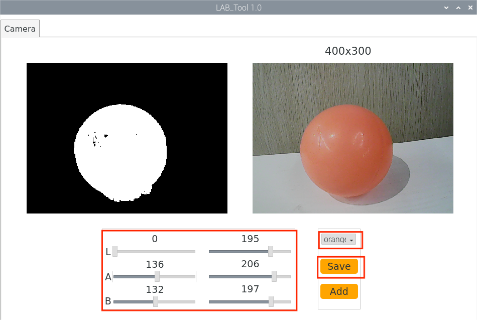
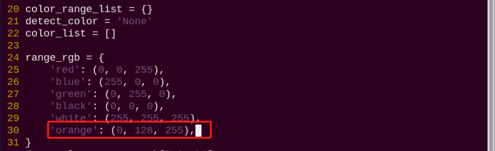
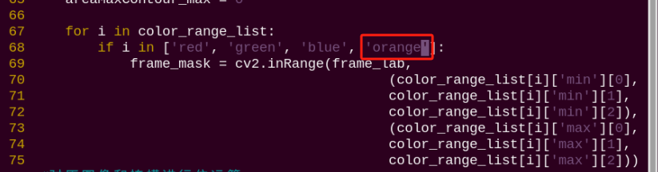
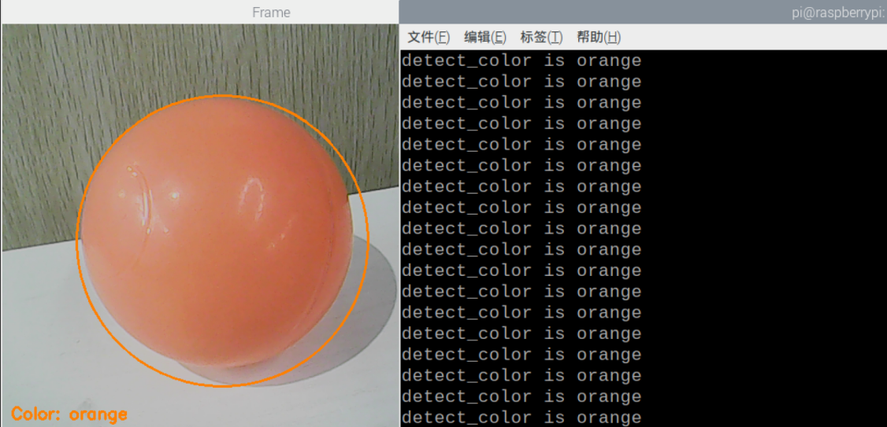

# ROS+OpenCV视觉识别与追踪项目

<p id="anchor_1"></p>

## 1. 颜色阈值的调节

我们都知道不同光源下会对物体颜色造成不同的影响，因此在进行颜色相关的功能时，会存在识别上的差异。如果这种差异影响到功能的实现，需要进行差异消除。

针对以上这个问题的解决，本节我们来学习这款LAB_Tool工具。

### 1.1 启动 LAB_Tool

(1) 打开VNC软件，在系统桌面找到并双击"**LAB_Tool**"图标。

(2) 此时将出现"**执行文件**"对话框，点击"**执行**"即可。


(3) 进入软件后，我们可以看到LAB_Tool的界面，如下图所示：


:::{Note}
若回传画面无法正常显示，即摄像头连接失败，需检查其连接线是否连接正常。
:::

### 1.2 LAB_Tool 的界面分布及说明

LAB_Tool软件的界面分为画面显示区和识别调节区两个部分。

| **区域名称** | **区域分布** |
|----|----|
| 画面显示区 |  |
| 识别调节区 |  |

(1) **画面显示区**

| **图标** | **功能说明** |
|----|----|
|  | 左侧为原始画面，右侧为处理后的画面。 |

(2) **识别调节区**

在识别调节区，可调节颜色属性。各部分对应功能见下表：

| **图标** | **功能说明** |
|----|----|
|  | 用于调节画面L分量的数值。（A、B滑杆功能与此类似，皆为调节画面对应分量的数值。） |
|  | 选择需要调节的识别颜色。 |
|  | 用于保存调节的效果数值。 |
|  | 用于增加识别的颜色种类。 |

### 1.3 调节默认颜色效果

我们这里以调节红色为例，其它颜色亦可参考，具体调节步骤如下：

(1) 启动系统桌面的LAB_Tool，连接摄像头后，在识别调节区的颜色选择栏中选择"**red**"。


(2) 将左边"**min**"调节区都调整为0，右边"**max**"调节区都调整为255。


(3) 将摄像头对准需要进行效果调节的颜色物体，拖动识别调节区的L、A、B分量滑杆进行阈值调节，直至画面显示区左侧的颜色物体区域变为白色，其它区域变为黑色。


LAB阈值调节参数表：

| **颜色分量** | **颜色分量数值** | **对应颜色区间** |
|--------------|------------------|------------------|
| L            | 0~255            | 黑-白（-L ~ +L） |
| A            | 0~255            | 绿-红（-a ~ +a） |
| B            | 0~255            | 蓝-黄（-b ~ +b） |

LAB颜色空间：


调节颜色阈值时，需要将L、A、B的参数数值向需要识别的颜色区间进行调整。此处以红色为例，调节步骤如下：

(1) 将L、A、B三个颜色分量的数值范围都调整为0~255，即调节区左侧参数都为0，右侧参数都为255；

(2) 由"**LAB颜色空间**"可知，所有的红色都处于"+a"附近，所以需要让A的分量增加，在右侧"max"的分量参数保持不变时，增大左侧"min"的分量参数，直至画面显示区左侧的颜色物体区域变为白色，其它区域变为黑色；

(3) 根据所处环境来调整L分量和B分量。若红色物体在环境下颜色偏浅，增大亮度的最小值(**L_min**)；在环境下颜色偏深，则减小亮度的最大值(**L_max**)。若红色物体在环境下偏暖色调，增大色度的最小值(**b_min**)；在环境下偏冷色调，减小色度的最大值(**b_max**)。

(4) 点击识别调节区的"**Save**"按键，将调节后的参数数值保存。


### 1.4 增加新的识别颜色

除了内置的三种识别颜色，我们还可以增设其它可识别的颜色。增设的方法有两种：

(1) 直接将默认颜色选项的LAB数值调整为实际颜色的LAB数值；

(2) 使用"**Add**"按键，增加新的颜色选项。

本着最易操作，最快速达到效果的原则，本节课仅介绍第一种方法。

**下面我们以橙色为例进行设置，具体步骤如下：**

① 启动系统桌面的LAB_Tool，连接摄像头后，在识别调节区的颜色选择栏中选择"**red**"。

 

② 将摄像头对准需要识别的橙色物体，拖动L、A、B分量滑杆调整阈值，直到画面显示区左侧画面中的橙色物体所在区域变为白色，其他区域变成黑色。

 

③ 点击识别调节区的"**Save**"按键，将修改后的L、A、B参数数值保存。


## 2. 颜色识别

### 2.1 实验原理

首先，需要对颜色进行识别，此处使用Lab颜色空间进行处理，将图像颜色空间由RGB转换为Lab。

随后，对图像进行二值化、腐蚀、膨胀等操作，获得包含目标颜色的最大轮廓。

最后，通过回传画面与终端界面反馈颜色识别结果。

### 2.2 玩法开启及关闭步骤

:::{Note}
输入指令时需要严格区分大小写，且可使用"**Tab**"键补齐关键词。
:::

(1)  启动PuppyPi机器狗，通过VNC远程连接树莓派桌面。

(2)  点击系统桌面左上角的图标，打开Terminator终端。

(3)  输入指令，并按下回车，启动颜色识别玩法。

```bash
rosrun puppy_standard_functions color_detect_demo.py
```

(4)  如需关闭此玩法，可在终端界面按下"Ctrl+C"。若关闭失败，请反复尝试。

### 2.3 功能实现

当识别到红色、绿色或蓝色，回传画面的左下角和终端处会打印颜色名称，且画面内会用对应颜色的圆圈标识出目标物品。

比如这里以红色的方块为例，效果如下：


### 2.4 功能延伸

**增加新的识别颜色**

除了内置三种识别的颜色，我们还可以设置其它可识别的颜色，**比如我们以橙色作为新增的识别颜色为例，具体的修改步骤如下：**

(1) 根据"[1. 颜色阈值调节](#anchor_1)**"课程内容使用LAB_TOOL添加橙色并保存。



(2) 保存完橙色之后，我们打开命令窗口，输入以下命令，并按下回车。

```bash
sudo vim puppypi/src/lab_config/config/lab_config.yaml
```

在打开的文件中找到我们添加的橙色的LAB值。


(3) 打开新的命令窗口，输入如下命令。

```bash
sudo vim puppypi/src/lab_config/lab_config_list.yaml
```

将上一个文件中找到的orange的值写入lab_config_list文件中并保存。


(4) 在命令窗口中输入如下命令，打开程序文件。

```bash
sudo vim puppypi/src/puppy_standard_functions/scripts/color_detect_demo.py
```

在程序文件中，添加回传画面中字体颜色的BGR的值。



:::{Note}
这里的三个值为BGR值，仅作为回传画面中字体的颜色值，不影响识别效果。具体的BGR值可以在网站查询颜色相关的BGR的值进行修改。

这里的（0， 128， 255）为橙色的BGR值。
:::

以下程序部分是颜色识别的关键代码，我们需要在其中添加橙色的LAB值。




(5) 在以上的位置中添加完代码后，输入命令再次启动该玩法，把橙色物品放置到摄像头前，可看到回传画面中识别到橙色，且在命令窗口打印出"**detect_color is orange**"。



### 2.5 程序参数说明

[下载源代码](https://store.hiwonder.com.cn/docs/PuppyPi/pi5/source_code/13/color_detect_demo.py)

- #### 2.4.1 图像处理

(1) **高斯滤波**

在将图像的颜色空间由RGB转换为Lab前，需要先对其进行降噪处理，此处用到cv2库中的GaussianBlur()函数，该函数用于对图像进行高斯滤波处理。


函数括号内的参数含义如下：

第一个参数"**frame_resize**"是输入图像；

第二个参数"**(3, 3)**"是高斯内核大小；

第三个参数"**3**"是在高斯滤波中其平均值附近允许的方差大小。该值越大，平均值周围允许的方差越大；数值越小，平均值周围允许的方差越小。

(2) **二值化处理**

采用cv2库中的inRange()函数对图像进行二值化处理。


函数括号内的第一个参数是输入图像；第二个、第三个参数分别是阈值的下限和上限。当像素点RGB的颜色数值处于上、下限之间时，该像素点被赋值为1，否则为0。

(3) **腐蚀膨胀处理**

为了降低干扰，令图像更平滑，需要对图像进行腐蚀和膨胀处理。


erode()函数用于对图像进行腐蚀操作。以代码"**eroded = cv2.erode(frame_mask, cv2.getStructuringElement(cv2.MORPH_RECT, (3, 3)))**"为例，括号内的参数含义如下：

第一个参数"**frame_mask**"是输入图像；

第二个参数"**cv2.getStructuringElement(cv2.MORPH_RECT, (3, 3))**"是决定操作性质的结构元素或内核。其中，括号内的第一个参数是内核形状，第二个参数是内核尺寸。

dilate()函数用于对图像进行膨胀操作。此函数括号内参数的含义与erode()函数的相同。

(4) **获取最大面积轮廓**

完成上述的图像处理后，需要获取识别目标的轮廓，此处涉及cv2库中的findContours()函数。


函数括号内的第一个参数是输入图像；第二个参数是轮廓的检索模式；第三个参数是轮廓的近似方法。

在获得的轮廓中寻找面积最大的轮廓，而为了避免干扰，需要设定一个最小值，仅当面积大于该值时，目标轮廓才有效。


- #### 2.5.2 反馈信息

(1)  获得最大面积轮廓后，通过调用cv2库中的circle()函数，用圆圈对识别目标进行标识，圆圈的线条颜色是识别颜色。


(2)  通过调用print()函数，在终端窗口打印识别颜色。


(3) 在回传画面内打印识别颜色，此处涉及cv2库中的putText()函数。


函数括号内的参数含义如下：

第一个参数"**img**"是输入图像；

第二个参数"**"Color: " + detect_color**"是显示内容；

第三个参数"**(10, img.shape\[0\] - 10)**"是显示位置；

第四个参数"**cv2.FONT_HERSHEY_SIMPLEX**"是字体类型；

第五个参数"**0.65**"是字体大小；

第六个参数"**draw_color**"是字体颜色；

第七个参数"**2**"是字体粗细。

## 3. 标签识别

### 3.1 实验原理

首先，需要对标签进行识别，此处涉及图像灰度化、定位等操作。

然后，对检测标签进行编码与解码处理，并通过回传画面与终端界面反馈标签识别结果。

### 3.2 玩法开启及关闭步骤

:::{Note}
输入指令时需要严格区分大小写，且可使用"Tab"键补齐关键词。
:::


(1)  启动PuppyPi机器狗，通过VNC远程连接树莓派桌面。

(2)  点击系统桌面左上角的图标，打开Terminator终端。

(3)  输入指令，并按下回车，启动标签识别玩法。

```bash
rosrun puppy_standard_functions apriltag_detect_demo.py
```

(4)  如需关闭此玩法，可在终端界面按下"**Ctrl+C**"。若关闭失败，请反复尝试。

### 3.3 功能实现

玩法开启后，将标签卡片放置于摄像头的视野范围内。当识别到标签，回传画面的左下角会打印标签ID，终端处会打印标签ID与坐标。


### 3.4 程序参数说明

[下载源代码](https://store.hiwonder.com.cn/docs/PuppyPi/pi5/source_code/13/apriltag_detect_demo.py)

- #### 3.4.1 标签检测

(1) **图像灰度化**

通过调用cv2库中的**cvtColor()** 函数，将摄像头采集的彩色图像转换为灰色图，并从中采集标签信息。


(2) **提取标签信息**

获得标签信息后，将所需信息提取出来。


"**coordinate**"是标签坐标，"**tag_family**"是标签类型，"**tag_id**"是标签ID。

- #### 3.4.2 反馈信息

(1) 完成标签识别后，通过调用**print()** 函数，在终端处打印标签坐标与标签ID。


(2) 通过调用cv2库中的**putText()** 函数，在回传画面内打印标签ID。


函数括号内的参数含义如下：

第一个参数"**img**"是输入图像；

第二个参数"**tag_id**"是添加的文字，此处为标签ID；

第三个参数"**(10, img.shape\[0\] - 20)**"是添加内容的左上角坐标；

第四个参数"**cv2.FONT_HERSHEY_SIMPLEX**"是添加内容的字体；

第五个参数"**2**"是字体大小；

第六个参数"**(0, 255, 255)**"是字体颜色，其顺序为B、G、R，此处为黄色；

第七个参数"**3**"是字体粗细。

## 4. AR视觉

### 4.1 实验原理

首先，需要对标签进行识别，此处涉及图像灰度化、定位等操作。

随后，对检测标签进行编码与解码处理，获取标签信息。

最后，通过模型投影、多边形填充等操作，在回传画面内的指定位置绘制三维图像，并在回传画面与终端界面打印标签信息。

### 4.2 玩法开启及关闭步骤

:::{Note}
输入指令时需要严格区分大小写，且可使用"**Tab**"键补齐关键词。
:::

(1)  启动PuppyPi机器狗，通过VNC远程连接树莓派桌面。

(2)  点击系统桌面左上角的图标，打开Terminator终端。

(3)  输入指令，并按下回车，启动AR视觉玩法。

```bash
rosrun puppy_standard_functions apriltag_AR_demo.py
```

(4)  如需关闭此玩法，可在终端界面按下"**Ctrl+C**"。若关闭失败，请反复尝试。

### 4.3 功能实现

玩法开启后，将标签卡片放置于摄像头的视野范围内。当识别到标签，回传画面内会用蓝色小点标识标签的四个角，并显示三维图像于标签处。此外，终端处会打印标签ID与坐标。


### 4.4 功能延伸

- #### 4.4.1 更换默认显示图像

程序默认显示的三维图像是bicycle（自行车）。除此以外，还有其他可供选择的三维图像模型：cow（牛）、fox（狐狸）、rat（老鼠）、wolf（狼）、pirate-ship-fat（海盗船）和rectangle（正方体）。

此处以**将默认显示的三维图像更改为cow**为例，具体的修改步骤如下所示：

(1)  单击桌面左上角的的图标，或使用快捷键"**Ctrl+Alt+T**"，打开命令行终端。

(2)  输入指令，并按下回车，打开玩法程序文件。

```bash
rosed puppy_standard_functions apriltag_AR_demo.py
```

(3)  找到下图所示代码：


:::{Note}
在键盘输入代码位置序号后，按下"Shift+G"键，可直接跳转到对应位置。（图示代码位置序号仅供参考，请以实际为准。）
:::

(4)  点击"**i**"键进入编辑模式。将代码修改为"**ar_app_node.set_model_srv_callback('cow')**"。


(5)  修改完成后，按下"**Esc**"键，输入指令并按下回车，进行保存与退出。

```bash
:wq
```

(6)  输入指令，重新启动玩法，即可查看修改后的玩法效果。

```bash
rosrun puppy_standard_functions apriltag_AR_demo.py
```

### 4.5 程序参数说明

[下载源代码](https://store.hiwonder.com.cn/docs/PuppyPi/pi5/source_code/13/apriltag_AR_demo.py)

- #### 4.5.1 标签检测

(1) **图像灰度化**

  通过调用cv2库中的cvtColor()函数，将摄像头采集的彩色图像转换为灰色图，并从中采集标签信息。


(2) **提取标签信息**

获得标签信息后，将所需信息提取出来。


"**coordinate**"是标签坐标，"**tag_id**"是标签ID，"**tag_center**"是标签中心坐标，"**tag_corners**"是标签四个角的坐标。

- #### 4.5.2 三维图像绘制

(1) **相对位姿计算**

若想在回传画面内的指定位置绘制三维图像，需要先求解相机相对于世界坐标系的位姿，即由世界坐标系变换到相机坐标系的旋转向量与平移向量，此处涉及cv2库中的solvePnP()函数。


其中，括号内的参数含义如下：

第一个参数"**OBJP**"是相机的内参矩阵；

第二个参数"**corners**"是相机的畸变参数；

第三个参数"**self.camera_intrinsic**"是世界坐标系下的三维坐标，单位为毫米；

第四个参数"**self.dist_coeffs**"是相机坐标系下的二维坐标，单位为像素。

(2) **模型投影**

获取相机相对于世界坐标系的位姿后，进而可以通过调用cv2库中的projectPoints()函数，将特征点在世界坐标系下的三维坐标转换为像素坐标系下的二维坐标。


(3) **图像绘制**

程序默认绘制的三维图像是bicycle（自行车）。


除了bicycle（自行车）以外，还有其他可供选择的三维图像模型，模型文件存储于下图所示路径处，有cow（牛）、fox（狐狸）、rat（老鼠）、wolf（狼）、pirate-ship-fat（海盗船）和rectangle（正方体）。


① 通过调用cv2库中的drawContours()、line()函数，即可实现rectangle（正方体）的上色。


② 通过调用可填充多边形的函数fillConvexPoly()，可实现对其他图形的上色。


以代码"**cv2.fillConvexPoly(result_image, imgpts, (255, 255, 0)**"为例，括号内的参数含义如下：

第一个参数"**result_image**"是输入图像；

第二个参数"**imgpts**"是多边形顶点；

第三个参数"**(255, 255, 0)**"是填充颜色，其顺序为R、G、B，此处为黄色。

- #### 4.5.3 反馈信息

(1) **图像输出**

通过调用cv2库中的**imshow()** 函数，即可在回传画面内显示图像。


其中，括号内的参数含义如下：

第一个参数"**'image'**"是窗口名称，数据类型为字符串；

第二个参数"**frame_result**"是输入图像。

(2) **标签信息打印**

通过调用**print()** 函数，在终端处打印标签坐标与标签ID。


## 5. 色块定位实验

### 5.1 实验原理

首先，需要对颜色进行识别，此处使用Lab颜色空间进行处理，将图像颜色空间由RGB转换为Lab。

随后，对图像进行二值化、腐蚀、膨胀等操作，获得包含目标颜色的最大轮廓。

最后，通过回传画面与终端界面反馈颜色识别结果。

### 5.2 玩法开启及关闭步骤

:::{Note}
输入指令时需要严格区分大小写，且可使用"Tab"键补齐关键词。
:::

(1)  启动PuppyPi机器狗，通过VNC远程连接树莓派桌面。

(2)  点击系统桌面左上角的图标，打开Terminator终端。

(3)  输入指令，并按下回车，启动玩法。

```bash
rosrun puppy_standard_functions color_tracking_demo.py
```

(4)  如需关闭此玩法，可在终端界面按下"**Ctrl+C**"。若关闭失败，请反复尝试。

### 5.3 功能实现

玩法开启后，将红色方块放置在摄像头的视野范围内。当识别到色块，回传画面内会用红色圆圈将其标识出来，且终端处会打印色块坐标。


### 5.4 功能延伸

<p id="anchor_5_4_1"></p>

- #### 5.4.1 修改默认识别颜色

程序内置的可识别颜色有三种：红色、绿色、蓝色，而默认生效的目标识别颜色为红色。

此处以**将默认目标识别颜色修改为绿色为例**，具体的修改步骤如下所示：

(1)  单击桌面左上角的的图标，或使用快捷键"**Ctrl+Alt+T**"，打开命令行终端。

(2)  输入指令，并按下回车，打开玩法程序文件。

```bash
rosed puppy_standard_functions color_tracking_demo.py
```

(3)  找到下图所示代码：


:::{Note}
在键盘输入代码位置序号后，按下"Shift+G"键，可直接跳转到对应位置。（图示代码位置序号仅供参考，请以实际为准。）
:::

(4)  点击"**i**"键进入编辑模式。将代码修改为"**msg.data = 'green'**"。


(5)  修改完成后，按下"**Esc**"键，输入指令并按下回车，进行保存与退出。

```bash
:wq
```

(6)  输入指令并按下回车，重新启动玩法，即可查看修改后的玩法效果。

```bash
rosrun puppy_standard_functions color_tracking_demo.py
```

- #### 5.4.2 增加新的识别颜色

除了程序内置的三种可识别颜色，用户还可以添加其它可识别颜色。此处以**新增黄色**为例，具体的修改步骤如下：

(1)  单击桌面左上角的的图标，或使用快捷键"**Ctrl+Alt+T**"，打开命令行终端。

(2)  输入指令，并按下回车，打开Lab颜色设置文件，采用截图或备份文件的形式记录初始数据。

```bash
rosed lab_config lab_config.yaml
```


(3)  双击桌面的调试工具图标，打开颜色阈值调节工具。若弹出提示框，选择"**执行**"即可。


(4)  连接成功后，在界面右下角的颜色选项栏中选择"**red**"。


(5)  将黄色物品放置在摄像头的视野范围内，拖动LAB滑杆，使右侧画面中的黄色区域，在左侧画面内显示为白色，其它区域显示为黑色。


(6)  调节完成后，点击"**Save**"按钮保存数据，并关闭颜色阈值调节工具。


(7)  检查修改数据是否被成功写入，输入指令，并按下回车，打开Lab颜色设置文件。

```bash
rosed lab_config lab_config.yaml
```


:::{Note}
在学习了如何修改Lab参数后，建议通过LAB_Tool工具将数值恢复为初始值，以免影响玩法的实现效果。
:::

(8)  参照"[5.4 功能延伸\ 修改默认识别颜色](#anchor_5_4_1)"，将默认识别颜色还原为红色。

(9)  输入指令，再次启动色块坐标定位玩法。将黄色方块放置在摄像头的视野范围内，回传画面内会用圆圈将其标识出来，且终端处会打印色块坐标。

```bash
rosrun puppy_standard_functions color_tracking_demo.py
```

### 5.5 程序参数说明

[下载源代码](https://store.hiwonder.com.cn/docs/PuppyPi/pi5/source_code/13/color_tracking_demo.py)

- #### 5.5.1 图像处理

(1) **二值化处理**

采用cv2库中的inRange()函数对图像进行二值化处理。


函数括号内的第一个参数是输入图像；第二个、第三个参数分别是阈值的下限和上限。当像素点RGB的颜色数值处于上、下限之间时，该像素点被赋值为1，否则为0。

(2) **腐蚀膨胀处理**

为了降低干扰，令图像更平滑，需要对图像进行腐蚀和膨胀处理。


erode()函数用于对图像进行腐蚀操作。以代码"**eroded = cv2.erode(frame_mask, cv2.getStructuringElement(cv2.MORPH_RECT, (3, 3)))**"为例，括号内的参数含义如下：

第一个参数"**frame_mask**"是输入图像；

第二个参数"**cv2.getStructuringElement(cv2.MORPH_RECT, (3, 3))**"是决定操作性质的结构元素或内核。其中，括号内的第一个参数是内核形状，第二个参数是内核尺寸。

dilate()函数用于对图像进行膨胀操作。此函数括号内参数的含义与erode()函数的相同。

(3) **获取最大面积轮廓**

完成上述的图像处理后，需要获取识别目标的轮廓，此处涉及cv2库中的findContours()函数。


函数括号内的第一个参数是输入图像；第二个参数是轮廓的检索模式；第三个参数是轮廓的近似方法。

在获得的轮廓中寻找面积最大的轮廓，而为了避免干扰，需要设定一个最小值，仅当面积大于该值时，目标轮廓才有效。


- #### 5.5.2 **反馈信息**

(1) **色块坐标反馈**

通过调用**print()** 函数，在回传画面内打印色块坐标。


(2) **回传画面标识**

在回传画面内，用目标识别颜色的圆圈标识出色块，此处涉及cv2库中的**circle()** 函数。


函数括号内的参数含义如下：

第一个参数"**img**"是输入图像；

第二个参数"**(int(center_x), int(center_y))**"是圆心坐标；

第三个参数"**int(radius)**"是圆形半径；

第四个参数"**range_rgb\[\_\_target_color\]**"是绘制圆形边界的线条颜色；

第五个参数"**2**"是圆形边界的线条粗细。

## 6. 颜色追踪实验

:::{Note}
可在本节文件夹下观看演示效果。
:::

### 6.1 实验原理

首先，需要对颜色进行识别，此处使用Lab颜色空间进行处理，将图像颜色空间由RGB转换为Lab。

随后，对图像进行二值化、腐蚀、膨胀等操作，获得包含目标颜色的最大轮廓，并用圆圈将其标识出来。

接着，获取目标轮廓中心点的X、Y轴坐标值，并根据坐标值调整PuppyPi机器狗的俯仰角和翻滚角。

最后，通过逆运动学计算，获取舵机的转动角度，并控制舵机转动到指定角度，即可实现机器狗的颜色追踪功能。

### 6.2 玩法开启及关闭步骤

:::{Note}
输入指令时需要严格区分大小写，且可使用"**Tab**"键补齐关键词。
:::

(1)  启动PuppyPi机器狗，通过VNC远程连接树莓派桌面。

(2)  点击系统桌面左上角的图标，打开Terminator终端。

(3)  输入指令，并按下回车，启动玩法。

```bash
rosrun puppy_standard_functions color_tracking_demo.py
```

(4)  如需关闭此玩法，可在终端界面按下"**Ctrl+C**"。若关闭失败，请反复尝试。

### 6.3 功能实现

玩法开启后，将红色物体放置在摄像头的视野范围内。当识别到物体，PuppyPi机器狗会根据物体位置进行姿态调整。此外，回传画面内会用红色圆圈将物体标识出来，且终端处会打印其中心坐标。


### 6.4 功能延伸

- #### 6.4.1 修改默认识别颜色

程序内置的可识别颜色有三种：红色、绿色、蓝色，而默认生效的目标识别颜色为红色。

此处以**将默认目标识别颜色修改为绿色**为例，具体的修改步骤如下所示：

(1)  单击桌面左上角的的图标，或使用快捷键"Ctrl+Alt+T"，打开命令行终端。

(2)  输入指令，并按下回车，打开玩法程序文件。

```bash
rosed puppy_standard_functions color_tracking_demo.py
```

(3)  找到下图所示代码：


:::{Note}
在键盘输入代码位置序号后，按下"Shift+G"键，可直接跳转到对应位置。（图示代码位置序号仅供参考，请以实际为准。）
:::

(4)  点击"**i**"键进入编辑模式。将代码修改为"**msg.data = 'green'**"。


(5)  修改完成后，按下"**Esc**"键，输入指令并按下回车，进行保存与退出。

```bash
:wq
```

(6)  输入指令并按下回车，重新启动玩法，即可查看修改后的玩法效果。

```bash
rosrun puppy_standard_functions color_tracking_demo.py
```

- #### 6.4.2 增加新的识别颜色

除了程序内置的三种可识别颜色，用户还可以添加其它可识别颜色。此处以新增黄色为例，具体的修改步骤如下：

(1)  双击桌面的调试工具图标，打开颜色阈值调节工具。若弹出提示框，选择"**执行**"即可。


(2)  点击界面右下方的"**Add**"按键。


(3)  在弹出的窗口中输入新增的颜色名称"**yellow**"，并点击"**OK**"按键。


(4)  在界面右下方的颜色选项栏处选择"**yellow**"。


(5)  将黄色物品放置在摄像头的视野范围内，拖动LAB滑杆，使右侧画面中的黄色区域，在左侧画面内显示为白色，其它区域显示为黑色。


(6)  调节完成后，点击"**Save**"按钮保存数据，并关闭颜色阈值调节工具。


(7)  单击桌面左上角的的图标，或使用快捷键"**Ctrl+Alt+T**"，打开命令行终端。

(8)  检查修改数据是否被成功写入，输入指令，并按下回车，打开Lab颜色设置文件。

```bash
rosed lab_config lab_config.yaml
```


(9)  参照"4.1 更改默认识别颜色"，将默认识别颜色修改为黄色。

(10) 输入指令，重新启动玩法，即可查看修改后的玩法效果。

```bash
rosrun puppy_standard_functions color_tracking_demo.py
```

### 6.5 程序参数说明

[下载源代码](https://store.hiwonder.com.cn/docs/PuppyPi/pi5/source_code/13/color_tracking_demo.py)

- #### 6.5.1 图像处理

(1) **二值化处理**

采用cv2库中的inRange()函数对图像进行二值化处理。


函数括号内的第一个参数是输入图像；第二个、第三个参数分别是阈值的下限和上限。当像素点RGB的颜色数值处于上、下限之间时，该像素点被赋值为1，否则为0。

(2) **腐蚀膨胀处理**

为了降低干扰，令图像更平滑，需要对图像进行腐蚀和膨胀处理。


erode()函数用于对图像进行腐蚀操作。以代码"**eroded = cv2.erode(frame_mask, cv2.getStructuringElement(cv2.MORPH_RECT, (3, 3)))**"为例，括号内的参数含义如下：

第一个参数"**frame_mask**"是输入图像；

第二个参数"**cv2.getStructuringElement(cv2.MORPH_RECT, (3, 3))**"是决定操作性质的结构元素或内核。其中，括号内的第一个参数是内核形状，第二个参数是内核尺寸。

dilate()函数用于对图像进行膨胀操作。此函数括号内参数的含义与erode()函数的相同。

(3) **获取最大面积轮廓**

完成上述的图像处理后，需要获取识别目标的轮廓，此处涉及cv2库中的findContours()函数。


函数括号内的第一个参数是输入图像；第二个参数是轮廓的检索模式；第三个参数是轮廓的近似方法。

在获得的轮廓中寻找面积最大的轮廓，而为了避免干扰，需要设定一个最小值，仅当面积大于该值时，目标轮廓才有效。


- #### 6.5.2 反馈信息

(1) **坐标反馈**

通过调用print()函数，在回传画面内打印目标物体的坐标。


(2) **回传画面标识**

在回传画面内，用目标物体对应颜色的圆圈将其标识出来，此处涉及cv2库中的circle()函数。


函数括号内的参数含义如下：

第一个参数"**img**"是输入图像；

第二个参数"**(int(center_x), int(center_y))**"是圆心坐标；

第三个参数"**int(radius)**"是圆形半径；

第四个参数"**range_rgb\[\_\_target_color\]**"是绘制圆形边界的线条颜色；

第五个参数"**2**"是圆形边界的线条粗细。

- #### 6.5.3 反馈动作

(1) **设置特定点**

将回传画面的中心设置为特定点，后续需要根据目标物体中心点与此特定点的位置差，判断PuppyPi机器狗需要执行的反馈动作。


(2) **调整翻滚角（Roll）**

根据目标物体中心点位于回传画面中心点的左侧或是右侧，调整PuppyPi机器狗的翻滚角（Roll）。


(3) **调整俯仰角（Pitch）**

根据目标物体中心点低于或是高于回传画面中心点，调整PuppyPi机器狗的翻滚角（Pitch）。


## 7. 标签坐标定位实验

### 7.1 实验原理

首先，需要对标签进行识别，此处涉及图像灰度化、定位等操作。

最后，对检测标签进行编码与解码处理，并通过回传画面与终端界面反馈标签识别结果。

### 7.2 玩法开启及关闭步骤

:::{Note}
输入指令时需要严格区分大小写，且可使用"Tab"键补齐关键词。
:::

(1)  启动PuppyPi机器狗，通过VNC远程连接树莓派桌面。

(2)  点击系统桌面左上角的图标，打开Terminator终端。

(3)  输入指令，并按下回车，启动玩法。

```bash
rosrun puppy_standard_functions apriltag_tracking_demo.py
```

(4)  如需关闭此玩法，可在终端界面按下"**Ctrl+C**"。若关闭失败，请反复尝试。

### 7.3 功能实现

玩法开启后，将标签放置在摄像头的视野范围内。当识别到标签，回传画面的左下角处会打印标签ID。


### 7.4 程序参数说明

[下载源代码](https://store.hiwonder.com.cn/docs/PuppyPi/pi5/source_code/13/apriltag_tracking_demo.py)

- #### 7.4.1 标签检测

(1) **图像灰度化**

通过调用cv2库中的cvtColor()函数，将摄像头采集的彩色图像转换为灰色图，并从中采集标签信息。


(2) **提取标签信息**

获得标签信息后，将所需信息提取出来。


"**coordinate**"是标签坐标，"**tag_family**"是标签类型，"**tag_id**"是标签ID。

- #### 7.4.2 反馈信息

通过调用cv2库中的putText()函数，在回传画面内打印标签ID。


函数括号内的参数含义如下：

第一个参数"**img**"是输入图像；

第二个参数"**tag_id**"是添加的文字，此处为标签ID；

第三个参数"**(10, img.shape\[0\] - 20)**"是添加内容的左上角坐标；

第四个参数"**cv2.FONT_HERSHEY_SIMPLEX**"是添加内容的字体；

第五个参数"**2**"是字体大小；

第六个参数"**(0, 255, 255)**"是字体颜色，其顺序为B、G、R，此处为黄色；

第七个参数"**3**"是字体粗细。

## 8. 标签追踪实验

:::{Note}
可在本节文件夹下观看演示效果。
:::

### 8.1 实验原理

AprilTag作为一种视觉定位标志符，其作用类似于二维码或者条形码，可以帮助快速检测标志与计算相对位置，它的主要应用范围有AR、机器人和相机校准等。

标签追踪实验的实现步骤如下：

首先，需要对标签进行识别，此处涉及图像灰度化、定位等操作。

随后，对检测标签进行编码与解码处理，获取标签坐标、ID等信息，并通过回传画面与终端界面反馈标签识别结果。

最后，根据标签与摄像头的间距，控制PuppyPi机器狗跟随标签进行移动，即可实现机器狗的标签追踪功能。

### 8.2 玩法开启及关闭步骤

:::{Note}
输入指令时需要严格区分大小写，且可使用"Tab"键补齐关键词。
:::

(1)  启动PuppyPi机器狗，通过VNC远程连接树莓派桌面。

(2)  点击系统桌面左上角的图标，打开Terminator终端。

(3)  输入指令，并按下回车，启动玩法。

```bash
rosrun puppy_standard_functions apriltag_tracking_demo.py
```

(4)  如需关闭此玩法，可在终端界面按下"**Ctrl+C**"。若关闭失败，请反复尝试。

### 8.3 功能实现

玩法开启后，将标签放置在摄像头的视野范围内。当识别到标签，回传画面的左下角处会打印标签ID。若移动标签，PuppyPi机器狗会随之进行前进或后退。


### 8.4 功能延伸

- #### 8.4.1 修改默认距离阈值

程序内部已设置好用于判断PuppyPi机器狗反馈动作的距离阈值。

当摄像头与标签的间距大于0.22米，机器狗会朝标签方向前进，直至间距小于或等于0.22米；当两者间距小于0.18米，机器狗会后退，直至间距大于或等于0.18米。

此处以**将默认距离阈值修改为间距大于0.20米时，机器狗前进**为例，具体的修改步骤如下所示：

(1)  启动PuppyPi机器狗，通过VNC远程连接树莓派桌面。

(2)  点击系统桌面左上角的图标，打开Terminator终端。

(3)  输入指令，并按下回车，打开玩法程序文件。

```bash
rosed puppy_standard_functions apriltag_tracking_demo.py
```

(4)  找到下图所示代码：


:::{Note}
在键盘输入代码位置序号后，按下"Shift+G"键，可直接跳转到对应位置。（图示代码位置序号仅供参考，请以实际为准。）
:::

(5)  点击"**i**"键进入编辑模式。将代码修改为"**coordinate\[2\] \> 0.20**"。


(6)  修改完成后，按下"**Esc**"键，输入指令并按下回车，进行保存与退出。

```bash
:wq
```

(7)  输入指令，重新启动玩法，即可查看修改后的玩法效果。

```bash
rosrun puppy_standard_functions apriltag_tracking_demo.py
```

- #### 8.4.1 更改默认移动速度

程序内部已将PuppyPi机器狗前进与后退的速度设置为5cm/s。此处以**将前进速度修改为3cm/s为例**，具体的修改步骤如下所示：

(1)  启动PuppyPi机器狗，通过VNC远程连接树莓派桌面。

(2)  点击系统桌面左上角的图标，打开Terminator终端。

(3)  输入指令，并按下回车，打开玩法程序文件。

```bash
rosed puppy_standard_functions apriltag_tracking_demo.py
```

(4)  找到下图所示代码：


:::{Note}
在键盘输入代码位置序号后，按下"**Shift+G**"键，可直接跳转到对应位置。（图示代码位置序号仅供参考，请以实际为准。）
:::

(5)  点击"**i**"键进入编辑模式。将代码修改为"**PuppyVelocityPub.publish(x=3, y=0, yaw_rate=0)**"。


(6)  修改完成后，按下"**Esc**"键，输入指令并按下回车，进行保存与退出。

```bash
:wq
```

(7)  输入指令并按下回车，重新启动玩法，即可查看修改后的玩法效果。

```bash
rosrun puppy_standard_functions apriltag_tracking_demo.py
```

### 8.5 程序参数说明

[下载源代码](https://store.hiwonder.com.cn/docs/PuppyPi/pi5/source_code/13/apriltag_tracking_demo.py)

- #### 8.5.1 标签检测

(1) **图像灰度化**

通过调用cv2库中的cvtColor()函数，将摄像头采集的彩色图像转换为灰色图，并从中采集标签信息。


(2) **提取标签信息**

获得标签信息后，将所需信息提取出来。


 

"**coordinate**"是标签坐标，"**tag_family**"是标签类型，"**tag_id**"是标签ID。

- #### 8.5.2 反馈信息

通过调用cv2库中的putText()函数，在回传画面内打印标签ID。


函数括号内的参数含义如下：

第一个参数"**img**"是输入图像；

第二个参数"**tag_id**"是添加的文字，此处为标签ID；

第三个参数"**(10, img.shape\[0\] - 20)**"是添加内容的左上角坐标；

第四个参数"**cv2.FONT_HERSHEY_SIMPLEX**"是添加内容的字体；

第五个参数"**2**"是字体大小；

第六个参数"**(0, 255, 255)**"是字体颜色，其顺序为B、G、R，此处为黄色；

第七个参数"**3**"是字体粗细。

- #### 8.5.3 反馈动作

程序以发布话题消息的方式控制PuppyPi机器狗的移动。


"**PuppyVelocityPub.publish()**"括号内有三个参数，各自含义如下：

第一个参数用于控制PuppyPi机器狗直行，以前进方向为正方向，单位为cm/s。当值为"**0**"，机器狗处于原地；当值为正数，机器狗前进；当值为负数，机器狗后退。数值的绝对值越大，机器狗的步幅越大。

第二个参数用于控制机器狗侧行，以左侧方向为正方向，单位为cm/s。（由于PuppyPi机器狗不具备侧行功能，该参数无实际作用）

第三个参数用于控制机器狗转弯，以逆时针方向为正方向，单位为rad/s。当值为"0"，机器狗行进时为直行；当值为正数，机器狗行进时持续朝左侧转弯；当值为负数，机器狗行进时持续朝右侧转弯。数值的绝对值越大，机器狗的转弯幅度越大。

(1) 若没有识别到标签，则PuppyPi机器狗无动作。


(2) 若标签距离摄像头Z轴方向的坐标值大于设定阈值，机器狗以5m/s的速度前进。


(3) 若标签距离摄像头Z轴方向的坐标值小于设定阈值，机器狗以5m/s的速度后退。


