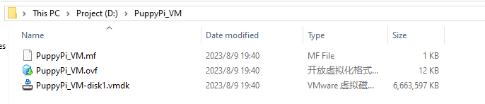
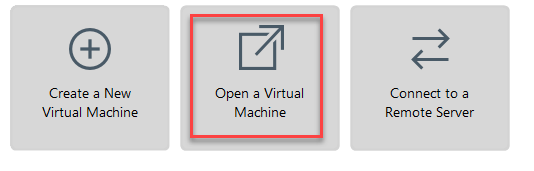
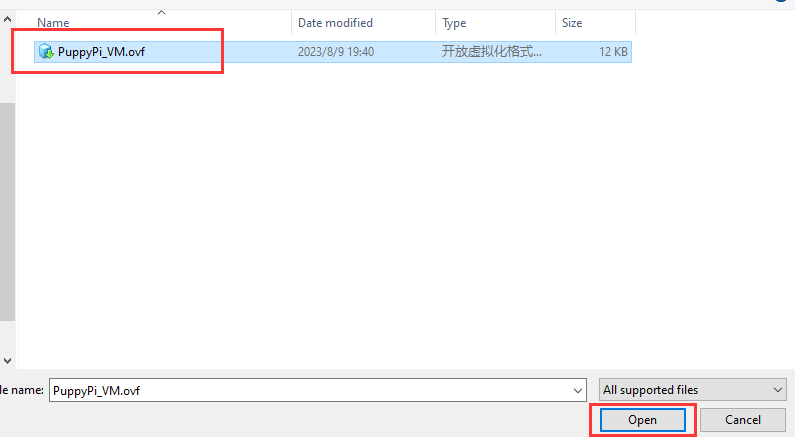
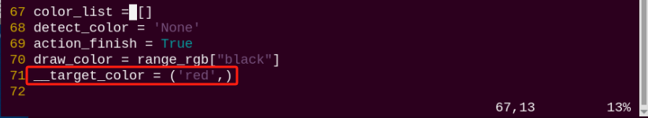

# AI自主追踪踢球项目

## 1. 小球寻找与定位

:::{Note}
可在本节文件夹下观看演示效果。
:::

### 1.1 玩法简要说明

首先，需要对颜色进行识别，本节使用的是Lab颜色空间进行处理，将图像颜色空间由RGB转换为Lab，随后对图像进行二值化、腐蚀、膨胀等操作，获得只包含目标颜色的轮廓，并用圆圈将其标识出来。

接着，判断小球颜色，如果小球为红色，获取小球的坐标。

最后，在终端打印出小球的X轴坐标。

### 1.2 玩法开启及关闭步骤

:::{Note}
指令输入需严格区分大小写及空格。
:::

1. 启动PuppyPi机器狗，通过VNC远程连接树莓派桌面。

2. 点击系统桌面左上角的图标，打开Terminator终端。


3. 输入启动玩法的指令，按下回车。

```commandline
rosrun puppy_advanced_functions kick_ball_demo.py
```


4.  如需关闭此玩法，可在LX终端界面按下"**Ctrl+C**"。如果关闭失败，可多次按下。

### 1.3 功能实现

:::{Note}
程序默认检测颜色为红色。
:::

当识别到红色小球后，回传画面内会使用矩形标识出小球，并在终端打印出X轴坐标。


### 1.4 程序参数说明

该程序的源代码位于Docker容器中的：**/home/ubuntu/puppypi/src/puppy_advanced_functions/scripts/kick_ball_demo.py**

根据实现的效果，梳理程序的过程逻辑，如下图所示：


- **导入功能包**


通过 import 语句导入所需模块：math提供了一系列数学函数和常数,用于进行相关计算；rospy用于ROS通信，from object_tracking.srv import \*: 导入目标跟踪相关的服务。from puppy_control.msg import Velocity, Pose, Gait: 导入控制和传递机器人的速度、姿态和步态服务。

- #### 1.4.1 处理图像

1. **高斯滤波**

在将图像的颜色空间由RGB转换为Lab前，需要先对其进行降噪处理，此处用到cv2库中的GaussianBlur()函数，该函数用于对图像进行高斯滤波处理。


括号内的参数含义如下：

第一个参数"**frame_resize**"是输入图像；

第二个参数"**(3, 3)**"是高斯内核大小；

第三个参数"**3**"是在高斯滤波中其平均值附近允许的变化范围大小。该值越大，平均值周围允许的变化范围越大；数值越小，平均值周围允许的变化范围越小。

2. **二值化处理**

采用cv2库中的inRange()函数对图像进行二值化处理。


括号内的第一个参数是输入图像；第二个、第三个参数分别是阈值的下限和上限。当像素点RGB的颜色数值处于上、下限之间时，该像素点被赋值为1，否则为0。

3. **腐蚀膨胀处理**

:::{Note} 
为了降低干扰，令图像更平滑，需要对图像进行腐蚀和膨胀处理。
:::


erode()函数用于对图像进行腐蚀操作。

以代码

```python
eroded = cv2.erode(frame_mask, cv2.getStructuringElement(cv2.MORPH_RECT, (3, 3)))
```

为例，括号内的参数含义如下：

第一个参数"**frame_mask**"是输入图像；

第二个参数"**cv2.getStructuringElement(cv2.MORPH_RECT, (3, 3))**"是决定操作性质的结构元素或内核。其中，括号内的第一个参数是内核形状，第二个参数是内核尺寸。

dilate()函数用于对图像进行膨胀操作。此函数括号内参数的含义与erode()函数的相同。

4. **获取最大面积轮廓**

完成上述的图像处理后，需要获取识别目标的轮廓，此处涉及cv2库中的findContours()函数。


括号内的第一个参数是输入图像；第二个参数是轮廓的检索模式；第三个参数是轮廓的近似方法。

在获得的轮廓中寻找面积最大的轮廓，而为了避免干扰，需要设定一个最小值，仅当面积大于该值时，目标轮廓才有效。


获得最大面积轮廓后，通过调用cv2库中的minAreaRect()、drawContours()函数，获取并标识出目标轮廓的最小外接矩形。


- #### 1.4.2 **显示坐标**

最后在终端显示红色小球的X轴坐标，如下图所示：


## 2. 自主追踪踢球

:::{Note}
如果演示效果不佳，可根据文档内"[关闭调试画面](#anchor_2_4_1)"进行调试。
:::

### 2.1 实验原理

首先，需要对颜色进行识别，本节使用的是Lab颜色空间进行处理，将图像颜色空间由RGB转换为Lab，随后对图像进行二值化、腐蚀、膨胀等操作，获得只包含目标颜色的轮廓，并用圆圈将其标识出来。

机器狗不断进行颜色识别，识别到红色小球后，获取小球的坐标位置；然后靠近红色小球；稳定后，根据红色小球的X轴坐标，控制机器狗执行对应动作组踢球，从而达到智能踢球的效果。

### 2.2 玩法开启及关闭步骤

:::{Note}
指令输入需严格区分大小写及空格。
:::

1.  启动PuppyPi机器狗，通过VNC远程连接树莓派桌面。

2.  点击系统桌面左上角的图标，打开Terminator终端。

    

3.  输入启动玩法的指令，按下回车。

```commandline
rosrun puppy_advanced_functions kick_ball_demo.py
```



4.  如需关闭此玩法，可在LX终端界面按下"**Ctrl+C**"。如果关闭失败，可多次按下。

### 2.3 功能实现

程序默认识别颜色为红绿蓝三种颜色。

当识别到红色小球后，PuppyPi机器狗会根据小球位置，自动靠近小球，完成对应踢球动作。此外，回传画面内会使用对应颜色的圆圈标识出小球，并打印小球颜色。

### 2.4 功能延伸

<span id="anchor_2_4_1" class="anchor"></span>

- #### 2.4.1 关闭调试画面

由于调试画面不断刷新，会占用树莓派一定的CPU资源，所以如果出现运行不流畅的情况，可通过关闭调试画面来改善，具体步骤如下：

1)  输入指令，用来编辑自主追踪踢球玩法程序，按下回车。

```commandline
rosed puppy_advanced_functions kick_ball_demo.py
```



2)  找到下图所示代码：


:::{Note}

在键盘输入代码位置序号后，按下"Shift+G"键，可直接跳转到对应位置。（图示代码位置序号仅供参考，请以实际为准。）

:::

3)  按下"**i**"键进入编辑模式，在代码前面添加"**\#**"，进行注释。


4)  修改完成后，按下"**Esc**"键，输入并回车，进行保存与退出。

```commandline
:wq
```


5)  输入指令，重新启动玩法，即可查看修改后的玩法效果。

```commandline
rosrun puppy_advanced_functions kick_ball_demo.py
```


6)  如需再次查看调试画面（摄像头实时回传画面），可将步骤3）框出的内容进行反注释，即将代码前面的"**\#**"去掉，再进行保存，如下图所示：


- #### 2.4.2 更改小球颜色

**玩法默认识别红色小球后开始踢球，如需更改小球颜色，比如蓝色，可参照以下步骤：**

1)  输入指令，用来编辑自主追踪踢球玩法程序，按下回车。

```commandline
rosed puppy_advanced_functions kick_ball_demo.py
```


2)  找到下图所示代码：



:::{Note}
在键盘输入代码位置序号后，按下"Shift+G"键，可直接跳转到对应位置。（图示代码位置序号仅供参考，请以实际为准。）
:::

3)  按下"**i**"键进入编辑模式，将"**red**"改为"**blue**"。


4)  修改完成后，按下"**Esc**"键，输入指令并按下回车，进行保存与退出。

```commandline
:wq
```


5)  输入指令，重新启动玩法，即可查看修改后的玩法效果。

```commandline
rosrun puppy_advanced_functions kick_ball_demo.py
```


### 2.5 程序参数说明

该程序的源代码位于Docker容器中的：**/home/ubuntu/puppypi/src/puppy_advanced_functions/scripts/kick_ball_demo.py**

根据实现的效果，梳理程序的过程逻辑，如下图所示：


1. **判断左右位置**

第一课我们介绍了小球的寻找觉定位，接下来可以小球的坐标信息，判断小球的左右位置，如下图：


2. **靠近红色小球**

接下根据小球坐标，控制机器狗不断靠近红色小球，如下图：


控制机器狗行走时，主要通过调用PuppyVelocityPub.publish函数。

PuppyVelocityPub.publish()函数用于控制机器狗运动时的状态。以代码

```python
PuppyVelocityPub.publish(x=4, y=0, yaw_rate = math.radians(0))
```

为例，括号内的参数含义如下：

第一个参数"**x**"是机器狗的直行速度，前进方向为正方向，单位cm/s；

第二个参数"**y**"是机器狗的侧移速度，左侧方向为正方向，单位cm/s，目前无此功能；

第三个参数"**yaw_rate**"是机器狗的转弯速度，逆时针方向为正方向，单位rad/s。

3. **开始踢球**

靠近红色小球后，通过小球左右位置，调用对应动作组，执行踢球动作，如下图：


