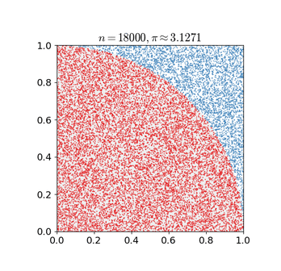
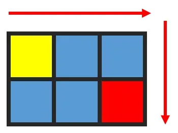

# AI自主巡航项目

## 1. 线条定位

>可在本节文件夹下观看演示效果。

### 1.1 玩法简要说明

PuppyPi机器狗在进行自主巡线行走之前，需要先对线条进行定位。

首先，对线条颜色进行识别，此处使用Lab颜色空间进行处理，将图像颜色空间由RGB转换为Lab，随后对图像进行二值化、腐蚀、膨胀等操作，获得只包含目标颜色的轮廓，并用矩形将其标识出来。

接着，获取矩形的对角点，并且画出线条的中心点。

最后，在终端上显示线条的中心点信息。

### 1.2 玩法开启及关闭步骤

> 指令输入需严格区分大小写及空格。

1)  启动PuppyPi机器狗，通过VNC远程连接树莓派桌面。

2)  点击系统桌面左上角的图标，打开Terminator终端。


3)  输入启动玩法的指令，按下回车。

```commandline
rosrun puppy_advanced_functions visual_patrol_demo.py
```


4)  如需关闭此玩法，可在LX终端界面按下“**Ctrl+C**”，如关闭失败，可多次按下。

### 1.3 功能实现

程序默认检测颜色为红色。

将红色的电工胶带铺设在所用场地，并将PuppyPi机器狗置于红色线条上。启动玩法后，机器狗识别到线条后，会在回传画面中框出线条，并画出中心点，同时在终端上显示中心点坐标。


### 1.4 程序参数说明

1. **处理图像**

该程序的源代码位于Docker容器中的： **/home/ubuntu/puppypi/src/puppy_advanced_functions/scripts/visual_patrol_demo.py**

根据实现的效果，梳理程序的过程逻辑，如下图所示：


- **导入功能包**


通过 import 语句导入所需模块：math提供了一系列数学函数和常数,用于进行相关计算；rospy用于ROS通信；from sensor_msgs.msg import Image: 是从 sensor_msgs.msg 包中导入 Image 消息类型。sensor_msgs 包提供了各种传感器数据的消息定义,相机图像。puppy_control导入动作组

- **获取最大面积轮廓**


设置巡线颜色设置为红色

- **高斯滤波**

在将图像的颜色空间由RGB转换为Lab前，需要先对其进行降噪处理，此处用到cv2库中的GaussianBlur()函数，该函数用于对图像进行高斯滤波处理。


函数括号内的参数含义如下：

第一个参数“**frame_resize**”是输入图像；

第二个参数“**(3, 3)**”是高斯内核大小；

第三个参数“**3**”是在高斯滤波中其平均值附近允许的方差大。该值越大，平均值周围允许的方差越大；数值越小，平均值周围允许的方差越小。

- **二值化处理**

采用cv2库中的inRange()函数对图像进行二值化处理。


函数括号内的第一个参数是输入图像；第二个、第三个参数分别是阈值的下限和上限。当像素点RGB的颜色数值处于上、下限之间时，该像素点被赋值为1，否则为0。

- **开运算和闭运算**

> 为了降低干扰，令图像更平滑，需要对图像进行处理。


cv2.MORPH_OPEN 进行开运算，指的是先进行腐蚀操作，再进行膨胀操作；cv2.MORPH_CLOSE 进行闭运算，指的是先进行膨胀操作，再进行腐蚀操作。

以代码“**opened = cv2.morphologyEx(frame_mask, cv2.MORPH_OPEN, np.ones((6, 6), np.uint8))** ”为例，括号内的参数含义如下：

第一个参数“**frame_mask**”是输入图像；

第二个参数“**cv2.MORPH_OPEN**”是进行变化的方式，为开运算；

第三个参数“**np.ones((6, 6), np.uint8)**”是方框的大小。

- **获取最大面积轮廓**

完成上述的图像处理后，需要获取识别目标的轮廓，此处涉及cv2库中的findContours()函数。


函数括号内的第一个参数是输入图像；第二个参数是轮廓的检索模式；第三个参数是轮廓的近似方法。

在获得的轮廓中寻找面积最大的轮廓，而为了避免干扰，需要设定一个最小值，仅当面积大于该值时，目标轮廓才有效。


2. **获取位置信息**

- **框出线条**

通过drawContours()函数，设置矩形图案，将线条框出。


- **画出中心点**

接着，获取矩形的对角点，通过circle()画出线条的中心点。


最后在终端显示，矩形中心点的信息。


## 2. 自主巡线行走

:::{Note}
如果演示效果不佳，可根据文档内“[关闭调试画面和终端打印数据 ](#anchor_2_4_1)”进行调试。
:::

### 2.1 玩法简要说明

巡线是机器人比赛中的常见项目，传统的巡线项目通过二路或者四路巡线传感器来进行实现，而在PuppyPi机器狗仅需通过视觉模块识别线条颜色，再经过图像算法处理，即可实现自主巡线行走。

首先，需要对线条颜色进行识别，此处使用Lab颜色空间进行处理，将图像颜色空间由RGB转换为Lab，随后对图像进行二值化、腐蚀、膨胀等操作，获得只包含目标颜色的轮廓，并用矩形将其标识出来。

完成颜色识别后，根据图像中线条位置的反馈进行计算，控制PuppyPi机器狗沿着线条移动，从而达到自主巡线行走的效果。

### 2.2 玩法开启及关闭步骤

>指令输入需严格区分大小写及空格。

  - 1)  启动PuppyPi机器狗，通过VNC远程连接树莓派桌面。

  - 2)  点击系统桌面左上角的图标，打开Terminator终端。


  - 3)  输入启动玩法的指令，按下回车。

    **rosrun puppy_advanced_functions** **visual_patrol_demo.py**


  - 4)  如需关闭此玩法，可在LX终端界面按下“**Ctrl+C**”，如关闭失败，可多次按下。

### 2.3 功能实现

程序默认检测颜色为红色。

将红色的电工胶带铺设在所用场地，并将PuppyPi机器狗置于红色线条上。启动玩法后，机器狗将巡红色线条进行移动。

### 2.4 功能延伸

<span id="anchor_2_4_1" class="anchor"></span>

1. **关闭调试画面和终端打印数据**

由于调试画面和终端打印数据不断刷新，会占用树莓派一定的CPU资源，所以如果出现运行不流畅的情况，可通过关闭调试画面和终端打印数据来改善，具体步骤如下：

  - 1)  输入指令，用来编辑自主巡线行走玩法程序，按下回车。

```commandline
rosed puppy_advanced_functions visual_patrol_demo.py
```


  - 2)  找到下图所示代码：




:::{Note}
在键盘输入代码位置序号后，按下“Shift+G”键，可直接跳转到对应位置。（图示代码位置序号仅供参考，请以实际为准。）
:::

  - 3)  按下“**i**”键进入编辑模式，在代码前面添加“**\#**”，进行注释。


  - 4)  修改完成后，按下“**Esc**”键，输入指令并按下回车，进行保存与退出。

```commandline
:wq
```


  - 5)  输入指令，重新启动玩法，即可查看修改后的玩法效果。

```commandline
rosrun puppy_advanced_functions visual_patrol_demo.py
```


  - 6)  如需再次查看调试画面（摄像头实时回传画面）和终端打印数据，可将步骤3）框出的内容进行反注释，即将代码前面的“**\#**”去掉，再进行保存，如下图所示：


2. **更改巡线颜色**

**玩法默认巡线颜色是红色，如需更改巡线颜色，比如黑色，可参照以下步骤：**

  - 1) 输入指令，用来编辑 自主巡线行走玩法程序，按下回车。

```commandline
rosed puppy_advanced_functions visual_patrol_demo.py
```


  - 2)  找到下图所示代码：

    

:::{Note}
在键盘输入代码位置序号后，按下“Shift+G”键，可直接跳转到对应位置。（图示代码位置序号仅供参考，请以实际为准。）
:::

4)  按下“**i**”键进入编辑模式，将“**red**”改为“**black**”。


5)  修改完成后，按下“**Esc**”键，输入“**:wq**”并回车，进行保存与退出。

```commandline
:wq
```


6)  输入指令并按下回车，重新启动玩法，即可查看修改后的玩法效果。

```commandline
rosrun puppy_advanced_functions visual_patrol_demo.py
```


### 2.5 程序参数说明

该程序的源代码位于Docker容器中的： **/home/ubuntu/puppypi/src/puppy_advanced_functions/scripts/visual_patrol_demo.py**

根据实现的效果，梳理程序的过程逻辑，如下图所示：


- **设置巡线颜色**

  

  设置巡线颜色设置为红色

1.  **控制巡线**

第一课我们介绍了如何给线条进行定位，接下来可以根据线条的中心坐标信息，控制机器人沿着线条行走，如下图：


2. **控制行走**

我们主要通过调用PuppyPosePub.publish()、PuppyGaitConfigPub.publish和

PuppyVelocityPub.publish函数控制机器狗行走。


PuppyPosePub.publish()函数用于控制机器狗运动时的姿态。

以代码 

```python
PuppyPosePub.publish(stance_x=PuppyPose['stance_x'],stance_y=PuppyPose['stance_y'],x_shift=PuppyPose['x_shift'],height=PuppyPose['height'],roll=PuppyPose['roll'],pitch=PuppyPose['pitch'],yaw=PuppyPose['yaw'], run_time = 500)
```

 为例，括号内的参数含义如下：

  - 1.  第一个参数“**stance_x**”是4条腿在x轴上额外分开的距离，单位为cm；

  - 2.  第二个参数“**stance_y**”是4条腿在y轴上额外分开的距离，单位为cm；

  - 3.  第三个参数“**x_shift**”是4条腿在x轴上同向移动的距离，越小，走路越前倾，越大越后仰,通过调节x_shift可以调节机器狗走路的平衡，单位为cm；

  - 4.  第四个参数“**height**”是机器狗的高度，脚尖到大腿转动轴的垂直距离，单位为cm；

  - 5.  第五个参数“**roll**”是机器狗的滚转角，单位为度；

  - 6.  第六个参数“**pitch**”是机器狗的的俯仰角，单位为度；

  - 7.  第七个参数“**yaw**”是机器狗的偏航脚，单位为度；

  - 8.  第八个参数“**run_time**”是运动时间，单位为ms。

PuppyGaitConfigPub.publish函数用于控制机器狗运动时的步态。

以代码 

```python
PuppyGaitConfigPub.publish(overlap_time = GaitConfig['overlap_time'], swing_time = GaitConfig['swing_time'],clearance_time = GaitConfig['clearance_time'],z_clearance = GaitConfig['z_clearance'])
```

为例，括号内的参数含义如下：

  - 1.  第一个参数“**overlap_time**”是4个膝关节末端全部着地的时间，单位为s；

  - 2.  第二个参数“**swing_time**”是2个膝关节末端全部脱离地面的时间，单位为s；

  - 3.  第三个参数“**clearance_time**”是前后脚间隔时间，单位为s；

  - 4.  第四个参数“**z_clearance**”是移动时，膝关节所抬起的末端高度距离，单位为cm。

PuppyVelocityPub.publish()函数用于控制机器狗运动时的状态。

以代码 

```python
PuppyVelocityPub.publish(x=PuppyMove['x'], y=PuppyMove['y'],yaw_rate=PuppyMove['yaw_rate'])
```

为例，括号内的参数含义如下：

  - 1.  第一个参数“**x**”是机器狗的直行速度，前进方向为正方向，单位cm/s；

  - 2.  第二个参数“**y**”是机器狗的侧移速度，左侧方向为正方向，单位cm/s，目前无此功能；

  - 3.  第三个参数“**yaw_rate**”是机器狗的转弯速度，逆时针方向为正方向，单位rad/s。

