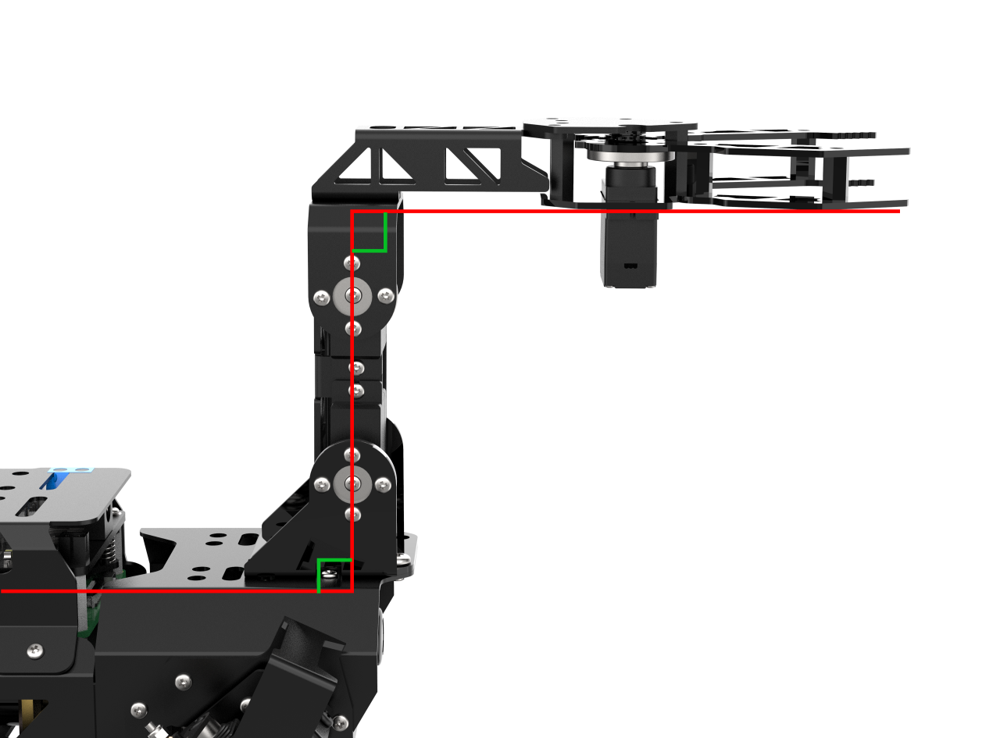
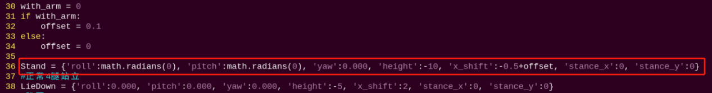
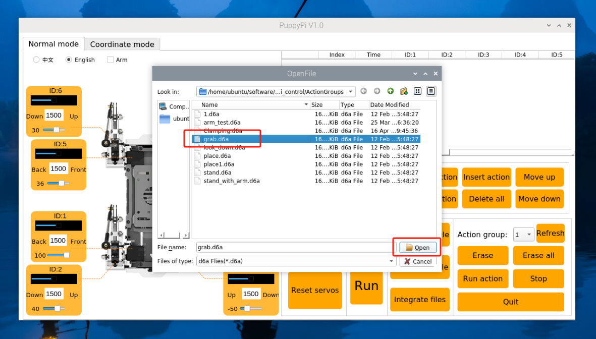

# ROS机器狗传感器结合课程

<span id="anchor_1_1" class="anchor"></span>

## 1. 发光超声波控制

### 1.1 发光超声波传感器安装


### 1.2 准备工作

准备一个超声波传感器，并通过4PIN线将其连接至树莓派扩展板上的任意一个IIC接口，接线效果如下图所示：


:::{Note}
4PIN线采用防反插设计，切勿硬塞。
:::

### 1.3 使用模块

本节课超声波测距芯片内部集成超声波发射电路、接收电路、数字处理电路等。模块采用IIC通信接口，能利用IIC通信读取测量的距离。

此外，超声波探头位置集成两个RGB灯，不仅能调节灯光亮度，还可以通过修改红(R)、绿(G)、蓝(B)三个颜色通道的参数，实现多彩颜色变化。

### 1.4 实验原理

首先设置测距，然后通过高低电平的变化控制RGB彩灯的亮灭，最后通过改变各颜色分量数值来控制显示的灯光颜色。

[下载源代码](https://store.hiwonder.com.cn/docs/PuppyPi/pi5/source_code/17/sonar_control_demo.py)

### 1.5 玩法开启及关闭步骤

:::{Note}
指令输入需严格区分大小写及空格。
:::

(1)  启动PuppyPi机器狗，通过VNC远程连接树莓派桌面。

(2)  点击系统桌面左上角的图标，打开Terminator终端。

(3)  输入指令，按下回车，运行玩法程序。

```bash
rosrun puppy_extend_demo sonar_control_demo.py
```

(4)  如需关闭此程序，可按下"**Ctrl+C**",若关闭失败，可多次按下。

### 1.6 功能实现

程序运行后，在超声波传感器前方放置障碍物，终端界面会打印测得距离，且RGB灯显示对应的灯光颜色。灯光颜色与距离范围对应如下：

当间距小于或等于300mm时，RGB灯显示红色灯光；

当间距大于300mm且小于500mm时，RGB灯显示绿色灯光；

当间距大于500mm时，RGB灯显示蓝色灯光。

### 1.7 功能延伸

<span id="anchor_1_7_1" class="anchor"></span>

- #### 1.7.1 修改探测距离

我们可以修改RGB灯颜色对应的距离范围，这里以将RGB亮绿色的距离范围"**300\<distance\<500**"修改为"**300\<distance\<550**"，将RGB亮蓝色的距离范围"**distance\>550**"修改为"**distance\>550**"为例进行示范，可参考以下步骤进行：

(1)  点击系统桌面左上角的图标，打开Terminator终端。

(2)  输入指令，回车，打开玩法程序文件。

```bash
rosed puppy_extend_demo sonar_control_demo.py
```

(3)  找到如下图框出的代码，按一下键盘的"**i**"键，进入编辑模式。


(4)  修改数据，如下图所示：


(5)  修改完成之后，按一下键盘的"**Esc**"键，再依次输入指令（注意wq前为冒号：），回车，即可保存修改内容。

```bash
:wq
```

- #### 1.7.2 自定义RGB颜色

同样，我们也可以更改RGB彩灯的颜色，这里以将RGB彩灯的颜色由红色更改为黄色为例进行示范，可按照以下步骤进行修改：

(1)  参考"[6.1 修改探测距离](#anchor_1_7_1)"的步骤1、2，打开玩法程序文件。

(2)  在打开的界面中，找到如下图所示代码，按一下键盘的"i"键，进入编辑模式。


(3)  可通过修改RGB的值来修改发光颜色。将"**setRGB(1,(255,0,0))**"和"**setRGB(0,(255,0,0))**"修改为"**setRGB(1,(255,255,0))**"和"**setRGB(0,(255,255,0))**"，如下图所示：


RGB值指某种颜色中红（Red）、绿（Green）、蓝（Blue）成分，理论上讲，红绿蓝三种基色按照不同的比例混合可以调配出任何一种颜色。某种颜色的RGB值越近就越接近灰色或黑白，数值越大就越白，反之越黑。

(4)  修改完成之后，按一下键盘的"**Esc**"键，再依次输入指令（注意wq前为冒号：），按下回车，即可保存修改内容。

```bash
:wq
```

## 2. 机器狗超声波测距避障

[发光超声波传感器安装](#anchor_1_1)

### 2.1 准备工作

准备一个超声波传感器，并通过4PIN线将其连接至树莓派扩展板上的任意一个IIC接口，接线效果如下图所示：


:::{Note}
4PIN线采用防反插设计，切勿硬塞。
:::

### 2.2 使用模块

本节课超声波测距芯片内部集成超声波发射电路、接收电路、数字处理电路等。模块采用IIC通信接口，能利用IIC通信读取测量的距离。

此外，超声波探头位置集成两个RGB灯，不仅能调节灯光亮度，还可以通过修改红(R)、绿(G)、蓝(B)三个颜色通道的参数，实现多彩颜色变化。

### 2.3 实验原理

首先设置测距，然后通过高低电平的变化来判断前方是否有障碍物，再根据判断来执行不同的动作

[下载源代码](https://store.hiwonder.com.cn/docs/PuppyPi/pi5/source_code/17/sonar_avoidance.py)

### 2.4 玩法开启及关闭步骤

(1)  启动PuppyPi机器狗，通过VNC远程连接树莓派桌面。

(2)  点击系统桌面左上角的图标，打开Terminator终端。

(3)  输入指令，按下回车，运行玩法程序。

```bash
rosrun puppy_extend_demo sonar_avoidance.py
```

(4)  如需关闭此程序，可按下"**Ctrl+C**",若关闭失败，可多次按下。

### 2.5 功能实现

程序运行后，在超声波传感器前方放置障碍物，终端界面会打印测得距离，当间距大于300mm，RGB灯显示蓝色灯光且机器狗会保持前进；当间距小于或等于300mm时，RGB灯显示红色灯光且机器狗会一直左转。

## 3. 触摸传感器检测

### 3.1 触摸传感器安装


### 3.2 准备工作

准备一个触摸传感器，并通过4PIN线将其连接至树莓派扩展板上的"5V GND IO22 IO24"接口，接线效果如下图所示：



:::{Note}
4PIN线采用防反插设计，切勿硬塞。
:::

### 3.3 使用模块

触摸传感器是一款基于电容感应原理的触摸传感器，人体或金属触碰传感器上的镀金接触面时，传感器会有所感应；此外，隔着一定厚度的塑料、纸张等材料的接触也可以被传感器所感应到，且感应的灵敏度与接触面的大小和覆盖材料的厚度有关。

这个传感器可应用于设备的开关控制，比如控制开关灯、门铃触摸按键等。传感器板载了乐高兼容孔位，可进行更多创意DIY设计。

### 3.4 实验原理

当感应到触摸时，传感器会输出高电平，否则输出低电平。我们可以通过I/O口的电平变化来判断传感器当前的状态。

[下载源代码](https://store.hiwonder.com.cn/docs/PuppyPi/pi5/source_code/17/touch_detect_demo.py)

主要通过GPIO.input函数获取触摸传感器反馈的数值，从而判断当前的状态。

### 3.5 玩法开启及关闭步骤

(1)  启动PuppyPi机器狗，通过VNC远程连接树莓派桌面。

(2)  点击系统桌面左上角的图标，打开Terminator终端。

(3)  输入指令，按下回车，运行玩法程序。

```bash
rosrun puppy_extend_demo touch_detect_demo.py
```

(4)  如需关闭此程序，可按下"**Ctrl+C**"，若关闭失败，可多次按下。

### 3.6 功能实现

程序运行后，触碰传感器的金属片，当感应到后，蜂鸣器会短鸣一次。

## 4. 点阵模块显示

### 4.1 点阵模块的安装


### 4.2 准备工作

需要准备点阵屏显示模块，并通过4PIN线将点阵屏显示模块连接至树莓派扩展板上的"**5V GND IO7 IO8**"接口，接线效果如下图所示：



:::{Note}
4PIN线采用防反插设计，切勿硬塞。
:::

### 4.3 使用模块

本节课所用到的点阵屏显示模块由两个红色8x8 LED点阵屏组成，通过驱动控制芯片，可实现对点阵屏的控制。其具备显示亮度高，显示时无闪烁，接线方便等特点，能显示数字、文本、图案等内容。

### 4.4 实现原理

我们来看下本节课的实现思路：

实验中我们通过利用一组十六进制数据控制点阵显示图案，一组数据共有16个数据，控 制时，每个数据控制点阵显示一列LED。


每组数据设置方法非常简单，我们以本节示例课程为例。实验中，我们控制点阵模块显示"**Hello**"字符。


在控制代码的32和33行中就是设置点阵显示图案的数组。数组中的第1个元素是0x7f， 转换为二进制数是01111111，它代表第一列LED从下往上的灯光状态为：灭亮亮亮亮亮亮亮。 同理，后面的15个元素，就是控制其他15列LED亮灭，最终让点阵显示"**Hello**"字符。

:::{Note}
大家可以在本节同目录下看到"字模软件的使用方法"，利用字模软件快速获取控制数组。
:::

[下载源代码](https://store.hiwonder.com.cn/docs/PuppyPi/pi5/source_code/17/lattice_display_demo.py)

<p id="anchor_4_5"></p>

### 4.5 玩法开启及关闭步骤

(1)  启动PuppyPi机器狗，通过VNC远程连接树莓派桌面。

(2)  点击系统桌面左上角的图标，打开Terminator终端。

(3)  输入运行玩法的指令，按下回车即可。

```bash
rosrun puppy_extend_demo lattice_display_demo.py
```

(4)  如需关闭此程序，可按下"**Ctrl+C**"。

### 4.6 功能实现

程序运行后，点阵显示"**Hello**"字符5秒钟，然后自动退出程序，关闭点阵显示。

### 4.7 功能延伸

本节程序默认点阵显示内容为"**Hello**"，如需修改显示的字样，例如修改为"**Love**"。可参照以下步骤：

修改之前，我们需要获取字母在点阵显示的地址符，这里我们通过取模软件来获取。

(1)  在本节同目录下双击打开取模软件。


(2)  先点击"**新建图像**"，在弹出的设置框设置点阵模块的尺寸参数，这里设置为"**16\*8**"，设置完成后，点击"**确定**"。


(3)  依次点击"**模拟动画**"和"**放大格点**"，将右侧点阵模拟区域放大。


(4)  然后通过点击鼠标的方式，在右侧区域绘制显示内容。


(5)  绘制完成之后，依次点击"**取模方式**"、"**51格式**"，即可得到地址符（这一步请将地址符记下，后续步骤需用到）。


(6)  输入指令，按下回车，打开玩法程序文件。

```bash
rosed puppy_extend_demo lattice_display_demo.py
```

(7)  在打开界面找到如下图所示代码。


(8)  按一下键盘的"**i**"键，进入编辑模式。


(9)  将程序默认的地址符替换为取模软件得出的地址符，如下图所示：


(10) 修改完成之后，按一下键盘的"**Esc**"键，再依次输入指令（注意wq前为冒号：），回车，即可保存修改内容。

```bash
:wq
```

(11) 重复本文档"[4.5 玩法开启及关闭步骤](#anchor_4_5)"的步骤，即可实现更改效果。

## 5. 语音识别传感器实验

### 5.1 语音识别模块安装


### 5.2 准备工作

准备一个语音识别传感器模块，并通过4PIN线将其连接至树莓派扩展板上的任意一个IIC接口，接线效果如下图所示：


:::{Note}
4PIN线采用防反插设计，切勿硬塞。
:::

### 5.3 使用模块

采用 IIC 通信，用户只需要把识别的关键词语以字符串的形式传送进芯片，即可在下次识别中立即生效。

该模块有三种使用模式，用户可通过编程，设置两种不同的使用模式。

按钮检测模式：系统的主控 MCU 在接收到外界一个触发后（比如用户按下按键）， 将会启动芯片上的一个定时识别过程（比如 5 s），此时需要用户在这个定时过程中说出要识别的语音关键词语。当这个过程结束后，需要用户再次触发才能再次启动一个识别过程。循环检测模式：系统的主控 MCU 反复启动的识别过程。如果没有人说话就没有别结果，则每次识别过程的定时到时后会再启动一个识别过程；如果有识别结果，则根据识别作相应处理后（比如播放某个声音作为回答）再启动一个识别过程。

口令检测模式：口令模式需要一个关键词来唤醒，唤醒后才可以进行识别，默认唤醒关键词为第一句，识别结束后，想再次进行识别，还需唤醒它，类似小艾同学。

### 5.4 实现原理

[下载源代码](https://store.hiwonder.com.cn/docs/PuppyPi/pi5/source_code/17/ASR_detect_demo.py)

通过asr.setMode函数设置识别模式，此行代码"**asr.setMode(2)**"中的参数"**2**"为选择口令模式，再通过asr.addWords函数添加词条，以代码"**asr.addWords(1, ‘kai shi’)**"为例，参数"**1**"为词条的序号，参数"**kai shi**"为词条"**开始**"的拼音

<p id="anchor_5_5"></p>

### 5.5 玩法开启及关闭步骤

(1)  启动PuppyPi机器狗，通过VNC远程连接树莓派桌面。

(2)  点击系统桌面左上角的图标，打开Terminator终端。

(3)  输入指令，按下回车，运行玩法程序。

```bash
rosrun puppy_extend_demo ASR_detect_demo.py
```

(4)  如需关闭此程序，可按下"**Ctrl+C**"，若关闭失败，可重复按下。

### 5.6 功能实现

程序运行后，说"开始"，识别到后，接着说"红色"，树莓派扩展板上的彩灯会变成红色；再说出"绿色"，彩灯会变成绿色；再说出"蓝色"，彩灯会变成蓝色。

### 5.7 功能延伸

程序默认是红绿蓝三种颜色的词条，如果想要修改词条的颜色，可按照以下步骤进行，本节以更换红色为黄色为例进行说明。

(1)  点击系统桌面左上角的图标，打开Terminator终端。

(2)  输入指令，按下回车，打开玩法程序文件。

```bash
rosed puppy_extend_demo ASR_detect_demo.py
```

(3)  找到如下图框出的代码。



(4)  按一下键盘的"**i**"键，进入编辑模式，将"**hong se**"修改为"**huang se**"，set_rgb_show函数中的数值修改为"**255，255，0**"如下图所示。


(5)  修改完成之后，按一下键盘的"**Esc**"键，再依次输入指令（注意wq前为冒号：），回车，即可保存修改内容。

```bash
:wq
```

(6)  重复本文档"[5.5 玩法开启及关闭步骤](#anchor_5_5)"的步骤，即可实现更改效果。

## 6. 机器狗触摸检测感应

### 6.1 触摸传感器安装


### 6.2 准备工作

准备一个触摸传感器，并通过4PIN线将其连接至树莓派扩展板上的"**5V GND IO22 IO24**"接口，接线效果如下图所示：


:::{Note}
4PIN线采用防反插设计，切勿硬塞。
:::

此外，也可以用3根母对母杜邦线将触摸传感器连接至树莓派扩展板上，如下图所示：


### 6.3 使用模块

触摸传感器是一款基于电容感应原理的触摸传感器，人体或金属触碰传感器上的镀金接触面时，传感器会有所感应；此外，隔着一定厚度的塑料、纸张等材料的接触也可以被传感器所感应到，且感应的灵敏度与接触面的大小和覆盖材料的厚度有关。

这个传感器可应用于设备的开关控制，比如控制开关灯、门铃触摸按键等。传感器板载了乐高兼容孔位，可进行更多创意DIY设计。

### 6.4 实验原理

当感应到触摸时，传感器会输出高电平，否则输出低电平。我们可以通过I/O口的电平变化来判断传感器当前的状态。

[下载源代码](https://store.hiwonder.com.cn/docs/PuppyPi/pi5/source_code/17/touch_control_demo.py)

主要通过GPIO.input函数获取触摸传感器反馈的数值，从而判断当前的状态，再根据触摸传感器状态执行不同的动作。

### 6.5 玩法开启及关闭步骤

(1)  启动PuppyPi机器狗，通过VNC远程连接树莓派桌面。

(2)  点击系统桌面左上角的图标，打开Terminator终端。

(3)  输入指令，按下回车，运行玩法程序。

```bash
rosrun puppy_extend_demo touch_control_demo.py
```

(4)  如需关闭此程序，可按下"**Ctrl+C**"，若关闭失败，可多次按下。

### 6.6 功能实现

程序运行后，机器狗会保持站立姿态，首次触碰传感器的金属片，当感应到后，机器狗会切换成下蹲姿态；再次触碰传感器的金属片，连续触碰2次，机器狗会做出抖一抖的动作。

## 7. MP3模块实验

### 7.1 MP3模块安装


### 7.2 准备工作

准备一个MP3模块，并通过4PIN线将其连接至树莓派扩展板上的任意一个IIC接口，接线效果如下图所示：


:::{Note}
4PIN线采用防反插设计，切勿硬塞。
:::

### 7.3 使用模块

本节课所用到的MP3模块采用了IIC通信，通过数字信号器的DSP即可完成对MP3文件的处理、传输及解码工作。

### 7.4 实现原理

MP3模块最大支持32G的SD卡，支持FAT16， FAT32文件系统，支持MP3， WAV，WMA格式歌曲，先在SD卡内建立一个名称为"**MP3**"的文件夹，然后在文件夹里放入需要播放的歌曲，歌曲格式如下0001+歌曲名，例如歌曲小苹果可以命名如下：0001小苹果，也可以不加歌曲名即0001,其他以此类推0010, 0100, 1000等。

[下载源代码](https://store.hiwonder.com.cn/docs/PuppyPi/pi5/source_code/17/mp3_moonwalk_demo.py)


### 7.5 玩法开启及关闭步骤

(1)  启动PuppyPi机器狗，通过VNC远程连接树莓派桌面。

(2)  点击系统桌面左上角的图标，打开Terminator终端。

(3)  输入指令，按下回车，运行玩法程序。

```bash
rosrun puppy_extend_demo mp3_moonwalk_demo.py
```

(4)  如需关闭此程序，可按下"**Ctrl+C**"，若关闭失败，可重复按下。

### 7.6 功能实现

程序运行后，MP3模块会播放SD卡中设置的音乐，并跳一个舞蹈。

### 7.7 功能延伸

如需修改音乐，可按照以下步骤进行，本节以更换编号为"0007"的曲目为例进行说明。

:::{Note}
替换曲目需下载至MP3的SD卡内，并以数字命名，例如命名为0007
:::

(1)  点击系统桌面左上角的图标，打开Terminator终端。

(2)  输入指令，并按下回车，打开玩法程序文件。

```bash
rosed puppy_extend_demo** **mp3_moonwalk_demo.py
```

(3)  找到如下图框出的代码，按一下键盘的"i"键，进入编辑模式。


(4)  playNum函数中的参数就是歌曲的编号，我们修改为7，修改完成之后，按一下键盘的"**Esc**"键，再依次输入指令，按下回车，即可保存修改内容。

```bash
:wq
```


:::{Note}
函数中填写歌曲编号时可以省略前面的0，例如"0007"可以写成"7"
:::

## 8. 机器狗语音识别交互

### 8.1 语音识别模块安装


### 8.2 准备工作

准备好语音合成传感器模块，并通过4PIN线将连接至树莓派扩展板上的任意IIC接口，接线效果如下图所示：


:::{Note}
4PIN线采用防反插设计，切勿硬塞。
:::

### 8.3 使用模块

语音识别传感器采用 IIC 通信，用户只需要把识别的关键词语以字符串的形式传送进芯片，即可在下次识别中立即生效。

该模块有三种使用模式，用户可通过编程，设置两种不同的使用模式。

按钮检测模式：系统的主控 MCU 在接收到外界一个触发后（比如用户按下按键），将会启动芯片上的一个定时识别过程（比如 5 s），此时需要用户在这个定时过程中说出要识别的语音关键词语。当这个过程结束后，需要用户再次触发才能再次启动一个识别过程。循环检测模式：系统的主控 MCU 反复启动的识别过程。如果没有人说话就没有识别结果，则每次识别过程的定时到时后会再启动一个识别过程；如果有识别结果，则根据识别作相应处理后（比如播放某个声音作为回答）再启动一个识别过程。

口令检测模式：口令模式需要一个关键词来唤醒，唤醒后才可以进行识别，默认唤醒关键词为第一句，识别结束后，想再次进行识别，还需唤醒它，类似小艾同学。

### 8.4 实现原理

[下载源代码](https://store.hiwonder.com.cn/docs/PuppyPi/pi5/source_code/17/voice_interaction_demo.py)

通过asr.setMode函数设置识别模式，此行代码"**asr.setMode(2)**"中的参数"**2**"为选择口令模式，再通过asr.addWords函数添加词条，以代码"**asr.addWords(1, ‘kai shi’)**"为例，参数"**1**"为词条的序号，参数"**kai shi**"为词条"**开始**"的拼音

### 8.5 玩法开启及关闭步骤

(1)  启动PuppyPi机器狗，通过VNC远程连接树莓派桌面。

(2)  点击系统桌面左上角的图标，打开Terminator终端。

(3)  输入指令，按下回车，运行玩法程序。

```bash
rosrun puppy_extend_demo voice_interaction_demo.py
```

(4)  如需关闭此程序，可按下"**Ctrl+C**"，若关闭失败，可重复按下。

### 8.6 功能实现

程序运行后，机器狗会保持站立，说"开始"，识别到后，接着说"抬头"，机器狗会做出抬头的动作；再说出"趴下"，机器狗会切换成趴下姿态；再说出"立正"，机器狗会回到站立姿态；再说出"原地踏步"，机器狗会开始原地踏步。
