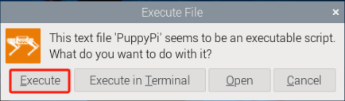

# 11. ROS1-Sensor Development Course

<span id="anchor_1_1" class="anchor"></span>

## 11.1 Glowy Ultrasonic Sensor Control

### 11.1.1 Glowy Ultrasonic Sensor Installation


### 11.1.2 Getting Ready

Prepare a glowy ultrasonic sensor and connect it to any IIC interface on Raspberry Pi expansion board with 4PIN wire as the picture shown.


:::{Note}
4PIN wire adopts anti-reverse plug in design, please don't insert violently.
:::

### 11.1.3 Glowy Ultrasonic Sensor Introduction

The ultrasonic ranging chip integrates ultrasonic transmitting circuit, receiving circuit, digital processing circuit, etc. This module adopts IIC communication interface through which the measured distance can be read.

Besides, on each probe, there is RGB light whose brightness can be adjusted and parameters of color channel can be modified to change the color. 

### 11.1.4 Program Logic

Firstly, set the distance range. Then control RGB colored light to light on or get out though the change of the level. Lastly, control the color of light through changing the parameter of color channels.

The source code of this program is stored in [/home/ubuntu/puppy_pi/src/puppy_extend_demo/scripts/sonar_control_demo.py ](https://store.hiwonder.com.cn/docs/PuppyPi/pi5/source_code/17/sonar_control_demo.py)

### 11.1.5 Operation Steps

:::{Note}
Commands must be entered with strict attention to capitalization and spaces.
:::

(1) Turn on PuppyPi, and connect it to Raspberry Pi desktop via VNC.

(2) Click  at upper left corner to to open Terminator.

(3) Enter command and press Enter to run the game program.

```bash
rosrun puppy_extend_demo sonar_control_demo.py
```

(4) If need to close this program, we can press **"Ctrl+C"**. If it fails to close, please try again.

### 11.1.6 Program Outcome

After the program starts, place an obstacle in front of the glowy ultrasonic sensor. Then the measured distance will be printed on the terminal. And the RGB colored light will illuminate in corresponding color according to the distance.

**① Distance ≤ 300mm:** red light on.

**② 300mm≤ Distance ≤ 500mm:** green light on.

**③ Distance ≥500mm:** blue light on.

### 11.1.7 Function Extension

<span id="anchor_1_7_1" class="anchor"></span>

- #### Modify Distance Range

The corresponding distance range of different light colors can be modified. For example, we set green light to turn on when 300<distance<550, and blue light to turn on when distance>550.  

(1) Click  at upper left corner to open Terminator.

(2) Enter command **"rosed puppy_extend_demo sonar_control_demo.py"** and press Enter to open the program file.

```bash
rosed puppy_extend_demo sonar_control_demo.py
```

(3) Next, scroll down to the codes in the red frame. Press **"i"** key to enter the editing mode.


(4) Modify the values as the picture shown.


(5) After modification, press **"Esc"**, input **":wq"** and press Enter to save and exit editing.

```bash
:wq
```

- #### Customize RGB Color

Likewise, we can change the color of RGB light, for example yellow.

(1)  According to step (1) and (2) in "[11.1.7 Function Extension -> Modify Distance Range]()", open program file. 

(2)  Locate the codes in the red frame. Press "i" key to enter editing mode.

(3)  The color of RGB light can be changed through modifying RGB values. Modify `setRGB(1,(255,0,0))` as `setRGB(1,(255,255,0))`, and `setRGB(0,(255,0,0))` as `setRGB(0,(255,255,0))`.


RGB value refers to the content of Red, Green and Blue colors in one color. And all the colors can be constructed from the combination of the Red, Green and Blue colors.

(4)  After modification, press **"Esc"**, input **":wq"** and press Enter to save the modified data.

```bash
:wq
```

## 11.2 Distance Ranging and Obstacle Avoidance

[ Glowy Ultrasonic Sensor Installation](#anchor_1_1)

### 11.2.1 Getting Ready

Prepare a ultrasonic sensor and connect it to any IIC interface on Raspberry Pi expansion board with 4PIN wire as the picture shown.


:::{Note}
4PIN wire adopts anti-reverse plug in design, please don't insert violently.
:::

### 11.2.2 Ultrasonic Sensor Introduction

The ultrasonic ranging chip integrates ultrasonic transmitting circuit, receiving circuit, digital processing circuit, etc. This module adopts IIC communication interface through which the measured distance can be read.

Besides, on each probe, there is RGB light whose brightness can be adjusted and parameters of color channel can be modified to change the color.

### 11.2.3 Program Logic

Firstly, set the distance range. Then judge whether there is obstacle ahead through the change of level. Next, program PuppyPi to execute different actions based on the previous judgement.

The source code of this program is stored in: [/home/ubuntu/puppy_pi/src/puppy_extend_demo/scripts/sonar_avoidance.py](https://store.hiwonder.com.cn/docs/PuppyPi/pi5/source_code/17/sonar_avoidance.py)

### 11.2.4 Operation Steps

(1) Turn on PuppyPi and connect it to RaspberryPi desktop via VNC.

(2) Click  at upper left corner to enter Terminator terminal.

(3) Enter command "rosrun puppy_extend_demo sonar_avoidance.py" and press Enter to run the game program.

```bash
rosrun puppy_extend_demo sonar_avoidance.py
```

(4) If need to close this program, we can press **"Ctrl+C"**. If it fails to close, please try again.

### 11.2.5 Program Outcome

After the program starts, place an obstacle in front of the glowy ultrasonic sensor. Then the measured distance will be printed on the terminal. When distance is greater than 300mm, RGB light will emit blue light and PuppyPi will keep moving forward. When the distance is less than or equal to 300mm, RGB light will emit red light and PuppyPi will keep turning left.

## 11.3 Touch Sensor

### 11.3.1 Touch Sensor Installation


### 11.3.2 Getting Ready

Prepare a touch sensor and connect it to **5V GND IO22 IO24** interface on Raspberry Pi expansion board with 4PIN wire as the picture shown.


:::{Note}
4PIN wire adopts anti-reverse plug in design, please don't insert violently.
:::

### 11.3.3 Touch Sensor Introduction 

Based on capacitive sensing, Hiwonder touch sensor can sense the touch from human body or metal. In addition, the contact between plastic, paper and other materials of certain thickness can also be sensed. Its sensitivity is related to contact area and material thickness.
After powering, signal terminals OUT will output high-level signal when sensor does not sense the touch signal. When the touch signal is sensed, signal terminal OUT will output low-level signal. It is applicable in switch control, such as light switch and doorbell touch buttons. The holes on the module are compatible with Lego for more creative DIY designs.

### 11.3.4 Program Logic

When sensing the touch, touch sensor will output high level, otherwise out low level. We can judge the status of the sensor through the level change of I/O interface. 

The source code of this program is stored in [/home/ubuntu/puppy_pi/src/puppy_extend_demo/scripts/touch_detect_demo.py ](https://store.hiwonder.com.cn/docs/PuppyPi/pi5/source_code/17/touch_detect_demo.py)

```py
```


GPIO.input function is used to acquire the value given by touch sensor so as to judge the status of the sensor.

### 11.3.5 Operation Steps

(1) Turn on PuppyPi and connect it to Raspberry Pi desktop via VNC.

(2)  Click at upper left corner to enter Terminator terminal.

(3) Enter the command  and press Enter to run the game program.

```bash
rosrun puppy_extend_demo touch_detect_demo.py
```

(4) If need to close this program, we can press "Ctrl+C". If it fails to close, please try again.

### 11.3.6 Program Outcome

After the program starts, buzzer will beep once when sensing the touch on metal plate.

## 11.4 Dot Matrix Display

### 11.4.1 Dot-matrix Installation


### 11.4.2 Getting Ready

Prepare a dot matrix display and connect it to **5V GND IO7 IO8** interface on Raspberry Pi expansion board with 4PIN wire as the picture shown.


:::{Note}
 4PIN wire adopts anti-reverse plug in design. Please do not insert it to the interface violently.
:::

### 11.4.3 Dot Matrix Display Introduction

Dot matrix display module composed of two 8x8 LED dot matrix screens, which can be controlled through driving the control chip. It features high brightness, no-flicker display, convenient wiring, etc. And it can display various content, including number, text, pattern, etc. 

### 11.4.4 Program Logic

In this program, a set of hexadecimal data is used to control the dot matrix screen to display the content. A set of hexadecimal data consists of 16 data each of which controls a column of LED.


It is simple to set the data. For example, control the dot matrix display to display "Hello".

{lineno-start=28}

```py
if __name__ == '__main__':
    # 显示'Hello'(display 'Hello')
    while True:
        try:
            dms.display_buf=(0x7f, 0x08, 0x7f, 0x00, 0x7c, 0x54, 0x5c, 0x00,
                              0x7c, 0x40, 0x00,0x7c, 0x40, 0x38, 0x44, 0x38)
```

The parameter in brackets of 32nd and 33rd line are the array for setting the displayed pattern. The converted binary number of its first element **"0x7f"** is 01111111 which represents the light status, that is off on on on on on on on.
As the same, the rest 15 elements are also for controlling the LED lights to display "Hello".

:::{Note}
 You can find "Instructions for Using the Font Software" in the same directory of this section, where you can quickly obtain control arrays using the font software.
:::

The source code of this program locates in [/home/ubuntu/puppy_pi/src/puppy_extend_demo/scripts/lattice_display_demo.py](https://store.hiwonder.com.cn/docs/PuppyPi/pi5/source_code/17/lattice_display_demo.py)

{lineno-start=28}

```
if __name__ == '__main__':
    # 显示'Hello'(display 'Hello')
    while True:
        try:
            dms.display_buf=(0x7f, 0x08, 0x7f, 0x00, 0x7c, 0x54, 0x5c, 0x00,
                              0x7c, 0x40, 0x00,0x7c, 0x40, 0x38, 0x44, 0x38)
            dms.update_display()
            time.sleep(5)
        except KeyboardInterrupt:
            dms.display_buf = [0]*16
            dms.update_display()
            break
```

<p id="anchor_4_5"></p>

### 11.4.5 Operation Steps

(1) Turn on PuppyPi, and connect it to Raspberry Pi desktop via VNC.

(2) Click  to enter Terminator terminal.

(3) to enter Terminator terminal.

```bash
rosrun puppy_extend_demo lattice_display_demo.py
```

(4) If want to close this program, press "Ctrl+C".

### 11.4.6 Project Outcome

After the program runs, the dot matrix display will display "Hello" for 5s. Then, the program will automatically exit and the dot matrix display will be closed.

### 11.4.7 Function Extension

The current displayed content is "Hello". If you need to modify the content, like "Love", please follow the below steps to operate.

Before modification, we need to obtain the address of the character on the dot matrix display through the Internet.

(1) Double-click to open the CharacterMatrix software in this directory.


(2) First, click on "New Image", then in the pop-up settings box, set the size parameters for the dot matrix module. Here, set it to "16*8". After setting, click "OK".


(3) Then click **"Simulated Animation"** and **"Enlarge Grid"** in order to enlarge the dot matrix simulation area on the right side.


(4) Then, use the mouse to click and draw the display content in the right area.


(5) After finishing the drawing, click "Modeling Method" and then "51 Format" in sequence to obtain the address symbol (please remember the address symbol for the subsequent steps).


(6) Next, input command rosed puppy_extend_demo lattice_display_demo.py and press Enter to open the game program file.

```bash
rosed puppy_extend_demo lattice_display_demo.py
```

(7) Find the following code in the interface.


(8) Press "i" key on the keyboard to enter the editing mode.


(9) Replace the default address symbol in the program with the address symbol obtained from the font software, as shown in the following figure:


(10) After modification, press "Esc" and enter ":wq" and the press Enter to save the modified content

```bash
:wq
```

(11) Repeat the operations in"[11.4.5 Operation Steps](#anchor_4_5)" of this document to apply the changes.

## 11.5 Voice Recognition Sensor

### 11.5.1 Voice Recognition Module Installation


### 11.5.2 Getting Ready

Prepare a voice recognition sensor module and connect it to I2C interface on Raspberry Pi expansion board with 4PIN wire as the picture shown.


:::{Note}
4PIN wire adopts anti-reverse plug in design, please don't insert violently.
:::

### 11.5.3 Module Usage

Using I2C communication, the user only needs to transmit the recognized keywords into the chip in the form of a string. This will take effect immediately in the next recognition.
The module has three usage modes. Users can set two different usage modes through programming.

Button Detection Mode: When the system's main control MCU receives an external trigger (such as the user pressing a button), it will start a timed recognition process on the chip (e.g., 5 seconds). During this timed process, the user needs to speak the voice keywords to be recognized. After this process ends, the user needs to trigger it again to start a new recognition process.

Loop Detection Mode: The system's main control MCU repeatedly starts the recognition process. If no one speaks and there is no recognition result, a new recognition process will start after each timed recognition process ends. If there is a recognition result, the system will perform the corresponding action based on the recognition (e.g., play a sound as a response) and then start a new recognition process.

Password Detection Mode: The password mode requires a keyword to wake up the system. After waking up, the system can perform recognition. The default wake-up keyword is the first phrase. After the recognition ends, to perform recognition again, it needs to be woken up again, similar to how the AI Xiao Ai operates.

### 11.5.4 Program Logic

The source code of this program is stored in [/home/ubuntu/puppy_pi/src/puppy_extend_demo/scripts/ASR_detect_demo.py](https://store.hiwonder.com.cn/docs/PuppyPi/pi5/source_code/17/ASR_detect_demo.py)

By using the asr.setMode function, you can set the recognition mode. In the code line asr.setMode(2), the parameter 2 means the command mode. You can then add entries using the asr.addWords function. For example, in the code asr.addWords(1, 'kai shi'), the parameter 1 is the index of the entry, and the parameter kai shi is the pinyin for the entry "开始" (which means "start").

<p id="anchor_5_5"></p>

### 11.5.5 Operation Steps

(1) Turn on PuppyPi, and connect it to Raspberry Pi via VNC.

(2) Click at upper left corner to enter Terminator terminal.

(3) Enter command "rosrun puppy_extend_demo ASR_detect_demo.py" and press Enter to run the game program.

```bash
rosrun puppy_extend_demo ASR_detect_demo.py
```

(4) If need to close this program, we can press "Ctrl+C". If it fails to close, please try again.

### 11.5.6 Program Outcome

After the program runs, it says "Start." Upon recognizing this, it then says "Red," and the RGB LED on the Raspberry Pi extension board will turn red. When "Green" is said, the RGB LED will turn green. When "Blue" is said, the RGB LED will turn blue.

### 11.5.7 Function Extension

The program defaults to entries in red, green, and blue. If you need to change the color of the entry,please follow the below steps to operate. Take replacing the red to yellow for example.

(1) Clickat upper left corner to enter Terminator terminal.

(2) Input command **"rosed puppy_extend_demo ASR_detect_demo.py"** and press Enter to open the program file.

```bash
rosed puppy_extend_demo ASR_detect_demo.py
```

(3) Then find the codes in red frame.


(4) Press **"i"** key to enter editing mode. Modify **"hong se"** to **"huang se"**, and modify the value in the "set_rgb_show" function to "255，255，0".


(5) After modification, press "Esc" and input command ": wq"again. Then press Enter to save the modification.

```bash
:wq
```

(6)  Repeat the step "[11.5.5 Operation Steps](#anchor_5_5)"" to realize the modified effect.

## 11.6 Touch Detection

### 11.6.1 Touch Sensor Installation


### 11.6.2 Getting Ready

Prepare a touch sensor and connect it to **5V GND IO22 IO24** interface on Raspberry Pi expansion board with 4PIN wire as the picture shown.


:::{Note}
4PIN wire adopts anti-reverse plug in design, please don't insert violently.
:::

### 11.6.3 Touch Sensor Introduction

Based on capacitive sensing, Hiwonder touch sensor can sense the touch from human body or metal. In addition, the contact between plastic, paper and other materials of certain thickness can also be sensed. Its sensitivity is related to contact area and material thickness.
After powering, signal terminals OUT will output high-level signal when sensor does not sense the touch signal. When the touch signal is sensed, signal terminal OUT will output low-level signal. It is applicable in switch control, such as light switch and doorbell touch buttons. The holes on the module are compatible with Lego for more creative DIY designs.

### 11.6.4 Program Logic

When sensing the touch, touch sensor will output high level, otherwise out low level. We can judge the status of the sensor through the level change of I/O interface.

The source code of this program is stored in [/home/ubuntu/puppy_pi/src/puppy_extend_demo/scripts/touch_control_demo.py](https://store.hiwonder.com.cn/docs/PuppyPi/pi5/source_code/17/touch_control_demo.py)

GPIO.input function is used to acquire the value given by touch sensor so as to judge the status of the sensor.

### 11.6.5 Operation Steps

(1) Turn on PuppyPi and connect it to Raspberry Pi desktop via VNC.

(2) Clickat upper left corner to enter Terminator terminal.

(3) Enter command **"rosrun puppy_extend_demo touch_control_demo.py"** and press Enter to run the game program.

```bash
rosrun puppy_extend_demo touch_control_demo.py
```

(4) If need to close this program, we can press **"Ctrl+C"**. If it fails to close, please try again.

### 11.6.6 Program Outcome

After the program starts, PuppyPi will keep standing. When we first touch the metal plate of touch sensor, PuppyPi will squat when sensing the touch. When we touch the metal plate twice, PuppyPi will shake.  

## 11.7 MP3 Module

### 11.7.1 MP3 Module Installation


### 11.7.2 Getting Ready

Prepare a MP3 module and connect it to IIC interface on Raspberry Pi expansion board with 4PIN wire as the picture shown.


:::{Note}
4PIN wire adopts anti-reverse plug in design, please don't insert violently.
:::

### 11.7.3 MP3 Module Introduction

MP3 module adopts IIC communication. MP3 files can be processed, transferred and decoded through digital signaler DSP. 

### 11.7.4 Program Logic

MP3 module can support SD card of 32G at most, FAT16 as well as FAT32 file system and songs in MP3, WAV and WMA format. Firstly, create a new folder named "MP3", and then put the songs into this folder. The name format is "0001+ name of the song". For example, we can name "A Little Apple" 0001 A Little Apple. Or we can directly name it four numbers, like 0001. Similarly, repeat for others such as 0010, 0100, 1000, and so on.

The source code of this program is stored in [/home/ubuntu/puppy_pi/src/puppy_extend_demo/scripts/mp3_moonwalk_demo.py](https://store.hiwonder.com.cn/docs/PuppyPi/pi5/source_code/17/mp3_moonwalk_demo.py)

### 11.7.5 Operation Steps

(1) Turn on PuppyPi and connect it to Raspberry Pi via VNC.

(2) Click  at upper left corner to enter Terminator terminal.

(3) Enter the  command and press Enter to run the game program.

```bash
rosrun puppy_extend_demo mp3_moonwalk_demo.py
```

(4) If need to close this program, we can press "Ctrl+C". If it fails to close, please try again.

### 11.7.6 Function Extension

After the program starts, MP3 module will play the music in SD card and PuppyPi will dance.

### 11.7.7 Function Extension

If you need to change the song, please follow the below steps to operate. Take replacing the original song with "0007" song for example.

:::{Note}
we need to download the substitute to the SD card of MP3 module, and name it four numbers, such as 0007. 
:::

(1) Click  at upper left corner to enter Terminator terminal.

(2) Input the command and press Enter to open program file.

```bash
rosed puppy_extend_demo mp3_moonwalk_demo.py
```

(3) Then find the codes in red frame. And press "**i**" key to enter editing mode.


(4) The parameter in parenthesis of playNum function is the number of the song. And we modify the parameter as 7. After modification, press "Esc", input ":wq" and press Enter to save the modified content.

```bash
:wq
```


:::{Note}
 when inputting the number of song, we can omit "000" and directly input "7".
:::

## 11.8 Voice Recognition and Interaction

### 11.8.1 Voice Recognition Module Installation


### 11.8.2 Getting Ready

Prepare a voice synthesis sensor module and connect it to I2C interface on Raspberry Pi expansion board with 4PIN wire as the picture shown.


:::{Note}
4PIN wire adopts anti-reverse plug in design, please don't insert violently.
:::

### 11.8.3 Module Usage

Using I2C communication, the user only needs to transmit the recognized keywords into the chip in the form of a string. This will take effect immediately in the next recognition.
The module has three usage modes. Users can set two different usage modes through programming.

Button Detection Mode: When the system's main control MCU receives an external trigger (such as the user pressing a button), it will start a timed recognition process on the chip (e.g., 5 seconds). During this timed process, the user needs to speak the voice keywords to be recognized. After this process ends, the user needs to trigger it again to start a new recognition process.

Loop Detection Mode: The system's main control MCU repeatedly starts the recognition process. If no one speaks and there is no recognition result, a new recognition process will start after each timed recognition process ends. If there is a recognition result, the system will perform the corresponding action based on the recognition (e.g., play a sound as a response) and then start a new recognition process.

Password Detection Mode: The password mode requires a keyword to wake up the system. After waking up, the system can perform recognition. The default wake-up keyword is the first phrase. After the recognition ends, to perform recognition again, it needs to be woken up again, similar to how the AI Xiao Ai operates.

### 11.8.4 Working Principle

The source code of this program is stored in [/home/ubuntu/puppy_pi/src/puppy_extend_demo/scripts/voice_interaction_demo.py](https://store.hiwonder.com.cn/docs/PuppyPi/pi5/source_code/17/voice_interaction_demo.py)

By using the asr.setMode function, you can set the recognition mode. In the code line asr.setMode(2), the parameter 2 means the command mode. You can then add entries using the asr.addWords function. For example, in the code asr.addWords(1, 'kai shi'), the parameter 1 is the index of the entry, and the parameter kai shi is the pinyin for the entry "开始" (which means "start").

### 11.8.5 Operation Steps

(1) Turn on PuppyPi, and connect it to Raspberry Pi desktop via VNC.

(2) Clickat upper left corner to enter Terminator terminal.

(3) Input command "rosrun puppy_extend_demo voice_interaction_demo.py" and press Enter to run the game program.

```bash
rosrun puppy_extend_demo voice_interaction_demo.py
```

(4) If need to close this program, we can press "Ctrl+C". If it fails to close, please try again.

### 11.8.6 **Program Outcome**

After the program starts running, the robotic dog will remain standing. Upon saying "start" and recognizing it, the system will then say "lift head". Following this command, the robotic dog will perform the action of lifting its head. Subsequently, saying "lie down" will prompt the robotic dog to switch to a lying down position. Saying "stand at attention" will cause the robotic dog to return to a standing position. Finally, saying "march in place" will initiate the robotic dog to start marching in place.
