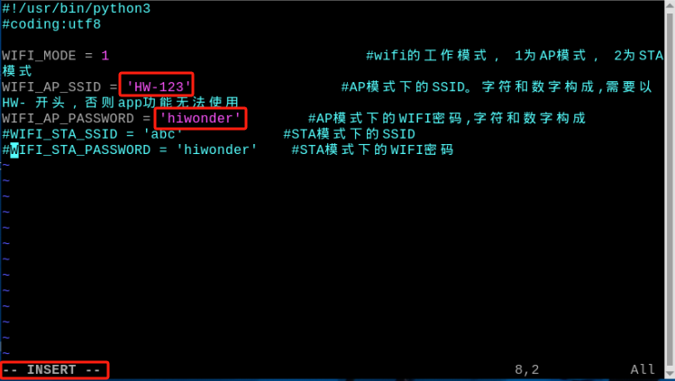
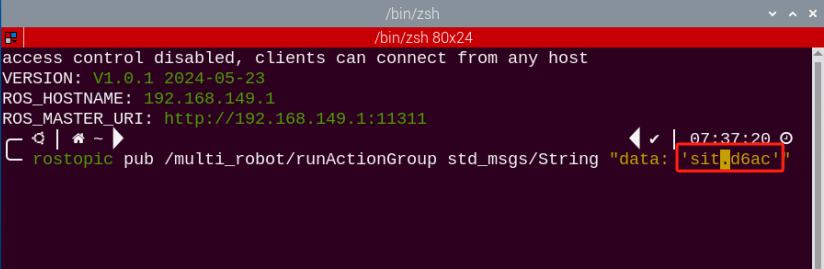

# 群发控制课程

## 1. 主从机配置工作

### 1.1 准备工作

(1)  至少准备2台及以上的PuppyPi（本节课以2台PuppyPi为例进行示范）。

(2)  开发环境搭建，参照"**[远程工具安装及容器进入方法\1. 远程桌面工具安装与连接](https://docs.hiwonder.com/projects/PuppyPi/en/latest/docs/8_remote_tool.html#)**"，下载并安装远程连接工具 VNC。

### 1.2 实现原理

通过将主机与从机配置在同一个网络内，主机通过群发程序向从机发送动作指令，达到 控制从机的效果

### 1.3 实验步骤

<p id="anchor_1_3_1"></p>

- #### 1.3.1 网络配置

(1) **配置主机网络**

① 首先，选取一台PuppyPi作为主机，将它开机，然后远程连接它的系统桌面。

②  按下"Ctrl+Alt+T"打开命令行终端，进入到文件所在目录。输入指令，按下回车。
      
```bash
cd hiwonder-toolbox
```

③ 使用vim编辑器打开Wi-Fi 配置文件，输入指令，按下回车。
      
```bash
sudo vim wifi_conf.py
```

④ 按下键盘上的"**i** "键，进入编辑模式。修改主机热点密码，先找到下图框选的这两行代码。



⑤ 修改完成之后，按下"**Esc** "键，退出编辑模式。再输入"**:wq** "保存并退出。

```bash
:wq
```


⑥ 输入指令重启主机。
```bash
sudo systemctl restart wifi.service
```

⑦ 待主机重启完成后，再连接主机的Wi-Fi 时，需输入Wi-Fi密码"**hiwonder** "。

(2) **配置从机网络**

① 将从机开机，远程连接从机的系统桌面。

② 打开命令行终端，进入到文件所在目录。输入指令，按下回车。

```bash
cd hiwonder-toolbox
```

③ 使用vim编辑器打开Wi-Fi 配置文件，输入指令，按下回车。

```bash
sudo vim wifi_conf.py
```

④ 输入键盘上的"**i**"键，进入编辑模式，将WI-FI名称和密码这两行代码改成如下图所示。

:::{Note}
找到框选出的这四行代码。
:::


将从机的网络模式设置为"**2**"即为局域网模式，"**HW-123**"和"**hiwonder**"则为**配置主机网络**设置的主机WI-FI名称和密码。

⑤ 修改完成之后，按一下"**Esc** "键，退出编辑模式。再输入" **:wq** "保存并退出。

```bash
:wq
```


⑥ 输入命令将设备重启。（**此步不可跳过！**）

```bash
sudo systemctl restart wifi.service
```

## 2. 群控启动方法

### 2.1 启动群发控制

:::{Note}
指令输入需严格区分大小写及空格。
:::

(1)  选择一个PuppyPi机器狗作为主机并启动，通过VNC远程连接树莓派桌面。

(2)  点击系统桌面左上角的图标，打开Terminator终端。

(3)  输入关闭自启玩法的指令，并按下回车。

```bash
sudo ./.stop_ros.sh
```

(4) 输入指令配置主机环境变量。

```bash
source multi_master_env.sh
```

(5)  再回到从机的终端界面，输入关闭自启玩法的指令，并按下回车。

```bash
sudo ./.stop_ros.sh
```

(6)  在从机的终端界面，输入指令启动从机群发控制程序。

```bash
rosrun puppy_control puppy_mul.py
```

(7)  接着再打开一个新的终端输入"**ssh 192.168.149.119**"按下回车，输入密码"**raspberrypi**"与"**source multi_slave_env.sh 192.168.149.1**"配置为从机环境变量（这里是为了启动群发控制的话题，也可将其配置为主机环境变量再启动8~11步）

```bash
ssh 192.168.149.119
```

```bash
source multi_slave_env.sh 192.168.149.1
```

(8)  输入以下指令可查看主/从机的话题信息。（**若未出现主/从机话题信息，则是主/从机对应的群发控制程序没有启动，需参照上文"1~6步重新操作** **"**）

```bash
rostopic info /multi_robot/runActionGroup
```

(9)  输入" **rostopic** **pub** **/multi_robot/runActionGroup** "，再按3下Tab键将命令补齐为"**rostopic** **pub** **/multi_robot/runActionGroup** **std_msgs/String** **"data:** **''"** "

```bash
rostopic pub /multi_robot/runActionGroup std_msgs/String "data: ''"
```

(10) 在data: ''中填入动作组的名称（动作组可在 "**/home/ubuntu/software/puppypi_control/ActionGroups**" 目录中可以找到）


(11) 动作组执行完毕后，可以在主机和从机运行群发控制程序的终端界面，看到打印的动作组名称。


(12) 若要执行其它的动作，在启动群发控制话题的终端按下"Ctrl+c "，将其关闭，再 按下键盘的" ↑ "方向按键，修改动作组名称，按下回车即可执行。



(13) 如需关闭此玩法，可在LX终端界面按下"**Ctrl+C**"，如关闭失败，可多次按下。

(14) 接着在主机与从机的终端界面参考"**[1.3 主从机配置工作\ 配置主机网络](#anchor_1_3_1)**"，将Wi-Fi配置文件的注释添加上。将其恢复成直连模式。

### 2.2 功能实现

玩法启动后，主机与从机将执行同样的动作。在动作组执行完毕后，也可以在主机和从 机运行群发控制程序的终端界面，看到打印的动作组名称 。


