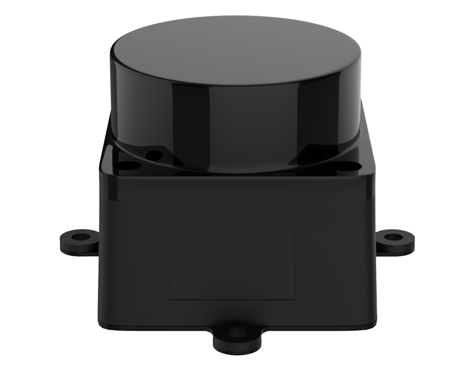
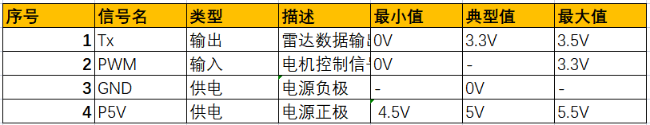
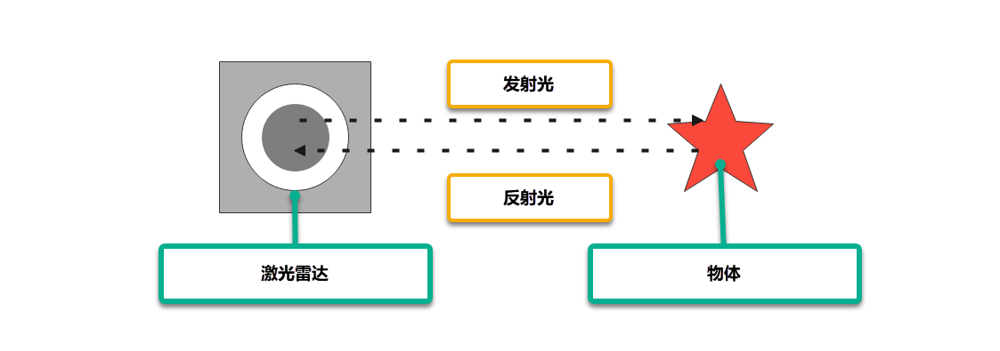
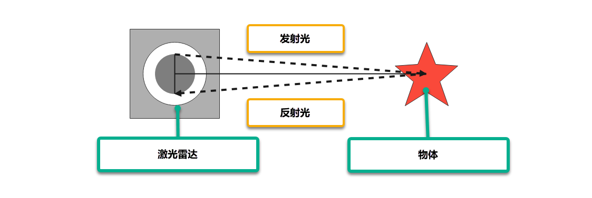
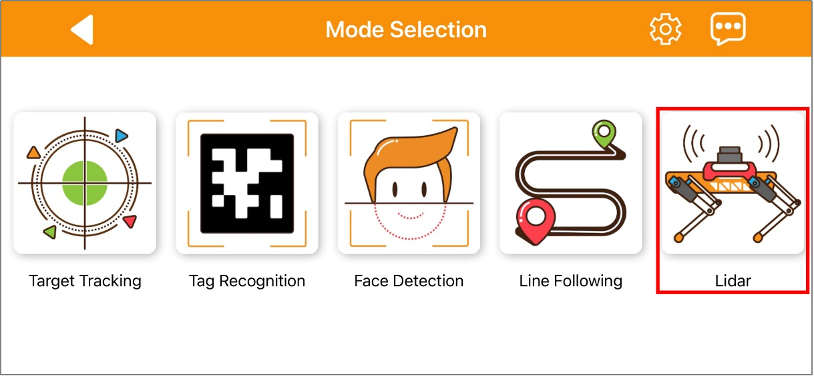

# ROS机器狗激光雷达课程

## 1. 激光雷达介绍

### 1.1 激光雷达简介

激光雷达是一种以发射激光束来探测目标位置、速度等特征量的遥感技术，它具备测量分辨率高、穿透能力强、抗干扰能力强、抗隐身能力强等优点。

根据测量原理，激光雷达可分为三种，分别是三角法激光雷达、脉冲法激光雷达和相干法激光雷达。**PuppyPi机器狗**所配备的激光雷达属于脉冲法激光雷达。



### 1.2 激光雷达原理

激光雷达由激光发射系统、扫描系统、激光接收系统和信号处理系统组成。

首先，激光发射系统向目标发射探测信号（激光束），扫描系统则负责扫描所在平面，获取平面图信息。

随后，激光接收系统接收从目标物体反射回来的激光，产生接收信号。

最后，信号处理系统对接收信号进行处理，获得目标表面形态、物理属性等特性（如目标方位、目标高度、目标速度等），进而完成物体模型的建立。

### 1.3 激光雷达参数

PuppyPi机器狗采用的激光雷达的各项规格参数如下：

1. **电气与机械参数**


2. **光学参数**


3. **性能参数**


4. **接口说明与通信协议**

LD19 使用 ZH1.5T-4P 1.5mm 连接器与外部系统连接，实现供电和数据接收，具体接口定义和参数要求见下表 ：




5. **串口规格**

用户可通过激光雷达上的物理接口，将其与外部系统进行连接。按照系统的通信协议进行通讯，可实时获取扫描的点云数据、设备信息和设备状态，并可设置设备工作模式等。


## 2. 雷达工作原理及测距方法

### 2.1 激光雷达测距

常见的激光雷达有两种方法得到目标与其之间的距离。一种叫三角测距，一种叫TOF。

TOF我们可以参考下图来理解，激光雷达先将光照射到物体上，物体会将光直接反射到激光雷达上，激光雷达计算光返回的时间，再用这一时间与光速相乘，即可得出物体与激光雷达之间的距离。



三角测距我们可以参考下图来理解，激光雷达在制作时，进行调整，让光不再直接照射到物体上，而是存在一定的角度再进行照射。这一角度是提前设置且在运行的时候不会改变的，我们可以通过三角函数代入这一角度计算物体到激光雷达的距离。



### 2.2 激光雷达效果

参考下图理解激光雷达效果，激光雷达发射出光，会照射到物体的表面，当激光雷达接收到物体反射回来的光的时候，就会在光照射到的位置标记出物体的轮廓。


## 3. 雷达避障

如需了解手机APP的连接方法，可前往目录"**[上手试玩\1. 手机APP安装和连接](https://docs.hiwonder.com/projects/PuppyPi/en/latest/docs/2_play_first_hand.html#app)**"查看相关课程。

### 3.1 玩法开启及关闭步骤

- #### 3.1.1 通过APP开启

1.  打开手机APP"**WonderPi**"，连接PuppyPi机器狗。

2.  在模式选择界面点击"**激光雷达**"，进入该玩法的操作界面。



3.  点击"**雷达避障**"右侧的开关按键，启动该玩法模式。


- #### 3.1.2 通过指令开启

:::{Note}

该玩法不需要关闭 APP 自启服务，如已经关闭自启服务，可以输入指令"**sudo systemctl restart start_node.service**"重新启动自启服务，等待机器人蜂鸣器滴一声。

:::

1)  启动PuppyPi机器狗，通过VNC远程连接树莓派桌面。

2)  点击系统桌面左上角的图标，打开Terminator终端。

3)  输入指令，并按下回车，进入激光雷达玩法。
```commandline
rosservice call /lidar_app/enter "{}"
```


4)  启动成功后，再输入指令并按下回车，开启雷达避障玩法。

**rosservice call /lidar_app/set_running "data: 1"**


:::{Note}
效果与手机 APP 开启玩法相同，若需要查看源码，可以在Docker容器中的"**/home/ubuntu/puppypi/src/lidar_app/scripts**"文件夹内找到"**lidar.py**"。
:::

5)  如需停止该玩法，输入指令并按下回车。

```commandline
rosservice call /lidar_app/set_running "data: 0"
```


6)  如需关闭玩法，接着输入指令， 并按下回车，关闭雷达避障玩法。

```commandline
rosservice call /lidar_app/exit "{}"
```


:::{Note}
玩法在未退出时，会在当前树莓派通电状态下持续运行。为避免过多占用树莓派的运行内存，如需执行其它玩法，请先按照上述指令关闭当前玩法。
:::

### 3.2 功能实现

在这里以书立作为检测物体进行检测，注意，在使用雷达跟随的功能当中，需要被检测的物体高于雷达的扫描水平高度，这样我们的PuppyPi机器狗上面搭载的雷达才能有效的扫描到它的位置信息，然后PuppyPi机器狗直走，当检测到障碍物，PuppyPi机器狗会自动转向，以躲避障碍物。


### 3.3 程序参数说明

- #### 3.3.1 Launch文件简要分析

Launch 文件路径位置在Docker容器中的：**/home/ubuntu/puppypi/src/lidar_app/launch/**


首先启动雷达，它的路径是 \$(find ldlidar)/launch/LD06.launch。 再启动了一个名为lidar_app的节点，使用了lidar_app包中的 lidar.py 文件。output="screen" 指示将节点的输出显示在终端上，respawn="false" 表示如果节点意外终止，将不会重新启动节点。

lidar.py 为程序的源码文件，可以在Docker容器中的"**/home/ubuntu/puppypi/src/lidar_app/scripts/**"路径下查看

- #### 3.3.2 源码文件程序简要分析

该程序的源代码位于Docker容器中的：**/home/ubuntu/puppypi/src/lidar_app/scripts/lidar.py**

根据实现的效果，梳理程序的过程逻辑，如下图所示：


- **初始化**


rospy.init_node(name, anonymous=True): 初始化一个 ROS 节点，使用提供的name 作为节点的名称，并将 anonymous 设置为 True。

self.name: 存储传入的名称作为对象的属性。

其他属性包括控制 Lidar 的一些参数，如运行模式、阈值、扫描角度、速度等。

self.lock: 创建了一个线程锁，用于多线程环境下的安全访问。

- **创建ROS服务**


enter_srv:创建了一个" /enter" 的 ROS 服务，类型为 Trigger，回调函数为enter_func。当调用这个服务时，它会执行enter_func函数。

exit_srv:创建了一个"/exit" 的 ROS 服务，类型为 Trigger，回调函数为exit_func。当调用这个服务时，它会执行exit_func函数。

set_running_srv:创建了一个"/set_running" 的 ROS 服务，类型为 SetInt64，回调函数为set_running_srv_callback。当调用这个服务时，它会执行set_running_srv_callback函数。

set_parameters_srv:创建了一个"/set_parameters" 的 ROS 服务，类型 为 SetFloat64List，回调函数为set_parameters_srv_callback。当调用这个服务时，它会执行set_parameters_srv_callback函数。

heartbeat_srv:创建了一个 Heart 对象，使用了/%s/heartbeat的 ROS主题，设置了一个 5 秒的时间间隔。用于在消息被触发时执行heartbeat_srv_cb函数。

- **雷达避障**


## 4. 雷达跟随

如需了解手机APP的连接方法，可前往目录"**第2章 上手试玩\第1课 手机APP安装和连接**"查看相关课程。

### 4.1 玩法开启及关闭步骤

- #### 4.1.1 通过APP开启

1.  打开手机APP"WonderPi"，连接PuppyPi机器狗。

2.  在模式选择界面点击"**激光雷达**"，进入该玩法的操作界面。


3.  点击"**雷达跟随**"右侧的开关按键，启动该玩法模式。


- #### 4.1.2 通过指令开启

:::{Note}

该玩法不需要关闭 APP 自启服务，如已经关闭自启服务，可以输入指令"**sudo systemctl restart start_node.service**"重 新启动自启服务，等待机器人蜂鸣器滴一声。

:::

1)  启动PuppyPi机器狗，通过VNC远程连接树莓派桌面。

2)  点击系统桌面左上角的图标，打开Terminator终端。

3)  输入指令，并按下回车，进入激光雷达玩法。
   
```commandline
rosservice call /lidar_app/enter "{}"
```


4)  启动成功后，再输入指令并按下回车，开启雷达跟随玩法。

```commandline
rosservice call /lidar_app/set_running "data: 2"
```


:::{Note}

效果与手机 APP 开启玩法相同，若需要查看源码，可以在Docker容器中的"**/home/ubuntu/puppypi/src/lidar_app/scripts**"文件夹内找到"**lidar.py**"。

:::

5)  如需停止该玩法，输入指令并按下回车。

```commandline
rosservice call /lidar_app/set_running "data: 0"
```


6)  如需关闭玩法，接着输入指令， 并按下回车，关闭雷达跟随玩法。

```commandline
rosservice call /lidar_app/exit** **"{}"
```


:::{Note}

玩法在未退出时，会在当前树莓派通电状态下持续运行。为避免过多占用树莓派的运行内存，如需执行其它玩法，请先按照上述指令关闭当前玩法

:::

### 4.2 功能实现

在这里以书立作为检测物体进行检测，注意，在使用雷达跟随的功能当中，需要被检测的物体高于雷达的扫描水平高度，这样我们的PuppyPi机器狗上面搭载的雷达才能有效的扫描到 它的位置信息，然后PuppyPi机器狗会调整自身位置，使机体和障碍物的间距始终保持在 0.35m左右。


### 4.3 程序参数说明

1. **Launch文件简要分析**

Launch 文件路径位置在Docker容器中的：**/home/ubuntu/puppypi/src/lidar_app/launch/**


首先启动雷达，它的路径是 \$(find ldlidar)/launch/LD06.launch。 再启动了一个名为lidar_app的节点，使用了lidar_app包中的 lidar.py 文件。output="screen" 指示将节点的输出显示在终端上，respawn="false" 表示如果节点意外终止，将不会重新启动节点。

lidar.py 为程序的源码文件，可以在Docker容器中的"**/home/ubuntu/puppypi/src/lidar_app/scripts/**"路径下查看。

2. **源码文件程序简要分析**

该程序的源代码位于Docker容器中的：**/home/ubuntu/puppypi/src/lidar_app/scripts/lidar.py**

根据实现的效果，梳理程序的过程逻辑，如下图所示：


- **初始化**


rospy.init_node(name, anonymous=True): 初始化一个 ROS 节点，使用提供的name 作为节点的名称，并将 anonymous 设置为 True。

self.name: 存储传入的名称作为对象的属性。

其他属性包括控制 Lidar 的一些参数，如运行模式、阈值、扫描角度、速度等。

self.lock: 创建了一个线程锁，用于多线程环境下的安全访问。

- **创建ROS服务**


enter_srv:创建了一个"/enter" 的 ROS 服务，类型为 Trigger，回调函数为enter_func。当调用这个服务时，它会执行enter_func函数。

exit_srv:创建了一个"/exit" 的 ROS 服务，类型为 Trigger，回调函数为exit_func。当调用这个服务时，它会执行exit_func函数。

set_running_srv:创建了一个"/set_running" 的 ROS 服务，类型为 SetInt64，回调函数为set_running_srv_callback。当调用这个服务时，它会执行set_running_srv_callback函数。

set_parameters_srv:创建了一个"/set_parameters" 的 ROS 服务，类型 为 SetFloat64List，回调函数为set_parameters_srv_callback。当调用这个服务时，它会执行set_parameters_srv_callback函数。

heartbeat_srv:创建了一个 Heart 对象，使用了/%s/heartbeat的 ROS主题，设置了一个 5 秒的时间间隔。用于在消息被触发时执行heartbeat_srv_cb函数。

- **雷达跟随**


## 5. 雷达警卫

如需了解手机APP的连接方法，可前往目录"**[上手试玩\1. 手机APP安装和连接]()**"查看相关课程。

### 5.1 玩法开启及关闭步骤

- #### 5.1.1 通过APP开启

1.  打开手机APP"**WonderPi**"，连接PuppyPi机器狗。

2.  在模式选择界面点击"**激光雷达**"，进入该玩法的操作界面。

     

3.  点击"**雷达警卫**"右侧的开关按键，启动该玩法模式。

     

- #### 5.1.2 通过指令开启

:::{Note}
该玩法不需要关闭 APP 自启服务，如已经关闭自启服务，可以输入指令"**sudo systemctl restart start_node.service**"重 新启动自启服务，等待机器人蜂鸣器滴一声。
:::

1)  启动PuppyPi机器狗，通过VNC远程连接树莓派桌面。

2)  点击系统桌面左上角的图标，打开Terminator终端。

3)  输入指令，并按下回车，进入激光雷达玩法。

```commandline 
rosservice call /lidar_app/enter "{}"
```


4)  启动成功后，再输入指令并按下回车，开启雷达警卫玩法。

```commandline 
rosservice call /lidar_app/set_running "data: 3"
```


:::{Note}
效果与手机 APP 开启玩法相同，若需要查看源码，可以在Docker容器中的"**/home/ubuntu/puppypi/src/lidar_app/scripts**"文件夹内找到"**lidar.py**"。
:::

5)  如需停止该玩法，输入指令并按下回车。

```commandline 
rosservice call /lidar_app/set_running "data: 0"
```


6)  如需关闭玩法，接着输入指令， 并按下回车，关闭雷达警卫玩法。

```commandline 
rosservice call /lidar_app/exit "{}"
```


:::{Note}
玩法在未退出时，会在当前树莓派通电状态下持续运行。为避免过多占用树莓派的运行内存，如需执行其它玩法，请先按照上述指令关闭当前玩法。
:::

### 5.2 功能实现

在这里以书立作为检测物体进行检测，注意，在使用雷达跟随的功能当中，需要被检测的物体高于雷达的扫描水平高度，这样我们的PuppyPi机器狗上面搭载的雷达才能有效的扫描到它的位置信息，然后PuppyPi机器狗会调整机体朝向，使机体面向障碍物，即摄像头正对障碍物。


### 5.3 程序参数说明

1. **Launch文件简要分析**

Launch 文件路径位置在Docker容器中的：**/home/ubuntu/puppypi/src/lidar_app/launch/**


首先启动雷达，它的路径是 \$(find ldlidar)/launch/LD06.launch。 再启动了一个名为lidar_app的节点，使用了lidar_app包中的 lidar.py 文件。output="screen" 指示将节点的输出显示在终端上，respawn="false" 表示如果节点意外终止，将不会重新启动节点。

lidar.py 为程序的源码文件，可以在Docker容器中的"**/home/ubuntu/puppypi/src/lidar_app/scripts/**"路径下查看

2. **源码文件程序简要分析**

该程序的源代码位于Docker容器中的：**/home/ubuntu/puppypi/src/lidar_app/scripts/lidar.py**

根据实现的效果，梳理程序的过程逻辑，如下图所示：


- **初始化**


rospy.init_node(name, anonymous=True): 初始化一个 ROS 节点，使用提供的name 作为节点的名称，并将 anonymous 设置为 True。

self.name: 存储传入的名称作为对象的属性。

其他属性包括控制 Lidar 的一些参数，如运行模式、阈值、扫描角度、速度等。

self.lock: 创建了一个线程锁，用于多线程环境下的安全访问。

- **创建ROS服务**


enter_srv: 创建了一个"/enter" 的 ROS 服务，类型为 Trigger，回调函数为enter_func。当调用这个服务时，它会执行enter_func函数。

exit_srv: 创建了一个"/exit" 的 ROS 服务，类型为 Trigger，回调函数为exit_func。当调用这个服务时，它会执行exit_func函数。

set_running_srv: 创建了一个"/set_running" 的 ROS 服务，类型为 SetInt64，回调函数为set_running_srv_callback。当调用这个服务时，它会执行set_running_srv_callback函数。

set_parameters_srv: 创建了一个"/set_parameters" 的 ROS 服务，类型 为 SetFloat64List，回调函数为set_parameters_srv_callback。当调用这个服务时，它会执行set_parameters_srv_callback函数。

heartbeat_srv: 创建了一个 Heart 对象，使用了/%s/heartbeat的 ROS主题，设置了一个 5 秒的时间间隔。用于在消息被触发时执行heartbeat_srv_cb函数。

- **雷达警卫**


