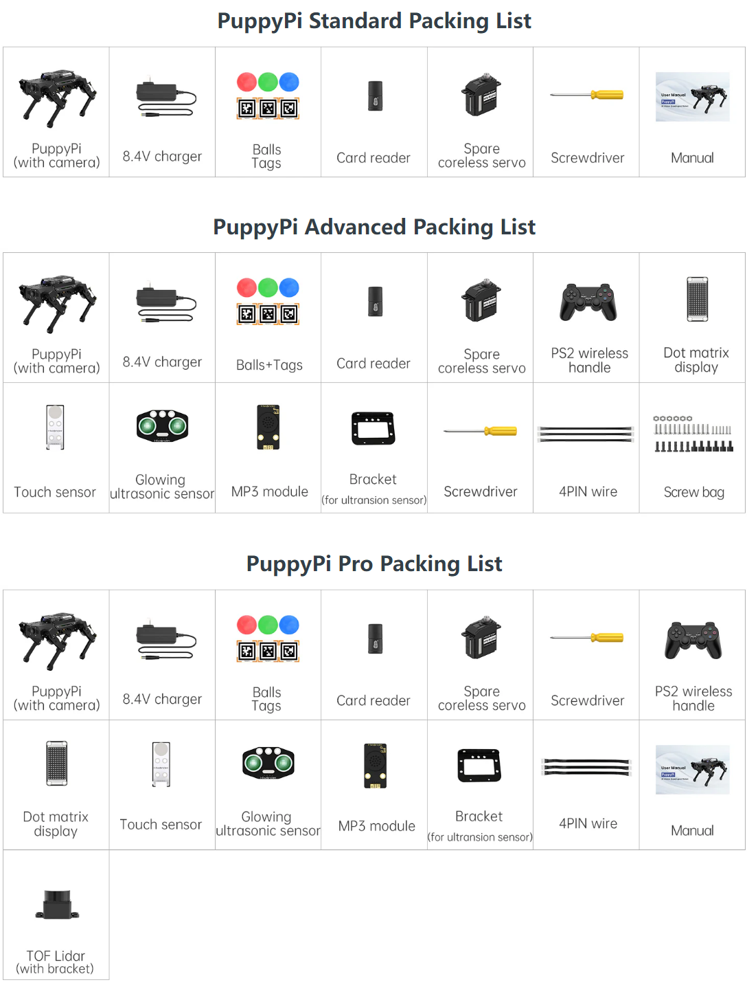
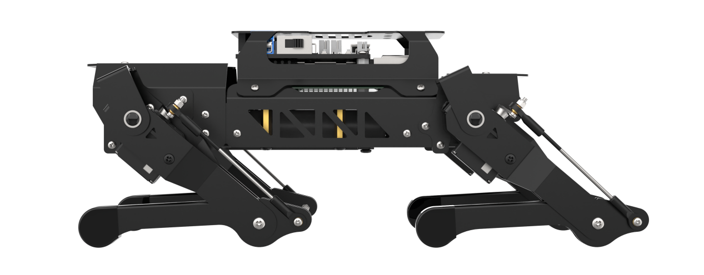

# 学前先看

## 1. 认识PuppyPi

### 1.1 产品简介

PuppyPi是一款基于树莓派5开发的AI视觉四足机器人。它的机身采用铝合金结构，并搭载8个高性能舵机，腿部采用连杆结构设计，动作灵活丰富，可以轻松实现自由行走、上下台阶等基本步态。

机器人拥有第一视觉，能实现更多有趣的AI玩法，如目标追踪、人脸检测、视觉巡航、自主攀爬等。

PuppyPi机器人采用ROS操作系统，支持Gazebo编程，能满足用户对机器视觉、机器人运动学、四足步态控制等算法的学习和验证。

### 1.2 产品清单

## 2. 首次开机

### 2.1 充电方法

1)  充电前，用螺丝刀将机器狗腹部的铝合钣金拆下:

2)  在对接前需要将扩展板的开关拨动到OFF。

3)  掏出电池，将对接线以**红对红**、**黑对黑**的形式连接，如下图所示：

4)  对接完成以后，将电池顺着方向塞入电池槽内，并将后盖装上。（螺丝无需拧的太紧，能固定即可）

5)  拿出附带的适配器，将插头端连接至树莓派扩展板的圆孔内，如下图所示：

6)  等待充电完成。适配器指示灯在未通电的状态下为绿色，通电后指示灯为红色代表充电中（**充电时长约为1个半小时左右**），当指示灯由红色变为绿色代表充电完成。充电完成后，请尽快拔掉充电器，切勿一直充电！

### 2.2 开机

:::{Note}

请勿在粗糙崎岖的地面上启动PuppyPi。

开机后不要强行掰动舵机，避免舵机产生损伤。

:::

1)  开机前，为避免舵机突然发力而造成受损，请将PuppyPi呈卧姿放置在平面上，如下图所示：

2)  然后将扩展板的开关由"**OFF**"推到"**ON**"，开机以后，机器狗尾部的数码管会显示电池当前电量（下图所示点亮为8V，当电池电量低于6.8V时需尽快给电池充电），且LED1和LED2会亮起微弱蓝灯，稍等片刻后，LED1将常亮，LED2将每隔两秒闪烁，代表网络配置已经准备完毕。然后等待蜂鸣器发出"嘀"的一声，说明Ros配置完成，设备启动完毕。

3)  设备出厂默认为AP直连模式，开机成功后，将产生一个以"**HW**"开头的热点。

接下来可前往"**[上手试玩](/projects/PuppyPi/en/latest/docs/2_play_first_hand.html)**"继续学习后续内容。

