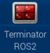
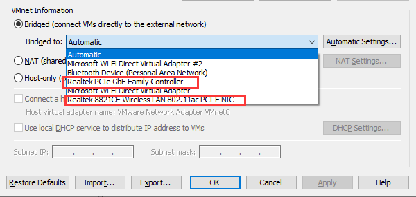
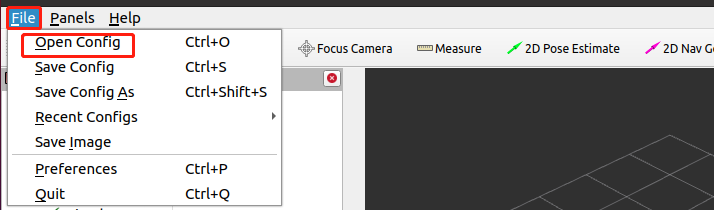
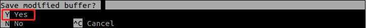
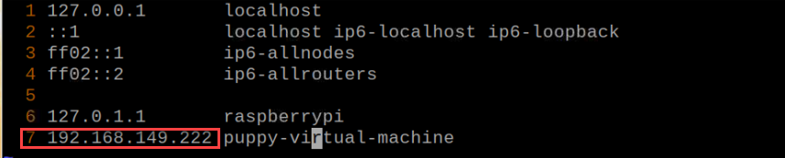
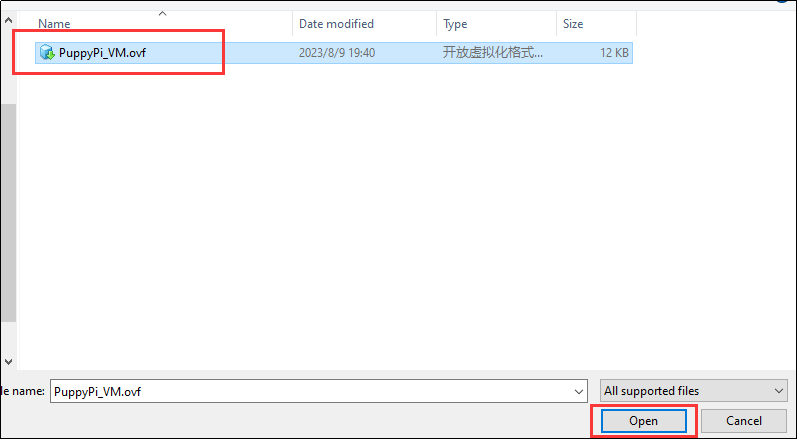
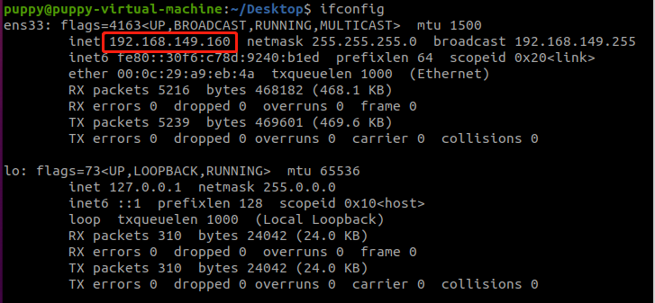
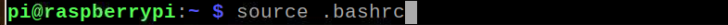
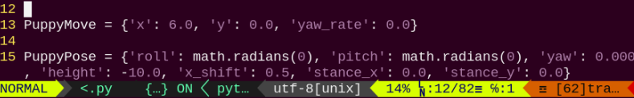

# SLAM建图课程

## 1. SLAM地图构建原理

### 1.1 SLAM简介

首先以人为例，在前往目的地前，不管是否有地图，肯定要知道当前所处的位置，只不过人是通过眼睛，机器人则通过“激光雷达”这种方式。SLAM（Simultaneous Localization and Mapping）指的是即时定位和建图。

定位是定位机体在坐标系下的位姿。坐标系的原点和姿态可以由第一帧关键帧、已有的全局地图或路标点、GPS得到。

建图指的是建立机器人所感知周围环境的地图，地图基本几何元素是点。地图的主要作用是定位、导航，导航可拆为导和航，导包括全局规划和局部规划，航即规划完后控制机器人运动。

### 1.2 SLAM建图原理


SLAM建图主要是有以下三个过程：

1.  预处理：对雷达的点云原始数据进行优化，剔除一些有问题的数据，或者进行滤波。通俗来说，激光雷达获取的周围环境信息，被称为点云。它是能反映机器人所在环境中“眼睛”能看到的一个部分。其采集到的物体信息呈现出一系列分散的、具有准确角度和距离的信息。

2.  匹配：把当前这一局部环境的点云数据在已建立的地图上寻找对应的位置，进行匹配。通常，激光SLAM系统通过对不同时刻两片点云的匹配与比对，计算激光雷达相对运动的距离和姿态的改变，也就完成了对机器人自身的定位。

3.  以激光作为信号源，由激光器发射出的脉冲激光，打到周围障碍物上，引起散射。一部分光波会反射到激光雷达的接收器上，再根据激光测距原理计算，就可以得到从激光雷达到目标点的距离。脉冲激光不断地扫描目标物，就可以得到目标物上全部目标点的数据，用此数据进行成像处理后，就可得到精确的三维立体图像。地图融合：将来自激光雷达的新一轮数据拼接到原始地图当中，最终完成地图的更新。

### 1.3 地图构建技巧

1)  在开机建图时，机器人最好是面向一堵直墙，或者用封闭的纸箱代替，尽可能让雷达扫到更多的点。


2)  尽量走直线，减少机器人旋转运动，否则会造成画面特征点稀疏。当周围环境特征较弱的时候，尽量使机器人贴近环境明显一侧完成建图。


3)  在一些大环境应用场景下建图时，最好让机器人先完成建图闭环，再去详细扫描环境里的各个小细节。

例如像商场等环境，透明玻璃较多，环境特征不明显。如果在机器人行进的前方有将要路过的相较有特征的环境，如：柱子、左右通道、斜着的墙壁等，可以在合适的位置停下来，然后向着特征位置原地旋转，等雷达扫出了特征环境后再旋转回来继续前进。但旋转的过程中尽量不要后退。



### 1.4 地图构建结果判断

最后在地图构建完成以后，可通过以下点来判断结果是否满足导航的要求：

1. 地图中障碍物边缘是否清晰；

2. 地图中是否存和实际环境不一致的区域（如：有无闭环）；

3. 地图中是否存在机器人行动区域内的灰色区域（如：未扫描到的区域）；

4. 地图中是否存在后续定位时将不存在的障碍物（如：移动障碍物）；

5. 地图中是否能保证机器人在活动区域内的任何位置，360度的视野范围内，均已探明。

### 1.5 各建图算法使用区别

机器人建图功能包为puppy_slam,已默认安装了Gmapping、Hector、Karto建图。通过功能包中的slam.launch文件来启动不同的建图算法。下表为各建图算法的简要区别，以供用户快速了解（各算法详细说明可参考后文），用户可根据具体需求和环境条件选择最适合的建图算法。

| **算法名称** | **精度** | **即时性** | **计算复杂度** | **要求** | **适用场景** |
|:--:|:--:|:--:|:--:|:--:|:--:|
| Gmapping | 高精度 | 实时 | 中等 | 对地图中的特征和环境的可感知性要求较高。 | 小到中型室内环境，需要实时建图和精确性。 |
| Hector | 相对准确 | 实时 | 低 | 对激光雷达数据的更新率有较高要求，以适应高速移动机器人的需求。 | 移动速度较快的机器人和存在运动模糊情况的环境 |
| Karto | 相对准确 | 实时 | 中等 | 对环境中的特征和结构要求较高，以实现准确的扫描匹配和建图。同时，它对计算资源的需求较低，适用于资源有限的平台。 | 小型环境，计算资源有限或设备性能较低的场景。 |

## 2. Gmapping建图算法

:::{Note}
开始建图前，需确保机器狗有充足的电量，最好是在充满的状态下进行。
:::

### 2.1 Gmapping简介

Gmapping的理论概念较为简单，它是基于Rao-Blackwellized粒子滤波(RBPF）算法实现的开源SLAM算法，Gmapping算法将定位与建图的过程分离，先通过粒子滤波算法做定位，并通过粒子与已产生地图进行 scanMatch，然后不断矫正里程计误差并添加新的scan做为地图。

随着场景增大，所需粒子数会增多，而由于每个粒子都需要携带一副地图，这会导致构建大地图所需的计算量和内存消耗都过大，因此Gmapping算法更适用于构建小场景地图。


### 2.2 Gmapping原理

Gmapping算法的实现流程大致为，通过上一时刻的地图及运动模型，预测当前时刻的位姿，随后根据传感器观测值计算权重，执行重采样，更新粒子的地图，并如此往复，便可以完成地图构建。


Gmapping在RBpf算法上做了两个主要的改进:改进提议分布和选择性重采样。

同其他建图算法相比，Gmapping算法的优点与缺点也比较显著。

Gmapping算法的优点在于可以实时构建室内地图，在构建小场景地图所需的计算量较小且精度较高。相比Hector对激光雷达频率要求低、鲁棒性高(Hector 在机器人 快速转向时很容易发生错误匹配，建出的地图发生错位，原因主要是优化算法容易陷入局部最小值)﹔而相比Cartographer在构建小场景地图时，Gmapping不需要太多的粒子并且没有回环检测因此计算量小于Cartographer而精度并没有差太多。Gmapping有效利用了车轮里程计信息，这也是Gmapping对激光雷达频率要求低的原因:里程计可以提供机器人的位姿先验。而Hector和Cartographer的设计初衷不是为了解决平面移动机器人定位和建图，Hector主要用于救灾等地面不平坦的情况，因此无法使用里程计。而Cartographer 是用于手持激光雷达完成SLAM过程，也就没有里程计可以用。

Gmapping算法的缺点是随着场景增大所需的粒子增加，因为每个粒子都携带一幅地图，因此在构建大地图时所需内存和计算量都会增加。因此不适合构建大场景地图。并且没有回环检测，因此在回环闭合时可能会造成地图错位，虽然增加粒子数目可以使地图闭合但是以增加计算量和内存为代价。所以不能像Cartographer那样构建大的地图，虽然论文生成几万平米的地图，但实际我们使用中建的地图没有几千平米时就会发生错误。Gmapping和Cartographer一个是基于滤波框架SLAM另一个是基于优化框架的SLAM，两种算法都涉及到时间复杂度和空间复杂度的权衡。Gmapping牺牲空间复杂度保证时间复杂度，这就造成Gmapping不适合构建大场景地图，试想一下要构建200x200米的环境地图，栅格分辨率选择5厘米，每个栅格占用一字节内存，那么一个粒子携带的地图就需要16M内存，如果是100个粒子就需要1.6G内存。如果地图变成500乘500米，粒子数为200个，可能电脑就要崩溃了。翻看Cartographer算法，优化相当于地图中只用一个粒子，因此存储空间比较Gmapping会小很多倍，但计算量大，一般的笔记本很难跑出来好的地图，甚至根本就跑不动。优化图需要复杂的矩阵运算，这也是谷歌为什么还要弄个ceres库出来的原因。

[Gmapping学习Wiki](http://wiki.ros.org/gmapping)

[Slam_Gmapping软件包](https://github.com/ros-perception/slam_gmapping)

[OpenSlam_Gmapping开源算法](https://github.com/ros-perception/openslam_gmapping)

### 2.3 虚拟机的安装和配置

由于树莓派计算能力有限，所以需要将建图的一部分工作放到虚拟机来完成。建图和导航都需要虚拟机和PuppyPi互相通信，我们需要在修改两者的配置。

1. **安装虚拟机软件**

虚拟机的安装可以参考同目录下的文档：“**虚拟机安装.docx**”。

2. **虚拟机的打开和导入**

   1)  将同目录下的虚拟机文件解压到任意非中文路径下。

        

   2)  打开虚拟机软件，点击“**打开虚拟机**”。

        

   3)  找到虚拟机文件解压的路径，点击打开。

        

   4)  根据自己的需求，设置虚拟机的名称和存储路径，设置完成后，点击导入。

        
       
       :::{Note}
        导入完成后，下次打开可以直接选择设置的虚拟机存储路径，直接打开虚拟机，无需再次导入
       :::

3. **虚拟机的网络配置**

    :::{Note}
    台式机进行以下配置时，需要确保装配有无线网卡或准备好一个USB无线网卡。
    :::

   1)  首先，启动机器狗，并用电脑主机连接机器狗的热点。

        

   2)  返回虚拟机，点击“**编辑**”，再点击“**虚拟机网络配置**”。

        

   3)  在桥接模式处，选择自己的无线网卡，然后点击确定。

        

        

   4)  开启虚拟机，等待开机完成。

        

   5)  进入系统桌面后，桌面右键点击，打开命令行终端。

        

        输入指令时需要严格区分大小写，且可使用“Tab”键补齐关键词。

   6)  输入指令，按下回车，查看虚拟机的IP，如红框处所示。
   
        ```commandline
        ifconfig
        ```

        

   7)  再次右键系统桌面，打开一个新的命令行终端，输入指令，按下回车，配置网络。

        ```commandline
        sudo nano /etc/hosts
        ```

        

   8)  将下图第2行和第3行的IP修改为查看到的虚拟机IP和树莓派的IP，虚拟机IP按实际查看情况填写，树莓派IP在直连模式下，固定为“**192.168.149.1**”。

        

        :::{Note}
        在修改ip的时候，我们要保证缩进与上行的相同。
        :::

   9)  修改完成后按“**Ctrl+x**”，按下Y键保存，再按下回车确定。

        
    
4. **PuppyPi的网络配置**

   1)  接着通过VNC远程连接树莓派桌面。

   2)  单击桌面左上角的的图标，或使用快捷键“**Ctrl+Alt+T**”，打开命令行终端。

   3)  输入指令，并按下回车，修改PuppyPi网络配置。

        ```commandline
        sudo vim /etc/hosts
        ```

        

   4)  找到下图红框位置，输入修改成自己的虚拟机IP（上文1.2获得）。按下“**Esc**”键，输入指令，按下回车保存并退出。

        ```commandline
        :wq
        ```

        

   5)  输入指令，并按下回车，更新配置。

        ```commandline
        source .bashrc
        ```

        

### 2.4 启动激光雷达建图

输入指令时需要严格区分大小写，且可使用“Tab”键补齐关键词。

1)  我们采用PS2手柄手动遥控的方式，让PuppyPi感知周围环境并建图。打开手柄电源开关，按下START按键，连上后，机器狗将处于标准站立姿势。

2)  接着通过VNC远程连接树莓派桌面。

3)  点击系统桌面左上角的图标，打开Terminator终端。

4) 输入指令，并按下回车开启建模服务。

```commandline
roslaunch puppy_slam gmapping.launch
```


5)  打开虚拟机，打开命令行终端窗口 ，并按下回车开启URDF模型显示节点。

```commandline
rosparam set /puppy_control/joint_state_pub_topic true
```


6)  输入指令，并按下回车，打开建图查看工具。

```commandline
roslaunch puppy_description rviz_with_urdf.launch
```


7)  点击左上角的“**File**”，再点击“**Open Config**”，打开配置文件。



8) 在“**puppy/puppy_sim/src/puppy_description**”路径下，找到“**mapping.rviz**”文件，点击打开。


9) 打开后，就会显示出地图，如下图所示。


10) 接着我们就可以用手柄控制机器狗，移动到你想要探索建图的区域，同时地图也会不断完善、更新。手柄按键和机器狗动作的对应关系如下：

:::{Note}

如果控制PuppyPi移动的过程中，发现行走有些卡顿，我们可以将VNC显示先关掉，避免跟建图抢占CPU资源。

:::

|    **按键**    |            **功能**            |
|:--------------:|:------------------------------:|
|     START      |       机体恢复初始化姿态       |
|       L1       |              上仰              |
|       L2       |              下俯              |
|       R1       |              前倾              |
|       R2       |              后倾              |
| ↑ / 左滑杆向上 |              前进              |
| ↓ / 左滑杆向下 |              后退              |
| ← / 左滑杆向左 |              左转              |
| → / 左滑杆向右 |              右转              |
| △ / 右滑杆向上 |          提升机体高度          |
| × / 右滑杆向下 |          降低机体高度          |
| ◻ / 右滑杆向左 | 减速（需配合按键“↑”、“↓”使用） |
| ○ / 右滑杆向右 | 加速（需配合按键“↑”、“↓”使用） |

11) 探索完区域后，需要将地图保存到树莓派中，回到VNC，重新打开一个命令行终端，输入指令

:::{Note}

rosrun map_server map_saver -f /home/ubuntu/puppypi/src/puppy_slam/maps/map1

:::

其中map1可以替换成你想要保存的地图名字，按下回车，等待一会，地图就会保存在此指令的路径下。


12) 保存的地图在Docker容器中的 “**/homeubuntu/puppy_pi/src/puppy_slam/maps/**”路径下。


13) 此时整个SLAM建图过程就已经完成，可在启动建图重新的终端界面按下“**Ctrl+C**”，关闭程序。

## 3. Hector建图算法

:::{Note}

开始建图前，需确保机器狗有充足的电量，最好是在充满的状态下进行。

:::

### 3.1 Hector简介

Hector算法采用了高斯—牛顿迭代法（Gauss-Newton iteration method），仅根据激光信息便可以构建地图。

Hector算法无需里程计数据，因此可以应用于救灾等地面不平坦的场景。由于需要根据激光雷达数据估算里程计信息，此算法对激光雷达的帧率要求较高。

Hector算法的整体建图精度要优于Gmapping算法，但它对参数配置要求较高，而Gmapping算法的易用性更好。


### 3.2 Hector原理

Hector算法利用了高斯—牛顿迭代法来解决扫描匹配问题。扫描匹配就是使用当前帧和已有地图数据构建误差函数，并利用高斯—牛顿迭代法获取最优解和偏差量。具体实现流程如下：

首先，在初始时刻，需要将激光雷达自身的坐标与栅格地图坐标系重合，这样即可获取激光雷达在地图中的初始位姿，以及雷达第一帧扫描数据在地图中的坐标。

随后，获取雷达第二帧扫描数据，并测出它在地图中的坐标。此时，第二帧与第一帧的相对位置关系是未知的。

接着，对这两帧数据进行匹配。假设两帧数据无限接近，通过构造最小二乘法等计算步骤，求解出位姿增量。将第一帧位姿与位姿增量相加，即可获得第二帧在地图坐标系下的位姿。

最后，根据第二帧扫描数据的位姿计算出它在地图中的坐标，也就是将其映射至地图上。不断重复上述步骤，即可完成建图。

Hector 的算法流程如下图所示：


上图不仅是Hector SLAM 的算法流程图，也是Hector 源码的结构图，用户在后期如果要学习Hector SLAM 算法源码，也可借鉴上图的结构进行代码梳理与学习。

- **HectorSLAM 相关源代码及WIKI 地址：**

[Hector Mapping ROS Wiki](http://wiki.ros.org/hector_mapping)

[Hector_slam 软件包](https://github.com/tu-darmstadt-ros-pkg/hector_slam)


### 3.3 虚拟机的安装和配置

由于树莓派计算能力有限，所以需要将建图的一部分工作放到虚拟机来完成。建图和导航都需要虚拟机和PuppyPi互相通信，我们需要在修改两者的配置。

1. **安装虚拟机软件**

虚拟机的安装可以参考同目录下的文档：“**虚拟机安装.docx**”。

2. **虚拟机的打开和导入**

    1)  将同目录下的虚拟机文件解压到任意非中文路径下。
    
    
    
    2)  打开虚拟机软件，点击“**打开虚拟机**”。
    
    
    
    3)  找到虚拟机文件解压的路径，点击打开。
    
    
    
    4)  根据自己的需求，设置虚拟机的名称和存储路径，设置完成后，点击导入。
    
    
    
    :::{Note}
    
    导入完成后，下次打开可以直接选择设置的虚拟机存储路径，直接打开虚拟机，无需再次导入
    
    :::

3. **虚拟机的网络配置**

    :::{Note}
    
    台式机进行以下配置时，需要确保装配有无线网卡或准备好一个USB无线网卡。
    
    :::
    
    1)  首先，启动机器狗，并用电脑主机连接机器狗的热点。
    
    
    
    2)  返回虚拟机，点击“**编辑**”，再点击“**虚拟机网络配置**”。
    
    
    
    3)  在桥接模式处，选择自己的无线网卡，然后点击确定。
    
    
    
    
    
    4)  开启虚拟机，等待开机完成。
    
    
    
    5)  进入系统桌面后，桌面右键点击，打开命令行终端。
    
    
    
    输入指令时需要严格区分大小写，且可使用“Tab”键补齐关键词。
    
    6)  输入指令，按下回车，查看虚拟机的IP，如红框处所示。
    
    ```commandline
    ifconfig
    ```
    
    
    
    7)  再次右键系统桌面，打开一个新的命令行终端，输入指令，按下回车，配置网络。
    
    ```commandline
    sudo nano /etc/hosts
    ```
    
    
    
    8)  将下图第2行和第3行的IP修改为查看到的虚拟机IP和树莓派的IP，虚拟机IP按实际查看情况填写，树莓派IP在直连模式下，固定为“**192.168.149.1**”。
    
    
    
    :::{Note}
    在修改ip的时候，我们要保证缩进与上行的相同。
    :::
    
    9)  修改完成后按“**Ctrl+x**”，按下Y键保存，再按下回车确定。
    
    

4. **PuppyPi的网络配置**

   1)  接着通过VNC远程连接树莓派桌面。

   2)  单击桌面左上角的的图标，或使用快捷键“Ctrl+Alt+T”，打开命令行终端。

   3)  输入指令，并按下回车，修改PuppyPi网络配置。
    
    ```commandline
    sudo vim /etc/hosts
    ```
    
    
    
    4)  找到下图红框位置，输入修改成自己的虚拟机IP（上文1.2获得）。按下“**Esc**”键，输入指令，按下回车保存并退出。
    
    ```commandline
    :wq
    ```
    
    
    
    5)  输入指令，并按下回车，更新配置。
    
    ```commandline
    source .bashrc
    ```
    
    

### 3.4 启动激光雷达建图

输入指令时需要严格区分大小写，且可使用“**Tab**”键补齐关键词。

1)  我们采用PS2手柄手动遥控的方式，让PuppyPi感知周围环境并建图。打开手柄电源开关，按下START按键，连上后，机器狗将处于标准站立姿势。

2)  接着通过VNC远程连接树莓派桌面。

3)  点击系统桌面左上角的图标，打开Terminator终端。

4)  输入指令，并按下回车开启建模服务。

```commandline
roslaunch puppy_slam hector.launch
```


5)  打开虚拟机，打开命令行终端窗口 ，并按下回车开启建模服务。

```commandline
rosparam set /puppy_control/joint_state_pub_topic true
```


6)  输入指令，并按下回车，打开URDF模型显示节点。

```commandline
roslaunch puppy_description rviz_with_urdf.launch
```


7) 点击左上角的“**File**”，再点击“**Open Config**”，打开配置文件。


8) 在“**puppy/puppy_sim/src/puppy_description**”路径下，找到“**mapping.rviz**”文件，点击打开。


9) 打开后，就会显示出地图，如下图所示。


10) 输入接着我们就可以用手柄控制机器狗，移动到你想要探索建图的区域，同时地图也会不断完善、更新。手柄按键和机器狗动作的对应关系如下：

:::{Note}

如果控制PuppyPi移动的过程中，发现行走有些卡顿，我们可以将VNC显示先关掉，避免跟建图抢占CPU资源。

:::

|    **按键**    |            **功能**            |
|:--------------:|:------------------------------:|
|     START      |       机体恢复初始化姿态       |
|       L1       |              上仰              |
|       L2       |              下俯              |
|       R1       |              前倾              |
|       R2       |              后倾              |
| ↑ / 左滑杆向上 |              前进              |
| ↓ / 左滑杆向下 |              后退              |
| ← / 左滑杆向左 |              左转              |
| → / 左滑杆向右 |              右转              |
| △ / 右滑杆向上 |          提升机体高度          |
| × / 右滑杆向下 |          降低机体高度          |
| ◻ / 右滑杆向左 | 减速（需配合按键“↑”、“↓”使用） |
| ○ / 右滑杆向右 | 加速（需配合按键“↑”、“↓”使用） |

11) 探索完区域后，需要将地图保存到树莓派中，回到VNC，重新打开一个命令行终端，输入指令

```commandline
rosrun map_server map_saver -f /home/ubuntu/puppypi/src/puppy_slam/maps/map1
```

其中map1可以替换成你想要保存的地图名字，按下回车，等待一会，地图就会保存在此指令的路径下。


12) 保存的地图在Docker容器中的“**/home/ubuntu/puppypi/src/puppy_slam/maps/**”路径下 。


13) 此时整个SLAM建图过程就已经完成，可在启动建图重新的终端界面按下“**Ctrl+C**”，关闭程序。

## 4. Karto建图算法

:::{Note}

开始建图前，需确保机器狗有充足的电量，最好是在充满的状态下进行。

:::

### 4.1 Karto简介

Karto算法基于图优化框架，通过非线性最小二乘方法来优化建图过程中累积的误差，在一定程度上替代了基于滤波器的激光SLAM方案。

Karto算法的缺点在于，每次采用局部子图匹配前都需构建子图，因此耗费时间较长。

Karto_SLAM 的 ROS 版本，其中采用的稀疏点调整（the Spare Pose Adjustment(SPA)）与扫描匹配和闭环检测相关。landmark 越多,内存需求越大,然而图优化方式相比其他方法在大环境下制图优势更大，因为他仅包含点的图(robot pose)，求得位姿后再求 map。

Karto SLAM 的算法程序框架如下图所示：


从上图中可以看出，其实流程还是相当简单的，slam 传统软实时的运行机制，每进入一帧数据，即进行处理，然后返回。

- **KartoSLAM 相关源代码及 WIKI 地址：**

[KartoSLAM ROS Wiki](http://wiki.ros.org/slam_karto)

[slam_karto 软件包](https://github.com/ros-perception/slam_karto)

[open_karto 开源算法](https://github.com/ros-perception/open_karto)

### 4.2 Karto原理

Karto算法以图优化为基础思想，也就是用图像均值表示地图，每个节点表示机器人轨迹的一个位置点和传感器测量数据集。每当地图加入新节点，会根据节点位置进行约束计算，更新地图信息。

Karto算法的数据处理流程如下：


首先，根据里程计获取机器人的当前位姿，并将其与机器人进行一定范围的平移和旋转后的位姿进行匹配，选择其中可能性最大的位姿。若得到单个位姿，则将此位姿作为匹配后的位姿。若得到多个位姿，则对其求均值，将结果位姿作为匹配后的位姿。

随后，设定激光雷达数据保存的阈值，扫描过程中会对达到该阈值的数据进行保存。

需要注意的是，雷达由一个区域移动至另一个区域时，此移动过程会导致两个区域的地图存在重合。此时，机器人会先保存第一个地图中的未重合部分，然后将重合部分包含至第二个地图中。

最后，根据处理所得的数据更新地图，完成地图构建。

### 4.3 虚拟机的安装和配置

由于树莓派计算能力有限，所以需要将建图的一部分工作放到虚拟机来完成。建图和导航都需要虚拟机和PuppyPi互相通信，我们需要在修改两者的配置。

1. **安装虚拟机软件**

虚拟机的安装可以参考同目录下的文档：“**虚拟机安装.docx**”。

2. **虚拟机的打开和导入**

   1)  将同目录下的虚拟机文件解压到任意非中文路径下。

       

   2)  打开虚拟机软件，点击“**打开虚拟机**”。

       

   3)  找到虚拟机文件解压的路径，点击打开。

       

   4)  根据自己的需求，设置虚拟机的名称和存储路径，设置完成后，点击导入。

       
       :::{Note}
       导入完成后，下次打开可以直接选择设置的虚拟机存储路径，直接打开虚拟机，无需再次导入
       :::

3. **虚拟机的网络配置**

    :::{Note} 
    台式机进行以下配置时，需要确保装配有无线网卡或准备好一个USB无线网卡。
    :::

    1)  首先，启动机器狗，并用电脑主机连接机器狗的热点。
    
        

    2)  返回虚拟机，点击“**编辑**”，再点击“**虚拟机网络配置**”。
    
        

   3)  在桥接模式处，选择自己的无线网卡，然后点击确定。

       

       

   4)  开启虚拟机，等待开机完成。

       

   5)  进入系统桌面后，桌面右键点击，打开命令行终端。

       

       输入指令时需要严格区分大小写，且可使用“**Tab**”键补齐关键词。

   6)  输入指令，按下回车，查看虚拟机的IP，如红框处所示。
       ```commandline
       ifconfig
       ```

       

   7)  再次右键系统桌面，打开一个新的命令行终端，输入指令，按下回车，配置网络。

       ```commandline
       sudo nano /etc/hosts
       ```

       

   8)  将下图第2行和第3行的IP修改为查看到的虚拟机IP和树莓派的IP，虚拟机IP按实际查看情况填写，树莓派IP在直连模式下，固定为“**192.168.149.1**”。

       

       :::{Note} 
       在修改ip的时候，我们要保证缩进与上行的相同。
       :::

   9)  修改完成后按“**Ctrl+x**”，按下Y键保存，再按下回车确定。

       

4. **PuppyPi的网络配置**

   1)  接着通过VNC远程连接树莓派桌面。

   2)  单击桌面左上角的的图标，或使用快捷键“**Ctrl+Alt+T**”，打开命令行终端。

   3)  输入指令，并按下回车，修改PuppyPi网络配置。

       ```commandline
       sudo vim /etc/hosts
       ```

       

   4)  找到下图红框位置，输入修改成自己的虚拟机IP（上文1.2获得）。按下“**Esc**”键，输入指令，按下回车保存并退出。

       ```commandline
       :wq
       ```

       

   5)  输入指令，并按下回车，更新配置。

       ```commandline
       source .bashrc
       ```

       

### 4.4 启动激光雷达建图

>输入指令时需要严格区分大小写，且可使用“**Tab**”键补齐关键词。

1)  我们采用PS2手柄手动遥控的方式，让PuppyPi感知周围环境并建图。打开手柄电源开关，按下START按键，连上后，机器狗将处于标准站立姿势。

2)  接着通过VNC远程连接树莓派桌面。

3)  点击系统桌面左上角的图标，打开Terminator终端。

4)  输入指令，并按下回车开启建模服务。

    ```commandline
    roslaunch puppy_slam karto.launch
    ```

    

5)  打开虚拟机，打开命令行终端窗口 ，并按下回车开启URDF模型显示节点。

    ```commandline
    rosparam set /puppy_control/joint_state_pub_topic true
    ```

    

6)  输入指令，并按下回车，打开建图查看工具。

    ```commandline
    roslaunch puppy_description rviz_with_urdf.launch
    ```

    

7)  点击左上角的“**File**”，再点击“**Open Config**”，打开配置文件。

    

8) 在“**puppy/puppy_sim/src/puppy_description**”路径下，找到“**mapping.rviz**”文件，点击打开。

    

9) 打开后，就会显示出地图，如下图所示。

    

10) 输入接着我们就可以用手柄控制机器狗，移动到你想要探索建图的区域，同时地图也会不断完善、更新。手柄按键和机器狗动作的对应关系如下：

    :::{Note} 
    如果控制PuppyPi移动的过程中，发现行走有些卡顿，我们可以将VNC显示先关掉，避免跟建图抢占CPU资源。
    :::

|    **按键**    |            **功能**            |
|:--------------:|:------------------------------:|
|     START      |       机体恢复初始化姿态       |
|       L1       |              上仰              |
|       L2       |              下俯              |
|       R1       |              前倾              |
|       R2       |              后倾              |
| ↑ / 左滑杆向上 |              前进              |
| ↓ / 左滑杆向下 |              后退              |
| ← / 左滑杆向左 |              左转              |
| → / 左滑杆向右 |              右转              |
| △ / 右滑杆向上 |          提升机体高度          |
| × / 右滑杆向下 |          降低机体高度          |
| ◻ / 右滑杆向左 | 减速（需配合按键“↑”、“↓”使用） |
| ○ / 右滑杆向右 | 加速（需配合按键“↑”、“↓”使用） |

11) 探索完区域后，需要将地图保存到树莓派中，回到VNC，重新打开一个命令行终端，输入指令，并按下回车。

    ```commandline
    rosrun map_server map_saver -f /home/ubuntu/puppypi/src/puppy_slam/maps/map1
    ```

    其中map1可以替换成你想要保存的地图名字，按下回车，等待一会，地图就会保存在此指令的路径下。

    

12) 保存的地图在Docker容器中的“**/homeubuntu/puppypi/src/puppy_slam/maps/**”路径下 。

    

13) 此时整个SLAM建图过程就已经完成，可在启动建图的终端界面按下“**Ctrl+C**”，关闭程序。

## 5. APP建图

### 5.1 准备工作

我们可以通过手机来控制机器狗和查看机器狗的建图画面，并且用手机给机器狗设置目标点进行导航。

1. 本节课需要用到手机APP“**Make A APP**”和“**Map Nav**”，前者用于建图，后者用于导航。

2. 目前仅支持安卓系统：软件安装包位于本目录下，用户可将其导入手机进行安装。

### 5.2 建图操作

<span id="anchor_5_2_1" class="anchor"></span>

1. **APP建图服务的开启**

   1)  开启机器狗，接着通过VNC远程连接树莓派桌面。

   2)  点击系统桌面左上角的图标，打开Terminator终端。 

   3)  输入指令，并按下回车，开启APP建图服务。

       ```commandline
       . /home/ubuntu/puppypi/src/puppy_slam/scripts/mapping_app.sh
       ```
    
       

2. **APP建图**

   1.  开启机器狗，将其连接至远程控制软件VNC。

   2.  开启APP服务，具体操作步骤可参考“[**APP建图服务的开启**](#anchor_5_2_1)”。

   3.  前往手机的设置界面，连接机器狗生成的热点。

       

   4.  打开APP“**Make A Map**”，将“**Master URI**”一栏修改为“**http://192.168.149.1:11311**”，并点击“**CONNECT**”按键。

       
    
       APP界面可分为两个区域，黄色方框用于显示构建的地图，蓝色方框用于控制机器狗的移动。
    
       

3. **保存地图**

   1)  探索完区域后，需要将地图保存到树莓派中，回到VNC，重新打开一个命令行终端，输入指令

       ```commandline
       rosrun map_server map_saver -f /home/ubuntu/puppypi/src/puppy_slam/maps/map1
       ```

       其中map1可以替换成你想要保存的地图名字，按下回车，等待一会，地图就会保存在此指令的路径下。

       

   2)  保存的地图在Docker容器中的“**/homeubuntu/puppypi/src/puppy_slam/maps/**”路径下。

       

   3)  此时整个SLAM建图过程就已经完成，可在启动建图重新的终端界面按下“**Ctrl+C**”，关闭程序。

4. **使用其他算法建图**

   1)  开启机器狗，接着通过VNC远程连接树莓派桌面。

   2)  点击系统桌面左上角的图标，打开Terminator终端。

   3)  输入指令，并按下回车，进入存放.sh执行文件的文件夹。

       ```commandline
       roscd puppy_slam/scripts/
       ```

       

   4)  输入指令，并按下回车，查看app建图文件。

       ```commandline
       sudo vim mapping_app.sh
       ```

       

   5) 可以通过修改下图红框位置来修改APP建图所想要使用的算法，一共提供三种算法，他们的文件名称分别为：“**gmapping.launch**”、“**hector.launch**”、“**karto.launch**”。将红框位置修改成需要使用的算法对应的文件名后，按下“**Esc**”键，输入指令并按下回车保存并退出。然后执行“[**2.1APP建图服务的开启**](#_APP服务的开启)”。

       ```commandline
       :wq
       ```

       
