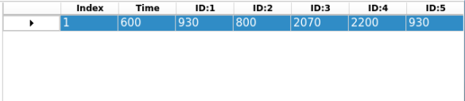
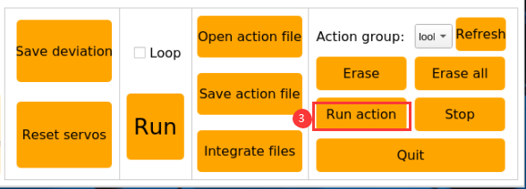
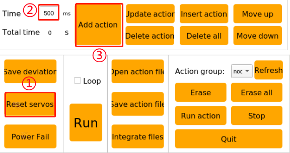
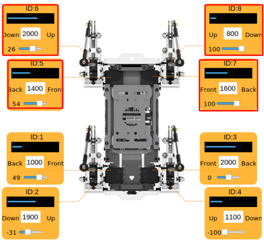
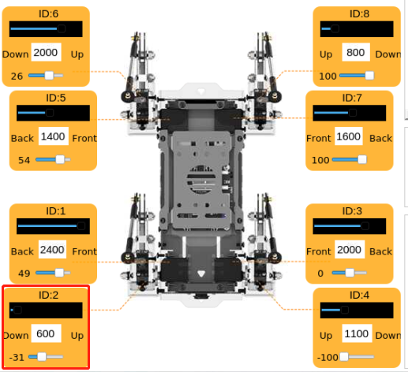
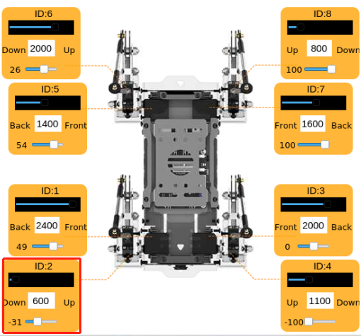
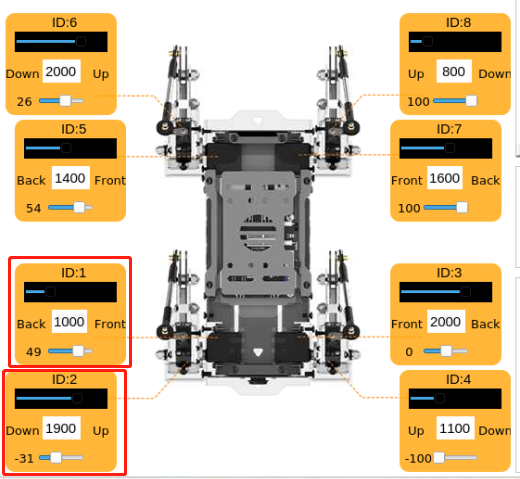
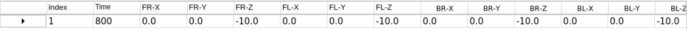

# 自主导航课程

## 1. ROS机器人自主导航原理

### 1.1 自主导航简介

所谓自主导航，就是让机器人从A点能够自己移动到B点。而要实现这样的功能，就需要机器人自带的固定组件：全局地图、自身定位、路径规划、运动控制和环境感知。通过这些组件才能实现后续自主导航的功能，具体可以参考以下图片：


### 1.2 自主导航原理

我们已经知道，要实现自主导航，就需要机器人带有：全局地图、自身定位、路径规划、运动控制和环境感知这五个组件，而这些组件对应的就是机器人内部的功能包。

首先是**全局地图**：它可以为机器人的导航提供全局性质的地图，而对应的地图则是通过SLAM来进行构建的，对应有关SLAM的原理可以参考"**第20章SLAM建图课程\第1课 SLAM地图构建原理**"进行学习。

**自身定位**：通过算法来计算出机器人在地图中的位置。

一般采用算法有两种：一种是通过里程计计算出当前位置与原点位置的进而得出当前机器人在地图上的位置；另一种是通过雷达传感器来感知周边的环境信息再与当前地图的特征点进行对比进而得出机器人位置。

**路径规划**：通过全局地图和本地地图来对路径进行规划。全局地图是通过SLAM建图得到的，本地地图可通过雷达传感器进行实时扫描更新进而对路径进行规划。

**运动控制**：通过发送信息给机器人进而控制其运动。

**环境感知**：通过雷达传感器对周围环境进行感知，对SLAM构建地图、自身定位以及后续的导航功能都有帮助。

## 2. AMCL自适应蒙特卡洛定位

### 2.1 AMCL定位

定位就是推算机器人自身在全局地图中的位置，SLAM 中也包含定位算法实现，不过 SLAM 的定位是用于构建全局地图的，是属于导航开始之前的阶段。当前定位是用于导航中，机器人需要按照设定的路线运动，通过定位可以判断机器人的实际轨迹是否符合预期。在 ROS 的导航功能包集ros-navigation 中提供了 AMCL定位系统，用于实现导航中的机器人定位。

AMCL(adaplive Monte CarloLocalizalion) 是用于二维移动机器人的概率定位系统，它实现了自适应蒙特卡罗定位方法，可以根据已有地图使用粒子滤波器推算机器人位置。

定位解决了机器人与障碍物之间的关联问题，因为路径规划本质上就是基于机器人周围障碍物进行决策的过程。理论上只要已知机器人全局定位并借助激光雷达等传感器扫描信息实时避障，就能完成导航任务。但全局定位的实时性和精度一般不高，由里程计、IMU 等局部定位提供,就能保证机器人的运动轨迹跟IMU的实时性和精度。导航功能包中的 amcl节点通过发布 map_odom来提供全局定位。amcl全局定位并不是必需的，用户可以将amcl 全局定位替换成其他能提供 map_odom 的全局定位，例如使用SLAM、UWB、二维码定位等方式。

全局定位和局部定位已经构建起一套动态tf坐标map_odom base_footprint,机器人中各个传感器之间的静态 tf坐标通过机器人 URDF 型提供。这部分 TF 关系解决了机器人与障碍物之间的关联问题，比如激光雷达探测到前方 3m 处有一个障碍物，那么利用激光雷达与机器人底盘之间的tf坐标，base_link到 laser_link 的。标变换，可以知道该障碍物与机器人底盘之间的关系。

[AMCL学习Wiki](http://wiki.ros.org/amcl)

[AMCL包链接](https://github.com/ros-planning/navigation/tree/melodic-devel/amcl)

### 2.2 粒子滤波

蒙特卡罗定位过程拟了一个一维机器人的粒子更新。首先随机生成一群粒子，粒子可以有位置、方向、或需要估计的状态变量，每种方法都有一个权重，表示它与系统实际状态匹配的相似度。然后预测每个粒子下一时刻的状态，可根据预测真实系统的行为来移动粒子。之后根据测量更新粒子的权重，与测量值更匹配的粒子将赋予更高的权粒之后进行重采样，丢弃极不可能的粒子，用更可能的拉子替换。最后计算粒子集的加权平均值和协方差以获得状态估计值。


蒙特卡罗方法各不相同，但趋于遵循一个特定的模式：

1. 定义可能输入的域

2. 从域上的概率分布随机生成输入

3. 对输入进行确定性计算

4. 汇总结果

有两个重要的考虑因素：

1. 如果这些点不是均匀分布的，那么近似效果就会很差。

2. 这一过程需要很多点。如果整个正方形中只有几个点是随机放置的，那么这个近似值通常是很差的。平均而言，随着放置更多的点，近似值精度会提升。

蒙特卡罗粒子滤波算法算有许多的应用领域非常广泛，例如：物理科学、工程学、气候学和计算机生物学。

### 2.3 自适应蒙特卡罗定位

AMCL可以看作是蒙特卡罗定位算法的改进版本，它通过在蒙特卡罗定位算法中使用少量样本来减少执行时间，以此提高实时性能。它实现了自适应或 KLD 采样的蒙特卡罗定位方法，其中针对已有地图使用粒子滤波跟踪一个机器人的姿态

自适应蒙特卡罗定位节点主要使用激光扫描和激光雷达地图。传递消息并完成位姿估计的计算。实现过程先针对 ROS 系统提供的各个初始化参数，完成自适应蒙特卡罗定位算法粒子滤波器的初始化。如果没有设定初始化位姿，自适应蒙特卡罗定位算法会假定机器人从坐标系原点开始运行这样计算会相对复杂。

因此，建议在 rviz 中通过 2D Pose Estimate 按钮来设定初始化位姿，关于自适应蒙特卡罗定位内容同样可以参考wiki 地址链接: https://github.com/ros-planning/navigation

### 2.4 代价地图

无论是激光雷达还是深度相机作为传感器跑出的2D或3D SLAM地图，都不能直接用于实际的导航，必须将地图转化为costmap(代价地图),ROS的costmap通常采用grid(网格)形式。栅格地图一个栅格占1个字节，也就是八位，可以存0-255中数据，也就是每个cell cost（网格的值）从0~255我们只需要三种情况：Occupied被占用（有障碍）, Free自由区域（无障碍）,  Unknown Space未知区域。

在介绍costmap_2d之前，要先介绍个算法bresenham算法，Bresenham直线算法是用来描绘由两点所决定的直线的算法，它会算出一条线段在n维光栅上最接近的点。这个算法只会用到较为快速的整数加法、减法和位元移位，常用于绘制电脑画面中的直线。是计算机图形学中最先发展出来的算法。


过各行各列像素中心构造一组虚拟网格线如上图。按直线从起点到终点的顺序计算直线与各垂直网格线的交点，然后根据误差项的符号确定该列像素中与此交点最近的像素。

算法核心思想：假设：k=dy/dx。因为直线的起始点在像素中心，所以误差项d的初值d0＝0。X下标每增加1，d的值相应递增直线的斜率值k，即d＝d＋k。一旦d≥1，就把它减去1，这样保证d在0、1之间。当d≥0.5时，最接近于当前像素的右上方像素（x+1,y+1）而当d\<0.5时，更接近于右方像素(x+1,y）为方便计算，令e＝d-0.5，e的初值为-0.5，增量为k。当e≥0时，取当前像素（xi，yi）的右上方像素（x+1,y+1）而当e\<0时，更接近于右方像素(x+1,y）可以改用整数以避免除法。由于算法中只用到误差项的符号，因此可作如下替换：e1 = 2\*e\*dx。


Costmap2D类维护了每个栅格的代价值。Layer类是虚基类，它统一了各插件costmap层的接口。其中最主要的接口函数有：

initialize函数，它调用onInitialize函数，分别对各costmap层进行初始化；

matchSize函数，在StaticLayer类和ObstacleLayer类中，该函数调用了CostmapLayer类的matchSize函数，初始化各costmap层的size，分辨率，原点和默认代价值，并保持与layered_costmap一致。对于inflationLayer类，根据膨胀半径计算了随距离变化的cost表。后面就可以用距离来查询膨胀栅格的cost值。同时定义了seen_数组，该数组用于标记栅格是否已经被遍历过。对于VoxelLayer类，则初始化了体素方格的size；

updateBounds函数，调整当前costmap层需要更新的大小范围。对于StaticLayer类，确定costmap的更新范围为静态地图的大小（注意：静态层一般只用在全局costmap中。）。对于ObstacleLayer类，遍历clearing_observations中的传感器数据，确定障碍物的边界。

其中initialize函数和matchSize函数分别只执行一次。updateBounds函数和updateCosts函数则会周期执行，其执行频率由map_update_frequency决定。

CostmapLayer类同时继承了Layer类和Costmap2D类，并提供了几个更新cost值的操作方法。StaticLayer类和ObstacleLayer类需要保存实例化costmap层的cost值，所以都继承了CostmapLayer类。StaticLayer类使用静态栅格地图数据更新自己的costmap。ObstacleLayer类使用传感器数据更新自己的costmap。VoxelLayer类相对于ObstacleLayer类则多考虑了z轴的数据。效果的区别主要体现在障碍物的清除方面。一个是二维层面的清除，一个是三维里的清除。


Costmap 度量障碍非常灵活，可以根据需求创建特定的图层，然后在该图层上维护需要关注的障碍信息。如果机器人上只安装了激光雷达，那么需创建一个 Obstacles 图层来维护激光雷达扫描到的障碍信息。如果机器人上添加了超声波，那么需要新建一个 Sonar 图层来维护声波传感器扫描到的障碍信息。每个图层都可以有自己的障碍更新规则，例如添加障碍、删除障碍、更新障碍点的置信度等，极大地提高了导航系统的可扩展性。

更多内容可以参考：

[ROS navigation wiki](http://wiki.ros.org/navigation)

[ROS move_base wiki](http://wiki.ros.org/move_base)

### 2.5 全局路径规划

前言：根据移动机器人对环境的了解情况、环境性质以及使用的算法，可将路径规划分为基于环境的路径规划算法、基于地图知识的路径规划算法和基于完备性的路径规划算法，



机器人自主导航中比较常用的路径规划算法包括 Diikstra、A\*、D\*、PRM、RRT、遗传算法蚁群算法、模糊算法等。

机器人中用到的 Dijkstra、A\*属于基于图结构的路径搜索算法。导航功能包中集成了 navfn、global planner 和 carrot planner 全局路规划插件。用户可以从中选择一种加载到 move_base 中使用，也可以选择第三方全局路径规划插件加载到move_base中使用，例 SBPL_Lattice_Planner、srl_global_planner，或者根据nav_core 的接口规范自己开发所需的全局路径规划插件。


移动机器人导航通过路径规划使其可以到达目标点。导航规划层可以分为全局路径规划层、局部路径规划层、行为执行层等。

（1） **全局路径规划层**：依据给定的目标，接受权值地图信息生成全局权值地图，规划出从起点到目标位置的全局路径，作为局部路径规划的参考。

（2） **局部路径规划层**：作为导航系统的局部规划部分，接受权值地图生成的局部权值地图信息，依据附近的障碍物信息进行局部路径规划。

（3） **行为执行层**：结合上层发送的指令以及路径规划，给出移动机器人的当前行为。

作为移动机器人研究的一个重点领域，移动机器人路径规划算法的优劣很大程度上决定了机器人的工作效率。

- #### 2.5.1 Dijkstra 算法

迪杰斯特拉(Dijkstra)算法是典型最短路径算法，Dijkstra是一种单源最短路径算法，主要特点是以起始点为中心向外层层扩展，即广度优先搜索思想，直到扩展到终点为止，是一种带有边权值考量的广度优先算法，是全局路径规划问题中最常用的算法之一。

下面是Dijkstra算法图解：

1)  开始时我们把dis\[start\]初始化为0,其余点初始化为inf。


2)  第一轮循环找到dis值最小的点1,将1变成白点,对所有与1相连的蓝点的dis值进行修改,使得dis\[2\]=2,dis\[3\]=4,dis\[4\]=7。


3)  第二轮循环找到dis值最小的点2,将2变成白点,对所有与2相连的蓝点的dis值进行修改,使得dis\[3\]=3,dis\[5\]=4。



4)  第三轮循环找到dis值最小的点3,将3变成白点,对所有与2相连的蓝点的dis值进行修改,使得dis\[4\]=4。


5)  接下来两轮循环分别将4,5设为白点,算法结束,求出所有点的最短路

关于 Dijkstra 算法介绍和使用方法，可以登录 wiki 查看链接: http://wiki.ros.org/navfn

- #### 2.5.2 A星算法

A星是对Dijkstra算法的修改，该算法针对单个目的地进行了优化。Dijkstra算法可以找到所有位置的路径；A星查找到一个位置或几个位置中最近的位置的路径。它优先考虑那些似乎更接近目标的路径。

A星算法的公式为：F = G + H，其中G值是起点移动到指定方格的移动代价H是指定的方格移动到终点的估算成本，H值的计算方式有如下两种：

1)  计算横向和纵向移动的距离，无法斜向计算（曼哈顿距离）。


2)  计算横向和纵向移动的距离，可以斜向计算（对角线距离）。


关于A\*算法介绍和使用方法，请参考视频教程，或者登录 wiki 查看链接: http://wiki.ros.org/global planner

以及redblobgames网站：

https://www.redblobgames.com/pathfinding/a-star/introduction.html#graphs

## 3. 雷达定点及多点导航与避障

### 3.1 虚拟机的安装和配置

由于树莓派计算能力有限，所以需要将建图的一部分工作放到虚拟机来完成。建图和导航都需要虚拟机和PuppyPi互相通信，我们需要在修改两者的配置。

- #### 3.1.1 安装虚拟机软件

虚拟机的安装可以参考"**[软件工具\6.虚拟机安装包与虚拟机镜像]()**"路径下的文档。

- #### 3.1.2 虚拟机的打开和导入

1)  将同目录下的虚拟机文件解压到任意非中文路径下。


2)  打开虚拟机软件，点击"**打开虚拟机**"。


3)  找到虚拟机文件解压的路径，点击打开。


4)  根据自己的需求，设置虚拟机的名称和存储路径，设置完成后，点击导入。


:::{Note}
导入完成后，下次打开可以直接选择设置的虚拟机存储路径，直接打开虚拟机，无需再次导入
:::

- #### 3.1.2 虚拟机的网络配置

:::{Note}
台式机进行以下配置时，需要确保装配有无线网卡或准备好一个USB无线网卡。
:::

1)  首先，启动机器狗，并用电脑主机连接机器狗的热点。



2)  返回虚拟机，点击"**编辑**"，再点击"**虚拟机网络配置**"。


3)  在桥接模式处，选择自己的无线网卡，然后点击确定。


4)  开启虚拟机，等待开机完成。



 5)  进入系统桌面后，桌面右键点击，打开命令行终端。


输入指令时需要严格区分大小写，且可使用"Tab"键补齐关键词。

6)  输入指令，按下回车，查看虚拟机的IP，如红框处所示。

```commandline
ifconfig
```


7)  再次右键系统桌面，打开一个新的命令行终端，输入指令，按下回车，配置网络。

```commandline
sudo nano /etc/hosts
```



8)  将下图第2行和第3行的IP修改为查看到的虚拟机IP和树莓派的IP，虚拟机IP按实际查看情况填写，树莓派IP在直连模式下，固定为"**192.168.149.1**"。


:::{Note}
在修改ip的时候，我们要保证缩进与上行的相同。
:::

9)  修改完成后按"**Ctrl+x**"，按下Y键保存，再按下回车确定。



- #### 3.1.4 PuppyPi的网络配置

1)  接着通过VNC远程连接树莓派桌面。

2)  单击桌面左上角的的图标，或使用快捷键"**Ctrl+Alt+T**"，打开命令行终端。

3)  输入指令，并按下回车，修改PuppyPi网络配置。

```commandline
sudo vim /etc/hosts
```



4)  找到下图红框位置，输入修改成自己的虚拟机IP（上文1.2获得）。按下"**Esc**"键，输入指令，按下回车保存并退出。

```commandline
:wq
```


5)  输入指令，并按下回车，更新配置。

```commandline
source .bashrc
```


### 3.2 配置导航

1)  打开PuppyPi系统，点击系统桌面左上角的图标，打开Terminator终端.

2)  输入指令并按下回车，开启导航服务。

```commandline
roslaunch puppy_navigation navigation.launch
```


:::{Note}

默认情况下此处录取的地图为map1。

:::

出现下图内容则打开成功：


3)  打开虚拟机，输入指令，并按下回车，开启模型查看节点。

```commandline
rosparam set /puppy_control/joint_state_pub_topic true
```


4)  打开新的命令行终端窗口，输入开启模型查看软件的指令 ，并按下回车。

```commandline
roslaunch puppy_description rviz_with_urdf.launch
```


5)  根据下图提示，打开建图文件。点击"**File-\>Open Config**"。


如下图，打开对应的路径，选择"**navigation.rviz**"，然后点击"**Open**"。


### 3.3 开始导航

可以根据下图红框内容，对机器狗下达指令，我们在进行导航时，需要使用第一个工具设置机器狗的初始位置，使用第二个工具可以设置机器狗的目标点，使用第三个工具，可以设置多个目标点。机器狗会根据地图，自动设置路线，躲开障碍，达到目标点。

:::{Note}

若需要中断导航，在机器狗所在的位置上用第二个工具设置目标点即可。若拿起机器狗或被外力改变了位置，则需要我们重新设置位置。

:::


1)  软件菜单栏中，"**2D Pose Estimate**"用于设置PuppyPi机器狗的初始位置；


2)  "**2D Nav Goal**"用于设置机器人的单个目标点。点击图标，并在地图界面选择一处作为目标点，在该点处按下鼠标左键，然后拖动鼠标，选择机器人所需要到达的目的地以及朝向，选择完成后，机器人会自动生成路线，并移动至目标点。


当设置好目标点后，会生成红色和绿色两条线，红色的线是机器狗距离目标的直线距离，绿色的线是机器狗自行规划的路线。


## 4. APP导航

### 4.1 准备工作

我们可以通过手机来控制机器狗和查看机器狗的建图画面，并且用手机给机器狗设置目标点进行导航。

1. 本节课需要用到手机APP"**Make A APP**"和"**Map Nav**"，前者用于建图，后者用于导航。

2. 目前仅支持安卓系统：软件安装包位于本目录下，用户可将其导入手机进行安装。

3. 确保已参照"**[SLAM建图课程\5. APP建图]()**"进行了建图。

### 4.2 导航操作

- #### 4.2.1 APP导航服务的开启

1)  开启机器狗，接着通过VNC远程连接树莓派桌面。

2)  点击系统桌面左上角的图标，打开Terminator终端。

3)  输入指令，并按下回车，开启APP导航服务。

```commandline
. /home/ubuntu/puppypi/src/puppy_navigation/scripts/navigation_app.sh
```


- #### 4.2.2 APP导航

1.  启动机器狗，将其连接至远程控制软件VNC。

2.  开启APP服务，具体操作步骤可参考"3.1 APP导航服务的开启"。

3.  前往手机的设置界面，连接机器狗生成的热点。



4.  打开APP"**Map Nav**"，将"**Master URI**"一栏为"**http://192.168.149.1:11311**"，并点击"**CONNECT**"按键。


:::{Note}

下图"CHOOSE A MAP"按键无实际作用，地图将会自动加载。

:::

"**Map Nav**"的界面可分为3个区域。绿色方框用于显示地图；红色方框用于控制机器狗的移动；蓝框内选项"**Set Pose**"、"**Set Goal**"搭配绿色方框使用，用于设置机器狗的初始位置与导航目标点。


5.  选中"**Set Pose**"，长按地图内的某一点即可将该点设置为机器狗的初始位置。

6.  将红色方框内的箭头标识朝四周拖动，控制机器人移动以进行位置校准。

将箭头标识依次朝上、下、左、右四个方向拖动，分别可以控制机器狗进行前进、后退、左转、右转。

7.  选中"**Set Goal**"，长按地图内的某一点即可将该点设置为导航目标点。

8.  完成初始位置与导航目标点的设置后，机器狗会自动生成路线，并按照路线由初始位置移动至目标点。

机器狗移动过程中，红色方框内会以百分数形式来显示机器狗的移动速度。


