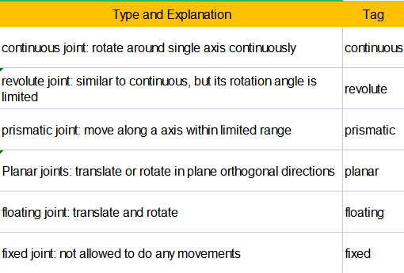
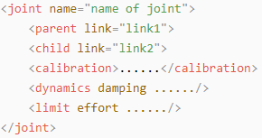
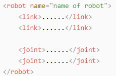

# 16. ROS1-ROS Robot with Robot Arm

## 16.1 The Installation of Robotic Arm and Power-on Test

### 16.1.1 The Installation of Robotic Arm

The installation tutorial video for the Puppypi robotic arm can be referred to in the same directory under "Robotic Arm Installation." Below is a schematic diagram for the installation of the Puppypi robotic arm:

Use four M4\*6 round head machine screw to secure the robotic arm to the Puppypi. Due to the replacement of old and new versions of Puppypi sheet metal parts, some sheet metal parts can only be installed with two M4*6 round head machine screws. Please refer to the actual Puppypi sheet metal parts for specifics.




Connect the servos ID9, ID10, and ID11 on the robotic arm to the PWM servo interfaces 9, 10, and 11 on the Raspberry Pi expansion board as pictured:



### 16.1.2 Power-on Inspection

:::{Note}

* Do not start PuppyPi on rough or uneven surfaces.
* Do not forcibly move the servos after powering on to avoid damaging them.
  :::

(1) Before powering on, to avoid servo damage from sudden movement, place PuppyPi in a lying position on a flat surface. The robotic arm should be positioned facing forward, as shown in the diagram below:



:::{Note}
Before powering on, the robotic arm must be positioned facing straight forward. Do not position it hanging downwards to prevent damage to the robotic arm when the servos are powered on.
:::


(2) Then, push the switch on the expansion board from "OFF" to "ON". After powering on, the digital display at the tail of the robot dog will show the current battery level (it lights up at 8V as pictured). when the battery level is below 6.8V, the battery needs to be charged as soon as possible. LED1 and LED2 will emit a faint blue light. After a short wait, LED1 will stay on continuously, and LED2 will blink every two seconds, indicating that the network configuration is ready. Finally, wait for a "beep" from the buzzer, indicating that the ROS configuration is complete and the device has successfully started.


(3) The device defaults to AP direct connection mode out of the factory. After successful boot-up, it will generate a hotspot starting with "HW".


## 16.2 Use of PC Software

### 16.2.1 Open the PC Software

- #### Start device via desktop icons (recommended for beginners)

(1)   Double-click the desktop icon。

(2)  Click "Execute" option in the pop-up prompt window to open the PC software.


- #### Start device via command line

(1) Click on the icon at the top left corner of the desktop, or use the shortcut **"Ctrl+Alt+T"** to open the command line terminal.

(2) Input command **"sudo python3 PuppyPi_PC_Software/PuppyPi.py"** and press Enter to open the PC software.

```bash
python3 /home/ubuntu/software/puppypi_control/PuppyPi.py
```

### 16.2.2 Usage Introduction of PC

After the upper computer successfully starts, when we select the option "Robotic Arm" in normal mode, the corresponding control area for the robotic arm servos will appear on the interface.


The servos ID9, ID10, and ID11 correspond to the three servos of the robotic arm.


The interface in normal mode can be divided into four parts: servo control area, action details list, action group settings area, and deviation settings area.


**(1) servo control area**

:::{Note}
You can adjust the posture of the PuppyPi by adjusting the values corresponding to the respective servos.
:::

| Icon | Function |
|:--:|:--:|
|  | Servo ID number. |
|  | The range of values used to adjust the angle position of the servo is from 500 to 2500. |
|  | The range of values used to adjust the servo deviation is from -100 to 100. |

**(2) action details list**

:::{Note}
You can check the execution time and servo parameter of actions in the action details list.
:::


| Icon | Function |
|:--:|:--:|
|  | Action number. |
|  | Action running time refers to the time taken to execute the action. |
|  | You can double-click on the numerical value corresponding to the ID servo to modify it. |
|  | Run the currently selected action. |

**(3) action group setting area**

| Icon | Function |
|:--:|:--:|
|  | The time required to run a single action can be directly modified within the corresponding box. |
|  | The time required to run the entire action group. |
|  | Add the current servo values from the servo control area as a new action to the last row of the action details list. |
|  | Replace the servo parameters of the selected action in the action details list with the current servo values from the servo control area, and replace the action runtime with the set value of "action time". |
|  | Insert a new action above the selected action in the action details list. Set the servo parameters to the values from the servo control area, and set the action time to the value of "action time". |
|  | Swap the selected action in the action details list with the action above it. |
|  | Delete the selected action from the action details list. |
|  | Delete all the action from the action details list. |
|  | Swap the selected action in the action details list with the action below it. |
|  | Run the selected action in the action details list once. Check "loop" to indicate looping the action. |
|  | Open the action group file required for the action group. |
|  | Save the action of the action details list to the specified position. |
|  | By clicking the "Open Action File" button to open one action group, and then clicking this button again to open another action group, you can link them together. |
|  | The saved action groups can be displayed in the PC software. |
|  | Refresh the selected action group. |
|  | Delete the currently selected action group file. |
|  | **(Caution)** Delete all action group files. |
|  | Execute the selected action group once. |
|  | Stop the currently running action group. |
|  | Exit PC software interface. |

:::{Note}
All action group files are uniformly saved to the directory `/home/pi/PuppyPi_PC_Software/ActionGroups`.
:::

**(4) Deviation setting area (The PuppyPi robot dog has been calibrated for deviation before leaving the factory. The functionality of this area's buttons is provided for informational purposes only.)**

| Icon | Function |
|:--:|:--:|
|  | Save the adjusted deviation to the PuppyPi. |
|  | Restore all servo values in the servo control area to 1500. |

### 16.2.3 Robotic Arm Deviation Adjustment

:::{Note}
PuppyPi has already been adjusted for deviation before leaving the factory, so users not need to adjust it again. However, if any changes occur due to replacing servos or other operations, it may be necessary to recalibrate the deviation.
:::

If the robotic arm on the PuppyPi is perpendicular to the body part, the two links of the robotic arm are in a right-angle position, and the gripper is properly closed, then no deviation adjustment is needed. As shown in the diagram below:


If a situation like the one shown in the diagram below occurs, deviation adjustment is required.


- #### Causes of deviation

 Deviation typically occurs under the following circumstances:

(1) When the servos is in the middle position, rotating the servo shaft angle during servo horn installation causes an angle deviation from the initial position (the factory default servo angle is the middle position).

(2) If the servo horn is installed without rotating the shaft angle, but there is a slight offset in the direction or angle fixed to the support bracket, it results in minor deviation. In addition, deviation values within 100 (i.e., within 30°) are considered within the normal adjustable range. If the deviation is larger, exceeding 100, it cannot be adjusted through software. In this case, the servo shaft screw with significant deviation needs to be removed, adjusted to the correct orientation, and then reinstalled.

- #### Adjustment method

This lesson will use adjusting servo 10 as an example for calibration. The **"Reset Servos"** operation has been performed.


(1) In **"Normal Mode"**, check **"Robotic Arm"** to observe the posture of each servo in the robotic arm. You can see the deviation value that needs to be adjusted for servo 10.


(2) The PC software will automatically read the deviation. Then, based on the actual servo situation, click on the small slider below the ID10 servo icon to make the two links of the robotic arm perpendicular to each other. You can click the left mouse button multiple times or scroll the mouse wheel to fine-tune the slider value.

(3) After adjustment, click on **"Save Deviation"**, then click **"OK"** to save the deviation to the control board.


## 16.3 Color Recognition Gripping

### 16.3.1 Program Logic

First, subscribe to the topic messages published by the camera node to obtain real-time image data. Then, convert the RGB color space to grayscale and read the camera's intrinsic parameters.

Next, perform thresholding, erosion, and dilation on the image to obtain the largest contour of the target color within the image, and outline the detected color.

Finally, control the PuppyPi to perform feedback actions. When red is detected, control the robot to perform the "grasping" action.

<p id="anchor_3_2"></p>

### 16.3.2 Operation Steps

:::{Note}
Command input must strictly differentiate between uppercase and lowercase letters as well as spaces.
:::

(1) Turn on PuppyPi, and connect it to Raspberry Pi desktop via VNC.

(2) Click the icon on the upper left corner to open the Terminator terminal.

(3) Input command **"sudo ./.stop_ros.sh"** and press Enter to close auto-start program.

```bash
sudo ./.stop_ros.sh
```

(4) Input command **"roslaunch puppy_pi_bringup start_node_with_arm.launch"** and press Enter start robotic arm game.

```bash
roslaunch puppy_bringup start_node_with_arm.launch
```

(5) Open the new terminal. Input color recognition command **"roslaunch puppy_with_arm color_detect_with_arm.launch"** and press Enter to start the program.

```bash
roslaunch puppy_with_arm color_detect_with_arm.launch
```

(6) To close this program, press **"Ctrl+C"** in the LX terminal interface. If closing fails, try pressing multiple times.

(7) After closing the program, you still need to enter the command **"sudo systemctl restart start_node.service"** and press Enter to start the app auto-start service.

```bash
sudo systemctl restart start_node.service
```

After startup completion, the buzzer will emit a short beep sound **"beep"**.

:::{Note}
 If the app auto-start service is not initiated, it will affect the normal implementation of the corresponding game in the app. If the command for auto-start is not entered, restarting the robot will also initiate the app auto-start service again.
:::

### 16.3.3 Program Outcome

:::{Note}
After starting the game, please ensure that there are no other objects with the recognized color within the field of view of the camera, to avoid affecting the implementation effect of the game.
:::

After starting the game, place the color block in front of PuppyPi. When the color block is recognized, it will be identified with a circle in the corresponding color, and the color name will be printed in the center of the window. The program can recognize color blocks of "red," "blue," and "green," but only performs "grasping" operation on red color blocks.

:::{Note}

If the color recognition is inaccurate, please refer to "[ROS1-AI Visual and Tracking Course->7.1 Color Threshold Adjustment](https://docs.hiwonder.com/projects/PuppyPi/en/latest/docs/13_visual_recognition_and_tracking.html#id1)" for adjustment.
:::

### 16.3.4 Program Analysis

:::{Note}
before making any program modifications, it is essential to backup the original factory program. Avoid directly modifying the source code files to prevent accidentally changing parameters in the wrong way, leading to robot malfunctions that cannot be repaired!
:::

**(1) launch file analysis**

During the execution of the functionality, the launch file of the current package will be started (color_detect_with_arm.launch) as pictured:


From the above diagram, it can be seen that the node name for this game functionality is "color_detect_with_arm," and this node is located in the package "puppy_with_arm." The node displays the processed information through the terminal.
Finally, the color recognition and gripping function is executed by calling the source code file "color_detect_with_arm.py".

**(2)  Source code program analysis**

The source code of this program is stored at: **[/home/ubuntu/puppypi/src/puppy_with_arm/scripts/color_detect_with_arm.py](https://store.hiwonder.com.cn/docs/PuppyPi/pi5/source_code/22/color_detect_with_arm.py)**.

```py
import sys
import cv2
import math
import rospy
import time
import threading
import numpy as np
from threading import RLock, Timer
from ros_robot_controller.msg import BuzzerState
from std_srvs.srv import *
from std_msgs.msg import Float32,Header
from sensor_msgs.msg import Image
from puppy_control.srv import SetRunActionName
from common import Misc


ROS_NODE_NAME = 'color_detect_with_arm'

sys.path.append('/home/ubuntu/software/puppypi_control/')
from servo_controller import setServoPulse

color_range_list = {}
detect_color = 'None'
color_list = []

action_finish = True
```

① sys is used for handling command-line arguments and exiting the program;

② cv2 is used for OpenCV image processing;

③ math is used for mathematical calculations;

④ rospy is used for ROS communication;

⑤ time is used for timing and delays;

⑥ threading is used for implementing parallel processing;

⑦ Rlock、Time are used for thread synchronization;

⑧ Import service types from "std_srvs.srv".

⑨ Import message types from "sensor_msgs.msg".

⑩ Import corresponding message types and service types from hiwonder_interfaces;

⑪ Import ROS image message module from sensor_msgs.msg for processing image messages;

⑫ Import action groups from puppy_control.srv.

**(3) Main program**

Subscribes to the "/usb_cam/image_raw" topic to receive image messages and calls the image_callback function for processing. Additionally, it retrieves a list of color ranges from the parameter server and creates proxies for motion control services and a buzzer publisher. Upon execution, the program initializes movement operations and then enters a loop to wait for incoming image messages. If an exception occurs, the program prints the log message "Shutting down". The overall logic is to implement image processing and control robot movement within the ROS environment.

```py
if __name__ == '__main__':
    rospy.init_node(ROS_NODE_NAME, log_level=rospy.DEBUG)
    
    color_range_list = rospy.get_param('/lab_config_manager/color_range_list', {})
    rospy.Subscriber('/usb_cam/image_raw', Image, image_callback)
    
    runActionGroup_srv = rospy.ServiceProxy('/puppy_control/runActionGroup', SetRunActionName)
    buzzer_pub = rospy.Publisher('/ros_robot_controller/set_buzzer', BuzzerState, queue_size=1)
    initMove()
    rospy.sleep(0.2)
    
    try:
        rospy.spin()
    except :
        rospy.loginfo("Shutting down")
```

① Use `rospy. Subscriber` to create a message subscriber to handle camera information.

```py
color_range_list = rospy.get_param('/lab_config_manager/color_range_list', {})
rospy.Subscriber('/usb_cam/image_raw', Image, image_callback)
```

The first parameter `/usb_cam/image_raw` indicates the topic name of image data;

The second parameter `Image` indicates message type.

The third parameter indicates calling `image_callback` function to process the returned image.

② Create `buzzer_pub`  buzzer publisher. Use `rospy.Publisher` to create a message publisher.

```py
buzzer_pub = rospy.Publisher('/ros_robot_controller/set_buzzer', BuzzerState, queue_size=1)
initMove()
```

The first parameter `/sensor/buzzer` indicates the topic name of buzzer control.

The second parameter `Float32` indicates message type.

The third parameter `queue_size=1` specify the size of message queue.

**(4) image_callback callback function**

The following image is a screenshot of the code inside the image_callback callback function:

```py
def image_callback(ros_image):

    image = np.ndarray(shape=(ros_image.height, ros_image.width, 3), dtype=np.uint8,
                       buffer=ros_image.data)  # 将自定义图像消息转化为图像(convert the customized image information to image)
    cv2_img = cv2.cvtColor(image, cv2.COLOR_RGB2BGR)
    cv2_img = cv2.flip(cv2_img, 1)
    frame = cv2_img.copy()
    frame_result = run(frame)
    cv2.imshow('Frame', frame_result)
    key = cv2.waitKey(1)
```

First, convert the ROS image message to a numpy array format of image data and convert it from RGB format to BGR format. Then, horizontally flip the image and create a copy of the image data for further processing. Next, call a function named `run` to process the image and obtain the processing result. Finally, use the cv2 module to display the processed image and wait for key input. The overall logic is to process the received image upon receiving the image message and display the processing result in real-time for monitoring and debugging of the image processing algorithm.

**(5) Run image process function**

The following image is a screenshot of part of the code for the `run` function:


First, preprocess the image, including resizing and Gaussian blur. Then, based on the preset color ranges, locate the color blocks in the image and mark them using minimum enclosing circles. Next, based on the matching between the detected color blocks and the target colors, display the corresponding text in the image. The overall logic is to detect target color blocks, mark them, and display text based on image processing and color matching.

① Preprocess the image, including resizing, Gaussian blur, and converting RGB colors to LAB space.

```py
img_copy = img.copy()
img_h, img_w = img.shape[:2]

frame_resize = cv2.resize(img_copy, size, interpolation=cv2.INTER_NEAREST)
frame_gb = cv2.GaussianBlur(frame_resize, (3, 3), 3)      
frame_lab = cv2.cvtColor(frame_gb, cv2.COLOR_BGR2LAB)  # 将图像转换到LAB空间(convert the image to LAB space)
```

② Iterate through each element in the color range list (color_range_list) for the three colors (red, green, blue), and perform a mask operation on the image based on the specified color range.

```py
for i in color_range_list:
    if i in ['red', 'green', 'blue']:
       frame_mask = cv2.inRange(frame_lab,
                                       (color_range_list[i]['min'][0],
                                       color_range_list[i]['min'][1],
                                       color_range_list[i]['min'][2]),
                                       (color_range_list[i]['max'][0],
                                        color_range_list[i]['max'][1],
                                        color_range_list[i]['max'][2]))  #对原图像和掩模进行位运算(perform bitwise operation to original image and mask)
```

③ After the mask operation, perform erosion and dilation operations on the image, as well as cropping the image. Then, call the getAreaMaxContour() function for contour detection, and finally find the contour with the largest area and its corresponding color.

```py
eroded = cv2.erode(frame_mask, cv2.getStructuringElement(cv2.MORPH_RECT, (3, 3)))  #腐蚀(corrosion)
dilated = cv2.dilate(eroded, cv2.getStructuringElement(cv2.MORPH_RECT, (3, 3))) #膨胀(dilation)
dilated[0:120,:] = 0
dilated[:,0:80] = 0
dilated[:,240:320] = 0
# cv2.imshow(i, dilated)
contours = cv2.findContours(dilated, cv2.RETR_EXTERNAL, cv2.CHAIN_APPROX_NONE)[-2]  #找出轮廓(find out the contour)
areaMaxContour, area_max = getAreaMaxContour(contours)  #找出最大轮廓(find out the contour with the maximal area)
                
if areaMaxContour is not None:
     if area_max > max_area:#找最大面积(find out the maximal area)
          max_area = area_max
          #print(max_area)
          color_area_max = i
          areaMaxContour_max = areaMaxContour
```

④ Calculate the pixel value of the contour and filter out those with less than 8500 to ensure that the recognized colors are target color blocks. Use the cv2.minEnclosingCircle() function to obtain the center point (centerX, centerY) and radius (radius) of the minimum enclosing circle of the contour with the largest area, and use the cv2.circle() function to draw the minimum enclosing circle on the image with the color corresponding to the color block.

```py
if max_area > 4000:  # 有找到最大面积,面积取大一点，确保色块放入方块里的面积足够大(the largest ares has been found, to ensure that the color block fits well into the square, use a larger area)
            
((centerX, centerY), radius) = cv2.minEnclosingCircle(areaMaxContour_max)  # 获取最小外接圆(get the minimum circumcircle)
centerX = int(Misc.map(centerX, 0, size[0], 0, img_w))
centerY = int(Misc.map(centerY, 0, size[1], 0, img_h))
radius = int(Misc.map(radius, 0, size[0], 0, img_w))            
cv2.circle(img, (centerX, centerY), radius, range_rgb[color_area_max], 2)#画圆(draw circle)
```

⑤ Differentiate the largest color block based on color, and mark the colors as 1 (red), 2 (green), or 3 (blue), and add them to the color_list. By repeatedly checking the length of the color_list, assign the corresponding color value to detect_color and draw_color.

```py
if color_area_max == 'red':  #红色最大(red is the maximal area)
     color = 1
elif color_area_max == 'green':  #绿色最大(green is the maximal area)
     color = 2
elif color_area_max == 'blue':  #蓝色最大(blue is the maximal area)
      color = 3
else:
      color = 0
 color_list.append(color)

if len(color_list) == 3:  #多次判断(multiple judgement)
     # 取平均值(take average value)
     color = int(round(np.mean(np.array(color_list))))
     color_list = []
     if color == 1:
         detect_color = 'red'
         draw_color = range_rgb["red"]
     elif color == 2:
         detect_color = 'green'
         draw_color = range_rgb["green"]
     elif color == 3:
         detect_color = 'blue'
         draw_color = range_rgb["blue"]
      else:
          detect_color = 'None'
          draw_color = range_rgb["yellow"]     
      print('detect_color is',detect_color)          
else:
     detect_color = 'None'
     draw_color = range_rgb["yellow"]
cv2.rectangle(img,(190,270),(450,480),(0,255,255),2)
```

⑥ Based on the matching between the detected color (detect_color) and the target color (target_color), use the cv2.putText() function to draw the text "Color: " + detect_color on the image, with the position (225, 210), font cv2.FONT_HERSHEY_SIMPLEX, size 1, color draw_color, line width 2, and return the processed image.

```py
if detect_color == target_color:
   cv2.putText(img, "Target Color" , (225, 250), cv2.FONT_HERSHEY_SIMPLEX, 1, draw_color, 2)  
else:
   cv2.putText(img, "Not Target Color" , (200, 250), cv2.FONT_HERSHEY_SIMPLEX, 1, draw_color, 2)      
cv2.putText(img, "Color: " + detect_color, (225, 210), cv2.FONT_HERSHEY_SIMPLEX, 1, draw_color, 2)
    
return img
```

**(6) move execute action function**

The following image is a screenshot of part of the code for the `move` function:

```py
def move():
    global action_finish 
    global draw_color
    global detect_color
    global target_color
    
    while not rospy.is_shutdown():
            
        if detect_color == target_color:
            msg = BuzzerState()
            msg.freq = 1900
            msg.on_time = 0.1
            msg.off_time = 0.9
            msg.repeat = 1
            buzzer_pub.publish(msg)
            action_finish = False
            rospy.sleep(0.8)
            runActionGroup_srv('grab.d6a', True)
            rospy.sleep(0.5)
            setServoPulse(9,1200,300)
            rospy.sleep(0.3)
            setServoPulse(9,1500,300)
            runActionGroup_srv('look_down.d6a', True)
                                
            rospy.sleep(0.8)
            detect_color = 'None'
            draw_color = range_rgb["yellow"]
        action_finish = True                
        rospy.sleep(0.01)  
        
    runActionGroup_srv('stand_with_arm.d6a', True) 
```

Based on the matching between the detected color and the target color, control the robot to perform the corresponding actions. If the color matches (red), send a buzzer signal of 0.1 second duration using buzzer_pub.publish(0.1), execute a series of actions (grabbing and placing actions), and then reset the detected color to "None". If the colors do not match, do not execute the action group.

**(7)  Execute sub-thread**

Create a sub-thread named `th` and pass the move function as the target function to the sub-thread. Set the daemon parameter to True, indicating that the sub-thread is set as a daemon thread. Use th.start() to start the sub-thread, causing it to begin executing the move function.

```py
# 运行子线程(run sub-thread)
th = threading.Thread(target=move,daemon=True)
th.start()     
```

By creating a sub-thread and passing the move function as the target function to the sub-thread, it's possible to execute other tasks in the main thread simultaneously without blocking the execution of the move function. The move function in the sub-thread can execute in the background and can run concurrently with the main thread.

**(8) getAreaMaxContour function**

The following image is a screenshot of part of the code for the `getAreaMaxContour` function:

```py
# 找出面积最大的轮廓(find out the contour with the maximal area)
# 参数为要比较的轮廓的列表(the parameter is the list of contour to be compared)
def getAreaMaxContour(contours):
    contour_area_temp = 0
    contour_area_max = 0
    area_max_contour = None

    for c in contours:  # 历遍所有轮廓(iterate through all contours)
        contour_area_temp = math.fabs(cv2.contourArea(c))  # 计算轮廓面积(calculate the contour area)
        if contour_area_temp > contour_area_max:
            contour_area_max = contour_area_temp
            if contour_area_temp > 50:  # 只有在面积大于50时，最大面积的轮廓才是有效的，以过滤干扰(only when the area is greater than 50, the contour with the maximal area is valid to filter the interference)
                area_max_contour = c

    return area_max_contour, contour_area_max  # 返回最大的轮廓(return the contour with the maximal area)
```

From a group of contours, find the contour with the largest area. The function iterates through all contours, calculates their areas, and retains the contour with the largest area. Additionally, a condition is added during area calculation to consider only contours with an area greater than or equal to 50, filtering out smaller disturbances. Finally, the function returns the found largest contour and its corresponding area.

### 16.3.5 Function Extension

When recognizing red, PuppyPi executes action of **"gripping"** and **"placing"** color block. To change to color to be detected, such as the **"green"** color block, follow these steps: 

(1) Input command **"rosed puppy_with_arm color_detect_with_arm.py"** to edit color recognition gripping program. Then press Enter.

```bash
rosed puppy_with_arm color_detect_with_arm.py
```

(2)  Find the code as pictured:


:::{Note}
 After entering the code position number on the keyboard, press the **"Shift+G"** keys to directly navigate to the corresponding position. The code position number shown in the illustration is for reference only, please refer to the actual position.
:::

(3)  Press **"i"** to go to the editing mode. And change **"red"** to **"green"**.


(4) After modification, press Esc and input **":wq"**. Then press Enter to save and exit.

```bash
:wq
```

(5)  Refer to "[16.3.2 Operation Steps](#anchor_3_2)" to restart the program to check the modified game effects.

## 16.4 Auto Recognition Gripping

### 16.4.1 Program Logic

First, subscribe to the topic messages published by the camera node to obtain real-time image data. Then, convert the RGB color space to grayscale and read the camera's intrinsic parameters.

Next, perform thresholding, erosion, and dilation on the image to obtain the largest contour of the target color within the image, and outline the detected color.

Then, control the PuppyPi to perform feedback actions. When red is detected, control the robot to perform the "grasping" action.

Finally, PuppyPi moves forward and then turns left to search for the red placement point. When red is detected, control the robot to perform the "placement" action, placing the color block at the red placement point.

<p id="anchor_4_2"></p>

### 16.4.2 Operation Steps

:::{Note}
Instructions must be entered with strict attention to case sensitivity and spacing.
:::

(1) Turn on PuppyPi, and connect it to Raspberry Pi desktop via VNC.

(2) Click the icon on the upper left corner, or use shortcut **"Ctrl+Alt+T"** to open the LX terminal.

(3) Input command **"sudo systemctl stop button_scan.service"** and press Enter to close the auto-start program.

```bash
sudo systemctl stop button_scan.service
```

(4) Click the icon  on the upper left corner to open Terminator terminal.

(5) Input command **"sudo ./.stop_ros.sh"** and press Enter to close auto-start program.

```bash
sudo ./.stop_ros.sh
```

(6) Input command **"roslaunch puppy_with_arm color_grab.launch"** and press Enter to start the auto-start program.

```bash
roslaunch puppy_with_arm color_grab.launch
```

(7) Pressing KEY1 on the Raspberry Pi expansion board starts autonomous recognition and grasping, while pressing KEY2 can pause the game.

(8) If you need to close this game, you can press **"Ctrl+C"** in the LX terminal interface. If closing fails, you can try pressing multiple times.

(9) After closing the game, you also need to enter the command "sudo systemctl restart start_node.service" and press Enter to start the app auto-start service. 

```bash
sudo systemctl restart start_node.service
```

After the startup is completed, the buzzer will emit a short beep sound **'beep'**.

:::{Note}
If the app auto-start service is not enabled, it will affect the normal implementation of the corresponding gameplay in the app. If the command is not entered for auto-start, restarting the robot dog will also restart the app auto-start service.
:::

(10) Additionally, input command "sudo systemctl restart button_scan.service" and press Enter to open the button detection service.

```bash
sudo systemctl restart button_scan.service
```

### 16.4.3 Program Outcome

After the game is initiated, the recognized red color block will be outlined in the feedback screen. PuppyPi will move towards the color block, grasp it, take a small step forward after grasping, then turn left, and proceed to search for the placement point. Here, we use a red box as the placement point (you can choose according to your preference). Once the red box is found, the color block will be placed inside the box.

:::{Note}
If the color recognition is inaccurate, please refer to "[ROS1-AI Visual and Tracking Course->7.1 Color Threshold Adjustment](https://docs.hiwonder.com/projects/PuppyPi/en/latest/docs/13_visual_recognition_and_tracking.html)" for adjustment.
:::

If the gripping position is inaccurate, you can modify the parameter block_center_point[1] in the program. A larger value will move the gripper towards the rear, while a smaller value will move it towards the front. Adjusting this parameter will help to fine-tune the gripping position.


### 16.4.4 Program Analysis

**(1) launch file analysis**

The source code of this program is stored at  **[/home/ubuntu/puppypi/src/puppy_with_arm/launch/color_grab.launch](https://store.hiwonder.com.cn/docs/PuppyPi/pi5/source_code/22/color_detect_with_arm.launch)**


The first <node> tag is used to launch a node named  `puppy_control`, which controls the movement of the robotic dog. Its definition is as follows:

name="puppy_control"：Node name is puppy_control.

pkg="puppy_control": The software package where the node resides is puppy_control.

type="puppy"：Node type is puppy, which indicates the execution of an executable file named "puppy.py".

required="flase"：This node is not essential. Setting it to "false" means that even if this node fails to start, it will not affect the overall execution of the launch file.

output="screen"：Specify that the output of the node will be displayed on the screen.

The second <node> tag is used to launch a node named "color_grab", which is the main source file for the game. Its definition is as follows:

name="color_grab"： Set the node name to "color_grab".

pkg="puppy_with_arm"：Specify the software package that the node belongs to as "puppy_with_arm".

type="color_grab.py"：It indicates the execution of an executable file named "color_grab.py".

required="false"：Similar to the first node, setting it to "false" means that its failure to start will not affect the entire launch process.

output="screen"：The output of the node will be displayed on the screen.

The third <node> tag is used to launch a node named puppy_control_joystick, which is used for controlling the robotic arm. Its definition is as follows:

name="puppy_control_joystick": set the name of the node to `puppy_control_joystick`.

pkg="puppy_control": Specify the software package that the node belongs to as "puppy_control".

type="remote_control_joystick.py": Indicate the executable file named "remote_control_joystick.py" to be launched.

required="false"： Like other nodes, setting it to false means that a failed launch will not affect the entire startup process.

output="screen"： The output of the node will be displayed on the screen.

**(2) Source code program analysis**

The source code of this program is stored at:  **[/home/ubuntu/puppypi/src/puppy_with_arm/scripts/color_grab.py](https://store.hiwonder.com.cn/docs/PuppyPi/pi5/source_code/22/color_grab.py)**

**(3) Import related application library**

```py
import sys
import cv2
import time
import math
import threading
import numpy as np
from enum import Enum
from arm_kinematics.ArmMoveIK import ArmIK
from common import Misc
from common import Camera
from common import yaml_handle

import gpiod
```

① sys is used for handling command-line arguments and exiting the program;

② cv2 is used for OpenCV image processing;

③ math is used for mathematical calculations;

④ rospy is used for ROS communication;

⑤ time is used for timing and delays;

⑥ threading is used for implementing parallel processing;

⑦ Import Raspberry Pi GPIO library

```py
sys.path.append('/home/ubuntu/software/puppypi_control/') 
from servo_controller import setServoPulse
from action_group_control import runActionGroup, stopActionGroup
from HiwonderPuppy import HiwonderPuppy, PWMServoParams
```

A variable named HomePath is defined to represent the main directory path as `/home/pi`. Then, '/home/pi/PuppyPi_PC_Software' is added to Python's module search path using sys.path.append.
The function setServoPulse is imported from the module ServoCmd. This indicates that the ServoCmd module contains a function named setServoPulse, which is used to control the pulse signal of servo motors.
The functions runActionGroup and stopActionGroup are imported from the ActionGroupControl module. These functions can now be used directly in the current code without needing to call them with the full module name.
The HiwonderPuppy and PWMServoParams classes are imported from the HiwonderPuppy module. Instances of HiwonderPuppy and PWMServoParams are created in the current code, allowing their methods and properties to be used.

**(4) Main program**

Initialize the stance and gait configurations by calling the "stance_config" and "gait_config" methods on the `puppy` object. Start the robot dog with `puppy.start()`. Set the Debug mode to determine whether the robot dog should move. Open the camera to capture images. In the main loop, continuously capture images and call the "run()" function for image processing. The overall logic is to complete the program environment initialization, image acquisition and display, and state machine control running loop. Use the Debug mode to decide whether to enable the robot for line following and object grasping tasks.

```py
if __name__ == '__main__':

    puppy.stance_config(stance(PuppyPose['stance_x'],PuppyPose['stance_y'],PuppyPose['height'],PuppyPose['x_shift']), PuppyPose['pitch'], PuppyPose['roll'])
    puppy.gait_config(overlap_time = GaitConfig['overlap_time'], swing_time = GaitConfig['swing_time']
                            , clearance_time = GaitConfig['clearance_time'], z_clearance = GaitConfig['z_clearance'])
    # overlap_time:4脚全部着地的时间，swing_time：2脚离地时间，z_clearance：走路时，脚抬高的距离(overlap_time: The time when all four feet touch the ground, swing_time: The time when two feet are off the ground, z_clearance: The height at which the feet are lifted during walking)

    puppy.start() # 启动(start)
    puppy.move_stop(servo_run_time = 500)

    AK.setPitchRangeMoving((8.51,0,3.3),500)
    setServoPulse(9,1500,500)
    time.sleep(0.5)
    
    
    Debug = False
```

① Use `puppy.stance_config` to configure the stance of the robot dog's four legs in a stationary state.

```py
puppy.stance_config(stance(PuppyPose['stance_x'],PuppyPose['stance_y'],PuppyPose['height'],PuppyPose['x_shift']), PuppyPose['pitch'], PuppyPose['roll'])
```

The first parameter `PuppyPose['stance_x']` indicates the additional separation distance of the four legs on the X-axis, in centimeters.

The second parameter `PuppyPose['stance_y']` indicates the additional separation distance of the four legs on the Y-axis, in centimeters.

The third parameter `PuppyPose['height']` indicates the height of the dog, which is the vertical distance from the tips of the feet to the leg pivot axis, in centimeters.

The fourth parameter `PuppyPose['x_shift']` represents the distance that all legs move in the same direction along the X-axis. The smaller the value, the more the dog leans forward while walking; the larger the value, the more it leans backward.

The fifth parameter `PuppyPose['pitch']` represents the pitch angle of the robot dog's body, in radians.

The sixth parameter `PuppyPose['roll']` represents the roll angle of the robot dog's body, in radians.

② Use `puppy.gait_config` to configure the parameters for the gait motion of the robot fog.

```py
puppy.stance_config(stance(PuppyPose['stance_x'],PuppyPose['stance_y'],PuppyPose['height'],PuppyPose['x_shift']), PuppyPose['pitch'], PuppyPose['roll'])
    puppy.gait_config(overlap_time = GaitConfig['overlap_time'], swing_time = GaitConfig['swing_time']
                            , clearance_time = GaitConfig['clearance_time'], z_clearance = GaitConfig['z_clearance'])
    # overlap_time:4脚全部着地的时间，swing_time：2脚离地时间，z_clearance：走路时，脚抬高的距离(overlap_time: The time when all four feet touch the ground, swing_time: The time when two feet are off the ground, z_clearance: The height at which the feet are lifted during walking)
```

The first parameter `overlap_time` represents the time during which all four legs are simultaneously in contact with the ground.

The second parameter `swing_time` represents the time duration for a single leg to swing off the ground.

The third parameter `clearace_time` represents the time interval between the front and rear legs.

The fourth parameter `z_clearance` represents the height of the feet off the ground during the gait process

③ Start the robot dog, set its initial posture, and trigger the buzzer to sound.

```py
puppy.start() # 启动(start)
puppy.move_stop(servo_run_time = 500)

AK.setPitchRangeMoving((8.51,0,3.3),500)
setServoPulse(9,1500,500)
time.sleep(0.5)
```

④ Set the Debug variable to toggle between Running modes. If Debug is True, it's a non-real-time mode where only image processing is performed while the robot dog remains stationary. If Debug is False, it's a real-time mode where both image processing and robot dog line following and object grasping tasks are performed simultaneously.

```py
    if Debug:
        PuppyPose = Bend.copy()
        puppy.stance_config(stance(PuppyPose['stance_x'],PuppyPose['stance_y'],PuppyPose['height'],PuppyPose['x_shift']), PuppyPose['pitch'], PuppyPose['roll'])
        time.sleep(0.5)
        
    else:
        th.start() 
    #   开启机器狗移动线程(start the moving thread of robot dog)
    #   如果只是想看摄像头画面，调试画面，不想让机器人移动，可以把Debug设置为True，同时不要去按按钮(if you only want to view the camera feed and debug the image without moving the robot, you can set Debug to True, and avoid pressing any buttons)
    #   等调试完再把Debug设置为False，观察实际运行情况(once debugging is complete, set Debug to False, and observe the actual operation)
```

⑤ Enter the real-time image processing loop. Capture images from the camera, run processing functions on the images, and display the processed images. Additionally, detect the states of two buttons to set the robot dog's state to start or stop. Continue looping until the user presses 'Crtl+C' to exit. Finally, close the camera and release resources.

```py
while True:
    img = my_camera.frame
    if img is not None:
        frame = img.copy()
        Frame = run(frame)           
        cv2.imshow('Frame', Frame)
        key = cv2.waitKey(1)
        if key == 27:
            break
     else:
         time.sleep(0.01)

     if key1.get_value() == 0:
        time.sleep(0.05)
        if key1.get_value() == 0:
            puppyStatus = PuppyStatus.START
      if key2.get_value() == 0:
          time.sleep(0.05)
          if key2.get_value() == 0:
              puppyStatus = PuppyStatus.STOP
              stopActionGroup()
my_camera.camera_close()
cv2.destroyAllWindows()
```

**(5) stance function**

```py
def stance(x = 0, y = 0, z = -11, x_shift = 2):# 单位cm(unit: cm)
    # x_shift越小，走路越前倾，越大越后仰,通过调节x_shift可以调节小狗走路的平衡(the smaller the x_shift, the more forward-leaning the walk; the larger, the more backward-leaning. Adjusting x_shift can balance the robot dog's gait)
    return np.array([
                        [x + x_shift, x + x_shift, -x + x_shift, -x + x_shift],
                        [y, y, y, y],
                        [z, z, z, z],
                    ])#此array的组合方式不要去改变(please refrain from altering the combination of this array)
```

By changing the parameters within the function, describe the spatial relationship between the four limbs of the robot dog in various postures. The returned coordinate array serves as a reference for subsequent posture control and motion calculation modules.

**(6) getAreaMaxContour contour processing function**

By comparing the area of contours and filtering out those with an area less than 50, return the contour object along with its corresponding area value.

```py
# 找出面积最大的轮廓(find out the contour with the maximal area)
# 参数为要比较的轮廓的列表(the parameter is the list of contour to be compared)
def getAreaMaxContour(contours):
    contour_area_temp = 0
    contour_area_max = 0
    area_max_contour = None

    for c in contours:  # 历遍所有轮廓(iterate through all contours)
        contour_area_temp = math.fabs(cv2.contourArea(c))  # 计算轮廓面积(calculate the contour area)
        if contour_area_temp > contour_area_max:
            contour_area_max = contour_area_temp
            if contour_area_temp >= 5:  # 只有在面积大于300时，最大面积的轮廓才是有效的，以过滤干扰(only when the area is greater than 300, the contour with the maximal area is valid to filter the interference)
                area_max_contour = c

    return area_max_contour, contour_area_max  # 返回最大的轮廓(return the contour with the maximal area)
```

**(7) run image processing function**

```py
def run(img):
    
    global puppyStatus, block_center_point
    global block_color
    global color_list
    global Debug
    
    img_copy = img.copy()
    img_h, img_w = img.shape[:2]
    
    frame_resize = cv2.resize(img_copy, size, interpolation=cv2.INTER_NEAREST)
    frame_gb = cv2.GaussianBlur(frame_resize, (3, 3), 3)   
                       
    frame_lab_all = cv2.cvtColor(frame_gb, cv2.COLOR_BGR2LAB)  # 将图像转换到LAB空间(convert the image to LAB space)
    max_area = 0
    color_area_max = None    
    areaMaxContour_max = 0

    for i in lab_data:
        if i in ['red']:
            frame_mask = cv2.inRange(frame_lab_all,
                                            (lab_data[i]['min'][0],
                                            lab_data[i]['min'][1],
                                            lab_data[i]['min'][2]),
                                            (lab_data[i]['max'][0],
                                            lab_data[i]['max'][1],
                                            lab_data[i]['max'][2]))  #对原图像和掩模进行位运算(perform bitwise operation to original image and mask)
            eroded = cv2.erode(frame_mask, cv2.getStructuringElement(cv2.MORPH_RECT, (3, 3)))  #腐蚀(corrosion)
            dilated = cv2.dilate(eroded, cv2.getStructuringElement(cv2.MORPH_RECT, (3, 3))) #膨胀(dilation)
            
            contours = cv2.findContours(dilated, cv2.RETR_EXTERNAL, cv2.CHAIN_APPROX_NONE)[-2]  #找出轮廓(find out the contour)
            areaMaxContour, area_max = getAreaMaxContour(contours)  #找出最大轮廓(find out the contour with the maximal area)
```

Firstly, preprocess the image by resizing and applying Gaussian blur. Then, identify lines in different ROI regions based on predefined color ranges, calculate the center point positions of the line contours, compute the parameters of the circumscribed circles of the largest area color blocks in the image, determine the recognition status, output different recognition results, and display them in the image. The overall logic involves color recognition and contour extraction from the image, calculating key points of lines, and controlling robot dog movement based on recognition results.

① Preprocess the image, including resizing and applying Gaussian blur.

```py
frame_resize = cv2.resize(img_copy, size, interpolation=cv2.INTER_NEAREST)
frame_gb = cv2.GaussianBlur(frame_resize, (3, 3), 3) 
```

② Segment the preprocessed image ROI into three regions: upper, middle, and lower. Convert the RGB color of the image blocks in these three regions to the LAB color space, and perform bitwise operations with the mask.

```py
for i in lab_data:
    if i in ['red']:
        frame_mask = cv2.inRange(frame_lab_all,
                                       (lab_data[i]['min'][0],
                                        lab_data[i]['min'][1],
                                        lab_data[i]['min'][2]),
                                        (lab_data[i]['max'][0],
                                        lab_data[i]['max'][1],
                                        lab_data[i]['max'][2]))  #对原图像和掩模进行位运算(perform bitwise operation to original image and mask)
```

③ After the mask operation, perform opening and closing operations on the image using mathematical morphology. Extract the outer contours of the targets using the `cv2.findContours()` function, and call the `getAreaMaxContour()` function to detect contours, filtering out those with smaller areas.

```py
eroded = cv2.erode(frame_mask, cv2.getStructuringElement(cv2.MORPH_RECT, (3, 3)))  #腐蚀(corrosion)
dilated = cv2.dilate(eroded, cv2.getStructuringElement(cv2.MORPH_RECT, (3, 3))) #膨胀(dilation)
            
contours = cv2.findContours(dilated, cv2.RETR_EXTERNAL, cv2.CHAIN_APPROX_NONE)[-2]  #找出轮廓(find out the contour)
areaMaxContour, area_max = getAreaMaxContour(contours)  #找出最大轮廓(find out the contour with the maximal area)
```

④ Find the contours of color blocks in the image and filter out those with a maximum contour area less than 200 to improve recognition accuracy. Finally, use the `cv2.circle()` function to draw the minimum enclosing circle on the image with a yellow color.

```py
     if areaMaxContour is not None:
         if area_max > max_area:#找最大面积(find the maximal area)
            max_area = area_max
            color_area_max = i
            areaMaxContour_max = areaMaxContour
if max_area > 200:  # 有找到最大面积(the maximal area is found)
   ((centerX, centerY), radius) = cv2.minEnclosingCircle(areaMaxContour_max)  # 获取最小外接圆(get the minimum circumcircle)
   centerX = int(Misc.map(centerX, 0, size[0], 0, img_w))
   centerY = int(Misc.map(centerY, 0, size[1], 0, img_h))
   radius = int(Misc.map(radius, 0, size[0], 0, img_w))  
   block_center_point = (centerX,centerY)  
```

⑤ Differentiate the largest color block based on color, marking them as 1 (red), 2 (green), or 3 (blue), and assign the result to `block_color`. Then, check if `weight_sum` is not equal to 0. If it is, draw the center point of the image based on the calculated center point coordinates. Finally, return the processed image based on the values of  `block_center_point`  and  `line_centerx`.

```py
if color_area_max == 'red':  #红色最大(red is the maximal area)
   color = 1
elif color_area_max == 'green':  #绿色最大(green is the maximal area)
   color = 2
elif color_area_max == 'blue':  #蓝色最大(blue is the maximal area)
    color = 3
else:
     color = 0
color_list.append(color)

if len(color_list) == 3:  #多次判断(multiple judgements)
# 取平均值(take average value)
    color = int(round(np.mean(np.array(color_list))))
    color_list = []
    if color == 1:
        block_color = 'red'
                
    elif color == 2:
        block_color = 'green'
                
    elif color == 3:
         block_color = 'blue'
                
     else:
         block_color = 'None'
```

**(8) move execution action function**

During the startup phase (PuppyStatus.START), the robot dog stops moving and initializes its posture. In the normal forward phase (PuppyStatus.NORMAL), the robot dog's movement direction and speed are controlled based on the position relationship between the image center point and the color block center point. If a red color block is detected (PuppyStatus.FOUND_TARGET), execute the grasping action, and then turn the robot dog to the left for a certain distance. During the placing phase (PuppyStatus.PLACE), start searching for red placing points. If a red placing point is found, execute the placing action.

```py
def move():
    global line_centerx, puppyStatus, puppyStatusLast, block_center_point
    global block_color

    while True:
        while(puppyStatus == PuppyStatus.START) :  # 启动阶段，初始化姿态(startup stage, initialize the posture)
            
            puppy.move_stop(servo_run_time = 500)
            PuppyPose = Bend.copy()
            puppy.stance_config(stance(PuppyPose['stance_x'],PuppyPose['stance_y'],PuppyPose['height'],PuppyPose['x_shift']), PuppyPose['pitch'], PuppyPose['roll'])
            time.sleep(0.5)
            
            puppyStatus = PuppyStatus.NORMAL
            break

        while(puppyStatus == PuppyStatus.NORMAL) : # 
            
            if block_center_point[1] > 355 and block_center_point[1] < 370 and block_color == 'red' and abs(block_center_point[0] - img_centerx) < 50: # 已经发现目标物块,只有物块在线上才满足(target object has been found, it is considered valid only when the block is on the line)
                puppyStatus = PuppyStatus.FOUND_TARGET
                puppy.move_stop(servo_run_time = 500)
                time.sleep(0.5)
                break
            value = block_center_point[0] - img_centerx
            if block_center_point[1] <= 300:
                PuppyMove['x'] = 10
                PuppyMove['yaw_rate'] = math.radians(0)
            elif abs(value) > 80:
                PuppyMove['x'] = 5
                PuppyMove['yaw_rate'] = math.radians(-11 * np.sign(value))
            elif abs(value) > 50:
                PuppyMove['x'] = 5
                PuppyMove['yaw_rate'] = math.radians(-5 * np.sign(value))
            elif block_center_point[1] <= 355:
                PuppyMove['x'] = 8
                PuppyMove['yaw_rate'] = math.radians(0)
            elif block_center_point[1] >= 370:
```

**(9) getAreaMaxContour function**

Here is a screenshot of the code for the getAreaMaxContour function:

```py
# 找出面积最大的轮廓(find out the contour with the maximal area)
# 参数为要比较的轮廓的列表(the parameter is the list of contour to be compared)
def getAreaMaxContour(contours):
    contour_area_temp = 0
    contour_area_max = 0
    area_max_contour = None

    for c in contours:  # 历遍所有轮廓(iterate through all contours)
        contour_area_temp = math.fabs(cv2.contourArea(c))  # 计算轮廓面积(calculate the contour area)
        if contour_area_temp > contour_area_max:
            contour_area_max = contour_area_temp
            if contour_area_temp >= 5:  # 只有在面积大于300时，最大面积的轮廓才是有效的，以过滤干扰(only when the area is greater than 300, the contour with the maximal area is valid to filter the interference)
                area_max_contour = c

    return area_max_contour, contour_area_max  # 返回最大的轮廓(return the contour with the maximal area)
```

From a group of contours, find the contour with the largest area. The function iterates through all the contours, calculates their areas, and retains the contour with the largest area. Additionally, a condition is added during area calculation to consider only contours with an area greater than or equal to 5, filtering out smaller disturbances. Finally, the function returns the found largest contour along with its corresponding area.

### 16.4.5 Function Extension

When recognizing red, PuppyPi executes action of "gripping" and "placing" color block. To change to color to be detected, such as the "green" color block, follow these steps:

(1) Input command "rosed puppy_with_arm color_grab.py" to edit color recognition gripping program. Then press Enter.

```bash
rosed puppy_with_arm color_grab.py
```

(2) Find the code as pictured:


:::{Note}
 after entering the code position number on the keyboard, press the "Shift+G" keys to directly navigate to the corresponding position. The code position number shown in the illustration is for reference only, please refer to the actual position.
:::

(3)  Press **"i"** to go to the editing mode. And change **"red"** to **"green"**.


(4) After modification, press Esc and input **":wq"**. Then press Enter to save and exit.

```bash
:wq
```

(5)  Refer to "[16.4.2 Operation Steps](#anchor_4_2)" to restart the program to check the modified game effects.

## 16.5 Line Following Gripping

### 16.5.1 Program Logic

First, it's necessary to recognize the line colors. Here, we're using the Lab color space for processing. We'll convert the image color space from RGB to Lab.

Next, perform operations such as binarization, erosion, and dilation on the image to obtain contours containing only the target color, and mark them with rectangles.

After completing color recognition, calculate based on the feedback of line positions in the image, and control the PuppyPi robot dog to move along the lines, thus achieving autonomous line-following walking.

During line following, if color blocks of the target color are detected, the robot will call action groups to grasp and transport the color blocks. After the transport is completed, it will return to the task of autonomous line following.

<p id="anchor_5_2"></p>

### 16.5.2 Operation Steps

:::{Note}
Instructions must be entered with strict attention to case sensitivity and spacing.
:::

(1) Turn on PuppyPi, and connect it to Raspberry Pi desktop via VNC.

(2) Click the icon  on the upper left corner, or use shortcut **"Ctrl+Alt+T"** to open the LX terminal.

(3) Input command **"sudo systemctl stop button_scan.service "** and press Enter to stop button control service.

```bash
sudo systemctl stop button_scan.service
```

(4) Click the icon on the upper left corner to open the Terminator terminal.

(5) Input command **"sudo ./.stop_ros.sh"** and press Enter to close auto-start program.

```bash
sudo ./.stop_ros.sh
```

(6) Input the line follow gripping command **"roslaunch puppy_with_arm visual_patrol_with_arm.launch"** and press Enter to start the program.

```bash
roslaunch puppy_with_arm visual_patrol_with_arm.launch
```

(7) Press Key1 on the expansion board to start the program.

(8) If you need to close this game, you can press **"Ctrl+C"** in the LX terminal interface. If closing fails, you can try pressing multiple times.

(9) After closing the game, you still need to enter the command "sudo systemctl restart start_node.service" and press Enter to start the app's auto-start service.

```bash
sudo systemctl restart start_node.service
```

After startup is complete, the buzzer will emit a short beep sound, like **"beep"**.

:::{Note}
If the app's auto-start service is not initiated, it will affect the normal implementation of the corresponding game in the app. If the command for auto-start is not entered, restarting the robot dog will also restart the app's auto-start service.
:::

(10) Additionally, you need to input command **"sudo systemctl restart button_scan.service"** and press Enter to start button detection service.

```bash
sudo systemctl restart button_scan.service
```

### 16.5.3 Program Outcome

:::{Note}
 After starting the game, please ensure that there are no other objects containing the recognized colors within the field of view of the camera, to avoid affecting the implementation of the game.
:::

After placing the PuppyPi robot dog on a black line, starting the gameplay will prompt the robot dog to move along the black line. If a color block is detected blocking the line ahead, the robot will perform a "transport" action. It will pick up red color blocks and place them on the left side of the line, and pick up green or blue color blocks and place them on the right side of the line. After completing the pick-up action, it will continue with the line-following task.

:::{Note}

If the color recognition is inaccurate, you can refer to "[ROS1-AI Visual and Tracking Course->7.1 Color Threshold Adjustment](https://docs.hiwonder.com/projects/PuppyPi/en/latest/docs/13_visual_recognition_and_tracking.html#id1) " to adjust.
:::

If there are instances of inaccurate gripping positions, you can modify the parameter  `block_center_point[1]`  in the program. A larger value will position the gripper further back, while a smaller value will position it further forward.


### 16.5.4 Program Analysis

:::{Note}
Before modifying the program, it is essential to back up the original factory program. Avoid making direct modifications in the source code files to prevent unintentional changes to parameters that could lead to robot malfunctions and be irreparable!
:::

Based on the camera feed, obtain real-time visual information and use color thresholding algorithms to extract the color lines required for line following. Calculate the robot's required movement speed and heading angle based on the offset of the lines in the image, correcting its position to keep the lines centered in the frame in real-time. If a target color block is detected in front of the line-following position, execute a grasping action to place the color block aside and continue with the line-following task.

**(1) launch file analysis**

During the execution of the functionality, the launch file of the current package will be started (color_detect_with_arm.launch) as pictured:


From the above diagram, it can be seen that the node name for this game functionality is "color_detect_with_arm," and this node is located in the package "puppy_with_arm." The node displays the processed information through the terminal.

Finally, the line following gripping function is executed by calling the source code file **"visual_patrol_with_arm.py".**

**(2) Source code program analysis**

The source code of this program is stored at: ：**[/home/ubuntu/puppypi/src/puppy_with_arm/scripts/visual_patrol_with_arm.py](https://store.hiwonder.com.cn/docs/PuppyPi/pi5/source_code/22/visual_patrol_with_arm.py)**

```py
import sys
import cv2
import time
import math
import threading
import numpy as np
from enum import Enum
from arm_kinematics.ArmMoveIK import ArmIK
from common import Misc
from common import Camera
from common import yaml_handle
import gpiod


sys.path.append('/home/ubuntu/software/puppypi_control/') 
from servo_controller import setServoPulse
from action_group_control import runActionGroup, stopActionGroup
from HiwonderPuppy import HiwonderPuppy, PWMServoParams

puppy = HiwonderPuppy(setServoPulse = setServoPulse, servoParams = PWMServoParams(), dof = '8')
```

① sys is used for handling command-line arguments and exiting the program;

② cv2 is used for OpenCV image processing;

③ math is used for mathematical calculations; 

④ time is used for timing and delays;

⑤ threading is used for implementing parallel processing;

⑥ numpy is used for scientific computing.

⑦ enum is used to define program running states.

⑧ ArmMoveIK is used to control robotic arm movement.

⑨ pigpio is used for GPIO control, facilitating communication with peripheral hardware.

⑩ Iimport functions from servoCmd for setting servo pulse width.

⑪ Import action groups from ActionGroupControl.

**(3) Main program**

Initialize the posture and gait settings using the "stance_config" and "gait_config" methods of the puppy object, then start the robot dog with "puppy.start()". Set the Debug mode to control whether the robot dog moves. Next, open the camera to capture images. In the main loop, continuously capture images and call the "run()" function for image processing. The overall logic involves initializing the program environment, acquiring and displaying images, running a state machine control loop, and optionally enabling line-following and object grasping tasks based on the Debug mode.

```py
if __name__ == '__main__':

    puppy.stance_config(stance(PuppyPose['stance_x'],PuppyPose['stance_y'],PuppyPose['height'],PuppyPose['x_shift']), PuppyPose['pitch'], PuppyPose['roll'])
    puppy.gait_config(overlap_time = GaitConfig['overlap_time'], swing_time = GaitConfig['swing_time']
                            , clearance_time = GaitConfig['clearance_time'], z_clearance = GaitConfig['z_clearance'])
    # overlap_time:4脚全部着地的时间，swing_time：2脚离地时间，z_clearance：走路时，脚抬高的距离(overlap_time: The time when all four feet touch the ground, swing_time: The time when two feet are off the ground, z_clearance: The height at which the feet are lifted during walking)

    puppy.start() # 启动(start)
    puppy.move_stop(servo_run_time = 500)

    AK.setPitchRangeMoving((8.51,0,3.3),500)
    setServoPulse(9,1500,500)
    time.sleep(0.5)
    
    
    Debug = False
    
    if Debug:
        PuppyPose = Bend.copy()
        puppy.stance_config(stance(PuppyPose['stance_x'],PuppyPose['stance_y'],PuppyPose['height'],PuppyPose['x_shift']), PuppyPose['pitch'], PuppyPose['roll'])
        time.sleep(0.5)
        puppyStatus = PuppyStatus.NORMAL
    else:
        th.start() 
    #   开启机器狗移动线程(start the moving thread of robot dog)
    #   如果只是想看摄像头画面，调试画面，不想让机器人移动，可以把Debug设置为True，同时不要去按按钮(if you only want to view the camera feed and debug the image without moving the robot, you can set Debug to True, and avoid pressing any buttons)
    #   等调试完再把Debug设置为False，观察实际运行情况(once debugging is complete, set Debug to False, and observe the actual operation)

    my_camera = Camera.Camera()
    my_camera.camera_open()
    
    while True:
        img = my_camera.frame
        if img is not None:
            frame = img.copy()
            Frame = run(frame)           
            cv2.imshow('Frame', Frame)
            key = cv2.waitKey(1)
            if key == 27:
                break
        else:
            time.sleep(0.01)

        if key1.get_value() == 0:
            time.sleep(0.05)
            if key1.get_value() == 0:
                puppyStatus = PuppyStatus.START
        if key2.get_value() == 0:
            time.sleep(0.05)
            if key2.get_value() == 0:
                puppyStatus = PuppyStatus.STOP
                stopActionGroup()
    my_camera.camera_close()
    cv2.destroyAllWindows()
```

① Use `puppy.stance_config` to configure the stance of the robot dog's four legs in a stationary state.

```py
puppy.stance_config(stance(PuppyPose['stance_x'],PuppyPose['stance_y'],PuppyPose['height'],PuppyPose['x_shift']), PuppyPose['pitch'], PuppyPose['roll'])
```

The first parameter `PuppyPose['stance_x']` indicates the additional separation distance of the four legs on the X-axis, in centimeters.

The second parameter `PuppyPose['stance_y']` indicates the additional separation distance of the four legs on the Y-axis, in centimeters.

The third parameter `PuppyPose['height']` indicates the height of the dog, which is the vertical distance from the tips of the feet to the leg pivot axis, in centimeters.

The fourth parameter `PuppyPose['x_shift']` represents the distance that all legs move in the same direction along the X-axis. The smaller the value, the more the dog leans forward while walking; the larger the value, the more it leans backward.

The fifth parameter `PuppyPose['pitch']` represents the pitch angle of the robot dog's body, in radians.

The sixth parameter `PuppyPose['roll']` represents the roll angle of the robot dog's body, in radians.

② Use `puppy.gait_config` to configure the parameters for the gait motion of the robot fog.

```py
puppy.gait_config(overlap_time = GaitConfig['overlap_time'], swing_time = GaitConfig['swing_time']
```

The first parameter `overlap_time` represents the time during which all four legs are simultaneously in contact with the ground.

The second parameter `swing_time` represents the time duration for a single leg to swing off the ground.

The third parameter `clearace_time` represents the time interval between the front and rear legs.

The fourth parameter `z_clearance` represents the height of the feet off the ground during the gait process.

③ Set the Debug variable to toggle between Running modes. If Debug is True, it's a non-real-time mode where only image processing is performed while the robot dog remains stationary. If Debug is False, it's a real-time mode where both image processing and robot dog line following and object grasping tasks are performed simultaneously.

```py
    if Debug:
        PuppyPose = Bend.copy()
        puppy.stance_config(stance(PuppyPose['stance_x'],PuppyPose['stance_y'],PuppyPose['height'],PuppyPose['x_shift']), PuppyPose['pitch'], PuppyPose['roll'])
        time.sleep(0.5)
        puppyStatus = PuppyStatus.NORMAL
    else:
        th.start() 
    #   开启机器狗移动线程(start the moving thread of robot dog)
    #   如果只是想看摄像头画面，调试画面，不想让机器人移动，可以把Debug设置为True，同时不要去按按钮(if you only want to view the camera feed and debug the image without moving the robot, you can set Debug to True, and avoid pressing any buttons)
    #   等调试完再把Debug设置为False，观察实际运行情况(once debugging is complete, set Debug to False, and observe the actual operation)
```

**(4)  Stance function** 

The following is a screenshot of the code inside the run function:

```py
def stance(x = 0, y = 0, z = -11, x_shift = 2):# 单位cm(unit: cm)
    # x_shift越小，走路越前倾，越大越后仰,通过调节x_shift可以调节小狗走路的平衡(the smaller the x_shift, the more forward-leaning the walk; the larger, the more backward-leaning. Adjusting x_shift can balance the robot dog's gait)
    return np.array([
                        [x + x_shift, x + x_shift, -x + x_shift, -x + x_shift],
                        [y, y, y, y],
                        [z, z, z, z],
                    ])#此array的组合方式不要去改变(please refrain from altering the combination of this array)
```

By altering the parameters within the function, describe the spatial relationship of the robot dog's four limbs in various postures. The returned coordinate array provides reference for subsequent posture control and motion calculation modules.

(5) **run image processing function**

The following is a screenshot of the code inside the run function:


First, preprocess the image, including resizing and applying Gaussian blur. Then, identify lines in different ROI regions based on predefined color ranges, calculate the center point positions of the line contours, and compute the parameters of the minimum enclosing circle for the largest area color block detected in the image. Based on the judgment of recognition status, output different recognition results such as line center points and color block types, and display them in the image. The overall logic involves color recognition and contour extraction from the image, calculating key points of lines, and outputting recognition results for motion control.

① Preprocess the image, including resizing and applying Gaussian blur.

```py
frame_resize = cv2.resize(img_copy, size, interpolation=cv2.INTER_NEAREST)
frame_gb = cv2.GaussianBlur(frame_resize, (3, 3), 3)
```

② Segment the preprocessed image ROI into three regions: upper, middle, and lower. Convert the RGB color of the image blocks in these three regions to the LAB color space, and perform bitwise operations with the mask.

```py
    centroid_x_sum = 0
    weight_sum = 0
   
    n = 0

    center_x_3 = [None]*3
    #将图像分割成上中下三个部分，这样处理速度会更快，更精确(segment the image into top, middle, and bottom sections. This approach will improve processing speed and accuracy)
    for r in roi:
        roi_h = roi_h_list[n]
        n += 1       
        blobs = frame_gb[r[0]:r[1], r[2]:r[3]]
        frame_lab = cv2.cvtColor(blobs, cv2.COLOR_BGR2LAB)  # 将图像转换到LAB空间(convert the image to LAB space)
        
        for i in lab_data:
            if i in line_color:
                
                frame_mask = cv2.inRange(frame_lab,
                                             (lab_data[i]['min'][0],
                                              lab_data[i]['min'][1],
                                              lab_data[i]['min'][2]),
                                             (lab_data[i]['max'][0],
                                              lab_data[i]['max'][1],
                                              lab_data[i]['max'][2]))  #对原图像和掩模进行位运算(operate the bitwise operation to original image and mask)
```

③ After the mask operation, perform opening and closing operations on the image using mathematical morphology. Extract the outer contours of the targets using the `cv2.findContours()` function, and call the `getAreaMaxContour()` function to detect contours, filtering out those with smaller areas.

```py
opened = cv2.morphologyEx(frame_mask, cv2.MORPH_OPEN, np.ones((6, 6), np.uint8))  # 开运算(opening operation)
closed = cv2.morphologyEx(opened, cv2.MORPH_CLOSE, np.ones((6, 6), np.uint8))  # 闭运算(closing operation)
               
cnts = cv2.findContours(closed , cv2.RETR_EXTERNAL, cv2.CHAIN_APPROX_TC89_L1)[-2]#找出所有轮廓(find out all the contours)
```

④ By checking if `cnt_large` is not empty, it indicates the detection of the target color. Using the `cv2.minAreaRect()` function, calculate the minimum bounding rectangle of `cnt_large` and assign the processed result to `rect`. Then, use the `cv2.boxPoints()` function to obtain the four vertices of the minimum bounding rectangle and draw this rectangle and its center point on the image. Additionally, add the X-coordinate of the rectangle's center point to `centroid_x_sum` based on the weight value for subsequent calculations.

```py
if cnt_large is not None:#如果轮廓不为空(if contour is not none)
    rect = cv2.minAreaRect(cnt_large)#最小外接矩形(the minimum bounding rectangle)
    box = np.int0(cv2.boxPoints(rect))#最小外接矩形的四个顶点(the four vertices of the minimum bounding rectangle)
    for i in range(4):
        box[i, 1] = box[i, 1] + (n - 1)*roi_h + roi[0][0]
        box[i, 1] = int(Misc.map(box[i, 1], 0, size[1], 0, img_h))
    for i in range(4):
        box[i, 0] = int(Misc.map(box[i, 0], 0, size[0], 0, img_w))
                
    cv2.drawContours(img, [box], -1, (0,0,255), 2)#画出四个点组成的矩形(draw the rectangle formed by the four points)
            
    #获取矩形的对角点(obtain the diagonal points of the rectangle)
    pt1_x, pt1_y = box[0, 0], box[0, 1]
    pt3_x, pt3_y = box[2, 0], box[2, 1]            
    center_x, center_y = (pt1_x + pt3_x) / 2, (pt1_y + pt3_y) / 2#中心点(center point)
    cv2.circle(img, (int(center_x), int(center_y)), 5, (0,0,255), -1)#画出中心点(draw the center point)
    center_x_3[n-1] = center_x
                                   
    #按权重不同对上中下三个中心点进行求和(sum the weighted values of the top, middle, and bottom centroids, each with a different weight)
    centroid_x_sum += center_x * r[4]
    weight_sum += r[4]
```

⑤ By checking the value of `puppyStatus`, it indicates that the robot is currently performing the line-following and object grasping task. Then, the image is converted to the LAB color space. Based on the color threshold ranges defined in "lab_data", bitwise operations, erosion, and dilation operations are performed on the image to find color block contours. Contours with a maximum area less than 200 are filtered out to improve recognition accuracy. Finally, the "cv2.circle()" function is used to draw the minimum enclosing circle on the image with the color corresponding to the color block.

```py
    if puppyStatus == PuppyStatus.NORMAL :
        
        frame_lab_all = cv2.cvtColor(frame_gb, cv2.COLOR_BGR2LAB)  # 将图像转换到LAB空间(convert the image to LAB space)
        max_area = 0
        color_area_max = None    
        areaMaxContour_max = 0
    
        for i in lab_data:
            if i in ['red', 'green','blue']:
                frame_mask = cv2.inRange(frame_lab_all,
                                                (lab_data[i]['min'][0],
                                                lab_data[i]['min'][1],
                                                lab_data[i]['min'][2]),
                                                (lab_data[i]['max'][0],
                                                lab_data[i]['max'][1],
                                                lab_data[i]['max'][2]))  #对原图像和掩模进行位运算(perform bitwise operation to original image and mask)
                eroded = cv2.erode(frame_mask, cv2.getStructuringElement(cv2.MORPH_RECT, (3, 3)))  #腐蚀(corrosion)
                dilated = cv2.dilate(eroded, cv2.getStructuringElement(cv2.MORPH_RECT, (3, 3))) #膨胀(dilation)
                
                contours = cv2.findContours(dilated, cv2.RETR_EXTERNAL, cv2.CHAIN_APPROX_NONE)[-2]  #找出轮廓(find out the contour)
                areaMaxContour, area_max = getAreaMaxContour(contours)  #找出最大轮廓(find out the contour with the maximal area)
                if areaMaxContour is not None:
                    if area_max > max_area:#找最大面积(find the maximal area)
                        max_area = area_max
                        color_area_max = i
                        areaMaxContour_max = areaMaxContour
        if max_area > 200:  # 有找到最大面积(the maximal area is found)
            ((centerX, centerY), radius) = cv2.minEnclosingCircle(areaMaxContour_max)  # 获取最小外接圆(obtain the minimum circumcircle)
            centerX = int(Misc.map(centerX, 0, size[0], 0, img_w))
            centerY = int(Misc.map(centerY, 0, size[1], 0, img_h))
            radius = int(Misc.map(radius, 0, size[0], 0, img_w))  
            block_center_point = (centerX,centerY)   
            
            if Debug:
                # print("block_center_x",block_center_point[0])   
                print("block_center_y",block_center_point[1])     
            cv2.circle(img, (centerX, centerY), radius, (0,255,255), 2)#画圆(draw circle)
```

⑥ Differentiate the largest color block based on color, marking them as 1 (red), 2 (green), or 3 (blue), and assign the result to "block_color". Then, check if "weight_sum" is not equal to 0. If it is, draw the center point of the image based on the calculated center point coordinates. Finally, return the processed image based on the values of "block_center_point" and "line_centerx".

```py
if color_area_max == 'red':  #红色最大(red is the maximal area)
    color = 1
elif color_area_max == 'green':  #绿色最大(green is the maximal area)
    color = 2
elif color_area_max == 'blue':  #蓝色最大(blue is the maximal area)
    color = 3
else:
    color = 0
color_list.append(color)

if len(color_list) == 3:  #多次判断(multiple judgement)
     # 取平均值(take average value)
     color = int(round(np.mean(np.array(color_list))))
     color_list = []
     if color == 1:
         block_color = 'red'
                    
     elif color == 2:
         block_color = 'green'
                    
      elif color == 3:
          block_color = 'blue'
                   
       else:
           block_color = 'None'
                    
       if Debug:
            print('block_color is',block_color)          
else:
    block_color = 'None'
           
else:
    block_center_point = (0,0)
```

**(6) move execution action function**

 The following is a screenshot of the code portion inside the move function:


During the startup phase (PuppyStatus.START), the robot dog stops moving and initializes its posture. During normal line-following phase (PuppyStatus.NORMAL), the robot dog's movement direction and speed are controlled based on the position relationship between the image center point and the block center point. If a color block is detected (PuppyStatus.FOUND_TARGET), the corresponding action group is executed based on the color of the block. If the block is red, the robot first performs the grasping action, then moves to the left side of the line, and finally executes the placing action. If the block is green or blue, the robot first performs the grasping action, then moves to the right side of the line, and finally executes the placing action.

**(7) getAreaMaxContour  function**

The following is a screenshot of the code portion inside the getAreaMaxContour function:


From a group of contours, find the contour with the largest area. The function iterates through all the contours, calculates their areas, and retains the contour with the largest area. Additionally, a condition is added during area calculation to consider only contours with an area greater than or equal to 5, filtering out smaller disturbances. Finally, the function returns the found largest contour along with its corresponding area.

### 16.5.5 Function Extension

When the game default recognizes red, the robot dog executes the "grasping" action group and places the red color block on the left side of the line. When the game default recognizes green, the robot dog executes the "grasping" action group and places the green color block on the right side of the line. If you need to change the placement position, for example, swapping the positions of the "red" and "green" color blocks, you can follow these steps:

(1)  Input command "rosed puppy_with_arm visual_patrol_with_arm.py" and press Enter to edit the line following gripping program.

```bash
rosed puppy_with_arm visual_patrol_with_arm.py
```

(2) Find the following code:


:::{Note}
after entering the code position number on the keyboard, press the "Shift+G" keys to directly navigate to the corresponding position. The code position number shown in the illustration is for reference only, please refer to the actual position.
:::

(3) Press "i" to go to the editing mode. And swap the positions of the "red" and "green".


(4) After modification, press Esc and input ":wq". Then press Enter to save and exit.

```bash
:wq
```

(5)  Refer to "[5.2 Operation Steps](#anchor_5_2)" to restart the program to check the modified game effects. 

## 16.6 Gesture Control Robotic Arm

### 16.6.1 Program Logic

First, subscribe to the topic messages published by the camera node to obtain real-time image data.
Next, use the Mediapipe library to connect the recognized keypoints of the hand. Normalize the coordinates of the keypoints of the thumb and index finger, then convert them to pixel coordinates in the image. Calculate the distance between these two points.
Finally, the robotic gripper performs opening and closing movements based on the calculated distance.

### 16.6.2 Operation Steps

:::{Note}
Instructions must be entered with strict attention to case sensitivity and spacing.
:::

(1) Turn on PuppyPi, and connect it to Raspberry Pi desktop via VNC.

(2) Click the icon on the upper left corner to open the Terminator terminal.

(3) Input command "sudo ./.stop_ros.sh" and press Enter to close the auto-start program.

```bash
sudo ./.stop_ros.sh
```

(4) Input command "roslaunch puppy_with_arm hand_control_with_arm.launch" and press Enter to start the program.

```bash
roslaunch puppy_with_arm hand_control_with_arm.launch
```

To reduce memory usage and ensure the normal use of the game here, the camera feed is not displayed. If you want to enable the camera feed, you can follow the steps below.

:::{Note}
Before starting the camera feed, ensure that the gesture control gameplay is functioning properly, as otherwise, the camera feed may not start properly.
:::

After starting the game, if the camera feed is not displayed via VNC, you can view the camera feed in a web browser by opening the "web_video_server" service.

(5)  Use any web browser and enter the address "192.168.149.1:8080".


(6)  Select the corresponding node's image to view.


(7) Enter the camera feedback interface for gesture-controlled robotic arm game as pictured:


(8)  If you need to close this game, you can press "Ctrl+C" in the LX terminal interface. If closing fails, you can try pressing multiple times.

(9) After closing the game, you still need to enter the command and press Enter to start the app auto-start service.

```bash
sudo systemctl restart start_node.service
```

After the startup is completed, the buzzer will emit a short beep sound 'beep'.

:::{Note}
 If the app auto-start service is not enabled, it will affect the normal implementation of the corresponding gameplay in the app. If the command for auto-start is not entered, restarting the robot dog will also restart the app auto-start service.
:::

### 16.6.3 Program Outcome

After the game starts, when hand features are recognized, they will be connected by dots and lines. A yellow line connects the thumb and index finger, and the distance between them is calculated and displayed in the lower-left corner. The mechanical gripper of Puppypi will follow the changes in distance between the thumb and index finger.

### 16.6.4 Program Analysis 

**(1) launch file analysis**

The source code of this program is stored at  **[/home/ubuntu/puppypi/src/puppy_with_arm/launch/hand_control_with_arm.launch](https://store.hiwonder.com.cn/docs/PuppyPi/pi5/source_code/22/color_detect_with_arm.launch)**


The <include> tag is used to include the launch file named "config_manager.launch", which is located in the "launch" folder of the "puppy_pi_bringup" package. This file contains some tags and configuration parameters related to colors.
The <include> tag is used to include the launch file named "start_camera.launch", which is located in the `launch` folder of the "puppy_pi_bringup" package. This file is used to start the camera node.


The first <node> tag is used to launch a node named "web_video_server", which is used for camera web transmission. Its definition is as follows:

name="web_video_server"：Node name is web_video_server.

pkg="web_video_server"：The software package where the node resides is web_video_server.

type="web_video_server"：Node type is puppy, which indicates the execution of an executable file named "web_video_server".

required="true"：This node is not essential. Setting it to "true" means that if this node fails to start, it will cause the entire launch file to stop.

output="screen"：The output of the specified node will be displayed on the scree.

The second <node> tag is used to launch a node named "hand_control", which is used to control the robotic arm. Its definition is as follows:

name="hand_control"：Then node name is hand_control.

pkg="puppy_with_arm"：The software package where the node belongs to is puppy_with_arm.

type="hand_control_with_arm.py"：The node type is hand_control_with_arm.py, which indicates running a Python executable file named "hand_control_with_arm.py".

required="false"：This node is essential. Setting it to "false" means that even if this node fails to start, it will not affect the overall execution of the launch file.

output="screen"：Specify that the output of the node will be displayed on the screen.

**(2) Source code program analysis**

The source code of this program is stored at: **[/home/ubuntu/puppypi/src/puppy_with_arm/scripts/hand_control_with_arm.py](https://store.hiwonder.com.cn/docs/PuppyPi/pi5/source_code/22/hand_control_with_arm.py)**

**(3) Import related application library**

```py
import sys
import cv2
import math
import time
import rospy
import mediapipe as mp
from collections import deque
import threading
import numpy as np
from common import Misc
from common import PID
from std_msgs.msg import Header
from sensor_msgs.msg import Image
from arm_kinematics.ArmMoveIK import ArmIK
from std_srvs.srv import *
```

① sys is used for handling command-line arguments and exiting the program;

② cv2 is used for OpenCV image processing;

③ math is used for mathematical calculations;

④ rospy is used for ROS communication;

⑤ time is used for timing and delays;

⑥ mediapipe is used for gesture recognition

⑦ threading is used for implementing parallel processing.

⑧ Misc、PID are used for PID control of robotic arm movement;

⑨ Import service type from "std_srvs.srv".

⑩ Import ROS image message module from sensor_msgs.msg for handling image messages;

⑪ Import ArmIK from arm_kinematics.ArmMoveIK for inverse kinematics control;

⑫ Import all service types from the std_srvs.srv package.

```py
sys.path.append('/home/ubuntu/software/puppypi_control/')
from servo_controller import setServoPulse
```

A variable named HomePath is defined to represent the main directory path as '/home/pi'. Then, '/home/pi/PuppyPi_PC_Software' is added to Python's module search path using sys.path.append.

The function setServoPulse is imported from the module ServoCmd. This indicates that the ServoCmd module contains a function named setServoPulse, which is used to control the pulse signal of servo motors.

**(4) Distance calculation between two points**

```py
def distance(point_1, point_2):
    """
    计算两个点间的距离(calculate the distance between two points)
    :param point_1: 点1(point 1)
    :param point_2: 点2(point 2)
    :return: 两点间的距离(distance between two points)
    """
    return math.sqrt((point_1[0] - point_2[0]) ** 2 + (point_1[1] - point_2[1]) ** 2)
```

Using the Python math library, the Euclidean distance between two points is calculated. It computes the distance between two points (point_1[0], point_1[1]) and (point_2[0], point_2[1]) on a two-dimensional plane.
(point_1[0] - point_2[0]) ** 2 and (point_1[1] - point_2[1]) ** 2: These calculate the squares of the differences in the x and y directions, respectively. Then, these squares are added together to obtain the square of the Euclidean distance.
math.sqrt：Calculate the square root of the sum to obtain the final Euclidean distance.

**(5) Coordinates conversion**

```py
def get_hand_landmarks(img, landmarks):
    """
    将landmarks从medipipe的归一化输出转为像素坐标(convert the landmarks from mediapipe's normalized output to pixel coordinates)
    :param img: 像素坐标对应的图片(the image corresponding to the pixel coordinates)
    :param landmarks: 归一化的关键点(normalized key points)
    :return:
    """
    h, w, _ = img.shape
    landmarks = [(lm.x * w, lm.y * h) for lm in landmarks]
    return np.array(landmarks)
```

landmarks = [(lm.x * w, lm.y * h) for lm in landmarks]：Using list comprehension, multiply each key point's x and y coordinates by the width and height of the image, respectively, to obtain the actual coordinates. Here, "lm" represents the object containing key points.

return np.array(landmarks)：Convert the mapped key point coordinates to a NumPy array and return it as the function's result.

**(6) Convert the OpenCV image to the image message of the ROS**

```py
def cv2_image2ros(image, frame_id=''):
    image = image[:,:,::-1]
    ros_image = Image()
    header = Header(stamp=rospy.Time.now())
    header.frame_id = frame_id
    ros_image.height = image.shape[:2][0]
    ros_image.width = image.shape[:2][1]
    ros_image.encoding = 'rgb8'
    ros_image.data = image.tostring()
    ros_image.header = header
    ros_image.step = ros_image.width * 3

    return ros_image
```

The function cv2_image2ros converts an image in OpenCV format to the ROS image message format. It first converts the image channels from BGR to RGB, then creates a ROS image message, setting its header information, dimensions, encoding, and data. Finally, it returns the converted ROS image message.

**(7) HandControlWithArmNode class initialization**

```py
class HandControlWithArmNode:
    def __init__(self, name):
        rospy.init_node(name)  # launch里的name会覆盖此处的name，所以要修改name，需要修改launch里的name, 为了一致性此处name会和launch name保持一致(the "name" in the "launch" file will override the name here. To change "name", you need to modify it in the "launch" file. For consistency, the name here will match the name in the launch file)
        self.mpHands = mp.solutions.hands
        self.hands = self.mpHands.Hands(static_image_mode=False,
                        max_num_hands=1,
                        min_detection_confidence=0.7,
                        min_tracking_confidence=0.7)
        self.mpDraw = mp.solutions.drawing_utils
        self.ak = ArmIK()
        self.last_time = time.time()
        self.last_out = 0
        

        self.frames = 0
        
        self.window_size = 5  # 定义滑动窗口大小（滤波窗口大小）(define the size of slider window(filter window size))
        self.distance_measurements = deque(maxlen=self.window_size) # 创建一个队列用于存储最近的距离测量数据(create a queue to store recent distance measurement data)
        
        self.filtered_distance = 0
        self.th = threading.Thread(target=self.move,daemon=True)
        self.th.start()
        self.name = name
        self.image = None
        
        rospy.Subscriber('/usb_cam/image_raw', Image, self.image_callback)
        self.result_publisher = rospy.Publisher('~image_result', Image, queue_size=1)  # 图像处理结果发布,# 使用~可以自动加上前缀名称(image processing result publish, use "~" can automatically add the prefix name)
```

① rospy.init_node(name): Initialize a ROS noce. The node name is "name".

② self.mpHands = mp.solutions.hands: Import hands module of the mp library.

③ self.hands = self.mpHands.Hands(...): Create a hand detection object configured with parameters such as whether to use static image mode, maximum number of hands, minimum confidence for detection and tracking.

④ self.mpDraw = mp.solutions.drawing_utils: Import the drawing tool module.

⑤ self.ak = ArmIK(): Create a ArmIK object, = is used for inverse kinematics computation.

⑥ self.last_time = time.time(): Record current time.

⑦ self.last_out = 0: Initialize a variable.

⑧ self.frames = 0: Initialize a frame counter.

⑨ self.window_size = 5: Define the size of the sliding window as 5.

self.distance_measurements = deque(maxlen=self.window_size): Create a double-ended queue to store the most recent distance measurement data, with a maximum capacity of 5 data points.

⑩ self.filtered_distance = 0: Initialize a filtered distance variable.

⑪ self.th = threading.Thread(target=self.move,daemon=True): Create a new thread to execute the move method and set it as a daemon thread.

⑫ self.th.start(): Start new thread.

⑬ self.name = name: Assign the passed name value to self.name.

⑭ self.image = None: Initialize a image variable to None.

⑮ rospy.Subscriber('/usb_cam/image_raw', Image, self.image_callback): Subscribe to the ROS topic named /usb_cam/image_raw with the message type Image. When a message is received, call the self.image_callback callback function.

⑯ self.result_publisher = rospy.Publisher('~image_result', Image, queue_size=1): Create a publisher that publishes on the ROS topic named ~image_result, with the message type Image and a queue size of 1.

**(8) Image callback function**

```py
def image_callback(self, ros_image):
    self.image = np.ndarray(shape=(ros_image.height, ros_image.width, 3), dtype=np.uint8, buffer=ros_image.data) # 原始 RGB 画面(original RGB image)
```

A callback function named image_callback is defined to handle ROS image messages. It uses NumPy to create an array, converts ROS image data to RGB format, and stores it in the object's image attribute.

**(9) Set the initial state of robotic arm**

```py
def init(self):
    setServoPulse(9,1500,300)
    setServoPulse(10,800,300)
    setServoPulse(11,850,300)
    time.sleep(0.3)
```

Use  `setServoPulse`  function to control servo. Take  `setServoPulse(9,1500,300)` as example here:

The first parameter `9` is servo ID; 

the second parameter `1500` is servo pulse-width; 

the third parameter `300` is the servo running time in ms.

**(10) Claw movement function**

```py
def move(self):
    while not rospy.is_shutdown():
            
        if self.filtered_distance > 0 and self.filtered_distance < 100:
                
                
            out = Misc.map(self.filtered_distance, 15, 90, 1500, 900)
            setServoPulse(9,int(out),0)
 
        else:
            rospy.sleep(0.001)
```

Within the loop, the code checks if the value of `self.filtered_distance` is between 0 and 100. If it is, some operations are performed:

The `Misc.map` function is used to map `self.filtered_distance` to a new range, specifically mapping [15, 90] to [1500, 900]. This mapping is used to scale the measured distance between the two fingers into the range of control signals.

The `setServoPulse` function is called, passing the mapped value as a parameter to the servo motor. The function takes three parameters: the servo ID, the pulse width, and the time. Setting the time to 0 indicates that the servo will execute a single movement to the target position. This function is used to adjust the position of the claw servo motor.

If the value of `self.filtered_distance` is not between 0 and 100, the code sleeps for 0.001 seconds using  `rospy.sleep(0.001)`.

**(11) Main function**

```py
    def run(self):
        
        self.init()
        while not rospy.is_shutdown():
            if self.image is not None:
                image_flip = cv2.flip(self.image, 1)
                image_re = cv2.resize(image_flip, (320,240), interpolation=cv2.INTER_NEAREST)
                self.image = None
                bgr_image = cv2.cvtColor(image_re, cv2.COLOR_RGB2BGR)
                try:
                    
                       
                    results = self.hands.process(image_re)
                    if results.multi_hand_landmarks:
                        
                        for hand_landmarks in results.multi_hand_landmarks:
                            ## mediapipe中首部关键结点的连线(lines connecting the key points at the beginning of the MediaPipe)
                            self.mpDraw.draw_landmarks(bgr_image, hand_landmarks, self.mpHands.HAND_CONNECTIONS)
                            landmarks = get_hand_landmarks(image_re, hand_landmarks.landmark)
                            
                            cv2.line(bgr_image, (int(landmarks[4][0]), int(landmarks[4][1])), (int(landmarks[8][0]), int(landmarks[8][1])), (0, 255, 255), 2)
                            cv2.circle(bgr_image, (int(landmarks[8][0]), int(landmarks[8][1])), 4, (0, 255, 255), -1)
                            cv2.circle(bgr_image, (int(landmarks[4][0]), int(landmarks[4][1])), 4, (0, 255, 255), -1)

                            distanceSum = distance(landmarks[8], landmarks[4])
                           
                            distanceSum = max(15, min(distanceSum, 90))
                            self.distance_measurements.append(distanceSum)
                            self.filtered_distance = np.mean(self.distance_measurements)
                            self.filtered_distance = round(self.filtered_distance,2)
                            cv2.putText(bgr_image,'DST: '+str(self.filtered_distance), (5,220), cv2.FONT_HERSHEY_PLAIN, 2, (255,0,255), 2)
                                
                                
                    self.frames +=1
                    delta_time = time.time() - self.last_time
                    cur_fps = np.around(self.frames / delta_time, 1)
                    cv2.putText(bgr_image,'FPS: '+str(cur_fps), (5,30), cv2.FONT_HERSHEY_PLAIN, 2, (255,0,255), 2)
                except Exception as e:
                    print(e)
```

self.init()：The "init" method is called to perform some parameter settings and initialize ROS-related components.
The main loop `while not rospy.is_shutdown()` executes the loop as long as the ROS node is not shut down.
if self.image is not None: Check if there is image data available. If there is image data, perform the following operations:

① Image processing: First, flip the image horizontally. Resize the image to (320, 240). Clear the original image. Finally, convert the RGB format image to BGR format.

② Hand pose detection: 
Perform hand pose detection using MediaPipe to obtain the coordinates of hand keypoints, then draw the hand keypoints and connecting lines on the image.
Calculate the distance between fingers, update the distance measurement list "self.distance_measurements", compute the mean distance, update "self.filtered_distance", and display the distance information on the image.

③ Compute the frame rate information: Record the frame count and calculate the frame rate, then display the frame rate information on the image.

④ Publish result image: self.result_publisher.publish(cv2_image2ros(cv2.resize(bgr_image, (640, 480)), self.name))：Publish the processed image via ROS.

## 16.7 Inverse Kinematics Analysis of Robotic Arm

### 16.7.1 Inverse Kinematics Introduction

**(1) Brief Introduction of Inverse Kinematics**

Inverse kinematics is the process of determining the parameters of the joint movable object to be set to achieve the required posture.
The inverse kinematics of the robotic arm is an important foundation for its trajectory planning and control. Whether the inverse kinematics solution is fast and accurate will directly affect the accuracy of the robotic arm's trajectory planning and control. so it is important to design a fast and accurate inverse kinematics solution method for a six-degree-of-freedom robotic arm.

**(2) Brief Analysis of Inverse Kinematics**

For the robotic arm, the position and orientation of the gripper are given to obtain the rotation angle of each joint. The three-dimensional motion of the robotic arm is complicated. In order to simplify the model, we remove the rotation joint of the pan-tilt so that the kinematics analysis can be performed on a two-dimensional plane.
Inverse kinematics analysis generally requires a large number of matrix operations, and the process is complex and computationally expensive, so it is difficult to implement. In order to better meet our needs, we use geometric methods to analyze the robotic arm


We simplify the model of the robotic arm by removing the XOY plane, leaving us with the main body of the arm. From the diagram, we can see that the coordinates of the end effector P of the gripper are (X, Y, Z). Since the robotic arm has no rotation, the coordinates of P can be written as (X, Z). In this case, theta and beta in the diagram represent the rotation angles of the robotic arm that we need to solve for. Based on this, we can formulate the following equations:


### 16.7.2 Inverse Kinematics Analysis of Robotic Arm


According to the structure design of the robot dog, we can determine that the length of l1 is 4.21 centimeters, the length of l2 is 3.3 centimeters, and the length of l3 is 12.7 centimeters. Therefore, the length of PA is $\sqrt{{l2}^{2} + {l3}^{2}}$。

The source code of this program is stored at:**[puppy_pi/src/puppy_common\kinematics_sdk\arm_kinematics/InverseKinematics.py](https://store.hiwonder.com.cn/docs/PuppyPi/pi5/source_code/22/InverseKinematics.py)**


### 16.7.3 Inverse Kinematics Solution and Program Implementation

:::{Note}
Instructions must be entered with strict attention to case sensitivity and spacing.
:::

(1) Turn on PuppyPi, and connect it to Raspberry Pi desktop via VNC.

(2) Click the icon on the upper left corner to open the Terminator terminal.

(3) Input command "cd  puppypi/src/puppy_common/kinematics_sdk/arm_kinematics" and press Enter to switch to the directory containing the inverse kinematics program file.

```bash
cd puppypi/src/puppy_common/kinematics_sdk/arm_kinematics
```

(4) Input the command "vim InverseKinematics.py" and press Enter to open the inverse kinematics program file.

```bash
vim InverseKinematics.py
```

(5) Here is a screenshot of the code for the InverseKinematics.py function.


- #### The Calculation of the Pitch Angle beta


(1) According to the cosine theorem, calculate the value, then round it to four decimal places.

```py
cos_OAP = (pow(self.l1,2)+pow(PA,2)-pow(PO,2))/(2*self.l1*PA)#根据余弦定理(according to the law of cosines)
cos_OAP = round(cos_OAP,4) #取四位小数点(take four decimal places)
```

(2) Because the range of the cosine value is [-1, 1], check if the absolute value is greater than 1. If it is greater than 1, it means that the given end coordinates cannot form a linkage structure.

```py
if abs(cos_OAP) > 1:
   print('ERROR:不能构成连杆结构, abs(cos_OAP)为%s > 1' %(abs(cos_OAP)) )
   return False
```

(3) Next, calculate the cosPAC value, and then round it to four decimal places.

```py
cos_PAC = (pow(self.l2,2)+pow(PA,2)-pow(self.l3,2))/(2*self.l2*PA)#根据余弦定理(according to the law of cosines)
cos_PAC = round(cos_PAC,4) #取四位小数点(take four decimal places)
```

(4) Check again whether the absolute value exceeds 1.

```py
if abs(cos_PAC) > 1:
   print('ERROR:不能构成连杆结构, abs(cos_PAC)为%s > 1' %(abs(cos_PAC)))
   return False
```

(5) Next, use the inverse cosine function to find the angle in radians for both OAP and PAC, then add them together to get the angle for OAC.

```py
OAP = acos(cos_OAP)
PAC = acos(cos_PAC)
OAC = OAP + PAC
```

(6) Finally, convert the angle value of OAC from radians to degrees, and subtract 90 degrees (initial pitch joint angle of the arm) to obtain the pitch joint angle beta rotation.

```py
beta = degrees(OAC) - 90
```

- #### The Calculation of the Base Joint Angle theta


(1) According to the cosine theorem, calculate the value, then round it to four decimal places.

```py
cos_AOP = (pow(self.l1,2)+pow(PO,2)-pow(PA,2))/(2*self.l1*PO)#根据余弦定理(according to the law of cosines)
cos_AOP = round(cos_AOP,4) #取四位小数点(take four decimal places)
```

(2) Because the range of the cosine value is [-1, 1], check if the absolute value of cosAOP is greater than 1. If it is greater than 1, it means that the given end coordinates cannot form a linkage structure.

```py
if abs(cos_AOP) > 1:
   print('ERROR:不能构成连杆结构, abs(cos_AOP)为%s > 1' %(abs(cos_AOP)))
   return False
```

(3) Then calculate the sinPOB value, round it to four decimal places, and check again whether its absolute value is greater than 1.

```py
sin_POB = round(PB/PO,4)
if abs(sin_POB) > 1:
   print('ERROR:不能构成连杆结构, abs(sin_POB)为%s > 1' %(abs(sin_POB)) )
   return False
```

(4) Next, use the inverse cosine function and the inverse sine function to find the radians of the angles AOP and POB, then add them together to obtain the value of the angle AOB.

```py
AOB = acos(cos_AOP) + asin(sin_POB) #l1与x轴的夹角(the angle between l1 and the X-axis)
```

(5) Finally, subtract the angle OAB, converted to degrees, from 180 degrees to obtain the rotation angle of the base joint theta.

```py
theta = 180 - degrees(AOB)
```
