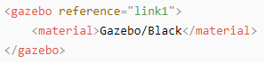
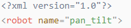
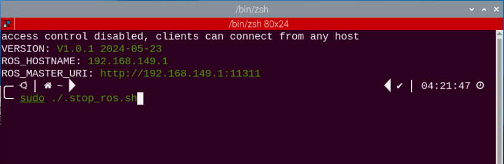
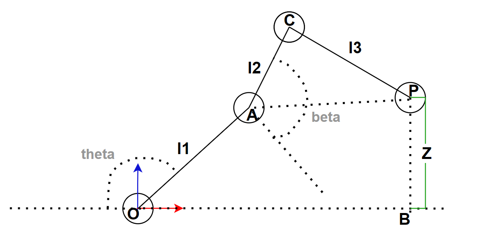

# ROS机器狗结合机械臂课程

## 1.机械臂的安装与开机检验

### 1.1 机械臂的安装

Puppypi机械臂安装的教学视频可以参考同目录下的“**机械臂的安装**”。下文为Puppypi机械臂安装的示意图：

使用**4颗M4\*6圆头机械螺丝**将机械臂固定在Puppypi上（**由于Puppypi钣金件新旧版本更替的现象，部分钣金件只能安装两颗M4\*6圆头机械螺丝，具体以实际Puppypi钣金件为主**）。


M4\*6圆头机械螺丝

将机械臂上的ID9、10、11号舵机接到树莓派扩展板上的9、10、11号PWM舵机接口，如下图所示。


### 1.2 开机检验

:::{Note}

1.  请勿在粗糙崎岖的地面上启动PuppyPi。

2.  开机后不要强行掰动舵机，避免舵机产生损伤。

:::

1)  开机前，为避免舵机突然发力而造成受损，请将PuppyPi呈卧姿放置在平面上，机械臂需要朝前摆放，如下图所示：


:::{Note}

开机前机械臂需要朝正前方摆放，禁止下垂摆放，防止舵机上电后发力对机械臂造成损坏。

:::





2)  然后将扩展板的开关由“**OFF**”推到“**ON**”，开机以后，机器狗尾部的数码管会显示电池当前电量（下图所示点亮为8V，当电池电量低于6.8V时需尽快给电池充电），且LED1和LED2会亮起微弱蓝灯，稍等片刻后，LED1将常亮，LED2将每隔两秒闪烁，代表网络配置已经准备完毕。然后等待蜂鸣器发出“嘀”的一声，说明ROS配置完成，设备启动完毕。


3)  设备出厂默认为AP直连模式，开机成功后，将产生一个以“**HW**”开头的热点。


## 2. 上位机的使用

### 2.1 启动上位机

- #### 2.1.1 采用桌面图标启动（初学者推荐）

1)  双击桌面图标。

2)  在弹出的提示窗口处单击“**Execute**”选项，即可打开上位机。


- #### 2.1.2 采用命令行形式启动

1)  点击系统桌面左上角的图标，打开Terminator终端。

2)  输入指令，并按下回车，打开上位机。

```commandline
python3 /home/ubuntu/software/puppypi_control/PuppyPi.py
```


### 2.2 上位机使用介绍

上位机启动成功后，我们在普通模式下方“**机械臂**”的选项勾选上，界面上就会出现对应机械臂舵机的控制区域。


舵机ID9、10、11分别对应了机械臂的三个舵机。


普通模式的界面可分为舵机操控区域、动作详情列表、动作组设置区域和偏差设置区域。


1.  **舵机操控区域**

:::{Note}
可通过调整对应舵机的数值，对PuppyPi机器狗的姿态进行调整。
:::

| **图标** | **功能说明** |
|:--:|:--:|
|  | 舵机ID编号。 |
|  | 用于调整舵机的角度位置，取值范围是500至2500。 |
|  | 用于调整舵机偏差，取值范围是-100至100。 |

2.  **动作详情列表**

:::{Note}
可在动作详情列表内查看动作的执行时间及舵机参数。
:::


| **图标** | **功能说明** |
|:--:|:--:|
|  | 动作编号。 |
|  | 动作运行时间，即执行该动作所用时间。 |
|  | 对应ID舵机的角度数值，可双击数值进行修改。 |
|  | 运行当前选择动作。 |

3.  **动作组设置区域**

| **图标** | **功能说明** |
|:--:|:--:|
|  | 运行单个动作所需的时间，可直接在方框内修改数值。 |
|  | 运行完整动作组所需的时间。 |
|  | 将当前舵机操控区域的舵机数值作为一个动作，添加至动作详情列表的最后一行。 |
|  | 将动作详情列表内选择动作的舵机参数替换为当前舵机操控区域的数值，动作运行时间替换为“**动作时间**”的设定值。 |
|  | 在动作详情列表内选择动作的上方插入一个动作，舵机参数取舵机操控区域的数值，动作时间取“**动作时间**”的设定值。 |
|  | 将动作详情列表内的选择动作与其上一个动作进行位置交换。 |
|  | 删除动作详情列表内的选择动作。 |
|  | 删除动作详情列表内的所有动作。 |
|  | 将动作详情列表内的选择动作与其下一个动作进行位置交换。 |
|  | 运行一次动作详情列表内的动作，勾选“**循环**”代表循环运行动作。 |
|  | 打开所需的动作组文件。 |
|  | 将动作详情列表内的动作保存至指定位置。 |
|  | 通过按键“**打开动作文件**”打开一个动作组后，点击此按键打开另一个动作组，可将两者串联。 |
|  | 可在上位机中显示已保存的动作组。 |
|  | 刷新选择的动作组。 |
|  | 删除当前选择的动作组文件。 |
|  | （**慎点**）删除所有动作组文件。 |
|  | 执行一次选择的动作组。 |
|  | 停止正在运行的动作组。 |
|  | 退出上位机操作界面。 |

:::{Note}
动作组文件统一保存至Docker容器中的“/home/ubuntu/software/puppypi_control/ActionGroups”。
:::

4.  **偏差设置区域（PuppyPi机器狗出厂前已调好偏差，此区域功能按键仅做了解）**

| **图标** | **功能说明** |
|:--:|:--:|
|  | 将调整后的偏差保存至PuppyPi机器狗。 |
|  | 将舵机操控区域内所有舵机的数值恢复至1500。 |
|  | 点击后，可手动调整舵机转动角度。 |

### 2.3 机械臂偏差调节

:::{Note}
PuppyPi 在出厂时就已经调节好了偏差，用户无需再调节，如因更换舵机或者其** **他操作导致发生变化，则需要重新调试偏差。
:::

如果 PuppyPi 机械臂与身体部分互相垂直，机械臂两连杆呈直角姿态，机械爪正常闭合，则无需调整偏差。如下图所示：


而例如出现下图这类情况，则需要调节偏差。


- #### 2.3.1 偏差产生的原因

偏差通常在以下情况下产生：

1)  舵机在中位的情况下，安装舵盘时转动了舵机主轴的角度，导致初始位置发生了角度偏差（出厂默认的舵机角度为中位位置）。

2)  舵机安装舵盘时未转动主轴角度，但固定到支撑架方向或角度存在小的偏移，导致细微偏差。另外，偏差值在 100 以内（角度 30°内），属于正常可调范围。如果产生的偏差较大，超出 100，将无法通过软件进行调整，需要将偏差较大的舵机主轴螺丝拆下，调整至正确方向的姿态再安装一次。

- #### 2.3.2 调节方法

本节课以调节 10号舵机为例进行调节。（已进行“**复位舵机**”操作）


1)  在“**普通模式**”中，勾选“**机械臂**”观察机械臂各个位置舵机的姿态。可以看到需要调节10号舵机的偏差值。


2)  上位机会自动读取偏差，再根据实际的舵机情况，点击 ID10 舵机图标下方的小滑杆，使机械臂两连杆互相垂直。可多次点击鼠标左键或者滑动鼠标滚轮来微调滑杆数值。

3)  调节完毕后点击“**保存偏差**”，再点击“**OK**”，将偏差保存到控制板中。


## 3. 颜色识别夹取

:::{Note}
可在本节文件夹下观看演示效果。
:::

### 3.1 实现流程

首先，需要订阅摄像头节点发布的话题消息，获取实时图像数据，将RGB颜色空间转换为灰度图，再读取相机内置参数。

接着对图像进行二值化、腐蚀、膨胀处理，以获取图像内目标颜色的最大轮廓，并将识别到的颜色框出；

最后，控制PuppyPi机器狗执行反馈动作。当检测到红色，控制机器狗执行“**夹取**”的动作。

<p id="anchor_3_2"></p>

### 3.2 玩法开启及关闭步骤

:::{Note}
指令输入需严格区分大小写及空格。
:::

1)  启动PuppyPi机器狗，通过VNC远程连接树莓派桌面。 

2)  点击系统桌面左上角的图标，打开Terminator终端。


3)  输入关闭自启玩法的指令，并按下回车。

```commandline
sudo ./.stop_ros.sh
```


4)  输入开启机械臂玩法的指令，按下回车。

```commandline
roslaunch puppy_bringup start_node_with_arm.launch
```


6)  打开新的终端，输入开启颜色识别抓取的指令，按下回车，启动玩法。

```commandline
roslaunch puppy_with_arm color_detect_with_arm.launch
```


7)  如需关闭此玩法，可在Terminator终端界面按下“**Ctrl+C**”。如果关闭失败，可多次按下。

8)  玩法关闭后，按下“Ctrl+Alt+T”打开LX终端，输入指令并按下回车，开启APP自启服务。

```commandline
sudo systemctl restart start_node.service
```


在启动完成后，蜂鸣器会短鸣“**滴**”一声。

:::{Note}
如未启动 APP 自启服务，则会影响 APP 对应玩法的正常实现。如未输入命令进行自启，将机器人重启也会重新启动 APP 自启服务。
:::

### 3.3 实现效果

:::{Note}
启动玩法后，请确保摄像头的视野范围内不存在其他包含识别颜色的物体，以免影响玩法的实现效果。
:::

玩法开启后，将色块放置在PuppyPi前面。当识别到色块后，会用对用颜色的圆圈标识出目标色块，并把颜色名称打印在窗口中间。程序能识别“**红色**”、“**蓝色**”和“**绿色**”的色块,但只对红色色块进行“**夹取**”操作。

:::{Note}
若颜色识别不准，可参照“**[ROS+OpenCV视觉识别与追踪项目\1. 颜色阈值调节]()**”对其进行调节。
:::


### 3.4 功能延伸

**玩法默认识别红色后，机器狗执行“夹取”和“放置”色块动作，如需更改识别的颜色，比如“绿色”色块，可参照以下步骤：**

1)  输入指令，用来编辑颜色识别夹取玩法程序，按下回车。

```commandline
rosed puppy_with_arm** **color_detect_with_arm.py
```


2)  找到下图所示代码：


:::{Note}
在键盘输入代码位置序号后，按下“Shift+G”键，可直接跳转到对应位置。（图示代码位置序号仅供参考，请以实际为准。）
:::

3)  按下“**i**”键进入编辑模式，将“**red**”改为“**green**”。


4)  修改完成后，按下“**Esc**”键，输入指令并按下回车，进行保存与退出。

```commandline
:wq
```


5)  参照“[3.2 玩法开启及关闭步骤](#anchor_3_2)”，重新启动玩法，即可查看修改后的玩法效果。

### 3.5 程序分析

:::{Note}
在程序修改前务必将原有出厂程序进行备份，再进行修改，禁止直接在源代码
:::

**文件中进行修改，避免以错误的方式修改参数之后导致机器人异常且无法修复！！！**

根据玩法的效果，梳理的本次玩法的过程逻辑，如下图所示：


- **launch文件分析**

在功能执行的过程当中，会启动当前功能包的launch文件（**color_detect_with_arm.launch**），内容如下图所示：


从上图可以看出，该功能玩法的节点名称（**color_detect_with_arm**）和该节点是位于哪个功能包（**puppy_with_arm**），节点通过终端显示处理后的信息。

最后通过调用**color_detect_with_arm.py**的源码文件去执行颜色识别夹取的功能。

- **源码程序分析**

该程序的源代码位于Docker容器中的：**/home/ubuntu/puppypi/src/puppy_with_arm/scripts/color_detect_with_arm.py**。


1.  **sys** 用于处理命令行参数和退出程序；

2.  **cv2** 用于 Opencv 图像处理；

3.  **math** 用于数学计算；

4.  **rospy** 用于 ROS 通信；

5.  **time** 用于计时和延时；

6.  **threading** 用于实现并行处理；

7.  **Rlock、Timer** 用于线程同步；

8.  从 **std_srvs.srv** 导入服务类型；

9.  从 **sensor_msgs.msg** 导入消息类型；

10. 从 **hiwonder_interfaces** 导入相应的消息类型和服务类型；

11. 从**sensor_msgs.msg**导入ROS图像消息模块，用于处理图像消息；

12. 从 **puppy_control.srv** 导入动作组；

- **主程序**

通过订阅'**/usb_cam/image_raw**'主题接收图像消息，并调用**image_callback**函数进行处理。同时，它还从参数服务器获取颜色范围列表，并创建了运动控制服务代理和蜂鸣器发布者。程序执行时会先进行初始化移动操作，然后进入循环等待图像消息的到来。如果发生异常，程序会打印日志信息"**Shutting down**"。整体逻辑是在ROS环境中实现图像处理和控制机器人运动的功能。


1.  使用“**rospy.Subscriber**”创建了一个信息订阅器，来处理相机信息。


第一个参数“**/usb_cam/image_raw**”表示接受图像数据的话题名称；

第二个参数“**Image**”消息类型；

第三个参数表示调用“**image_callback**”函数，处理回传画面；

2.  创建buzzer_pub蜂鸣器发布者，使用“**rospy.Publisher**”创建了一个信息发布器。


第一个参数“**/sensor/buzzer**”表示蜂鸣器控制的话题名称；

第二个参数“**Float32**”消息类型；

第三个参数“**queue_size=1**”指定了消息队列的大小。

- **image_callback回调函数**

下图是image_callback回调函数里面的代码截图：


首先，将ROS的图像消息转换为numpy数组形式的图像数据，并将其从RGB格式转换为BGR格式。然后，对图像进行水平翻转，并复制一份图像数据用于后续处理。接下来，调用名为"**run**"的函数对图像进行处理，获取处理结果。最后，使用cv2模块展示处理后的图像，并等待按键输入。整体逻辑是，在接收到图像消息时对其进行处理，并实时显示处理结果，以便进行图像处理算法的监测和调试。

- **run图形处理函数**

  下图是run函数的部分代码截图：


首先对图像进行预处理，包括调整大小和高斯模糊。然后，根据预设的颜色范围，找到图像中的色块，并通过最小外接圆进行标记。接着，根据检测到的色块颜色和目标颜色的匹配情况，在图像中显示相应的文字。整体逻辑是通过图像处理和颜色匹配来检测目标色块并进行标记和显示。

1.  对图像进行预处理，包括调整大小、高斯模糊和将RGB颜色转换成LAB空间。

    

2.  遍历颜色范围列表（color_range_list）中的每个元素（红、绿、蓝三种颜色），并根据指定的颜色范围对图像进行掩膜操作。

    

3.  掩膜操作后对图像进行腐蚀和膨胀操作，以及对图像进行裁剪，并调用getAreaMaxContour()函数进行轮廓检测，最后找到最大面积的轮廓及其对应的颜色。

    

4.  计算出轮廓的像素值，将小于8500的过滤掉，保证识别到的颜色是目标色块。使用cv2.minEnclosingCircle()函数获取最大面积轮廓的最小外接圆的中心点(centerX,centerY)和半径(radius)，并使用cv2.circle()函数在图像上绘制最小外接圆，颜色为对应色块的颜色。

    

5.  根据颜色区分最大的色块，将颜色标记为1（红色）、2（绿色）或3（蓝色），并将其添加到color_list列表中。通过判断多次判断color_list的长度，将对应的颜色值赋给detect_color和draw_color。

6.  根据检测到的颜色（detect_color）与目标颜色（target_color）的匹配情况，使用cv2.putText()函数在图像上"Color: " + detect_color文字，位置为(225, 210)，字体为cv2.FONT_HERSHEY_SIMPLEX，大小为1，颜色为draw_color，线宽为2，并返回处理后的图像。


- **move执行动作函数**

下图是move函数的代码截图：


根据检测到的颜色与目标颜色的匹配情况，控制机器人执行相应的动作。如果颜色匹配（红色）,通过buzzer_pub.publish(0.1)发送一个0.1秒的蜂鸣器信号，执行一系列动作（抓取和放置动作），然后将检测到的颜色重置为“None”；如果颜色不匹配，则不执行动作组。

- **执行子线程**

创建一个名为th的子线程，并将move函数作为目标函数传递给子线程。设置daemon参数为True，表示将子线程设置为守护线程。使用th.start()启动子线程，使其开始执行move函数。


通过创建子线程并将move函数作为目标函数传递给子线程，可以实现在主线程中同时执行其他任务，而不会阻塞move函数的执行。子线程中的move函数可以在后台执行，并且可以与主线程同时运行。

- **getAreaMaxContour函数**

下图是getAreaMaxContour函数的代码截图：


从一组轮廓中找到面积最大的轮廓。函数通过迭代所有轮廓，计算其面积，并保留面积最大的轮廓。在计算面积时，还添加了一个条件，仅考虑面积大于等于50的轮廓，以过滤掉较小的干扰。最终，函数返回找到的最大轮廓以及其对应的面积。

## 4. 自主识别夹取

:::{Note}
可在本节文件夹下观看演示效果。
:::

### 4.1 实验原理

首先，需要订阅摄像头节点发布的话题消息，获取实时图像数据，将RGB颜色空间转换为灰度图，再读取相机内置参数；

接着对图像进行二值化、腐蚀、膨胀处理，以获取图像内目标颜色的最大轮廓，并将识别到的颜色框出；

然后，控制PuppyPi机器狗执行反馈动作。当检测到红色，控制机器狗执行“**夹取**”的动作，将色块夹取起来；

最后，PuppyPi机器狗往前走再向左转寻找红色放置点。当检测到红色，控制机器狗执行“放置”的动作，将色块放置在红色放置点中。

<p id="anchor_4_2"></p>

### 4.2 玩法开启及关闭步骤

:::{Note}
指令输入需严格区分大小写及空格。
:::

1)  启动PuppyPi机器狗，通过VNC远程连接树莓派桌面。

2)  单击桌面左上角的的图标，或使用快捷键“**Ctrl+Alt+T**”，打开LX终端。

3)  输入关闭按键控制服务的指令，并按下回车。

```commandline
sudo systemctl stop button_scan.service
```


4)  点击系统桌面左上角的图标，打开Terminator终端。


5)  输入关闭自启玩法的指令，并按下回车。

```commandline
sudo ./.stop_ros.sh
```


6)  输入启动玩法的指令，并按下回车。

```commandline
roslaunch puppy_with_arm color_grab.launch
```


7)  按下树莓派扩展板上的KEY1开始启动自主识别夹取，按下KEY2可以暂停玩法。


8)  如需关闭此玩法，可在Terminator终端界面按下“**Ctrl+C**”。如果关闭失败，可多次按下。

9)  玩法关闭后还需在LX终端输入指令并按下回车，开启APP自启服务。

```commandline
sudo systemctl restart start_node.service
```


在启动完成后，蜂鸣器会短鸣“**滴**”一声。

:::{Note}
如未启动 APP 自启服务，则会影响 APP 对应玩法的正常实现。如未输入命令进行自启，将机器狗重启也会重新启动 APP 自启服务。
:::

10) 还需输入指令并按下回车，开启按键检测服务。

```commandline
sudo systemctl restart button_scan.service
```


### 4.3 实现效果

玩法开启后，会在回传画面中将识别到的红色色块框选出来，Puppypi会走向色块，对色块进行夹取，夹取完成之后向前走一小段，再向左转，然后开始进入寻找放置点的行为，这里我们采用红色方框作为放置点（可以根据个人需求进行选择），找到红色方框后将色块放入方框中。


:::{Note}
若颜色识别不准，可参照“**[ROS+OpenCV视觉识别与追踪项目\1. 颜色阈值调节](https://docs.hiwonder.com/projects/PuppyPi/en/latest/docs/13_visual_recognition_and_tracking.html)**”对其进行调节。
:::

若出现夹取位置不准的情况，可修改程序中**block_center_point\[1\]**的参数。数值越大，末端夹持器位置越靠后，反之则越靠前。


### 4.4 功能延伸

**玩法默认识别红色后，机器狗执行“夹取”和“放置”色块动作，如需更改识别的颜色，比如“绿色”色块，可参照以下步骤：**

1)  输入指令并按下回车，打开用来编辑颜色识别夹取玩法程序。

```commandline
rosed puppy_with_arm color_grab.py
```


2)  找到下图所示代码：


:::{Note}
在键盘输入代码位置序号后，按下“Shift+G”键，可直接跳转到对应位置。（图示代码位置序号仅供参考，请以实际为准。）
:::

3)  按下“**i**”键进入编辑模式，将“**red**”改为“**green**”。


4)  修改完成后，按下“**Esc**”键，输入指令并按下回车，进行保存与退出。

```commandline
:wq
```


5)  参照“[4.2 玩法开启及关闭步骤](#anchor_4_2)”，重新启动玩法，即可查看修改后的玩法效果。

### 4.5 程序分析

根据玩法的效果，梳理的本次玩法的过程逻辑，如下图所示：


- **launch文件分析**

该程序的源代码位于Docker容器中的： **/home/ubuntu/puppypi/src/puppy_with_arm/launch/color_grab.launch**


第一个 \<node\> 标签用于启动名为 puppy_control 的节点，用于控制机器狗运动

其定义如下：

name="**puppy_control**"：节点名称为 puppy_control。

pkg="**puppy**\_**control**"：节点所在的软件包为 puppy_control。

type="**puppy**"：节点类型为 puppy，表示将运行名为 puppy.py 的可执行文件。 

required="**flase**"：此节点是否为必需的，设置为 false 表示即使该节点启动失败也不会影响整个 launch 文件的运行。

output="**screen**"：指定节点的输出将显示在屏幕上。

第二个 \<node\> 标签用于启动名为color_grab 的节点，为玩法的主要源文件，其定义如下：

name="**color_grab**"： 节点的名称设置为 "**color_grab**"。

pkg="**puppy_with_arm**"： 指定节点所在的软件包为 "**puppy_with_arm**"。

type="**color_grab.py**"： 表示将启动名为 "**color_grab.py**" 的可执行文件。

required="**false**"： 类似于第一个节点，设置为 false 意味着启动失败不会影响整个启动过程。

output="**screen**"： 节点的输出将显示在屏幕上。

第三个 \<node\> 标签用于启动名为puppy_control_joystick 的节点，用于机械臂的控制，其定义如下：

name="**puppy_control_joystick"： 节点的名称设置为 "puppy_control_joystick"。

pkg="**puppy_control**"： 指定节点所在的软件包为 "**puppy_control**"。

type="**remote_control_joystick.py**"： 表示将启动名为 "**remote_control_joystick**.py" 的可执行文件。

required="**false**"： 与其他节点类似，设置为 false 意味着启动失败不会影响整个启动过程。

output="**screen**"： 节点的输出将显示在屏幕上。

- **源码程序分析**

该程序的源代码位于Docker容器中的： **/home/ubuntu/puppypi/src/puppy_with_arm/scripts/color_grab.py**

- **导入相关应用库**


1.  sys 用于处理命令行参数和退出程序；

2.  cv2 用于 Opencv 图像处理；

3.  math 用于数学计算；

4.  time 用于计时和延时；

5.  threading 用于实现并行处理；

6.  从 arm_kinematics.ArmMoveIK导入ArmIK用于逆运动学控制；

7.  导入树莓派GPIO库。


定义了一个名为 HomePath 的变量，表示主目录路径为 '/home/pi'。然后，通过 sys.path.append 将 '/home/pi/PuppyPi_PC_Software' 添加到 Python 的模块搜索路径中。

从模块 ServoCmd 中导入了 setServoPulse 函数。这表明 ServoCmd 模块中包含了一个名为 setServoPulse 的函数，用于控制伺服舵机的脉冲信号。

从 ActionGroupControl 模块中导入了 runActionGroup 和 stopActionGroup 两个函数。可以在当前代码中直接使用这两个函数，而不需要使用完整的模块名来调用。

从 HiwonderPuppy 模块中导入了 HiwonderPuppy 类和 PWMServoParams 类。

在当前代码中创建 HiwonderPuppy 和 PWMServoParams 的实例，并使用它们提供的方法和属性。

- **主程序**

调用puppy对象的stance_config和gait_config进行姿态和步态的初始化设置，启动小狗puppy.start()，设置Debug模式是否控制机器狗的移动，然后打开相机获取图像，在主循环中获取图像，调用run()函数进行图像处理。整体逻辑是完成程序环境初始化，图像获取显示，状态机控制运行循环。通过判断Debug模式来选择是否控制机器人开启巡线夹取任务。

1.  使用“**puppy.stance_config**”来配置机器狗四脚在静止状态下的姿态。


第一个参数“**PuppyPose\['stance_x'\]**”表示四条腿在X轴上的额外分开距离，单位cm；

第二个参数“**PuppyPose\['stance_y'\]**”表示四条腿在Y轴上的额外分开距离，单位cm；

第三个参数“**PuppyPose\['height'\]**”表示狗的高度，脚尖到腿转轴的垂直距离，单位cm；

第四个参数“**PuppyPose\['x_shift'\]**”表示四条腿在X轴上同向移动的距离，值越小走路越前倾，值越大越后仰；

第五个参数“**PuppyPose\['pitch'\]**”表示机器狗身体的俯仰角度，单位弧度；

第六个参数“**PuppyPose\['roll'\]**”表示机器狗身体的滚动角度，单位弧度；

2.  使用“**puppy.gait_config**”来配置机器狗步态动作参数。


第一个参数“**overlap_time**”表示四条腿同时着地时间；

第二个参数“**swing_time**”表示单脚离地摆动时间；

第三个参数“**clearace_time**”表示前后脚间隔时间；

第四个参数“**z_clearance**”表示步态过程中脚离地高度；

3.  启动机器狗，设置机器狗的初始姿态，触发蜂鸣器响声。


4.  设置Debug变量来进行Running模式的切换，如果Debug为True是非实时模式，只处理图像机器狗不动，如果Debug为Falses是实时运行模式，同时处理图像和机器狗巡线夹取。


5.  进行实时图像处理的循环。从摄像头获取图像，在图像上运行处理函数，然后显示处理后的图像。同时，通过检测两个按键的状态，可以设置机器狗的状态为启动或停止。循环持续执行，直到用户按下 '**Crtl+C**' 键退出。最后，关闭摄像头并释放资源。


- **stance函数**


通过改变函数内的参数，描述出机器狗各种姿态下的四肢的空间关系，返回的坐标数组为后续姿态控制和运动计算模块提供参考。

- **getAreaMaxContour轮廓处理函数**

  通过比较轮廓的面积大小，并过滤掉面积小于50的轮廓，并返回该轮廓对象和对应的面积值。

  

- **run图形处理函数**


首先对图像进行预处理，包括调整大小和高斯模糊。然后，根据预设的颜色范围在不同ROI区域识别线条，并计算线条轮廓中心点位置，对画面识别最大面积的色块计算其轮廓外接圆的参数，根据判断识别状态输出不同的识别结果，并在图像中显示识别结果。整体逻辑是通过对图像画面进行颜色识别、轮廓提取，计算出线条关键点位置，输出识别结果控制机器狗运动。

1.  对图像进行预处理，包括调整大小、高斯模糊。


2.  将预处理后的图像ROI分割成上中下三个区域，对三个区域的图像块RGB颜色转换成LAB颜色空间，然后进行和掩膜进行位运算。


3.  掩膜操作后对图像进行腐蚀和膨胀运算操作，通过cv2.findContours()函数提取出目标的外层轮廓，并调用getAreaMaxContour()函数进行轮廓检测，过滤掉较小面积的轮廓。


4.  找到图像中的色块轮廓，将最大轮廓的面积小于200的过滤掉，提高识别精度，最后使用cv2.circle()函数在图像上绘制最小外接圆，颜色为黄色。


5.  根据颜色区分最大的色块，将颜色标记为1（红色）、2（绿色）或3（蓝色），并将其赋值给block_color。接着，判断weight_sum是否不为0。如果是，则根据计算得到的中心点坐标绘制图像中心点。最后，根据block_center_point和line_centerx的值，返回处理后的图像。


- **move执行动作函数**

在启动阶段（PuppyStatus.START），机器狗停止运动并初始化姿态。在正常前进（PuppyStatus.NORMAL），根据图像中心点和色块中心点的位置关系，控制机器狗的运动方向和速度。如果发现红色色块（PuppyStatus.FOUND_TARGET），执行抓取动作，然后机器狗向左转一段距离。在放置物块（PuppyStatus.PLACE），开始寻找红色放置点，如果发现红色放置点，执行放置动作。


- **getAreaMaxContour函数**

下图是getAreaMaxContour函数的代码截图：


从一组轮廓中找到面积最大的轮廓。函数通过迭代所有轮廓，计算其面积，并保留面积最大的轮廓。在计算面积时，还添加了一个条件，仅考虑面积大于等于5的轮廓，以过滤掉较小的干扰。最终，函数返回找到的最大轮廓以及其对应的面积。

## 5. 巡线夹取

:::{Note}
可在本节文件夹下观看演示效果。
:::

### 5.1 实现流程

首先，需要对线条颜色进行识别，此处使用 Lab 颜色空间进行处理，将图像颜色空间由RGB 转换为 Lab，随后对图像进行二值化、腐蚀、膨胀等操作，获得只包含目标颜色的轮廓，并用矩形将其标识出来。完成颜色识别后，根据图像中线条位置的反馈进行计算，控制 PuppyPi 机器狗沿着线条移动，从而达到自主巡线行走的效果。

在巡线途中，发现目标颜色的色块，会通过调用动作组来抓取和搬运色块，搬运结束后，重新回到自主巡线的任务中。

<p id="anchor_5_2"></p>

### 5.2 玩法开启及关闭步骤

:::{Note}
指令输入需严格区分大小写及空格。
:::

1)  启动PuppyPi机器狗，通过VNC远程连接树莓派桌面。

2)  单击桌面左上角的的图标，或使用快捷键“**Ctrl+Alt+T**”，打开LX终端。

3)  输入关闭按键控制服务的指令，并按下回车。

```commandline
sudo systemctl stop button_scan.service
```


4)  点击系统桌面左上角的图标，打开Terminator终端。


5)  输入关闭自启玩法的指令，并按下回车。

```commandline
sudo ./.stop_ros.sh
```


6)  输入开启巡线夹取玩法的指令，按下回车，启动玩法程序。

```commandline
roslaunch puppy_with_arm visual_patrol_with_arm.launch
```


7)  按下扩展板上的Key1按键，启动玩法

8) 如需关闭此玩法，可在Terminator终端界面按下“**Ctrl+C**”。如果关闭失败，可多次按下。

9) 玩法关闭后还需在LX终端输入指令并按下回车，开启APP自启服务。

```commandline
sudo systemctl restart start_node.service
```


在启动完成后，蜂鸣器会短鸣“**滴**”一声。

:::{Note}
如未启动 APP 自启服务，则会影响 APP 对应玩法的正常实现。如未输入命令进行自启，将机器狗重启也会重新启动 APP 自启服务。
:::

10) 还需输入指令并按下回车，开启按键检测服务。

```commandline
sudo systemctl restart button_scan.service
```


### 5.3 实现效果

:::{Note}
启动玩法后，请确保摄像头的视野范围内不存在其他包含识别颜色的物体，以免影响玩法的实现效果。
:::

将PuppyPi机器狗放置黑色线条上，启动玩法后，机器狗将巡黑色线条进行移动，如果识别到前面线条上有色块阻挡，则会执行“搬运”动作。夹取红色色块放置于线条左边，夹取绿色或蓝色色块放置于线条右边，执行完夹取动作后继续进行巡线任务。


:::{Note}
若颜色识别不准，可参照“**[ROS+OpenCV视觉识别与追踪项目\1.  颜色阈值调节]()**”对其进行调节。
:::

若出现夹取位置不准的情况，可修改程序中**block_center_point\[1\]**的参数。数值越大，末端夹持器位置越靠后，反之则越靠前。


### 5.4 功能延伸

**玩法默认识别红色后，机器狗执行“夹取”动作组，将红色色块放置于线条左边；玩法默认识别绿色后，机器狗执行“夹取”动作组，将绿色色块放置于线条右边。如需更改放置的位置，比如“红色”和“绿色”色块互换位置，可参照以下步骤：**

1)  输入指令并按下回车，用来编辑巡线夹取玩法程序，按下回车。

```commandline
rosed puppy_with_arm** **visual_patrol_with_arm.py
```


2)  找到下图所示代码：


:::{Note}
在键盘输入代码位置序号后，按下“Shift+G”键，可直接跳转到对应位置。（图示代码位置序号仅供参考，请以实际为准。）
:::

3)  按下“**i**”键进入编辑模式，将“**red**”和“**green**”两个颜色的位置互换一下。


4)  修改完成后，按下“**Esc**”键，输入指令并回车，进行保存与退出。

```commandline
:wq
```


5)  参照“[5.2 玩法开启及关闭步骤](#anchor_5_2)”，重新启动玩法，即可查看修改后的玩法效果。

### 5.5 程序分析

:::{Note}
在程序修改前务必将原有出厂程序进行备份，再进行修改，禁止直接在源代码
:::

**文件中进行修改，避免以错误的方式修改参数之后导致机器人异常且无法修复！！！**

根据玩法的效果，梳理的本次玩法的过程逻辑，如下图所示：


根据摄像头的消息，获取实时视觉信息，利用颜色阈值算法从中提取需要巡线的颜色线条。根据线条在图像中的位置偏移情况，计算出机器狗应有的移动速度和航向角来矫正位置，使线条实时保持在画面中心。如果识别到目标色块在前方巡线位置上，执行夹取动作，将色块放置线条一旁，继续进行巡线任务。

- **launch文件分析**

在功能执行的过程当中，会启动当前功能包的launch文件（**visual_patrol_with_arm.launch**），内容如下图所示：


从上图可以看出，该功能玩法的名称（**visual_patrol_with_arm**）和该节点是位于哪个功能包（**puppy_with_arm**），节点通过终端显示处理后的信息。

最后通过调用**visual_patrol_with_arm.py**的源码文件去执行巡线夹取的功能。

- **源码程序分析**

该程序的源代码位于Docker容器中的：**/home/ubuntu/puppypi/src/puppy_with_arm/scripts/visual_patrol_with_arm.py**


1.  **sys** 用于处理命令行参数和退出程序；

2.  **cv2** 用于 Opencv 图像处理；

3.  **math** 用于数学计算；

4.  **time** 用于计时和延时；

5.  **threading** 用于实现并行处理；

6.  **numpy** 用于科学计算；

7.  **enum** 用于定义程序运行状态；

8.  **ArmMoveIK** 用于控制机械臂运动；

9.  **pigpio** 用于GPIO控制，与外设硬件通信；

10. 从**servoCmd**导入设置舵机脉宽的函数；

11. 从 **ActionGroupControl** 导入动作组；

- **主程序**

调用puppy对象的stance_config和gait_config进行姿态和步态的初始化设置，启动小狗puppy.start()，设置Debug模式是否控制机器狗的移动，然后打开相机获取图像，在主循环中获取图像，调用run()函数进行图像处理。整体逻辑是完成程序环境初始化，图像获取显示，状态机控制运行循环。通过判断Debug模式来选择是否控制机器人开启巡线夹取任务。

1.  使用“**puppy.stance_config**”来配置机器狗四脚在静止状态下的姿态。


第一个参数“**PuppyPose\[‘stance_x’\]**”表示四条腿在X轴上的额外分开距离，单位cm；

第二个参数“**PuppyPose\[‘stance_y’\]**”表示四条腿在Y轴上的额外分开距离，单位cm；

第三个参数“**PuppyPose\[‘height’\]**”表示狗的高度，脚尖到腿转轴的垂直距离，单位cm；

第四个参数“**PuppyPose\[‘x_shift’\]**”表示四条腿在X轴上同向移动的距离，值越小走路越前倾，值越大越后仰；

第五个参数“**PuppyPose\[‘pitch’\]**”表示机器狗身体的俯仰角度，单位弧度；

第六个参数“**PuppyPose\[‘roll’\]**”表示机器狗身体的滚动角度，单位弧度；

2.  使用“**puppy.gait_config**”来配置机器狗步态动作参数。


第一个参数“**overlap_time**”表示四条腿同时着地时间；

第二个参数“**swing_time**”表示单脚离地摆动时间；

第三个参数“**clearace_time**”表示前后脚间隔时间；

第四个参数“**z_clearance**”表示步态过程中脚离地高度；

3.  设置Debug变量来进行Running模式的切换，如果Debug为True是非实时模式，只处理图像机器狗不动，如果Debug为Falses是实时运行模式，同时处理图像和机器狗巡线夹取。


- **stance函数**

下图是stance函数里面的代码截图：


通过改变函数内的参数，描述出机器狗各种姿态下的四肢的空间关系，返回的坐标数组为后续姿态控制和运动计算模块提供参考。

- **run图形处理函数**

下图是run函数的部分代码截图：


首先对图像进行预处理，包括调整大小和高斯模糊。然后，根据预设的颜色范围在不同ROI区域识别线条，并计算线条轮廓中心点位置，对画面识别最大面积的色块计算其轮廓外接圆的参数，根据判断识别状态输出不同的识别结果，如线条中心点、色块类型等，并在图像中显示识别结果。整体逻辑是通过对图像画面进行颜色识别、轮廓提取，计算出线条关键点位置，输出识别结果供控制运动。

1.  对图像进行预处理，包括调整大小、高斯模糊。


2.  将预处理后的图像ROI分割成上中下三个区域，对三个区域的图像块RGB颜色转换成LAB颜色空间，然后进行和掩膜进行位运算。


3.  掩膜操作后对图像进行开和闭运算操作，通过cv2.findContours()函数提取出目标的外层轮廓，并调用getAreaMaxContour()函数进行轮廓检测，过滤掉较小面积的轮廓。


4.  通过判断cnt_large不为空来说明识别到目标颜色，使用cv2.minAreaRect()函数计算cnt_large的最小外接矩形，并将处理后的结果赋值给rect，然后使用cv2.boxPoints()函数获取最小外接矩形的四个顶点，并在图像上绘制该矩形和中心点，同时根据权重值将矩形中心点的X坐标添加到centroid_x_sum中，以便后续计算使用。


5.  通过判断puppyStatus的值来说明正进行巡线夹取任务，将图像转换到LAB空间，然后根据lab_data中定义的颜色阈值范围，对图像进行位运算、腐蚀和膨胀操作，找到图像中的色块轮廓，将最大轮廓的面积小于200的过滤掉，提高识别精度，最后使用cv2.circle()函数在图像上绘制最小外接圆，颜色为对应色块的颜色。


6.  根据颜色区分最大的色块，将颜色标记为1（红色）、2（绿色）或3（蓝色），并将其赋值给block_color。接着，判断weight_sum是否不为0。如果是，则根据计算得到的中心点坐标绘制图像中心点。最后，根据block_center_point和line_centerx的值，返回处理后的图像。


- **move执行动作函数**

下图是move函数的代码部分截图：


在启动阶段（PuppyStatus.START），机器狗停止运动并初始化姿态。在正常巡线阶段（PuppyStatus.NORMAL），根据图像中心点和区块中心点的位置关系，控制机器狗的运动方向和速度。如果发现色块（PuppyStatus.FOUND_TARGET），根据色块的颜色执行相应的动作组。如果色块是红色，先执行抓取动作，然后将机器狗移动到线条的左侧，再执行放置动作。如果色块是绿色或蓝色，先执行抓取动作，然后将机器狗移动到线条的右侧，再执行放置动作。

- **getAreaMaxContour函数**

下图是getAreaMaxContour函数的代码截图：


从一组轮廓中找到面积最大的轮廓。函数通过迭代所有轮廓，计算其面积，并保留面积最大的轮廓。在计算面积时，还添加了一个条件，仅考虑面积大于等于5的轮廓，以过滤掉较小的干扰。最终，函数返回找到的最大轮廓以及其对应的面积。

## 6. 手势控制机械臂

:::{Note}
可在本节文件夹下观看演示效果。
:::

### 6.1 实验原理

首先，需要订阅摄像头节点发布的话题消息，获取实时图像数据；

接着，再调用mediapipe库将识别到的手部关键点连接起来，将大拇指和食指的手部关键点的归一化坐标转换为图像的像素坐标，计算出两点距离；

最后，机械爪根据计算出来的距离进行张合运动。

### 6.2 玩法开启及关闭步骤

:::{Note}
指令输入需严格区分大小写及空格。
:::

1)  启动PuppyPi机器狗，通过VNC远程连接树莓派桌面。

2)  点击系统桌面左上角的图标，打开Terminator终端。


3)  输入关闭自启玩法的指令，并按下回车。

```commandline
sudo ./.stop_ros.sh
```



4)   输入启动玩法的指令，按下回车。

```commandline
roslaunch puppy_with_arm hand_control_with_arm.launch
```


这里为了减少内存占用，保证玩法的正常使用，没有显示回传画面，如果想要开启相机回传画面可以按照下面的步骤进行。

:::{Note}
启动相机回传前需要保证手势控制玩法正常运行，否则可能无法启动相机回传。
:::

玩法启动后，由于VNC没有显示摄像头画面，对此可以通过打开**“web_video_server”**服务在浏览器中查看摄像头画面。

5)  使用任意浏览器，输入地址“**192.168.149.1:8080**”。


6)  选择对应节点的图像进行查看。


7)  进入手势控制机械臂玩法的相机回传界面，如下图所示：


8)  如需关闭此玩法，可在Terminator终端界面按下“**Ctrl+C**”。如果关闭失败，可多次按下。

9) 玩法关闭后，按下“Ctrl+Alt+T”打开LX终端，输入指令并按下回车，开启APP自启服务。

```commandline
sudo systemctl restart start_node.service
```


在启动完成后，蜂鸣器会短鸣“**滴**”一声。

:::{Note}
如未启动 APP 自启服务，则会影响 APP 对应玩法的正常实现。如未输入命令进行自启，将机器狗重启也会重新启动 APP 自启服务。
:::

### 6.3 实现效果

玩法开启后，当识别到手部特征时，会将手部特征用圆点和线条连接起来，用黄线将大拇指和食指相连，识别出大拇指和食指之间的距离，并在左下角打印出来，Puppypi的机械爪会跟随大拇指和食指的距离变化而变化。


### 6.4 程序分析

根据玩法的效果，梳理的本次玩法的过程逻辑，如下图所示：


- **launch文件分析**

该程序的源代码位于Docker容器中的： **/home/ubuntu/puppypi/src/puppy_with_arm/launch/hand_control_with_arm.launch**


使用 \<include\> 标签引入了名为 config_manager.launch 的 launch 文件，该文件位于 puppy_pi_bringup 软件包中的 launch 文件夹内。里面包含一些标签和颜色的配置参数。

使用\<include\> 标签引入了名为 start_camera.launch 的 launch 文件，该文件位于 puppy_pi_bringup 软件包中的 launch 文件夹内。用于启动摄像头节点。


第一个 \<node\> 标签用于启动名为 web_video_server 的节点，用于摄像头网页传输

其定义如下：

name="**web_video_server**"：节点名称为 web_video_server。

pkg="**web_video_server**"：节点所在的软件包为 web_video_server。

type="**web_video_server**"：节点类型为 web_video_server，表示将运行名为 web_video_server 的可执行文件。

required="**true**"：此节点是否为必需的，设置为 true 表示如果该节点启动失败会 导致整个 launch 文件停止。

output="**screen**"：指定节点的输出将显示在屏幕上。

第二个 \<node\> 标签用于启动名为 hand_control 的节点，用于机械臂的控制，其定义如下：

name="**hand_control**"：节点名称为 hand_control。

pkg="**puppy_with_arm**"：节点所在的软件包为 puppy_with_arm。

type="**hand_control_with_arm.py**"：节点类型为 hand_control_with_arm.py，表示将运行名为 hand_control_with_arm.py 的 Python 可执行文件。

required="**false**"：此节点是否为必需的，设置为 false 表示即使该节点启动失败也不会影响整个 launch 文件的运行。

output="**screen**"：指定节点的输出将显示在屏幕上。


- **源码程序分析**

该程序的源代码位于Docker容器中的： **/home/ubuntu/puppypi/src/puppy_with_arm/scripts/hand_control_with_arm.py**

- **导入相关应用库**

  

1.  sys 用于处理命令行参数和退出程序；

2.  cv2 用于 Opencv 图像处理；

3.  math 用于数学计算；

4.  rospy 用于 ROS 通信；

5.  time 用于计时和延时；

6.  mediapipe 用于手势识别；

7.  threading 用于实现并行处理；

8.  Misc、PID用于机械臂运动的PID控制；

9.  从 std_srvs.srv 导入服务类型；

10. 从sensor_msgs.msg导入ROS图像消息模块，用于处理图像消息；

11. 从 arm_kinematics.ArmMoveIK导入ArmIK用于逆运动学控制；

12. 从 std_srvs.srv 包中导入所有的服务类型。


定义了一个名为 HomePath 的变量，表示主目录路径为 '/home/pi'。然后，通过 sys.path.append 将 '/home/pi/PuppyPi_PC_Software' 添加到 Python 的模块搜索路径中。

从模块 ServoCmd 中导入了 setServoPulse 函数。这表明 ServoCmd 模块中包含了一个名为 setServoPulse 的函数，用于控制伺服舵机的脉冲信号。

- **两点距离计算**


使用了 Python 中的数学库“**math**”，计算了两点之间的欧氏距离。它计算了二维平面上两个点 (point_1\[0\], point_1\[1\]) 和 (point_2\[0\], point_2\[1\]) 之间的距离。

(point_1\[0\] - point_2\[0\]) \*\* 2 和 (point_1\[1\] - point_2\[1\]) \*\* 2：分别计算 x 方向和 y 方向上的差值的平方，将两个平方相加，得到欧氏距离的平方。

math.sqrt：计算欧氏距离的平方根，得到最终的欧氏距离。

- **坐标转换**


landmarks = \[(lm.x \* w, lm.y \* h) for lm in landmarks\]：通过列表推导式，将每个关键点的 x 和 y 坐标乘以图像的宽度和高度，得到实际的坐标。lm 是表示关键点的对象。

return np.array(landmarks)：将映射后的关键点坐标转换为 NumPy 数组，并将其作为函数的返回值。

- **OpenCV 图像转换为 ROS 中的图像消息**


函数cv2_image2ros将OpenCV格式的图像转换为ROS的图像消息格式。它首先将图像的通道从BGR转换为RGB，然后创建一个ROS图像消息，设置其头部信息、尺寸、编码和数据。最后，它返回转换后的ROS图像消息。

- **HandControlWithArmNode类初始化**


1.  rospy.init_node(name): 初始化一个ROS节点，name是该节点的名称。

2.  self.mpHands = mp.solutions.hands: 导入mp库中的hands模块。

3.  self.hands = self.mpHands.Hands(...): 创建一个手部检测对象，配置了一 些参数，如是否使用静态图像模式、最大手部数量、检测和跟踪的最小置信度等。

4.  self.mpDraw = mp.solutions.drawing_utils: 导入绘图工具模块。

5.  self.ak = ArmIK(): 创建一个ArmIK对象，=用于逆向运动学解算。

6.  self.last_time = time.time(): 记录当前时间。

7.  self.last_out = 0: 初始化一个变量。

8.  self.frames = 0: 初始化一个帧计数器。

9.  self.window_size = 5: 定义滑动窗口的大小为5。

10. self.distance_measurements = deque(maxlen=self.window_size): 创建一个双端队列，用于存储最近的距离测量数据，最多存储5个数据。

11. self.filtered_distance = 0: 初始化一个滤波后的距离变量。

12. self.th = threading.Thread(target=self.move,daemon=True): 创建一个新线程来执行move方法，并设置为守护线程。

13. self.th.start(): 启动新线程。

14. self.name = name: 将传入的name值赋给self.name。

15. self.image = None: 初始化一个图像变量为None。

16. rospy.Subscriber('/usb_cam/image_raw', Image, self.image_callback): 订阅名为/usb_cam/image_raw的ROS话题，消息类型为Image，当收到消息时调用self.image_callback回调函数。

17. self.result_publisher = rospy.Publisher('~image_result', Image, queue_size=1): 创建一个发布者，发布名为~image_result的ROS话题，消息类型为Image，队列大小为1。

- **图像回调函数**


定义了一个名为image_callback的回调函数，用于处理ROS图像消息。它使用NumPy创建一个数组，将ROS图像数据转换为RGB格式，并存储在对象的image属性中。

- **设置机械臂的初始状态**


使用“**setServoPulse**”函数来控制舵机，这里以“**setServoPulse(9,1500,300)**”为例：

第一个参数“9”为舵机ID；第二个参数“1500”为舵机脉冲宽度；第三个参数“300”为舵机运动时间，单位为毫秒。

- **爪子运动函数**


在循环中，代码检查了 self.filtered_distance 的值是否在 0 到 100 之间。如果是，则进行一些操作：

使用 Misc.map 函数将 self.filtered_distance 映射到一个新的范围，具体映射关系为 \[15, 90\] 映射到 \[1500, 900\]。这个映射用于将测量到两指间的值映射到控制信号范围内。

调用 setServoPulse 函数，将映射后的值作为参数传递给伺服舵机（第一个参数是舵机的ID，第二个参数是脉冲宽度，第三个参数是时间，将运行时间设置为 0 表示舵机执行一次移动到目标位置的动作。）。这个函数用于调整爪子舵机的位置。

如果 self.filtered_distance 的值不在 0 到 100 之间，通过 rospy.sleep(0.001) 休眠 0.001 秒。

- **主函数**


self.init()：调用 init 方法进行进行了一些参数设置和 ROS 相关的初始化。

主循环 while not rospy.is_shutdown()：在 ROS 节点没有关闭的情况下执行循环。

if self.image is not None:检查是否有图像数据。如果有，执行以下操作：

1.  图像处理：

先将图像水平翻转，将图像大小调整为 (320, 240)，再清空原始图像，最后将 RGB 格

式的图像转换为 BGR 格式。

2.  手部姿势检测：

使用 MediaPipe 进行手部姿势检测，获取手部关键点的坐标，然后在图像上绘制手部关键点和连接线。

计算手指间的距离，并更新距离测量列表 self.distance_measurements，计算距离的均值，更新 self.filtered_distance，在图像上显示距离信息。

3.  统计帧率信息：

记录帧数和计算帧率，在图像上显示帧率信息。

4.  发布结果图像：

self.result_publisher.publish(cv2_image2ros(cv2.resize(bgr_image, (640, 480)), self.name))：通过 ROS 发布处理后的图像。

## 7. 机械臂逆运动学分析

### 7.1 逆运动学介绍

1. **逆运动学简介**

逆运动学是决定要达成所需要的姿势所要设置的关节可活动对象的参数的过程。

机械臂的逆运动学问题是其轨迹规划与控制的重要基础，逆运动学求解是否快速准确将直接影响到机械臂轨迹规划与控制的精度，因此针对机械臂，设计一种快速准确的逆运动学求解方法是十分重要的。

2. **逆运动学简析**

对于机械臂而言，就是给出夹持器的末端位置和朝向后求出每个关节的旋转角度。机械臂的三维运动是比较复杂的，这里为了简化模型，我们去掉机械臂的末端夹持器，这样就可以进行逆运动学分析了。

进行逆运动学分析一般要进行大量的矩阵运算，过程复杂计算量大所以实现起来较难。为了更好的适应我们的需要，我们使用几何法对机械臂进行分析。



我们将机械臂的模型简化，去掉XOY平面，和末端执行器得到机械臂的主体。从上图看到机械臂的夹持器末端P的坐标为（X,Y,Z），由于机械臂没有旋转量，所以P的坐标可写成（X,Z）。其中上图的theta和beta就是我们要求解机械臂的旋转角度。据此我们可以列出下式：

$$PA = \ \sqrt{{l2}^{2} + {l3}^{2}\ }$$

$$PO = \ \sqrt{X^{2} + Z^{2}\ }$$

$$\cos{OAP}\  = \ \frac{{l1}^{2} + {PA}^{2} - {PO}^{2}}{2\  \ast \ l1\  \ast \ PA}$$

$$\cos{PAC}\  = \ \frac{{l2}^{2} + {PA}^{2} - {l3}^{2}}{2\  \ast \ l2\  \ast \ PA}$$

角$OAC = \ {ar\cos}{{(\cos}{OAP})} + \ {ar\cos}{(\cos{PAC})}$

$$beta = \ 角OAC\  - \ 90$$

$$\cos{AOP}\  = \ \frac{{l1}^{2} + {PO}^{2} - {PA}^{2}}{2\  \ast \ l1\  \ast \ PO}$$

$$\sin{POB}\  = \ \frac{PB}{PO}$$

$$角AOB = \ {ar\cos}{{(\cos}{AOP})} + \ {arsin}{(\sin{POB})}$$

$$theta = \ 180\  - 角\ AOB$$

### 7.2 机械臂逆运动学分析 


根据机器狗的结构设计，我们可以得出l1的长度为4.21厘米，l2的长度为3.3厘米，l3的长度为12.7厘米，则PA的长度为$\sqrt{{l2}^{2} + {l3}^{2}}$。

该程序的源代码位于：**puppy_pi/src/puppy_pi_common/arm_kinematics/InverseKinematics.py**


### 7.3 逆运动学求解及程序实现

:::{Note}
指令输入需严格区分大小写及空格。
:::

1)  启动PuppyPi机器狗，通过VNC远程连接树莓派桌面。

2) 点击系统桌面左上角的图标，打开Terminator终端。


3)  输入指令并按下回车，切换到逆运动学程序文件所在目录。

```commandline
cd puppypi/src/puppy_common/kinematics_sdk/arm_kinematics
```


4)  输入指令并按下回车，打开逆运动学程序文件。

```commandline
vim InverseKinematics.py
```


5)  以下是InverseKinematics.py的部分代码截图：


- #### 7.3.1 俯仰关节beta转动角度的求解


-  根据余弦定理，计算出$\cos{OAP}$的值，然后将值四舍五入保留到小数点后四位。


-  由于余弦值的范围是\[-1,1\]，判断$\cos{OAP}$的绝对值是否大于1，如果大于1说明给定的末端坐标无法构成连杆结构。


-  接着计算出$\cos{PAC}$的值，然后将值四舍五入保留到小数点后四位。


-  再次判断$\cos{PAC}$的绝对值是否大于1。


- 接下来，用反余弦函数求出夹角OAP和PAC的弧度值并相加，得到夹角OAC的值。


-  最后，将夹角OAC的弧度值转换为角度值，并减去90度（机械臂初始俯仰关节），即可得到俯仰关节beta转动角度。


- #### 7.3.2 基座关节theta转动角度的求解


-  根据余弦定理，计算出$\cos{AOP}$的值，然后将值四舍五入保留到小数点后四位。


-  由于余弦值的范围是\[-1,1\]，判断$\cos{AOP}$的绝对值是否大于1，如果大于1说明给定的末端坐标无法构成连杆结构。


-  接着计算出$\sin{POB}$的值，并将值四舍五入保留到小数点后四位，再次判断$\sin{POB}$的绝对值是否大于1。


-  接下来，用反余弦函数和反正弦函数求出夹角AOP和POB的弧度值并相加，得到夹角AOB的值。


-  最后，180度减去转换为角度值的夹角AOB，即可得到基座关节theta转动角度。

