# 20.ROS2-AI Vision and Tracking Course

## 20.1 Color Threshold Adjustment

As we know, different light sources can affect the color of objects, which may lead to variations in color recognition. If these variations impact the functionality, it is necessary to address them.

To solve this issue, this section will guide you through the use of the LAB_Tool in the ROS2 environment.

### **20.1.1** Open LAB_Tool 

(1) Execute the following command to navigate to the file lab_tool.

```PY
cd /home/ubuntu/software/lab_tool
```

(2) Then enter the following command to initiate the PC software.

```PY
python3 main.py
```

(3) The interface of LAB_Tool is as follow.

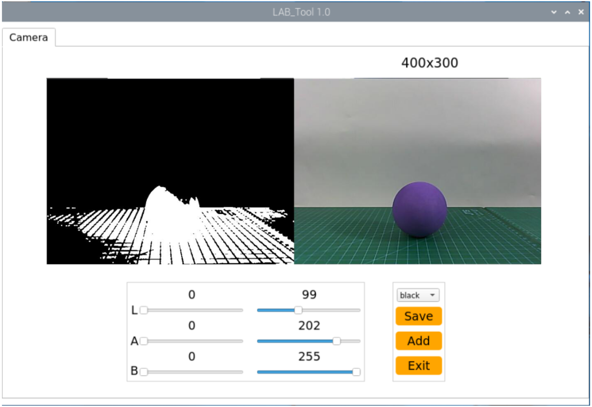

:::{Note}

if there is not camera returned image, it means that the camera is not connected. Please check the camera wiring.

:::

### 20.1.2 Interface Layout

The interface is divided into two parts, including image display zone and recognition adjustment zone.

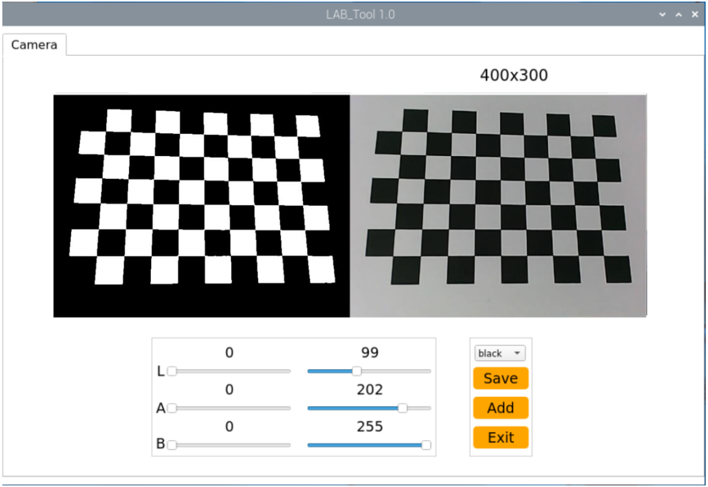

(1) Display Area: The left side shows the processed image from the camera, while the right side displays the original image.

:::{Note}

 If the transmitted image does not display correctly, indicating a camera connection failure, check if the connection cables are properly connected or try reconnecting them.

:::

(2) Color Adjustment Area: This section allows for adjusting the color thresholds. The functions of each button are shown in the table below:

<table>
<colgroup>
<col  />
<col  />
</colgroup>
<tbody>
<tr>
<td ><strong>Icon</strong></td>
<td ><strong>Function Description</strong></td>
</tr>
<tr>
<td ></td>
<td ><p>The sliders L, A, and B are used to adjust the L, A, and B component values of the transmitted image, respectively.</p>
<p>The left slider sets the "min" value for each component, and the right slider sets the "max" value.</p></td>
</tr>
<tr>
<td ></td>
<td >Select the color to adjust the threshold.</td>
</tr>
<tr>
</tr>
<tr>
</tr>
<tr>
<td ></td>
<td >Save the adjusted color threshold settings.</td>
</tr>
</tr>
<tr>
<td ></td>
<td >Close the LAB TOOL</td>
</tr>
</tbody>
</table>


### 20.1.3 Adjust Default Color

(1) Open the LAB TOOL, and select the color whose threshold needs to be adjusted from the color list in the recognition adjustment area. Here, we will use red as an example.

(2) Open the LAB TOOL, and select the color to adjust the threshold in the recognition adjustment area. Again, we will use red as an example.

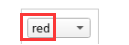

(3) Set the "min" values for the L, A, and B components to "0" and the "max" values to "255".

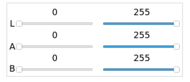

(4) Place the colored object within the camera's field of view. Refer to the LAB color space distribution chart, and adjust the L, A, and B components to match the target recognition color range.

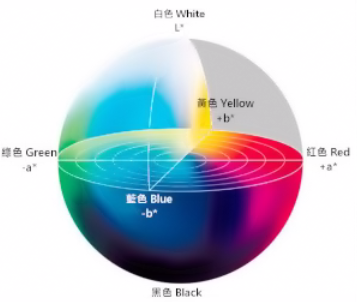

For red, which is closer to "+a," increase the A component. Keep the A component's "max" value unchanged, and increase its "min" value until the color object in the left part of the transmitted image becomes white, and other areas turn black.


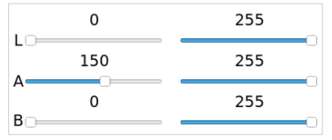

(5) Adjust the L and B components based on the surrounding environment. If the red object appears lighter in color under the current lighting, increase the minimum brightness value (L_min); if it appears darker, reduce the maximum brightness value (L_max). If the red object has a warm tone in the environment, increase the minimum chroma value (b_min); if it has a cool tone, reduce the maximum chroma value (b_max).

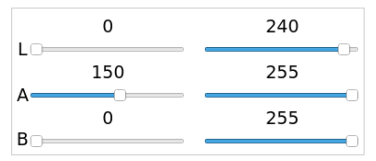

The table below shows the parameter information for adjusting LAB thresholds:

| **Color Component** | **Value Range** | **Corresponding Color Range** |
| :-----------------: | :-------------: | :---------------------------: |
|          L          |      0~255      |    Black–White（-L ~ +L）     |
|          A          |      0~255      |     Green–Red（-a ~ +a）      |
|          B          |      0~255      |    Blue–Yellow（-b ~ +b）     |

(6) Click the "**Save Settings**" button in the recognition adjustment area to save the adjusted color threshold parameters.

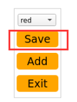


## 20.2 Color Recognition

In this lesson, we will use OpenCV to recognize red, green, and blue objects, with the recognition results displayed in the feedback image.

Before beginning, make sure to prepare one object in each of the red, green, and blue colors.

### 20.2.1 Program Logic

First, capture the RGB image from the camera and apply resizing and Gaussian blur. Then, convert the image color space from RGB to Lab.

Next, use color thresholds to identify the color of the object within the circle. Afterward, apply a mask to the image (masking involves covering the image, shape, or object with a selected region to hide or reveal specific parts of the image).

Then, process the image using morphological operations, such as opening and closing, to refine the image. Finally, highlight the largest object by drawing a circle around it.

Opening operation: This involves erosion followed by dilation. Its purpose is to remove small objects, smooth the shape boundaries, and not alter the area. It can remove small particle noise and separate objects that are connected.

Erosion: Removes boundary points of objects, causing the boundaries to shrink inward. It can eliminate small objects smaller than the structuring element.

Dilation: Expands boundary points, merging all background points touching the object into the object, causing the boundary to expand outward.

Finally, display the recognition results in the feedback image.

### 20.2.2 Operation Steps

:::{Note}

The input command should be case sensitive. And the key words can be complemented by "**Tab**" key.

:::

(1) Turn on PuppyPi, and then connect to Raspberry Pi desktop through VNC.

(2) Click  or press "**Ctrl+Alt+T**" to open command line terminal.

```py
~/.stop_ros.sh
```

(3) Input command and press Enter to enable the camera service.

```py
ros2 launch peripherals usb_cam.launch.py
```

(4) Open a new terminal  and input the following command to start the motion control node.

```py
ros2 launch puppy_control puppy_control.launch.py
```

(5) Open a new command-line terminal  and run the following command to switch to the directory containing the programs.

```py
cd ~/ros2_ws/src/example/example/opencv_course
```

(6) Execute the command below to run the program.

```py
python3 color_detect_demo.py
```

### 20.2.3 Program Outcome

:::{Note}

After starting the task, please ensure that there are no other objects with recognizable colors within the camera's field of view to avoid affecting the outcome of the task.

:::

After starting the task, place the target object within the camera's field of view. Once the target object is recognized, it will be highlighted with a circle of the corresponding color, and the color name will be displayed at the bottom left of the window. The program can recognize objects in "red," "blue," and "green" colors.

### 20.2.4 Program Analysis

The source code of this program is located in: [/home/ubuntu/ros2_ws/src/example/example/opencv_course/color_detect_demo.py]()

* **Basic Configuration**

**(1) Read the color threshold settings file**

Use the get_yaml_data function to obtain the color threshold configuration file.

```py
lab_data = common.get_yaml_data("/home/ubuntu/software/lab_tool/lab_config.yaml")
```

**(2) Get the image feed**

Create a subscription to the camera feed by using the following code: node.create_subscription(Image, 'image_raw', image_callback, 1)This subscribes to the camera feed and retrieves the real-time video stream.

```py
node.create_subscription(Image, 'image_raw', image_callback, 1)
```

* **Image Processing**

The `run()` function is mainly invoked to process the image.


**(1) Gaussian filtering**

Apply Gaussian blur to the image using the GaussianBlur() function from the cv2 library to remove noise from the image.

```py
 frame_gb = cv2.GaussianBlur(frame_resize, (3, 3), 3) 
```

The first parameter `frame_resize` is the input image

The second parameter `(3, 3)` is the size of Gaussian kernel

The third parameter `3` is the allowable variance around the average in Gaussian filtering. The larger the value, the larger the allowable variance

**(2) Color Space Conversion**

Convert the image from the BGR color space to the LAB color space.

```py
frame_lab = cv2.cvtColor(frame_gb, cv2.COLOR_BGR2LAB)
```

**(3) Color Detection and Morphological Operations**

Perform erosion and dilation on the image to smooth the edges of contours, making it easier to identify the target contours in subsequent steps.

```py
eroded = cv2.erode(frame_mask, cv2.getStructuringElement(cv2.MORPH_RECT, (3, 3))) 
dilated = cv2.dilate(eroded, cv2.getStructuringElement(cv2.MORPH_RECT, (3, 3))) 
```

① `frame_mask`: The input binary image mask.

② `cv2.getStructuringElement(cv2.MORPH_RECT, (3, 3))`: Generates a 3x3 rectangular structuring element (kernel). This matrix defines the shape and size 

of the erosion operation. cv2.MORPH_RECT specifies a rectangular shape.

③ `eroded`: The binary image mask after the erosion operation.

④ `cv2.getStructuringElement(cv2.MORPH_RECT, (3, 3))`: Uses the same structuring element as in the erosion step for the dilation operation.

* **Acquire the Maximum Area Contour**

Use the `findContours()` function from the cv2 library to identify the largest contour of the target color in the image.

```py
if areaMaxContour is not None:
    if area_max > max_area:
       max_area = area_max
       color_area_max = i
       areaMaxContour_max = areaMaxContour
```

Initialization: contour_area_temp and contour_area_max are used to store the area of the current contour and the maximum contour, respectively. area_max_contour is used to store the contour with the maximum area.

Iterate through contours: Loop through each contour c in the contours list.

Calculate area: Use `cv2.contourArea(c)` to calculate the area of contour c.

Determine the maximum area: If the area of the current contour is greater than the known maximum area and exceeds the threshold of 50, update the maximum area and the corresponding contour.

Return values: The function returns the contour with the largest area, area_max_contour, and its corresponding maximum area, contour_area_max.

* **Feedback information**

**(1) Highlight the Target Object**

Use the `drawContours` function to outline the target object in the returned image.

```py
cv2.putText(img, "Color: " + detect_color, (10, img.shape[0] - 10), cv2.FONT_HERSHEY_SIMPLEX, 0.65, draw_color, 2)
```

Explanation of the function parameters:

img: The target image where the text will be drawn.

`"Color: " + detect_color`: The text string to be displayed, showing the detected color.

`(10, img.shape[0] - 10)`: The starting position of the text in pixels, representing the bottom-left corner of the text.

`10`: The x-coordinate of the text, starting 10 pixels from the left edge.

`img.shape[0] - 10`: The y-coordinate, positioned 10 pixels above the bottom of the image.

`cv2.FONT_HERSHEY_SIMPLEX`: The font type used for the text.

`0.65`: The font size of the text.

`draw_color`: The color of the text, specified as a BGR tuple. For example, (255, 0, 0) represents blue.

Line thickness: Specifies the thickness of the text outline in pixels.


## 20.3 Tag Recognition

### 20.3.1 Program Logic

Firstly, program to recognize tag, which involves image graying, positioning and other operations.

Lastly, encode and decode the tag, and display the recognition result on the camera returned image and terminal interface.

### 20.3.2 Operation Steps

:::{Note}

The input command should be case sensitive. And the key words can be complemented by "**Tab**" key.

:::

(1) Turn on PuppyPi, and then connect to Raspberry Pi desktop through VNC.

(2) Click-on 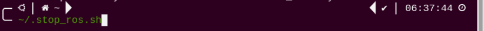 or input the following command to terminate the app auto-start service.

```py
~/.stop_ros.sh
```

(3) Input the following command and press Enter to start the camera service.

```py
ros2 launch peripherals usb_cam.launch.py
```

(4) Open a new terminal  and run the following command to start the motion control node.

```py
ros2 launch puppy_control puppy_control.launch.py
```

(5) Open another terminal and enter the command. Press Enter to switch to the directory where the program is located.

```py
cd ~/ros2_ws/src/example/example/opencv_course
```

(6) Run the following command to execute the program.

```py
python3 apriltag_detect_demo.py
```

(7) If you need to terminate this game, use short-cut '**Ctrl+C**'.


### 20.3.3 Program Outcome

After the game starts, place the tag card within the camera frame. When recognizing the tag, Tag ID will be printed on the camera returned image. And tag ID and coordinate will also be printed on the terminal.


### 20.3.4 Program Analysis Description

The source code of this program is stored in **[/home/ubuntu/ros2_ws/src/example/example/opencv_course/apriltag_detect_demo.py]()**

* **Tag Detection**

**(1) Image Graying**

Call `cvtColor()` function in cv2 library to convert the collected colored image into grayscale image and collect the tag information.

```py
gray = cv2.cvtColor(img, cv2.COLOR_RGB2GRAY)
detections = detector.detect(gray, return_image=False)
```

**(2) Extract Tag Information**

After collecting the tag information, extract the useful information.

```py
if len(detections) != 0:
    for detection in detections:
        M,e0,e1 = detector.detection_pose(detection,[camera_intrinsic.item(0,0), camera_intrinsic.item(1,1),
                                                                camera_intrinsic.item(0,2), camera_intrinsic.item(1,2)],
                                                                0.033)                
        P = M[:3,:4]
        coordinate=np.matmul(P,np.array([[0],[0],[0],[1]])).flatten()
        print('coordinate =',coordinate)    

        corners = np.rint(detection.corners)  # 获取四个角点(get for corners)
        cv2.drawContours(img, [np.array(corners, int)], -1, (0, 255, 255), 5, cv2.LINE_AA)
        tag_family = str(detection.tag_family, encoding='utf-8')  # 获取tag_family(get tag_family)
        times = 0
        if tag_family == 'tag36h11':
           tag_id = str(detection.tag_id)  # 获取tag_id(get tag_id)
           print('tag_id =',tag_id)
           return tag_id
```

`coordinate` represents the tag coordinate, `tag_family` refers to the type of tag, and `tag_id` indicates tag ID.

* **Feedback Information**

(1) After recognition, call print() function to print the tag coordinate and ID on the terminal.

```py
print('coordinate =',coordinate)  
```

```py
print('tag_id =',tag_id)
```

(2) Then, call `putText()` function in cv2 library to print tag ID on the camera returned image.

```py
cv2.putText(img, tag_id, (10, img.shape[0] - 20), cv2.FONT_HERSHEY_SIMPLEX, 2, (0, 255, 255), 1)
```

The meaning of the parameters in bracket is as follow.

The first parameter `img` is the input image.

The second parameter `tag_id` is the added text, referring to tag ID.

The third parameter `(10, img.shape[0] - 20)` is the coordinate of upper left corner of the added text.

The fourth parameter `cv2.FONT_HERSHEY_SIMPLEX` is the font type.

The fifth parameter  `2`  is the font size.

The sixth parameter `(0, 255, 255)` is the color of the font, and the values respectively corresponds to B, G, R. The color here is yellow.

The seventh parameter `3` is the font weight.


## 20.4 AR Vision

### **20.4.1 Program Logic** 

Firstly, program to recognize tag, which involves image graying, positioning and other operations.

Next, encode and decode the tag to acquire information of the tag.

Lastly, through model projection, polygon fill and other operations, draw 3D image on the designated area of camera returned image, and print Tag information on the camera returned image and terminal interface.

### 20.4.2 Operation Steps

:::{Note}

The input command should be case sensitive. And the key words can be complemented by "**Tab**" key.

:::

(1) Turn on PuppyPi, and then connect to Raspberry Pi desktop through VNC.

(2) Click  or enter the command-line terminal to terminate the ros node.

```py
~/.stop_ros.sh
```

(3) Run the following command to enable the camera service.

```py
ros2 launch peripherals usb_cam.launch.py
```

(5) Open a new terminal  and start the motion control node by entering the following command:

```py
ros2 launch puppy_control puppy_control.launch.py
```

(6) Open another terminal , navigate to the program directory by entering the following command and pressing Enter:

```py
cd ~/ros2_ws/src/example/example/opencv_course
```

(7) Execute the program by entering the following command and pressing Enter:

```py
python3 apriltag_ar_demo.py
```

(8) To exit this mode, press **Ctrl+C** in the terminal. If the termination fails, try pressing **Ctrl+C** repeatedly.


### **20.4.3** Program Outcome

After the game starts, place the tag card within the camera frame. When the tag is recognized, four corners of the tag will be marked by blue dots, and the 3D image will be displayed on the tag. Besides, the tag ID and coordinate will be printed on the terminal.


### **20.4.4** Program Analysis

The source code of this program is stored in **[/home/ubuntu/ros2_ws/src/example/example/opencv_course/apriltag_AR_demo.py]()**

* **Tag Detection**

**(1) Image Graying**

Call **cvtColor()** function in cv2 library to convert the collected colored image into grayscale image and collect the tag information.

```py
gray = cv2.cvtColor(rgb_image, cv2.COLOR_RGB2GRAY)
detections = self.tag_detector.detect(gray)
```

**(2) Extract Tag Information**

After collecting the tag information, extract the useful information.

```py
if detections != ():
     for detection in detections:

     M, e0, e1 = self.tag_detector.detection_pose(detection, [self.camera_intrinsic.item(0, 0), self.camera_intrinsic.item(1, 1),
                                                                              self.camera_intrinsic.item(0, 2), self.camera_intrinsic.item(1, 2)],
                                                                 0.033)

      P = M[:3, :4]
      coordinate = np.matmul(P, np.array([[0], [0], [0], [1]]))
      print('coordinate = ', coordinate)
```

```py
tag_id = detection.tag_id
tag_center = detection.center
tag_corners = detection.corners
```

"**coordinate**" represents the tag coordinate, "**tag_family**" refers to the type of tag, and "**tag_id**" indicates tag ID.

* **3D Image Rendering**

**(1) Relative Pose Calculation**

To render a 3D image at a specific position in the returned view, the pose of the camera relative to the world coordinate system must first be calculated. This involves determining the rotation vector and translation vector for transforming from the world coordinate system to the camera coordinate system using the cv2.solvePnP() function.

```py
ret, rvecs, tvecs = cv2.solvePnP(objp, corners, self.camera_intrinsic, self.dist_coeffs)
```

The parameters in parentheses have the following meanings:

`objp`: The camera's intrinsic matrix.

`corners`: The camera's distortion parameters.

`self.camera_intrinsic`: The 3D coordinates in the world coordinate system (in millimeters).

`self.dist_coeffs`: The 2D coordinates in the camera coordinate system (in pixels).

**(2) Model Projection**

After obtaining the camera's pose relative to the world coordinate system, you can use the cv2.projectPoints() function to convert the 3D coordinates of feature points in the world coordinate system into 2D coordinates in the pixel coordinate system.

```py
imgpts, jac = cv2.projectPoints(axis, rvecs, tvecs, self.camera_intrinsic, self.dist_coeffs)
```

**(3) Image Rendering**

By default, the program renders a 3D model of a bicycle.

```py
ar_app_node.set_model_srv_callback('bicycle')
```

Other 3D models, such as cow, fox, rat, wolf, pirate-ship-fat, and rectangle, are available and stored in the directory shown in the image below.

```py
MODEL_PATH = '/home/ubuntu/ros2_ws/src/example/example/opencv_course/models'
```

To color the rectangle, use functions like `cv2.drawContours()` and cv2.line().

```py
if self.target_model != 'rectangle':
   obj = obj_load(os.path.join(self.model_path, self.target_model + '.obj'), swapyz=True)
   obj.faces = obj.faces[::-1]
```

```py
def draw(img, corners, imgpts):

    imgpts = np.int32(imgpts).reshape(-1,2)
    cv2.drawContours(img, [imgpts[:4]],-1,(0, 255, 0),-3)
    for i,j in zip(range(4),range(4,8)):
        cv2.line(img, tuple(imgpts[i]), tuple(imgpts[j]),(255),3)
    cv2.drawContours(img, [imgpts[4:]],-1,(0, 0, 255),3)
    return img
```

① For other models, you can use the `cv2.fillConvexPoly()` function to fill polygons with color.

```py
else:
     for points, color in self.obj:
         dst, jac = cv2.projectPoints(points.reshape(-1, 1, 3) / 100.0, rvecs, tvecs, self.camera_intrinsic, self.dist_coeffs)
              imgpts = dst.astype(int)
              # 手动上色(manually apply color)
              if self.target_model == 'cow':
                   cv2.fillConvexPoly(result_image, imgpts, (0, 255, 255))
              elif self.target_model == 'wolf':
                  cv2.fillConvexPoly(result_image, imgpts, (255, 255, 0))
```

For example, in the code snippet  `cv2.fillConvexPoly(result_image, imgpts, (255, 255, 0))`, the parameters mean:

`result_image`: The input image.

`imgpts`: The vertices of the polygon.

`(255, 255, 0)`: The fill color in RGB format, which in this case is yellow.

* **Feedback Information**

**(1) Image Display**

To display the rendered image in the returned view, use the cv2.imshow() function.

```py
cv2.imshow('image', cv2.cvtColor(result_image, cv2.COLOR_RGB2BGR))
```

The parameters in parentheses mean:

`'image'`: The name of the display window (a string).

`frame_result`: The input image.

**(2) Label Information Output**

Use the `print()` function to output label coordinates and IDs in the terminal.

```py
print('coordinate = ', coordinate)
```

```py
print('tag_id = ', tag_id)
```


### 20.4.5 Function Extension

* **Change Default Displayed Image**

The program is default to display 3D bicycle. And other 3D models are available, including cow, fox, rat, wolf, pirate-ship-fat and rectangle.

For example, we can modify the program to display 3D cow. We need to take 6 steps to realize this.

(1) Open a new command-line terminal, and run the following command to switch to the directory containing the programs.

```py
cd ~/ros2_ws/src/example/example/opencv_course
```

(2) Enter the following command and press Enter to open the program file:

```py
vim apriltag_ar_demo.py
```

(3) Locate the code shown in the image below:


:::{Note}

You can jump directly to the desired line by typing the line number on the keyboard and pressing Shift+G. (The line number in the image is for reference only; please confirm the actual number in your file.)

:::

(4) Press the i key to enter edit mode. Modify the code to '**ar_app_node.set_model_srv_callback('cow')**'.


(5) After making the changes, press the Esc key, then type the following command and press Enter to save and exit:

```py
:wq
```


(6) Restart the program to see the changes by entering the following command:

```py
python3 apriltag_ar_demo.py
```

## 20.5 Colored Block Positioning

### 20.5.1 Program Logic

Firstly, program to recognize color. Use Lab color space to convert the image from RGB into Lab.

Then, perform binaryzation, corrosion, dilation, etc., on the image to obtain the maximum contour which contains the target color.

Lastly, display the recognition result on the camera returned image and terminal interface.

### 20.5.2 Operation Steps

:::{Note}

The input command should be case sensitive. And the key words can be complemented by "**Tab**" key.

:::

(1) Turn on PuppyPi, and then connect to Raspberry Pi desktop through VNC.

(2) Open a command-line terminal  or execute the following command to terminate the ros node.

```py
~/.stop_ros.sh
```

(3) Input the command below to enable the camera service.

```py
ros2 launch peripherals usb_cam.launch.py
```

(4) Open a new command-line terminal , and run the following command to enable the motion control node.

```py
ros2 launch puppy_control puppy_control.launch.py
```

(5) Open a new terminal , enter the following command, and press Enter to navigate to the program directo

```py
cd ~/ros2_ws/src/example/example/opencv_course
```

(6) Start the application by entering one of the following commands and pressing Enter:

```py
python3 color_tracking_demo.py
```

```py
python3 color_tracking_demo.py --model 0
```

(7) To exit the application, press Ctrl+C in the terminal. If the process does not close successfully, try pressing Ctrl+C repeatedly.

### 20.5.3 Program Outcome

After the game starts, place the red block within the camera frame. When the colored block is recognized, the block will be marked with red circle and its coordinate will be printed on the terminal.

### 20.5.4 Program Analysis

The source code of this program lies in **[/home/ubuntu//ros2_ws/src/example/example/opencv_course/color_tracking_demo.py]()**

According to the implemented effect, the process logic of the program can be summarized as shown in the following diagram:

**5.4.1 Image Processing**

**(1) Binaryzation Processing**

Adopt `inRange()` function in cv2 library to perform binaryzation on the image.

{lineno-start=189}

```
            frame_mask = cv2.inRange(frame_lab, tuple(target_color_range['min']), tuple(target_color_range['max']))  # 对原图像和掩模进行位运算(perform bitwise operation to original image and mask)
```

The first parameter in the bracket is the input image. The second and the third parameters respectively are the lower limit and upper limit of the threshold. When the RGB value of the pixel is between the upper limit and lower limit, the pixel is assigned 1, otherwise, 0.

**(1) Corrosion and Dilation**

To reduce the interference and make the image smoother, it is necessary to perform corrosion and dilation on the image.

{lineno-start=190}

```
            eroded = cv2.erode(frame_mask, cv2.getStructuringElement(cv2.MORPH_RECT, (3, 3)))  # 腐蚀(corrosion)
            dilated = cv2.dilate(eroded, cv2.getStructuringElement(cv2.MORPH_RECT, (3, 3)))  # 膨胀(dilation)
```

erode() function is used for corrosion. Take `eroded = cv2.erode(frame_mask, cv2.getStructuringElement(cv2.MORPH_RECT, (3, 3)))` for example. The meaning of the parameters in bracket are as follow.

The first parameter `frame_mask` is the input image.

The second parameter `cv2.getStructuringElement(cv2.MORPH_RECT, (3, 3))` is the structural element and kernel deciding the nature of the operation. And the first parameter in the parenthesis is the kernel shape and the second parameter is the kernel dimension.

dilate() function is used for image dilation. And the meaning of the parameters in parenthesis is the same as that of erode() function.

**(3) Acquire the Maximum Contour**

After processing the image, acquire the contour of the target to be recognized, which involves `findContours()` function in cv2 library.

{lineno-start=102}

```
            contours = cv2.findContours(dilated, cv2.RETR_EXTERNAL, cv2.CHAIN_APPROX_NONE)[-2]  # 找出轮廓(find out the contour)
```

The first parameter in parentheses is the input image; the second parameter is the retrieval mode of the contour; the third parameter is the approximation method of the contour.

**5.4.2 Feedback Information**

**(1) Coordinate Feedback**

Call print() function to print the coordinate of the colored block on the camera returned image.

{lineno-start=202}

```
            print('center_x = %d ,center_y=%d'%(int(center_x), int(center_y)))
```

**(2) Returned Image Indicator**

Use circle() function in cv2 library to circle the colored block in corresponding color

{lineno-start=203}

```
            cv2.circle(img, (int(center_x), int(center_y)), int(radius), (0,0,255), 2)
```

The meaning of the parameters in the bracket is as follow.

The first parameter `img` is the input image

The second parameter `(int(center_x), int(center_y))` is the center coordinate

The third parameter `int(radius)` is the radius of the circle

The fourth parameter `range_rgb[__target_color]` is the color of the circle

The fifth parameter `2` is thickness of the circle.

### 20.5.5 Function Extension

* **Modify Default Recognition Color**

There are three built-in colors, including red, green and blue. The default recognized color is red.

**Take modifying the default recognition color as green for example.** The specific operation steps are as follow.

(1) Open a new command-line terminal , and run the following command to switch to the program containing the programs.

```py
cd ~/ros2_ws/src/example/example/opencv_course
```

(2) Input command and press Enter to open program file.

```py
vim color_tracking_demo.py
```

(3) Then, jump to this line of code.


:::{Note}

we can input the line number and press "**Shift+G**" to jump to the corresponding line.

:::

(4) Press "**i**" to enter the editing mode. Modify the code as "**self.set_target('green')**".


(5) After modification, Press "**Esc**" and input "**:wq**" and then press Enter to save the file and exit the editor.

```py
:wq
```

(6) Enter the following command and press Enter to restart the application and view the updated behavior.

```py
python3 color_tracking_demo.py
```

* **Add New Recognition Color**

In addition to the built-in recognized colors, you can add other recognition colors in the program. Take adding yellow as example.

(1) Click  to open command line terminal.

(2) Enter the following command and press Enter to navigate to the directory where the Lab color settings file is located.

```py
cd software/lab_tool/
```

(3) Open the Lab color configuration file and record the initial data by taking a screenshot or backing up the file.

```py
vim lab_config.yaml
```


(4) Double-click the debugging tool icon  on the desktop to open the color threshold adjustment tool. If a prompt appears, click "**Execute**" to proceed.


(5) Once connected successfully, select "red" in the color options bar at the bottom right of the interface.


(6) Place a yellow object within the camera's field of view and adjust the LAB slider. Ensure that the yellow area in the right-side screen is displayed as white on the left-side screen, while other areas are displayed as black.


(7) After adjusting, click the "**Save**" button to save the data and close the color threshold adjustment tool.


(8) To verify that the modified data has been successfully saved, enter the following command and press Enter to open the Lab color configuration file:

```py
cd software/lab_tool/ && vim lab_config.yaml
```


:::{Note}

After learning how to modify Lab parameters, it is recommended to use the LAB_Tool to restore the values to their default settings to avoid affecting the functionality.

:::

(9) Refer to "[Modify Default Recognition Color]()" to reset the default recognition color to red.

(10) Enter the following command to restart the color block coordinate tracking process. Place a yellow block within the camera's field of view, and the system will mark it with a circle on the returned image. The terminal will also display the coordinates of the color block:

```py
cd ~/ros2_ws/src/example/example/opencv_course && python3 color_tracking_demo.py
```


## 20.6 Color Tracking

### 20.6.1 Program Logic

Firstly, program to recognize color. Use Lab color space to convert the image from RGB into Lab.

Then, perform binaryzation, corrosion, dilation, etc., on the image to obtain the maximum contour which contains the target color.

Next, acquire X-axis and Y-axis coordinates of the center of target contour. And adjust PuppyPi's pitch angle and roll angle according to the coordinate.

Lastly, obtain the rotation angle of the servo through inverse kinematics calculation, and program the servo to rotate to the designated angle.

### 20.6.2 Operation Steps

:::{Note}

The input command should be case sensitive. And the key words can be complemented by "**Tab**" key.

:::

(1) Turn on PuppyPi, and then connect to Raspberry Pi desktop through VNC.

(2) Click  and enter the following command to terminate the app auto-start service.

```py
~/.stop_ros.sh
```

(3) Input command the command below and press Enter to enable the camera service.

```py
ros2 launch peripherals usb_cam.launch.py
```

(4) Open a new terminal  and enter the following command to start the motion control node:

```py
ros2 launch puppy_control puppy_control.launch.py
```

(5) Open another terminal  and enter the following command. Press Enter and change to the directory where the program is located:

```py
cd ~/ros2_ws/src/example/example/opencv_course
```

(6) Enter the following command and press Enter to start the program:

```py
python3 color_tracking_demo.py --model 1
```

(7) To stop the program, press "**Ctrl+C**" in the terminal. If it does not close successfully, please try again.

### 20.6.3 Program Outcome

After the game starts, place the red block within the camera frame. When recognizing the object, PuppyPi will adjust its posture according to the position of the object. Besides, the block will be marked with red circle on the camera returned image and its coordinate will be printed on the terminal.

```py

```


### **20.6.4** Program Analysis

The source code of this program lies in **[/home/ubuntu//ros2_ws/src/example/example/opencv_course/color_tracking_demo.py]()**

* **Image Processing**

**(1) Binaryzation Processing**

Adopt `inRange()` function in cv2 library to perform binaryzation on the image.

```py
frame_mask = cv2.inRange(frame_lab, tuple(target_color_range['min']), tuple(target_color_range['max']))  # 对原图像和掩模进行位运算(perform bitwise operation to original image and mask)
```

The first parameter in the bracket is the input image. The second and the third parameters respectively are the lower limit and upper limit of the threshold. When the RGB value of the pixel is between the upper limit and lower limit, the pixel is assigned 1, otherwise, 0.

**(2) Corrosion and Dilation**

To reduce the interference and make the image smoother, it is necessary to perform corrosion and dilation on the image.

```py
eroded = cv2.erode(frame_mask, cv2.getStructuringElement(cv2.MORPH_RECT, (3, 3)))  # 腐蚀(corrosion)
dilated = cv2.dilate(eroded, cv2.getStructuringElement(cv2.MORPH_RECT, (3, 3)))  # 膨胀(dilation)
```

`erode()` function is used for corrosion. Take `eroded = cv2.erode(frame_mask, cv2.getStructuringElement(cv2.MORPH_RECT, (3, 3)))` for example. The meaning of the parameters in bracket are as follow.

The first parameter `frame_mask` is the input image.

The second parameter `cv2.getStructuringElement(cv2.MORPH_RECT, (3, 3))` is the structural element and kernel deciding the nature of the operation. And the first parameter in the parenthesis is the kernel shape and the second parameter is the kernel dimension.

`dilate()` function is used for image dilation. And the meaning of the parameters in parenthesis is the same as that of erode() function

**(3) Acquire the Maximum Contour**

① After processing the image, acquire the contour of the target to be recognized, which involves `findContours()` function in cv2 library.

```py
contours = cv2.findContours(dilated, cv2.RETR_EXTERNAL, cv2.CHAIN_APPROX_NONE)[-2]  # 找出轮廓(find out the contour)
```

The first parameter in parentheses is the input image; the second parameter is the retrieval mode of the contour; the third parameter is the approximation method of the contour.

* **Feedback Information**

**(1) Coordinate Feedback**

Call print() function to print the coordinate of the colored block on the camera returned image.

```py
print('center_x = %d ,center_y=%d'%(int(center_x), int(center_y)))
```

**(2) Block Marking**

Use `circle()` function in cv2 library to circle the colored block in corresponding color.

```py
cv2.circle(img, (int(center_x), int(center_y)), int(radius), (0,0,255), 2)
```

The meaning of the parameters in the bracket is as follow.

The first parameter `img` is the input image

The second parameter `(int(center_x), int(center_y))` is the center coordinate

The third parameter `int(radius)` is the radius of the circle

The fourth parameter `range_rgb[__target_color]` is the color of the circle

The fifth parameter `2` is thickness of the circle.

* **Action Feedback**

**(1) Set Specific Point**

Set the center of the camera returned image as the specific point. Then based on the position relation between the center of the target object and the specific point, determine PuppyPi to execute which action.

```py
self.x_pid.SetPoint = img_w / 2.0  # 设定(set)
```

```py
self.z_pid.SetPoint = img_h / 2.0
```

**(2) Adjust Roll Angle**

Adjust PuppyPi's Roll angle according to whether the target center is at left or right of the camera returned image center.

```py
if abs(self.x_pid.SetPoint - center_x) > 230:
	self.x_pid.Kp = 0.004    
self.x_pid.update(center_x)
self.x_dis = self.x_pid.output    
self.x_dis = np.radians(30) if self.x_dis > np.radians(30) else self.x_dis
self.x_dis = np.radians(-30) if self.x_dis < np.radians(-30) else self.x_dis
```

**(3) Adjust Pitch Angle**

Adjust PuppyPi's Pitch angle according to whether the target center is below or above the camera returned image center.

{lineno-start=215}

```
                if abs(self.z_pid.SetPoint - center_y) > 180:
                    self.z_pid.Kp = 0.002
                self.z_pid.update(center_y)
                self.z_dis = self.z_pid.output
                self.z_dis = np.radians(30) if self.z_dis > np.radians(30) else self.z_dis
                self.z_dis = np.radians(-20) if self.z_dis < np.radians(-20) else self.z_dis
                self.set_pose(roll = math.radians(self.x_dis),pitch=math.radians(self.z_dis),run_time = 30)
```

### 20.6.5 Function Extension

* **Modify Default Recognition Color**

There are three built-in colors, including red, green and blue. The default recognized color is red.

Take modifying the default recognition color as green for example. The specific operation steps are as follow.

(1) Open a terminal  and enter the following command. Press Enter to change to the directory where the program is located.

```py
cd ~/ros2_ws/src/example/example/opencv_course
```

(2) Input command and press Enter to open game program file.

```py
vim color_tracking_demo.py
```

(3) Then, locate the following code.

:::{Note}

we can input the line number and press "Shift+G" to jump to the corresponding line.

:::

(4) Press "**i**" to enter the editing mode. Modify the code as "**self.set_target('green')**".

```py
self.set_target('green')
```

(5) After modification, Press "**Esc**" and input "**:wq**" and then press Enter to save the file and exit the editor.

```py
:wq
```

(6) Input the following command to restart the game. Then PuppyPi will recognize green.

```py
python3 color_tracking_demo.py --model 1
```

* **Add New Recognition Color**

In addition to the built-in recognized colors, you can add other recognition colors in the program. Take adding yellow as example.

(1) Double click the  in the system desktop to open color threshold adjustment tool. If the prompt box pops up, just click "**Execute**".


(2) Next, click "**Add**" button.


(3) Then enter "**yellow**" in the pop-up interface.


(4) Select "**yellow**" in the drop-down menu.


(5) Place the yellow object within the camera frame. Then Drag the sliders of L, A, and B until the yellow block at the left screen becomes white and other areas become black.


(6) After adjustment, click "**Save**" to keep the data. Then we can close the tool.


(7) Check whether the modified data was successfully written in. Input the command below and press Enter to open Lab color setting file.

```py
cd software/lab_tool/ && vim lab_config.yaml
```


(8) According to the steps in "**[20.6.5 Function Extension -> Modify Default Recognition Color]()**", modify the default recognition color as yellow.

(9) Input the command below and press Enter to restart the game. The PuppyPi will recognize yellow.

```py
cd ~/ros2_ws/src/example/example/opencv_course && python3 color_tracking_demo.py
```


## 20.7 Tag Positioning

### 20.7.1 Program Logic

Firstly, program to recognize tag, which involves image graying, positioning and other operations.

Lastly, encode and decode the tag, and display the recognition result on the camera returned image and terminal interface.

### 20.7.2 Operation Steps

:::{Note}

The input command should be case sensitive. And the key words can be complemented by "**Tab**" key.

:::

(1) Turn on PuppyPi, and then connect to Raspberry Pi desktop through VNC.

(2) Click  or execute the following command to terminate the app auto-start service.

```py
~/.stop_ros.sh
```

(3) Input the command below and press Enter to enable the camera service.

```py
ros2 launch peripherals usb_cam.launch.py
```

(4) Open a new terminal  and execute the following command to enable the motion control node.

```py
ros2 launch puppy_control puppy_control.launch.py
```

(5) Open a terminal again , enter the command below, and press Enter to navigate to the directory where the program is located.

```py
cd ~/ros2_ws/src/example/example/opencv_course
```

(6) Enter one of the commands (choose one), then press Enter to start the functionality.

```py
python3 apriltag_tracking_demo.py

python3 apriltag_tracking_demo.py --model 0
```

(7) To close this functionality, press '**Ctrl+C**' in the terminal. If it fails to close, please try again.

### 20.7.3 Program Outcome

After the game starts, place the tag card within the camera field of view. When recognizing the tag, Tag ID will be printed on the camera returned image.

### 20.7.4 Program Analysis

The source code of this program is stored in **[/home/ubuntu//ros2_ws/src/example/example/opencv_course/apriltag_tracking_demo.py]()**

According to the implemented effect, the process logic of the program can be summarized as shown in the following diagram:

*  **Tag Detection**

**(1) Image Graying**

Call **cvtColor()** function in cv2 library to convert the collected colored image into grayscale image and collect the tag information.

```py
gray = cv2.cvtColor(img, cv2.COLOR_RGB2GRAY)
detections = self.detector.detect(gray, return_image=False)
```

**(2) Extract Tag Information**

After collecting the tag information, extract the useful information.

```py
if len(detections) != 0:
   for detection in detections:
      M,e0,e1 = self.detector.detection_pose(detection,[self.camera_intrinsic.item(0,0), self.camera_intrinsic.item(1,1),
                                                       self.camera_intrinsic.item(0,2), self.camera_intrinsic.item(1,2)],
                                                       0.033)  
      P = M[:3,:4]
      self.coordinate=np.matmul(P,np.array([[0],[0],[0],[1]])).flatten()
```

```py
tag_family = str(detection.tag_family, encoding='utf-8')  # 获取tag_family(get tag_family)
```

```py
if tag_family == 'tag36h11':
    tag_id = str(detection.tag_id)  # 获取tag_id(get tag_id)
    return tag_id
```

`coordinate` represents the tag coordinate, `tag_family` refers to the type of tag, and `tag_id` indicates tag ID.

* **Feedback Information**

Call `putText()` function in cv2 library to print the tag ID on the camera returned image.

```py
cv2.putText(img, self.tag_id, (10, img.shape[0] - 20), cv2.FONT_HERSHEY_SIMPLEX, 2, (0, 255, 255), 3)  
```

The meaning of the parameters in bracket is as follow.

The first parameter `img` is the input image.

The second parameter `tag_id` is the added text, referring to tag ID.

The third parameter `(10, img.shape[0] - 20)` is the coordinate of upper left corner of the added text.

The fourth parameter `cv2.FONT_HERSHEY_SIMPLEX` is the font type.

The fifth parameter `2` is the font size.

The sixth parameter `(0, 255, 255)` is the color of the font, and the values respectively corresponds to B, G, R. The color here is yellow.

The seventh parameter `3` is the font weight.


## 20.8 Tag Tracking

### 20.8.1 Program Logic

AprilTag is a visual positioning marker, which is similar to QR code or bar code. It can facilitate the tag detection and relative position calculation. It's mainly applied to AR, robot and camera calibration, etc.

The process of tag tracking is as follow.

Firstly, program to recognize tag, which involves image graying, positioning and other operations.

Next, encode and decode the tag, and display the recognition result on the camera returned image and terminal interface.

Then, according to the distance between the tag and the camera, control PuppyPi to move with the tag so as to realize tag tracking.

### 20.8.2 Operation Steps

:::{Note}

The input command should be case sensitive. And the key words can be complemented by "**Tab**" key.

:::

(1) Turn on PuppyPi, and then connect to Raspberry Pi desktop through VNC.

(2) Open a new command-line terminal and execute the following command to terminate the app auto-start service.

```py
~/.stop_ros.sh
```


(3) Input the command below and press Enter to enable the camera service.

```py
ros2 launch peripherals usb_cam.launch.py
```

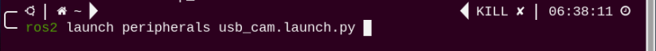

(4) Open a terminal again  and enter the following command to start the motion control node:

```py
ros2 launch puppy_control puppy_control.launch.py
```

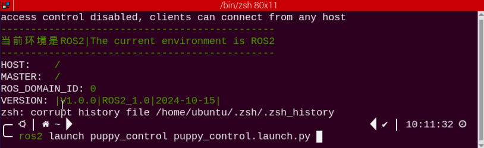

(5) Open another terminal, enter the following command, and press Enter to navigate to the program directory:

```py
cd ~/ros2_ws/src/example/example/opencv_course
```

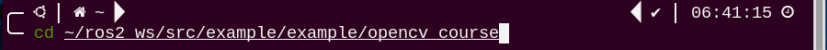

(6) Enter the following command and press Enter to start the functionality:

```py
python3 apriltag_tracking_demo.py --model 1
```

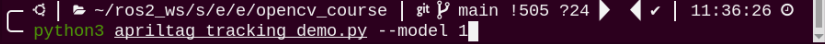

(7) To stop this functionality, press "**Ctrl+C**" in the terminal. If it fails to stop, please try again.

### 20.8.3 Program Outcome

After the game starts, place the tag card within the camera frame. When recognizing the tag, Tag ID will be printed on the camera returned image. If we move the tag, PuppyPi will move forward or backward.


### **20.8.4 Program Analysis**

The source code of this program is stored in **[/home/ubuntu//ros2_ws/src/example/example/opencv_course/apriltag_tracking_demo.py]()**

According to the implemented effect, the process logic of the program can be summarized as shown in the following diagram:

* **Tag Detection**

**(1) Image Graying**

Call **cvtColor()** function in cv2 library to convert the collected colored image into grayscale image and collect the tag information.

```py
gray = cv2.cvtColor(img, cv2.COLOR_RGB2GRAY)
detections = self.detector.detect(gray, return_image=False)
```

**(2) Extract Tag Information**

After collecting the tag information, extract the useful information.

```py
if len(detections) != 0:
	for detection in detections:
		M,e0,e1 = self.detector.detection_pose(detection,[self.camera_intrinsic.item(0,0), self.camera_intrinsic.item(1,1),
                                                          self.camera_intrinsic.item(0,2),self.camera_intrinsic.item(1,2)],
                                                          0.033) 
        P = M[:3,:4]
        self.coordinate=np.matmul(P,np.array([[0],[0],[0],[1]])).flatten()
```

```py
tag_family = str(detection.tag_family, encoding='utf-8')  # 获取tag_family(get tag_family)
```

```py
if tag_family == 'tag36h11':
	tag_id = str(detection.tag_id)  # 获取tag_id(get tag_id)
    return tag_id
```

`coordinate` represents the tag coordinate, `tag_family` refers to the type of tag, and `tag_id`  indicates tag ID.


* **Feedback Information**

Call `putText()` function in cv2 library to print the tag ID on the camera returned image.

```py
cv2.putText(img, self.tag_id, (10, img.shape[0] - 20), cv2.FONT_HERSHEY_SIMPLEX, 2, (0, 255, 255), 3) 
```

The meaning of the parameters in bracket is as follow.

The first parameter `img` is the input image.

The second parameter `tag_id` is the added text, referring to tag ID.

The third parameter `(10, img.shape[0] - 20)` is the coordinate of upper left corner of the added text.

The fourth parameter `cv2.FONT_HERSHEY_SIMPLEX` is the font type.

The fifth parameter `2` is the font size.

The sixth parameter `(0, 255, 255)` is the color of the font, and the values respectively corresponds to B, G, R. The color here is yellow.

The seventh parameter  `3`  is the font weight.


**8.4.3 Action Feedback**

The program controls PuppyPi's movement through publishing topic.

```py
else:
	if self.coordinate[2] > 0.22:
                        self.set_move(x = 5.0)                            
                    elif self.coordinate[2] < 0.18:
                        self.set_move(x = -5.0)
                    else:
                        self.set_move()
                time.sleep(0.01)         
            else:
                time.sleep(0.01)
```

```py
# 运动控制    
def set_move(self, x=0.00, y=0.0, yaw_rate=0.0):
	self.velocity_publisher.publish(Velocity(x=x, y=y, yaw_rate=yaw_rate)) 
```

The meaning of the parameters of `PuppyVelocityPub.publish()` is as follow.

The first parameter is used to control PuppyPi to move straight. Moving forward is taken as the positive direction and Its unit is cm/s. When it is "**0**", PuppyPi will stay still. When it is positive, PuppyPi will move forward. When it is negative, PuppyPi will move backward. The greater the absolute value of the parameter, the larger the stride PuppyPi takes.

The second parameter is used to control PuppyPi to walk sideways. Its unit is cm/s. As PuppyPi cannot walk sideways, this parameter is without actual function.

The third parameter is used to control PuppyPi to turn. The counterclockwise direction is taken as the positive direction, and the unit is rad/s. When the value is "**0**", PuppyPi will move straight. When the value is positive, PuppyPi will keep turning left as moving. When the value is negative, PuppyPi will keep turning right as moving. The greater the absolute value of the parameter, the greater PuppyPi turns.

(1) When not recognizing the tag, PuppyPi will not take action.

```py
if self.coordinate is None:
   self.set_move()
   time.sleep(0.01)
```

(2) When the distance between the tag and camera is greater than the set threshold, PuppyPi will move forward in 5cm/s.

```py
else:
    if self.coordinate[2] > 0.22:
       self.set_move(x = 5.0) 
```

(3) When the distance between the tag and camera is smaller than the set threshold, PuppyPi will move backward in 5cm/s.

```py
elif self.coordinate[2] < 0.18:
	self.set_move(x = -5.0)
```


### 20.8.5 Function Extension

* **Modify Default**

The distance threshold has been set in the program, which is used to decide PuppyPi perform which action for feedback.

When the distance between the camera and tag is greater than 0.22m, PuppyPi will moves forward. When it is smaller than 0.18m, PuppyPi will move backward continuously till the distance is greater than or equal to 0.18m.

The distance threshold can be modified. For example, we program PuppyPi to move forward when the distance between the camera and tag is greater than 0.20m.

(1) Power on the PuppyPi robot and remotely connect to the Raspberry Pi desktop via VNC.

(2) Open a terminal  and enter the following command to navigate to the program directory:

```py
cd ~/ros2_ws/src/example/example/opencv_course
```

(3) Enter the following command and press Enter to open the program file:

```py
vim apriltag_tracking_demo.py
```

(4) Locate the code shown in the image below:

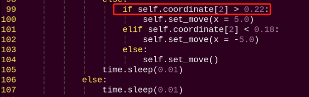

:::{Note}

After entering the line number in the code, press "Shift+G" to jump directly to the corresponding position. (The line numbers in the image are for reference only, please refer to the actual code.)

:::

(5) Press the "i" key to enter edit mode. Modify the code to: self.coordinate\[2\] \> 0.20

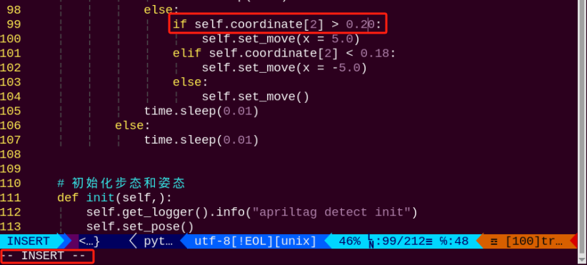

(6) After making the changes, press "Esc," enter the following command, and press Enter to save and exit:

```py
:wq
```

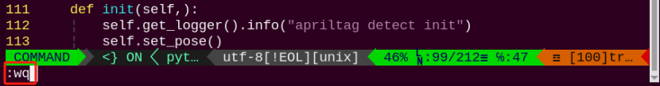

(7) Enter the following command to restart the functionality and see the changes:

```py
python3 apriltag_tracking_demo.py --model 1
```

* **Change the Default Moving Speed**

The PuppyPi robot's forward and backward speed is set to 5 cm/s by default. In this example, **we will change the forward speed to 3 cm/s**. The steps are as follows:

(1) Power on the PuppyPi robot and remotely connect to the Raspberry Pi desktop via VNC.

(2) Open a terminal  and enter the following command to navigate to the program directory:

```py
cd ~/ros2_ws/src/example/example/opencv_course
```

(3) Enter the following command and press Enter to open the program file:

```py
vim apriltag_tracking_demo.py
```

(4\) Locate the code shown in the image below:

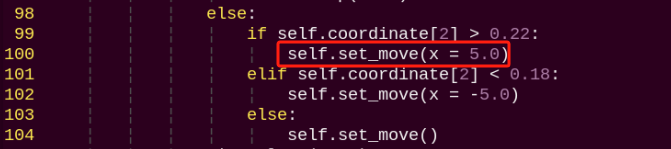

:::{Note}

After entering the line number in the code, press "Shift+G" to jump directly to the corresponding position. (The line numbers in the image are for reference only; please refer to the actual code.)

:::

(5\) Press the "**i**" key to enter edit mode. Modify the code to:

```py
self.set_move(x = 3.0)
```

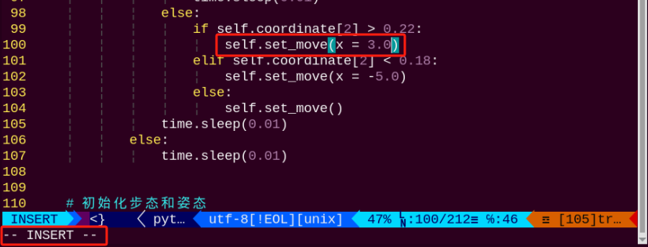

(6\) After making the changes, press "**Esc**," enter the following command, and press Enter to save and exit:

```py
:wq 
```


(7\) Enter the following command and press Enter to restart the functionality and view the effect of the changes:

```py
python3 apriltag_tracking_demo.py --model 1
```
