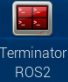
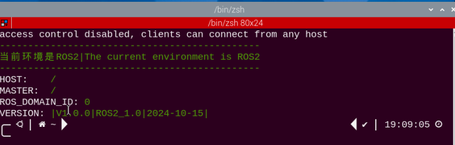
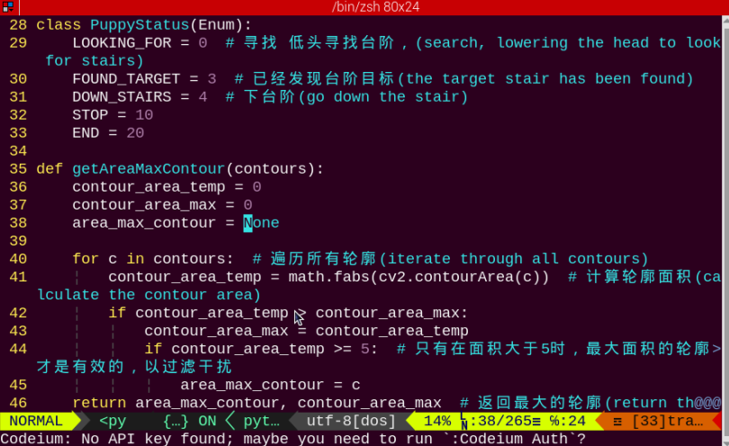
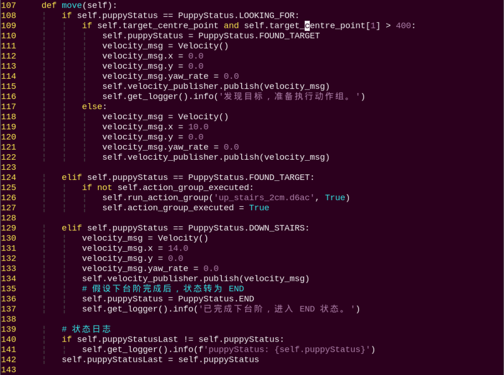
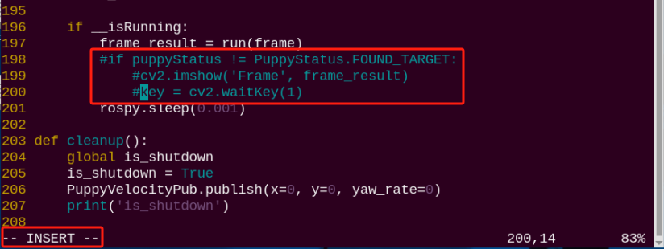
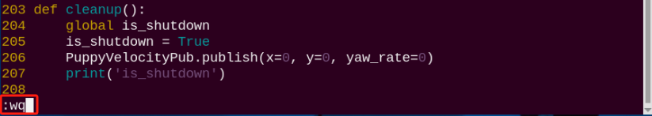
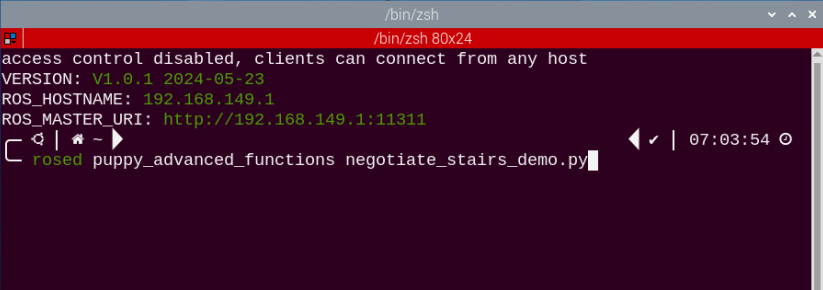
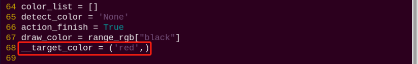
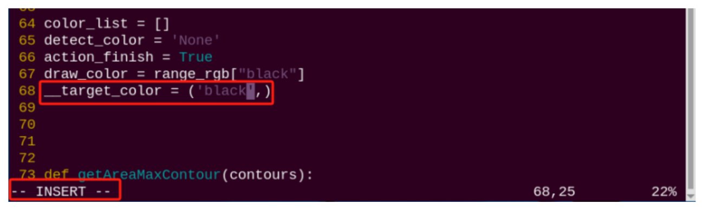
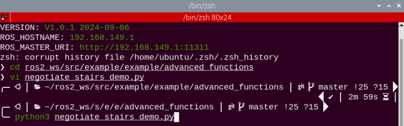

# 21. ROS2-AI Stair Recognition and Negotiating Course

## 21.1 Stair Recognition

### 21.1.1 Program Logic

Before the game, we need to DIY a stair. We can use 20mm height items as stair, such as board and sturdy box. And paste the red electrical tape on the border, because PuppyPi recognize the stair through recognizing the color.

Stair recognition process is as follow.

Firstly, program to recognize the color of line. Use Lab color space to convert the image from RGB into Lab. Then, perform binaryzation, corrosion, dilation, etc., on the image to obtain the contour which contains the target color. Next, mark the contour with rectangle.

Then, acquire the diagonal point of the rectangle and draw the center of the line.

Lastly, display the information about the line center on the terminal.

### 21.1.2 Operation Steps

:::{Note}

The input command should be case and space sensitive.

:::

(1) Turn on PuppyPi, and then connect to Raspberry Pi desktop through VNC.

(2) Click  to open Terminator ROS2 terminal.



(3) Input the command below and press Enter to start the game.

```bash
cd ros2_ws/src/example/example/advanced_functions/
```

```bash
ros2 launch negotiate_stairs_demo.launch.py
```

(4) If want to close this game, we can press "**Ctrl+C**". If it fails to close the game, please try again.

### 21.1.3 Program Outcome

The program is default to detect red.

Paste the red electrical tape on the boarder of the stair, and then place the stair in front of PuppyPi. After the game starts, PuppyPi will recognize the line. When recognized, it will be framed on the camera returned image and its center will be drawn.

### 21.1.4 Program Analysis

The source code of this program is stored in **[ros2_ws/src/example/example/advanced_functions/negotiate_stairs_demo.zip](../_static/source_code/ros2/negotiate_stairs_demo.zip)**

(1) Import Function Package

```py
import sys
import cv2
import time
import math
import numpy as np
from enum import Enum
import yaml
from sdk import Misc
import rclpy
from rclpy.node import Node
from rclpy.qos import QoSProfile
from sensor_msgs.msg import Image
from std_srvs.srv import Empty, SetBool
from interfaces.srv import *
from puppy_control_msgs.msg import Velocity, Pose, Gait
from puppy_control_msgs.srv import SetRunActionName
from cv_bridge import CvBridge
```

Using import statements to import the required modules: math provides a range of mathematical functions and constants for related calculations; rospy is used for ROS communication. `from object_tracking.srv import *` imports services related to object tracking. `from puppy_control.msg import Velocity, Pose, Gait` imports services for controlling and transmitting the velocity, pose, and gait of the robot.

* **Image Processing**

(1) Gaussian Filtering

Before converting the image from RGB into Lab space, denoise the image and use `GaussianBlur()` function in cv2 library for Gaussian filtering.

```py
frame_gb = cv2.GaussianBlur(frame_resize, (3, 3), 3)
```

The meaning of the parameters in bracket is as follow:

The first parameter `frame_resize` is the input image

The second parameter `(3, 3)` is the size of Gaussian kernel

The third parameter `3` is the allowable range of variation around the average in Gaussian filtering. The larger the value, the larger the allowable range of variation

(2) Binaryzation Processing

Adopt `inRange()` function in cv2 library to perform binaryzation on the image.

```py
frame_mask = cv2.inRange(frame_lab,
                    (self.color_range_list[detect_color]['min'][0],
                     self.color_range_list[detect_color]['min'][1],
                     self.color_range_list[detect_color]['min'][2]),
                    (self.color_range_list[detect_color]['max'][0],
                     self.color_range_list[detect_color]['max'][1],
                     self.color_range_list[detect_color]['max'][2]))
```

The first parameter in the bracket is the input image. 

The second and the third parameters respectively are the lower limit and upper limit of the threshold. When the RGB value of the pixel is between the upper limit and lower limit, the pixel is assigned 1, otherwise, 0.

(3) Open Operation and Close Operation

To reduce interference and make the image smoother, it is necessary to process the image.

```py
opened = cv2.morphologyEx(frame_mask, cv2.MORPH_OPEN, np.ones((6, 6), np.uint8))
closed = cv2.morphologyEx(opened, cv2.MORPH_CLOSE, np.ones((6, 6), np.uint8))
```

cv2.MORPH_OPEN refers to open operation where corrosion will be conducted first, then dilation. cv2.MORPH_CLOSE indicates close operation where dilation will be conducted first, then corrosion.

Take `opened = cv2.morphologyEx(frame_mask, cv2.MORPH_OPEN, np.ones((6, 6), np.uint8))` for example. The meaning of the parameters in bracket is as follow.

The first parameter `frame_mask` is the input image.

The second parameter `cv2.MORPH_OPEN` refers to processing method, open operation.

The third parameter `np.ones((6, 6), np.uint8)` is frame size.

(4) Acquire the Maximum Contour

After processing the image, acquire the contour of the target to be recognized, which involves `findContours()` function in cv2 library.

```py
cnts = cv2.findContours(closed, cv2.RETR_EXTERNAL, cv2.CHAIN_APPROX_TC89_L1)[-2]
cnt_large, area_max = getAreaMaxContour(cnts)
```

The first parameter in parentheses is the input image;

 the second parameter is the retrieval mode of the contour; the third parameter is the approximation method of the contour.

Find the contour of the maximum area among the obtained contours. To avoid interference, please set a minimum value. Only when the area is greater than this value, the target contour is valid.

```py
def getAreaMaxContour(contours):
    contour_area_temp = 0
    contour_area_max = 0
    area_max_contour = None

    for c in contours:
        contour_area_temp = math.fabs(cv2.contourArea(c))
        if contour_area_temp > contour_area_max:
            contour_area_max = contour_area_temp
            if contour_area_temp >= 5:
                area_max_contour = c
    return area_max_contour, contour_area_max
```

* **Acquire the Position**

(1) Frame the Line

Call `drawContours()` function to set the rectangle pattern and frame the line.

```py
 cv2.drawContours(img, [box], -1, (0, 0, 255, 255), 2)
```

(2) Draw the Center

Next, acquire the diagonal points of the rectangle, and draw the line center through `circle()` function.

```py
	centerX = rect[0][0]
	centerY = rect[0][1]
	centerX = int(Misc.map(centerX, 0, 320, 0, img_w))
	centerY = int(Misc.map(centerY, 0, 240, 0, img_h))
for i in range(4):
	box[i, 1] = int(Misc.map(box[i, 1], 0, 240, 0, img_h))
for i in range(4):                
	box[i, 0] = int(Misc.map(box[i, 0], 0, 320, 0, img_w))
                
	cv2.drawContours(img, [box], -1, (0, 0, 255, 255), 2)  # 画出矩形
self.target_centre_point = [centerX, centerY]
	cv2.circle(img, (centerX, centerY), 5, (0, 0, 255), -1)  # 画出中心点

return img
```

## 21.2 Stair Negotiating

:::{Note}

if PuppyPi's performance is not desired, we can close debugging interface according to "[**21.2.5 Function Extension -> Close Debugging Interface**](#anchor_21_2_5)".

:::

### 21.2.1 Program Logic

Before the game, we need to DIY a stair. We can use 20mm height items as stair, such as board and sturdy box. And paste the red electrical tape on the border. Then PuppyPi will recognize the red tape and approach it to finish negotiating the stair.

Stair negotiating process is as follow.

Firstly, program to recognize the color of line. Use Lab color space to convert the image from RGB into Lab. Then, perform binaryzation, corrosion, dilation, etc., on the image to obtain the contour which contains the target color. Next, mark the contour with rectangle. And draw the center of line with red dot.

Next, control PuppyPi to approach the line center to come closer to the stair.

Lastly, control PuppyPi to negotiate the stair.

### 21.2.2 Operation Steps

:::{Note}

The input command should be case and space sensitive.

:::

(1) Power on the PuppyPi robot and remotely connect to the Raspberry Pi desktop via VNC.

(2) Click  to open the Terminator ROS2 terminal. Enter the commands to activate the feature (two lines of commands, entered one line at a time):

```bash
cd ros2_ws/src/example/example/advanced_functions
```

```bash
ros2 launch negotiate_stairs_demo.launch.py
```

(3) To exit this feature, press **"Ctrl+C"** in the LX terminal interface. If the shutdown fails, try pressing **"Ctrl+C"** multiple times.

### 21.2.3 Program Outcome

:::{Note}

The program is default to detect red.

:::

Paste the red electrical tape on the boarder of the stair, and then place the stair in front of PuppyPi. After the game starts, PuppyPi will recognize the line, and then approach the center of the line to negotiate the stair.

### 21.2.4 Program Analysis

The source code for this program is located within the Docker container.

**[ros2_ws/src/example/example/advanced_functions/negotiate_stairs_demo.py](../_static/source_code/ros2/negotiate_stairs_demo.zip)**

* **Approach the Stair**

In the first lesson, we introduced how to identify stairs. Next, you can control the robot to approach the stairs based on the center coordinate information of the lines, as shown in the diagram below:



In the code, an enumerated class named **PuppyStatus** is defined, which includes five states. These states represent different actions or events, such as:

`LOOKING_FOR`: Searching for the stairs

`FOUND_TARGET`: Target stairs found

`DOWN_STAIRS`: Descending the stairs

`STOP`: Stopping

`END`: Ending

The **getAreaMaxContour** function is used to find the largest contour by area from a set of contours. The function iterates through all contours, calculates the area of each, and records the largest contour and its area. If a contour's area is greater than or equal to 5, it is considered valid and returned as the result.

* **Negotiate the Stair**

After PuppyPi approaches the stair, call the built-in action group "**up_stairs_2cm.d6ac**" to control it to negotiate the stair.



**Publishing Speed Messages**

In the `move` method, speed messages are published using the command `self.velocity_publisher.publish(velocity_msg)`. This is similar to the example where `self.rect = self.rect.move(self.speed)` is used to move an object by updating its speed. Both approaches rely on publishing speed messages to control movement.

**State Transitions:** The code determines the next action by checking the value of `self.puppyStatus`. This is comparable to how the `move` function in the example uses the current state to adjust the ball's movement.

**Logging:** The code utilizes `self.get_logger().info()` to log information, which is consistent with the logging approach mentioned in the example.

Behavior Based on `self.puppyStatus`:

① When `self.puppyStatus` is `PuppyStatus.LOOKING_FOR`:

- If `self.target_centre_point` exists and its `y` coordinate is greater than 400, the robot's status is updated to `PuppyStatus.FOUND_TARGET`. A speed message is then published to stop the robot.

- If `self.target_centre_point` does not exist or its `y` coordinate is not greater than 400, a speed message is published to move the robot with an `x` velocity of 10.0.

② When `self.puppyStatus` is `PuppyStatus.FOUND_TARGET`:

- If `self.action_group_executed` is `False`, the robot executes an action group named `'up_stairs_2cm.d6ac'` and sets `self.action_group_executed` to `True`.

③ When `self.puppyStatus` is `PuppyStatus.DOWN_STAIRS`:

- A speed message is published to move the robot dog forward with an `x` velocity of 14.0.

- The robot's status is then updated to `PuppyStatus.END`, and a log message is recorded.

<p id="anchor_21_2_5"></p>

### 21.2.5 Function Extension

* **Close Debugging Interface**

As the continuous refresh of debugging interface will occupy CPU of Raspberry Pi, we can close debugging interface to tackle choppy running.

(1) Input the command below and press Enter to edit the stair negotiating program.

```bash
cd ros2_ws/src/example/example/advanced_functions/
```

```bash
vim negotiate_stairs_demo.py
```

(2) Next, jump to this line of code.


:::{Note}

we can input the line code and press **"Shift+G"** to jump to the corresponding line. The numbering of code positions in the diagram is for reference only, please refer to the actual positions.

:::

(3) Press "**i**" key to enter editing mode. Then add "**\#**" in front of the codes in the red frame to comment.



(4) After modification, press "**Esc**" and input "**:wq**" and press Enter to save and exit editing.

```bash
:wq
```



(5) Input the following command to restart the game and check PuppyPi's performance.

```bash
Python3 negotiate_stairs_demo.py
```

(6) If you need to view the debugging screen again (real-time feedback from the camera), you can uncomment the content boxed in step 3), i.e., remove the "**#**" in front of the code, then save, as shown in the following figure:


* **Change Line Color**

**The program is default to recognize red line. And we can change the color, for example black.**

(1) Enter the following command in sequence and press **Enter** to edit the program file.

```bash
cd ros2_ws/src/example/example/advanced_functions/
```

```bash
vim negotiate_stairs_demo.py
```



(2) Next, jump to this line of code.



:::{Note}

we can input the line code and press "**Shift+G**" to jump to the corresponding line.

:::

(3) Press "**i**" key to enter editing mode. Modify "**red**" as "**black**".



(4) After modification, press "**Esc**" and input "**:wq**" and press Enter to save and exit editing.

```bash
:wq
```

(5) Input the following command to restart the game and check PuppyPi's performance.

```bash
python3 negotiate_stairs_demo.py
```


