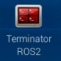
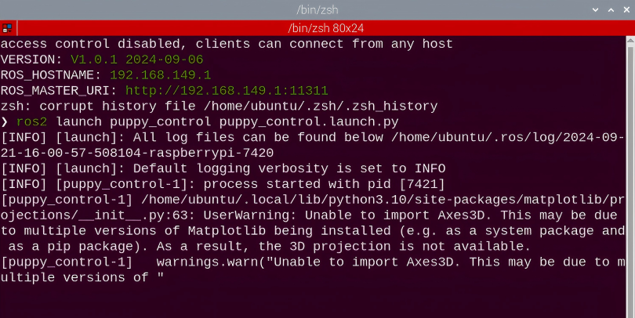
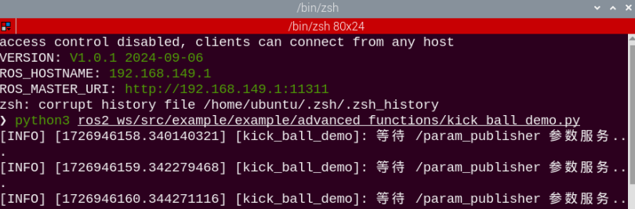
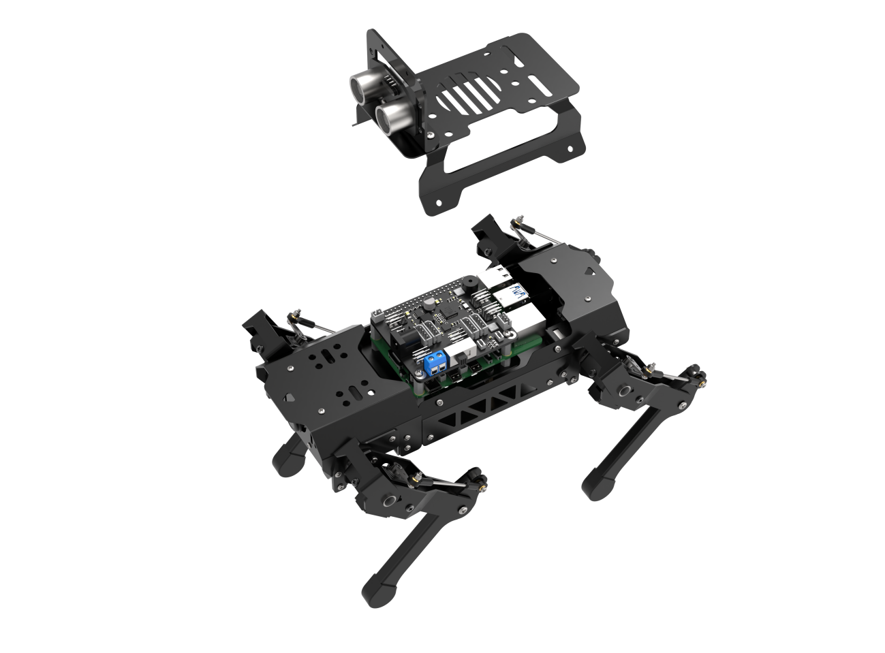
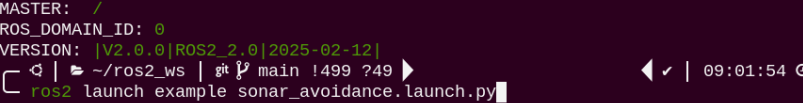
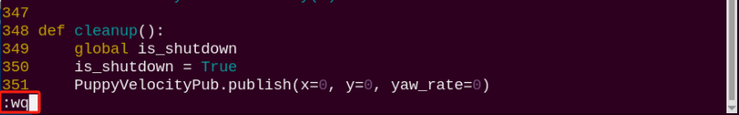
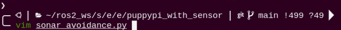
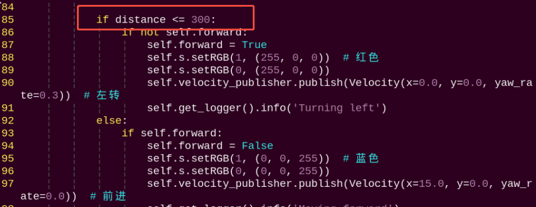
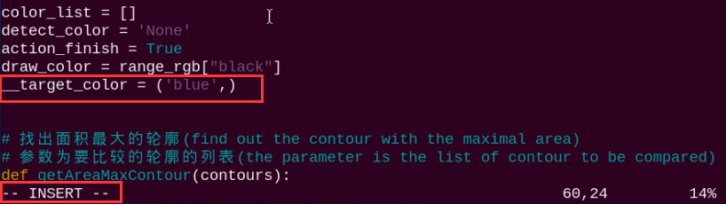

# 22. ROS2-AI Auto Tracking and Shooting Course

## 22.1 Ball Searching and Locating

### 22.1.1 Program Logic

Firstly, program to recognize color. Use Lab color space to convert the image from RGB into Lab. Then, perform binaryzation, corrosion, dilation, etc., on the image to obtain the contour which contains the target color. Next, circle the contour.

Next, judge the ball color. If it is red, acquire the coordinate of the ball.

Lastly, print the x-axis coordinate of the ball on the terminal.

### 22.1.2 Operation Steps 

:::{Note}

The input command should be case and space sensitive.

:::

(1) Turn on PuppyPi, and then connect to Raspberry Pi desktop through VNC.

(2) Click  to open Terminator ROS2 terminal.


(3) Input the command below and press Enter to start the game.

```py
ros2 launch puppy_control puppy_control.launch.py
```



(4) Open a new command-line terminal and run the following command to initiate the game.

```py
pyhton3 ros2_ws/src/example/example/advanced_functions/kick_ball_demo.py
```



(5) If want to close this game, we can press "**Ctrl+C**". If it fails to close the game, please try again.

### 22.1.3 Program Outcome

:::{Note}

The program is default to recognize red.

:::

Once the red ball is detected, a rectangle will be drawn around the ball in the video feed, and the X-axis coordinate will be printed in the terminal.


### 22.1.4 Program Analysis Analysis

The source code is located in **[ros2_ws/src/example/example/advanced_functions/include/kick_ball_demo.py]()**

**(1) Import Function Package**

```py
import sys
import cv2
import time
import math
import threading
import numpy as np
from enum import Enum
import yaml
from cv_bridge import CvBridge
import rclpy
from rclpy.node import Node
from sensor_msgs.msg import Image
from puppy_control_msgs.msg import Velocity, Pose, Gait
from puppy_control_msgs.srv import SetRunActionName
```

Import the required module through import statements: math provides a range of mathematical functions and constants for related calculations; rospy is used for ROS communication; from sensor_msgs.msg import Image: import target tracking related service. from puppy_control.msg import Velocity, Pose, Gait: import services for controlling and transmitting the velocity, pose, and gait of the robot.

* **Image Processing**

**(1) Gaussian Filtering**

Before converting the image from RGB into Lab space, denoise the image and use `GaussianBlur()` function in cv2 library for Gaussian filtering.

```py
frame_gb = cv2.GaussianBlur(frame_resize, (3, 3), 3)
```

The meaning of the parameters in bracket is as follow

The first parameter `frame_resize` is the input image

The second parameter `(3, 3)` is the size of Gaussian kernel

The third parameter `3` is the allowable range of variation around the average in Gaussian filtering. The larger the value, the larger the allowable range of variation.

**(2) Binaryzation Processing**

Adopt `inRange()` function in cv2 library to perform binaryzation on the image.

```py
frame_mask = cv2.inRange(frame_lab,
                         np.array(color_range['min'], dtype=np.uint8),
                         np.array(color_range['max'], dtype=np.uint8))
eroded = cv2.erode(frame_mask, cv2.getStructuringElement(cv2.MORPH_RECT, (3, 3)))
dilated = cv2.dilate(eroded, cv2.getStructuringElement(cv2.MORPH_RECT, (3, 3)))
```

The first parameter in the bracket is the input image. The second and the third parameters respectively are the lower limit and upper limit of the threshold. When the RGB value of the pixel is between the upper limit and lower limit, the pixel is assigned 1, otherwise, 0.

**(3) Erode and Dilate**

To reduce interference and make the image smoother, it is necessary to process the image.

```py
eroded = cv2.erode(frame_mask, cv2.getStructuringElement(cv2.MORPH_RECT, (3, 3)))
dilated = cv2.dilate(eroded, cv2.getStructuringElement(cv2.MORPH_RECT, (3, 3)))
```

`erode()` function is used for image erosion. Take `eroded = cv2.erode(frame_mask, cv2.getStructuringElement(cv2.MORPH_RECT, (3, 3)))` for example. The meaning of the parameters in bracket is as follow.

The first parameter `frame_mask` is the input image.

The second parameter `cv2.getStructuringElement(cv2.MORPH_RECT, (3, 3))` is the structural element or kernel deciding the nature of operation. And, the first parameter in the bracket is the shape of kernel, and the second parameter is the dimension of the kernel.

`dilate()` function is used for image dilation. The meaning of the parameters in bracket is the same as that of erode() function.

**(4) Acquire the Maximum Contour**

After processing the image, acquire the contour of the target to be recognized, which involves findContours() function in cv2 library.


The first parameter in the parentheses is the input image, usually an image that has undergone dilation for better contour detection. The second parameter specifies the contour retrieval mode, which extracts only the outermost contours, meaning the function will return only the outer contours and not any internal contours or holes. The third parameter defines the contour approximation method, which retains all the points on the contour.

```py
if max_area > 200:
	rect = cv2.minAreaRect(areaMaxContour_max)
    box = np.int0(cv2.boxPoints(rect))
    centerX = int(map_value(rect[0][0], 0, self.size[0], 0, img_w))
    centerY = int(map_value(rect[0][1], 0, self.size[1], 0, img_h))
    sideX = int(map_value(rect[1][0], 0, self.size[0], 0, img_w))
    sideY = int(map_value(rect[1][1], 0, self.size[1], 0, img_h))
    angle = rect[2]
    for i in range(4):
    	box[i, 1] = int(map_value(box[i, 1], 0, self.size[1], 0, img_h))
    for i in range(4):
        box[i, 0] = int(map_value(box[i, 0], 0, self.size[0], 0, img_w))
    cv2.drawContours(img, [box], -1, (0, 0, 255), 2)
```

* **Display Coordinate**

Lastly, the x-axis coordinate of the red ball will be displayed on the terminal.

```py
if sideX > sideY:
	self.target_info = {'centerX': centerX, 'centerY': centerY, 'sideX': sideX, 'sideY': sideY, 'scale': sideX/sideY, 'angle': angle}
else:
	self.target_info = {'centerX': centerX, 'centerY': centerY, 'sideX': sideX, 'sideY': sideY, 'scale': sideY/sideX, 'angle': angle}
```


## 22.2 Auto Tracking and Shooting

:::{Note}

 If the demonstration effect is not satisfactory, you can debug the device according to"[22.2.5 Function Extension -> Close Debugging Interface]()".

:::

### 22.2.1 Program Logic

Firstly, program to recognize color. Use Lab color space to convert the image from RGB into Lab. Then, perform binaryzation, corrosion, dilation, etc., on the image to obtain the contour which contains the target color. Next, circle the contour.

PuppyPi will execute color recognition continuously till red ball is recognized. Then acquire the coordinate of ball, and approach it. When PuppyPi stops in front of the ball, control it to shoot the ball according to the X-axis coordinate.

### 22.2.2 Operation Steps

:::{Note}

The input command should be case and space sensitive.

:::

(1) Turn on PuppyPi, and then connect to Raspberry Pi desktop through VNC.

(2) Click  to open Terminator ROS2 terminal.

```py
cd ros2_ws/src/example/example/advanced_functions
```

```
ros2 launch kick_ball_demo.launch.py
```

(3) If want to close this game, we can press "**Ctrl+C**". If it fails to close the game, please try again.

### 22.2.3 Program Outcome

:::{Note}

The program is default to recognize red, green and blue.

:::

When recognizing red ball, PuppyPi will approach the ball autonomously according to the location of PuppyPi, and then shoot the ball. Besides, the red ball will be marked with red circle and its color will be printed on the camera returned image.

### 22.2.4 Program Analysis Analysis

The source code of this program is located within the Docker container:

[ros2_ws/src/example/example/advanced_functions/include/kick_ball_demo.py]()

* **Direction Judging**

After locating the ball, judge whether the ball is at left or right according to the coordinate of the ball.

```py
if self.expect_center['X'] > self.target_info['centerX']:
	which_foot_kick_ball = 'left'
else:
	which_foot_kick_ball = 'right'
```

* **Approach the Red Ball**

According to the coordinate of the ball, control PuppyPi to approach the red ball.

```py
elif which_foot_kick_ball == 'right' and self.target_info['centerX'] < self.expect_center_kick_ball_right['X']:
	with self.lock:
    	velocity_msg = Velocity()
        velocity_msg.x = 0.0
        velocity_msg.y = 0.0
        velocity_msg.yaw_rate = float(math.radians(8))
        self.PuppyVelocityPub.publish(velocity_msg)
        	time.sleep(0.1)
        else:
        	with self.lock:
            	velocity_msg = Velocity()
                velocity_msg.x = 5.0
                velocity_msg.y = 0.0
                if which_foot_kick_ball == 'left':
                	velocity_msg.yaw_rate = float(math.radians(-10))
                else:
                    velocity_msg.yaw_rate = float(math.radians(10))
                self.PuppyVelocityPub.publish(velocity_msg)
                time.sleep(1.8)
                velocity_msg.x = 0.0
                velocity_msg.y = 0.0
                velocity_msg.yaw_rate = 0.0
                self.PuppyVelocityPub.publish(velocity_msg)
                self.puppyStatus = PuppyStatus.KICK_BALL
elif self.puppyStatus == PuppyStatus.KICK_BALL:
```

This process controls the movement and rotation of the robot dog based on whether the ball is kicked with the right foot and the relationship between the target position and the desired kick position. If specific conditions are met, the robot dog will rotate in place. Otherwise, the robot will move forward, rotate to the correct direction, and then stop to prepare for the kick.

For example, in the first block of code, it checks whether the which_foot_kick_ball variable is set to 'right' (indicating the ball is being kicked with the right foot), and whether the target position's center X coordinate (self.target_info\['centerX'\]) is smaller than the expected center X coordinate for the right foot kick (self.expect_center_kick_ball_right\['X'\]).

If both conditions are met, the code within the first with self.lock: block is executed. Otherwise, the code within the else: block is executed.

**2.4.3 Shoot the Ball**

After approaching the red ball, the robot uses the ball's position (left or right) to trigger the corresponding action group and perform the kicking motion. The lines if which_foot_kick_ball == 'left': and else: determine which foot will kick the ball based on the value of the which_foot_kick_ball variable. If the value is 'left', the left foot will be used; otherwise, the right foot will be used. See the diagram below:

```py
if which_foot_kick_ball == 'left':
	request.name = 'kick_ball_left.d6ac'
else:
	request.name = 'kick_ball_right.d6ac'
```


### 22.2.5 Function Extension

* **Close Debugging Interface**

As the continuous refresh of debugging interface will occupy CPU of Raspberry Pi, we can close debugging interface to tackle choppy running.

(1) Input the following command and press Enter to edit the program file.

```py
cd ros2_ws/src/example/example/advanced_functions
```

```
vim kick_ball_demo.py
```

(2) Next, jump to this line of code.



:::{Note}

After entering the line number for the code on the keyboard, press **'Shift+G'** to jump directly to the corresponding position. (The code line numbers shown in the image are for reference only; please refer to the actual ones.)

:::

(3) Press "**i**" key to enter editing mode. Then add "**\#**" in front of the codes in the red frame to comment.


(4) After modification, press "**Esc**" and input "**:wq**" and press Enter to save and exit editing.

```py
:wq
```



(5) Input the following command to restart the game and check PuppyPi's performance.

```py
python3 kick_ball_demo.py
```



(6) If you need to view the debugging screen again (real-time feedback from the camera), you can uncomment the content boxed in step 3), i.e., remove the **"#"** in front of the code, then save, as shown in the following figure:


**2.5.2 Change Ball Color**

:::{Note}

The program is default to recognize and shoot the red ball. If you need to change the color, please follow the below steps to operate.

:::

(1) Input the following command and press Enter to edit auto tracking and shooting program.

```py
cd ros2_ws/src/example/example/advanced_functions
```

```python
vi kick_ball_demo.py
```

(2) Next, jump to this line of code.



:::{Note}

we can input the line code and press **"Shift+G"** to jump to the corresponding line.

:::

(3) Press "**i**" key to enter editing mode. Modify "**red**" as "**blue**".



(4) After modification, press "**Esc**" and input "**:wq**" and press Enter to save and exit editing.

```py
:wq
```

(5) Input the following command to restart the game and check PuppyPi's performance.

```py
python3 kick_ball_demo.py
```
