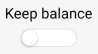
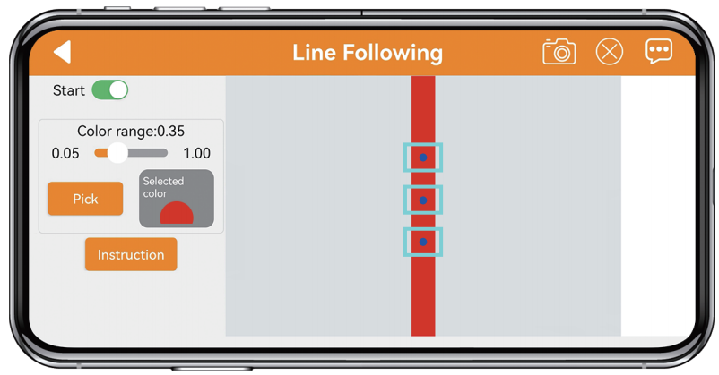
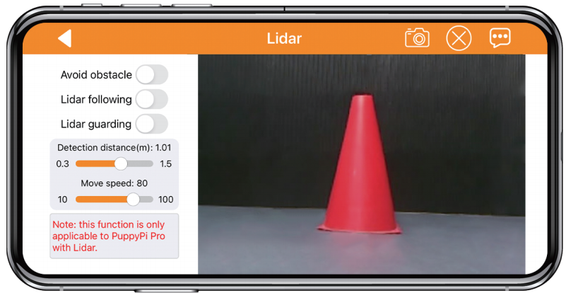

# 上手试玩

## 1. 手机APP安装与连接

### 1.1 准备工作

- APP安装

**[安卓系统](https://play.google.com/store/apps/details?id=com.Wonder.Pi)**： 需要注意，请务必在手机设置内为APP开启所有权限，否则可能会影响正常功能实现！

**[iOS系统](https://apps.apple.com/cn/app/wonderpi/id1477946178)**

- 设备开机

按照"**[学前先看\ 2. 首次开机](https://docs.hiwonder.com/projects/PuppyPi/en/latest/docs/1_read_before_studying.html#id4)**"内容，打开树莓派扩展板电源开关，等待开机完成。

### 1.2 设备连接

机器狗开机成功后，会进入AP直连模式并生成一个以"**HW**"开头的热点，使用手机APP连接该热点后，即可启动其对应玩法。

设备的连接方法有两种分别是直连模式与局域 网模式。

- #### 1.2.1 连接模式简介

以下为PuppyPi的两种网络模式：

1.  **AP 直连模式**：开发板能够开启热点被手机连接上。(但不能联通外部网络)

2.  **STA局域网模式**：开发板能够主动去连接指定的热点/Wi-Fi。(可联通外部网络)

局域网模式不能和直连模式共存，PuppyPi默认为AP 直连模式，用户无论是选择AP直连还是STA局域网模式，PuppyPi玩法功能都一致。

:::{Note}

这里建议用户先学习直连模式的配置方法进行相应功能的体验，局域网模式可根据需求来选看。

:::

- #### 1.2.2 直连模式连接方法（必看）

本小节教程以安卓版本为例，操作流程也适用于苹果版本。

在开始前，请先打开PuppyPi机器狗。

1)  打开手机APP，在主界面选择"**进阶平台-\>PuppyPi**"。

2)  点击界面右下角的"**+**"按钮，选择"**直连模式**"。

3)  按照画面提示，前往手机设置连接"**HW**"名开头的热点。

:::{Note}

若使用苹果手机进行操作，在连接热点时，切记要等待手机上方出现了Wi-Fi连接成功的图标之后再返回APP，否则可能会搜索不到设备。出现此情况可点击进行刷新，一般来说多刷新几次，就可以搜索到设备。

:::

4)  连接热点后，返回手机APP，APP将自动连接设备。稍等片刻，当搜索到下图所示图标时，即为连接成功。

:::{Note}
若手机出现"**网络不可用，是否继续连接**"的提示弹窗，单击"**保持连接**"按键即可。
:::

- #### 1.2.3局域网模式连接方法（选看）

本小节教程以苹果版本为例，操作流程也适用于安卓版本。

在开始前，请先打开PuppyPi机器狗。

1)  首先，在打开的WonderPi手机APP界面单击右下角"**+**"按钮，选择"**局域网模式**"，根据界面提示前往手机设置连接Wi-Fi。

2)  点击想要连接的Wi-Fi（这里以"**Hiwonder**"为例）。

3)  连接完成后返回APP，再次点击界面右下角"**+**"按钮，选择"**局域网模式**"。

4)  此时，APP会提示输入所要连接的Wi-Fi的密码（若没有自动弹出可再次点击"**局域网模式**"），输入Wi-Fi密码hiwonder，输入完成后点击"**下一步**"。（请确认Wi-Fi密码是否输入正确，如果输入错误会导致连接失败。）

5)  根据APP提示，再次前往设置，连接以"**HW**"开头的热点。

6)  连接热点后返回APP，此时可以看到APP已经开始自动连接了。连接过程中如出现是否加入的提示，点击"**加入**"即可。

7)  稍等片刻，界面会自动切回APP主界面，同时树莓派扩展板上的LED2将停止闪烁，和LED1一样保持常亮状态，此时即表示树莓派联网成功。

8)  长按APP中的机器狗图标，可以查看分配给机器狗的IP地址和ID。

9)  若要回到直连模式，可长按扩展板上的KEY1，直到LED2闪烁

## 2. 手机APP试玩

### 2.1 准备工作

请参照目录"**[上手试玩\1. 手机APP安装与连接](#anchor_1)**"下的文档，安装手机APP，并连接PuppyPi机器狗。

### 2.2 开始试玩

点击PuppyPi机器狗图标，进入玩法选择界面。

- #### 2.2.1 机体遥控

1)  在功能选择界面中点击"**机体遥控**"，进入玩法界面后，PuppyPi机器狗会立即恢复初始姿态。此玩法分为两种模式：**普通模式、高级模式** 。

- 普通模式可实现较为简单的控制，通过滑动摇杆即可控制机器狗运动。

- 高级模式可以控制运动速度、高度及姿态。

下表为两种模式的按键功能说明：

<table class="docutils-nobg" border="1">
    <colgroup>
        <col style="width: 20%" />
        <col style="width: 35%" />
    </colgroup>
    <tbody>
    <tr>
        <td style="text-align: center;"><strong>模式</strong></td>
        <td style="text-align: center;"><strong>图标</strong></td>
        <td style="text-align: center;"><strong>对应功能</strong></td>
    </tr>
    <tr>
        <td style="text-align: center;">
普通模式

        <td style="text-align: center;">

</td>
        <td style="text-align: left;">拖动摇杆可控制机器狗朝各个方向运动。</td>
    </tr>
    <tr>
        <td rowspan="4" style="text-align: center;">高级模式</td>
        <td style="text-align: center;"></td>
        <td style="text-align: left;">显示速度等级，等级范围为0-10级。</td>
    </tr>
    <tr>
        <td style="text-align: center;"></td>
        <td style="text-align: left;">拖动摇杆可控制机器狗的运动速度。摇杆离中心点越远，速度越快；离中心点越近，速度越慢。 </td>
    </tr>
    <tr>
        <td style="text-align: center;"></td>
        <td style="text-align: left;">拖动滑杆可调节机器狗的Pitch值，即俯仰角度。</td>
    </tr>
    <tr>
        <td style="text-align: center;"></td>
        <td style="text-align: left;">拖动滑杆可调节机器狗的高度。</td>
    </tr>
    <tr>
        <td style="text-align: center;" rowspan="3">
通用

        <td style="text-align: center;"></td>
        <td style="text-align: left;">点击图标，可将当前回传画面保存至手机相册。</td>
    </tr>
    <tr>
        <td style="text-align: center;"></td>
        <td style="text-align: left;">点击图标，可隐藏当前导航栏。</td>
    </tr>
    <tr>
        <td style="text-align: center;"></td>
        <td style="text-align: left;">点击图标，联系我们，了解更多产品详情。</td>
    </tr>
    </tbody>
</table>

2)  如需返回到玩法选择界面，点击当前界面的空白区域，调出标题栏，随后点击按键即可。

- #### 2.2.2 表演模式

1. 点击"**表演模式**"，进入玩法界面。该界面分为两部分：

- 界面左侧是动作选择区域，有内置动作和自定义动作可供选择；

- 界面右侧是自平衡功能区域。

自定义动作的使用请参考文档"**[ROS机器狗动作编辑课程\ 6. APP自定义控制](https://docs.hiwonder.com/projects/PuppyPi/en/latest/docs/10_action_editing.html#app)**"。

2.  点击界面左侧的动作名称，PuppyPi机器狗将执行对应的动作。

3.  点击界面右侧的"**自平衡**"按钮，机器狗将会根据平面的倾斜度，自主调整自身姿态，以维持稳定站姿。

下表为此玩法界面的按键功能说明：

| **按钮图标** | **功能说明** |
|:--:|:--:|
|  | 以趴下动作组按钮为例，按下此按钮后，机器狗将执行此内置动作。 |
|  | 开启/关闭机器狗自平衡功能（倾斜角度请勿超过30度） |

4)  如需返回到玩法选择界面，点击当前界面的空白区域，调出标题栏，随后点击按键即可。

- #### 2.2.3 颜色识别

:::{Note}
1.  请在光线充足的室内环境下进行，但尽量避免在强光直射下进行。

2.  识别时，摄像头画面内请勿应无同目标颜色相同或相近的杂物，避免干扰识别。

3.  如识别效果不佳，可前往目录"**[上手试玩\3. 颜色阈值调试](#anchor_3)**"学习颜色阈值的调节方式。
:::

1)  点击"**颜色识别**"，进入玩法界面。该界面分为两部分：

- 界面左侧是识别开关区域；

- 界面右侧是摄像头回传画面区域。

2)  点击"**开始识别**"按钮，可依次将红色、蓝色、绿色的物体单独放置于摄像头前，当识别到不同颜色的物体，PuppyPi机器狗会执行对应的反馈动作。

当识别到红色物体，机器狗会执行"**点头**"动作；当识别到蓝色或绿色物体，机器狗会执行"**摇头**"动作。

| **按钮图标** | **功能说明** |
|:--:|:--:|
|  | 开启/关闭玩法。 |

3)  如需返回到玩法选择界面，点击当前界面的空白区域，调出标题栏，随后点击按键即可。

- #### 2.2.4 目标追踪

:::{Note}

1.  请在光线充足的室内环境下进行，但尽量避免在强光直射下进行。

2.  识别时，摄像头画面内请勿应无同目标颜色相同或相近的杂物，避免干扰识别。

3.  如识别效果不佳，可前往目录"**[上手试玩\3. 颜色阈值调试](#anchor_3)**"查看文档，学习颜色阈值的调节方式。

:::

1)  点击"**目标追踪**"，进入玩法界面。该界面分为两部分：

- 界面左侧是追踪开关区域；

- 界面右侧是摄像头回传画面区域。

2)  选择目标颜色后，点击"**开始追踪**"按钮。PuppyPi机器狗将跟随选定的颜色目标运动。

| **按钮图标** | **功能说明** |
|:--:|:--:|
|  | 开启/关闭玩法。 |
|  | 选择追踪的目标颜色。 |
|  | 显示目标颜色信息。 |

3)  如需返回到玩法选择界面，点击当前界面的空白区域，调出标题栏，随后点击按键即可。

- #### 2.2.5 标签识别

:::{Note}

1.  请在光线充足的室内环境下进行。

2.  请保持标签纸面的完整性，如缺角、污渍可能会影响到该玩法的识别效果。

:::

1)  点击"**标签识别**"，进入玩法界面。该界面分为两部分：

- 界面左侧是识别开关区域；

- 界面右侧是摄像头回传画面区域。

2)  点击"**开始识别**"按钮，将标签逐张放置于摄像头前，当识别到不同ID的标签，PuppyPi机器狗会执行对应的反馈动作。

当识别到ID1，机器狗执行"**打招呼**"动作；当识别到ID2时，机器狗执行"**趴下**"动作；当识别到ID3，机器狗执行"**俯卧撑**"动作。

| **按钮图标** | **功能说明** |
|:--:|:--:|
|  | 开启/关闭玩法。 |

3)  如需返回到玩法选择界面，点击当前界面的空白区域，调出标题栏，随后点击按键即可。

- #### 2.2.6 人脸检测

:::{Note}

戴口罩不影响正常识别，且支持画面内多张人脸同时识别。

:::

1)  点击"**人脸检测**"，进入玩法界面。该界面分为两部分：

-  界面左侧是检测开关区域；

-  界面右侧是摄像头回传画面区域。

2)  点击"**开始检测**"按钮，机器狗会检测方圆1米内的人脸。当识别到人脸，PuppyPi机器狗会执行"**招手**"动作。

| **按钮图标** | **功能说明** |
|:--:|:--:|
|  | 开启/关闭玩法。 |

3)  如需返回到玩法选择界面，点击当前界面的空白区域，调出标题栏，随后点击按键即可。

- #### 2.2.7 视觉巡线

:::{Note}

1.  请在光线充足的室内环境下进行，但尽量避免在强光直射下进行。

2.  识别时，摄像头画面内请勿应无同目标颜色相同或相近的杂物，避免干扰识别。

3.  如识别效果不佳，可前往目录"**[上手试玩\3. 颜色阈值调试](#anchor_3)**"查看文档，学习颜色阈值的调节方式。

:::

1)  点击"**视觉巡线**"，进入玩法界面。该界面分为两部分：

-  界面左侧是巡线开关区域；

-  界面右侧是摄像头回传画面区域。

2) 点击"**开始巡线**"按钮，并选择选择巡线颜色，PuppyPi机器狗将沿着带有目标颜色的线条行进。

| **按钮图标** | **功能说明** |
|:--:|:--:|
|  | 开启/关闭玩法。 |
|  | 选择巡线目标颜色。 |

3) 如需返回到玩法选择界面，点击当前界面的空白区域，调出标题栏，随后点击按键即可。

## 3. 颜色阈值调试

在体验PuppyPi视觉玩法的过程中，周围环境的光线可能会对某些玩法的实现效果存在干扰。通过调节颜色阈值，可以解决这个问题（此处以安卓手机为例进行讲解），具体步骤如下：

1)  进入玩法主界面，点击右上角的设置按键，进入阈值调节界面。

2)  本节以调节红色为例，将红色方块放置在摄像头的视野范围内，在"**选择颜色**"处点击红色按键。

3)  点击界面右下角的"**操作说明**"按键，进入帮助界面。根据Lab颜色模型图可知，红色位于"**+a**"附近，因此需要将阈值区间往该处调整。

4)  点击"**好的**"按键以返回阈值设置界面，将L、A、B三个颜色分量的数值范围都调整为0~255，即所有_min的参数都为0，所有_max的参数都为255。

5)  保持"**A**"分量中"**a_max**"的数值不变，将"**a_min**"的数值增大，直至画面显示区上方的颜色物体区域变为白色，其它区域变为黑色。

6)  根据所处环境来调整L分量和B分量。若红色物体在环境下颜色偏浅，增大亮度的最小值(L_min)；在环境下颜色偏深，则减小亮度的最大值(L_max)。若红色物体在环境下偏暖色调，增大色度的最小值(b_min)；在环境下偏冷色调，减小色度的最大值(b_max)。

7)  调节完成后，点击"**保存**"按键。

## 4. 无线手柄遥控教程

### 4.1 准备工作

1.  将手柄接收器插入PuppyPi机器狗的任意一个USB接口。

:::{Note}

手柄接收器请在设备开机前插入，如已插入则忽略本步骤。

:::

2.  自备两节7号干电池，取出手柄后壳，将电池插入电池槽内，注意正负极请勿插反。

### 4.2 设备连接

1.  打开机器狗开关。

2.  打开手柄开关，此时手柄上两个LED灯（红色、绿色）将同时闪烁。

3.  等待几秒，机器狗将和手柄自动配对，配对成功后，绿色灯将常亮。

打开手柄开关后30秒内未连接机器狗，或连接后5分钟内对手柄无任何操作，手柄将进入睡眠模式。若需唤醒手柄，按下"**START**"键即可。

### 4.3 按键说明

手柄按键和机器狗动作的对应关系如下表所示（以PuppyPi机器狗自身为参考点）：

|    **按键**    |            **功能**            |
|:--------------:|:------------------------------:|
|     START      |       机体恢复初始化姿态       |
|       L1       |              上仰              |
|       L2       |              下俯              |
|       R1       |              前倾              |
|       R2       |              后倾              |
| ↑ / 左滑杆向上 |              前进              |
| ↓ / 左滑杆向下 |              后退              |
| ← / 左滑杆向左 |              左转              |
| → / 左滑杆向右 |              右转              |
| △ / 右滑杆向上 |          提升机体高度          |
| × / 右滑杆向下 |          降低机体高度          |
| ◻ / 右滑杆向左 | 减速（需配合按键"↑"、"↓"使用） |
| ○ / 右滑杆向右 | 加速（需配合按键"↑"、"↓"使用） |

