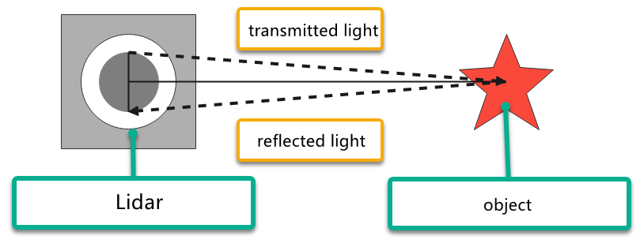

# 23. ROS2-AI Vision Line Following Course

## 23.1 Line Locating

### 23.1.1 Program Logic

Before line following, program PuppyPi to locate the line first.

Firstly, program to recognize color. Use Lab color space to convert the image from RGB into Lab. Then, perform binaryzation, corrosion, dilation, etc., on the image to obtain the contour which contains the target color. Next, mark the contour with rectangle.

Next, acquire the diagonal points of the rectangle, and draw the center of line.

Lastly, display the information about the center of line on the terminal.

### 23.1.2 Operation Steps

:::{Note}

The input command should be case and space sensitive.

:::

(1) Turn on PuppyPi, and then connect to Raspberry Pi desktop through VNC.

(2) Click  to open Terminator ROS2 terminal, then execute the following command in sequence:

```bash
cd ros2_ws/src/example/example/advanced_functions
```

```bash
ros2 launch visual_patrol_demo.launch.py
```

(3) If want to close this game, we can press "**Ctrl+C**". If it fails to close the game, please try again.

### 23.1.3 Program Outcome

:::{Note}

The program is default to recognize red.

:::

Use red electrical tape to set the line. Then place PuppyPi on the red line. After the line is recognized by PuppyPi, the line will be framed on the camera returned image and the center of line will be drawn. At the same time, the coordinate of the line center will be displayed on the terminal.


### 23.1.4 Program Analysis Analysis

The source code of this program is located within the Docker container at:

**[ros2_ws/src/advanced_functions/include/visual_patrol_demo.py]()**

According to the implemented effect, the process logic of the program can be summarized as shown in the following diagram:

* **Image Processing**

(1) Import Function Package

```py
import cv2
import math
import time
import numpy as np
import yaml
from cv_bridge import CvBridge, CvBridgeError
import rclpy
from rclpy.node import Node

from sensor_msgs.msg import Image
from std_srvs.srv import Empty
from puppy_control_msgs.msg import Velocity, Pose, Gait
```

Import the required modules through import statements: math provides a range of mathematical functions and constants for related calculations; rospy is used for ROS communication; from sensor_msgs.msg import Image: import Image information type from sensor_msgs.msg. Sensor_msgs package provides information definition and camera image of various sensor data. Puppy control imports action group.

(2) Obtain the Maximal Contour

```py
self.__isRunning = False
self.__target_color = 'red' 
self.line_centerx = -1
self.img_centerx = 320  
```

Set the line color to red.

(3) Gussian Filtering

Before converting the image from RGB into Lab space, denoise the image and use `GaussianBlur()` function in cv2 library for Gaussian filtering.

```py
frame_gb = cv2.GaussianBlur(frame_resize, (3, 3), 3)
```

The meaning of the parameters in bracket is as follow

The first parameter `frame_resize` is the input image

The second parameter `(3, 3)` is the size of Gaussian kernel

The third parameter `3` is the allowable variance around the average in Gaussian filtering. The larger the value, the larger the allowable variance.

(4) Binaryzation Processing

Adopt `inRange()` function in cv2 library to perform binaryzation on the image.

```py
frame_mask = cv2.inRange(frame_lab,
                         np.array(color_range['min'], dtype=np.uint8),
                         np.array(color_range['max'], dtype=np.uint8))
```

The line of code `frame_mask = cv2.inRange(frame_lab, np.array(color_range['min'], dtype=np.uint8), np.array(color_range['max'], dtype=np.uint8))` uses the cv2.inRange function to create a binary mask.

(5) Open Operation and Close Operation

To reduce interference and make the image smoother, it is necessary to process the image.

```py
opened = cv2.morphologyEx(frame_mask, cv2.MORPH_OPEN, np.ones((5, 5), np.uint8))
closed = cv2.morphologyEx(opened, cv2.MORPH_CLOSE, np.ones((5, 5), np.uint8))
```

`cv2.MORPH_OPEN` refers to open operation where corrosion will be conducted first, then dilation. cv2.MORPH_CLOSE indicates close operation where dilation will be conducted first, then corrosion.

Take `opened = cv2.morphologyEx(frame_mask, cv2.MORPH_OPEN, np.ones((6, 6), np.uint8))` for example. The meaning of the parameters in bracket is as follow.

The first parameter `frame_mask` is the input image.

The second parameter `cv2.MORPH_OPEN` refers to processing method, open operation.

The third parameter `np.ones((6, 6), np.uint8)` is frame size.

(6) Acquire the Maximum Contour

After processing the image, acquire the contour of the target to be recognized, which involves `findContours()` function in cv2 library.

```py
contours, _ = cv2.findContours(closed, cv2.RETR_EXTERNAL, cv2.CHAIN_APPROX_SIMPLE)
cnt_large, area = self.getAreaMaxContour(contours)
self.get_logger().debug(f"ROI {idx + 1}: 找到 {len(contours)} 个轮廓，最大面积为 {area}")
```

The first parameter in the function's parentheses is the input image; the second parameter is the contour retrieval mode; the third parameter is the contour approximation method.

The self.getAreaMaxContour function is called, passing the contours list, and it returns the largest contour cnt_large along with its corresponding area area.

```py
def getAreaMaxContour(self, contours):
    """找出面积最大的轮廓"""
    contour_area_max = 0
    area_max_contour = None

    for c in contours:
        contour_area_temp = math.fabs(cv2.contourArea(c))
        if contour_area_temp > contour_area_max:
            contour_area_max = contour_area_temp
            if contour_area_temp > 50:
                area_max_contour = c

    return area_max_contour, contour_area_max
```

* **Acquire the Position**

(1) Frame the Line

Call `drawContours()` function to set the rectangle pattern and frame the line.

```py
cv2.drawContours(img, [box], -1, (0, 0, 255), 2)
```

(2) Draw the Center

Next, acquire the diagonal points of the rectangle, and draw the line center through circle() function.

```py
cv2.drawContours(img, [box], -1, (0, 0, 255), 2)
pt1_x, pt1_y = box[0, 0], box[0, 1]
pt3_x, pt3_y = box[2, 0], box[2, 1]
center_x, center_y = (pt1_x + pt3_x) / 2, (pt1_y + pt3_y) / 2
cv2.circle(img, (int(center_x), int(center_y)), 5, (0, 0, 255), -1)
```

## 23.2 Auto Line Following

:::{Note}

If PuppyPi's performance is not desired, we can debug according to "[**23.2.5 Function Extension -> Close Debugging Interface and Printed Data**]()".

:::

### 23.2.1 Program Logic

PuppyPi can recognize the color of line and use algorithm to process the image so as to realize line following.

Firstly, program to recognize the color of line. Use Lab color space to convert the image from RGB into Lab. Then, perform binaryzation, corrosion, dilation, etc., on the image to obtain the contour which contains the target color. Next, mark the contour with rectangle.

After color recognition, perform calculation based on the location of line in the image to control PuppyPi to move along the line.

### 23.2.2 Operation Steps

:::{Note}

The input command should be case and space sensitive.

:::

(1) Turn on PuppyPi, and then connect to Raspberry Pi desktop through VNC.

(2) Click  to open Terminator ROS2 terminal, then enter the following command:

```bash
cd ros2_ws/src/example/example/advanced_functions
```

```bash
ros2 launch visual_patrol_demo.launch.py
```

(3) If want to close this game, we can press "**Ctrl+C**". If it fails to close the game, please try again.

### 23.2.3 Program Outcome

:::{Note}

The program is default to detect red.

:::

Use the red electrical tape to set the line, and place PuppyPi on the red line. After the game starts, it will move along the red line.
