# 28. ROS2-Robot Arm Couse

## 28.1 The Installation of Robotic Arm and Power-on Test

### 28.1.1 The Installation of Robotic Arm

The installation tutorial video for the Puppypi robotic arm can be referred to in the same directory under "**Robotic Arm Installation**". Below is a schematic diagram for the installation of the Puppypi robotic arm:

Use four **M4\*6 round head machine screws** to secure the robotic arm to the Puppypi. Due to the replacement of old and new versions of Puppypi sheet metal parts, some sheet metal parts can only be installed with two M4\*6 round head machine screws. Please refer to the actual Puppypi sheet metal parts for specifics.


Connect the servos ID9, ID10, and ID11 on the robotic arm to the PWM servo interfaces 9, 10, and 11 on the Raspberry Pi expansion board as pictured:

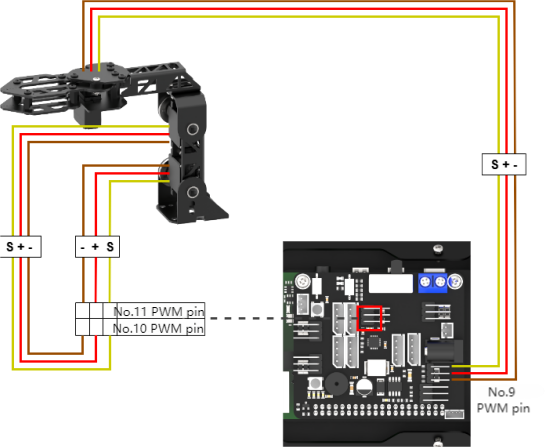

### 28.1.2 Power-on Inspection

:::{Note}

* Do not start PuppyPi on rough or uneven surfaces.

* Do not forcibly move the servos after powering on to avoid damaging them.

:::

(1) Before powering on, to avoid servo damage from sudden movement, place PuppyPi in a lying position on a flat surface. The robotic arm should be positioned facing forward, as shown in the diagram below:


:::{Note}

Before powering on, the robotic arm must be positioned facing straight forward. Do not position it hanging downwards to prevent damage to the robotic arm when the servos are powered on.

:::

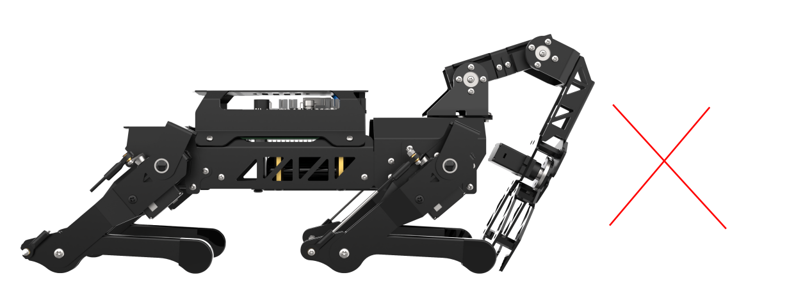

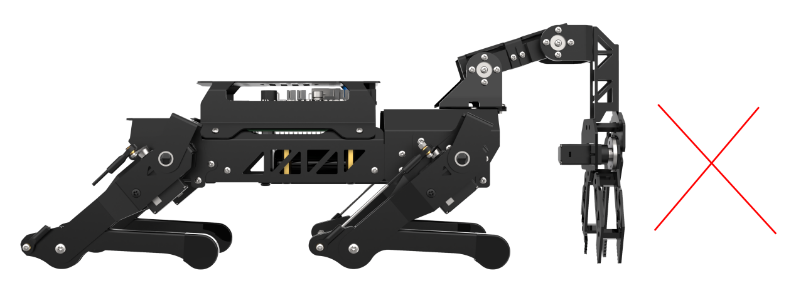

(2) Then, push the switch on the expansion board from "**OFF**" to "**ON**". After powering on, the digital display at the tail of the robot dog will show the current battery level (it lights up at 8V as pictured). when the battery level is below 6.8V, the battery needs to be charged as soon as possible. LED1 and LED2 will emit a faint blue light. After a short wait, LED1 will stay on continuously, and LED2 will blink every two seconds, indicating that the network configuration is ready. Finally, wait for a "**beep**" from the buzzer, indicating that the ROS configuration is complete and the device has successfully started.

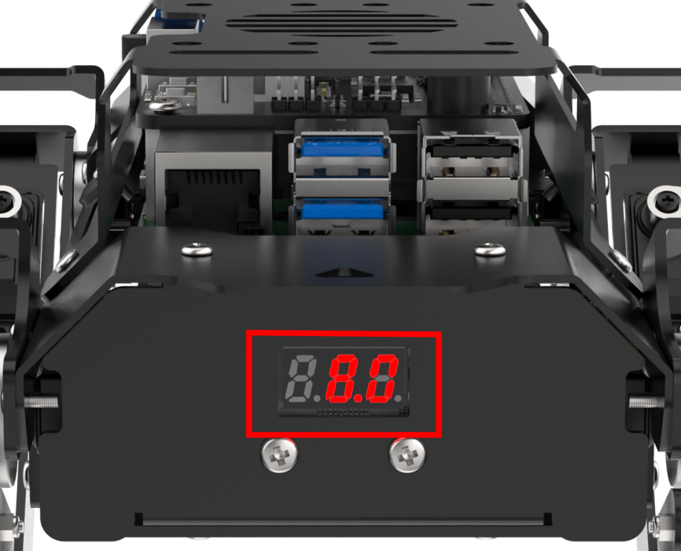

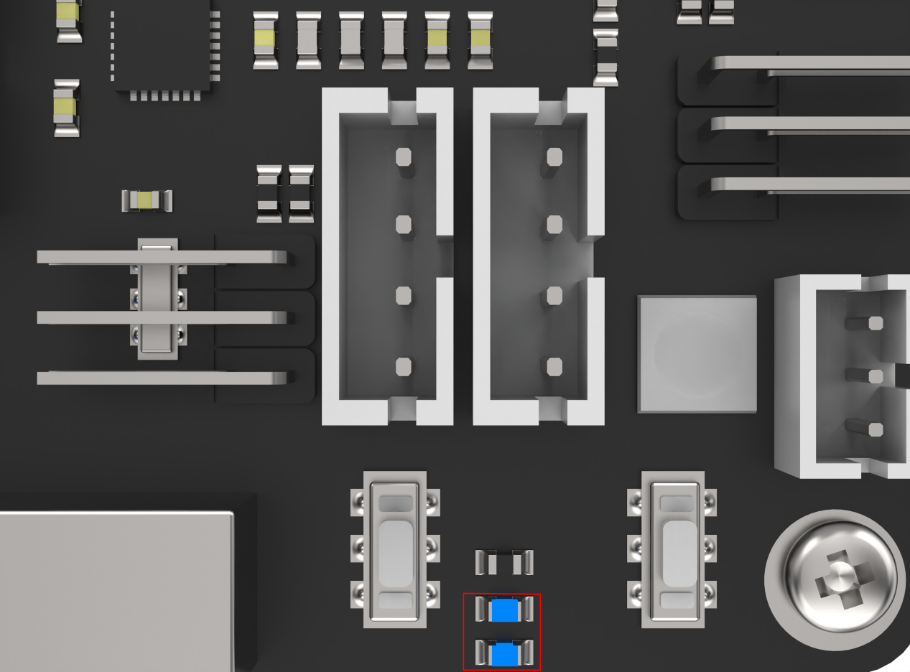

(3) The device defaults to AP direct connection mode out of the factory. After successful boot-up, it will generate a hotspot starting with **"HW"**.


## 28.2 Use of PC Software

### 28.2.1 Open the PC Software

* **Start device via desktop icons (recommended for beginners)**

(1) Double-click the desktop icon .

(2) Click **"Execute"** option in the pop-up prompt window to open the PC software.


* **Start device via command line**

(1) Click on the icon  at the top left corner of the desktop, or use the shortcut "**Ctrl+Alt+T**" to open the command line terminal.

(2) Input the following command and press Enter to open the PC software.

```bash
python3 /home/ubuntu/software/puppypi_control/PuppyPi.py
```

### 28.2.1 Usage Introduction of PC

After the upper computer successfully starts, when we select the option **"Robotic Arm"** in normal mode, the corresponding control area for the robotic arm servos will appear on the interface.

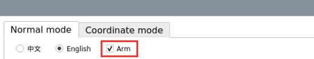

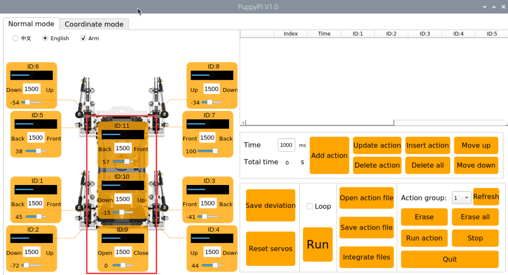

The servos ID9, ID10, and ID11 correspond to the three servos of the robotic arm.

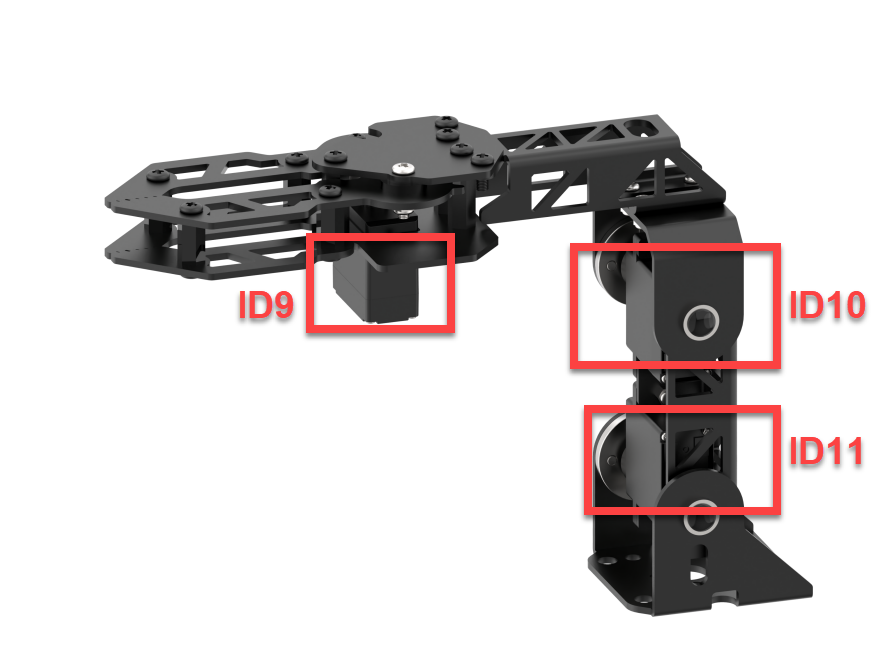

The interface in normal mode can be divided into four parts: servo control area, action details list, action group settings area, and deviation settings area.

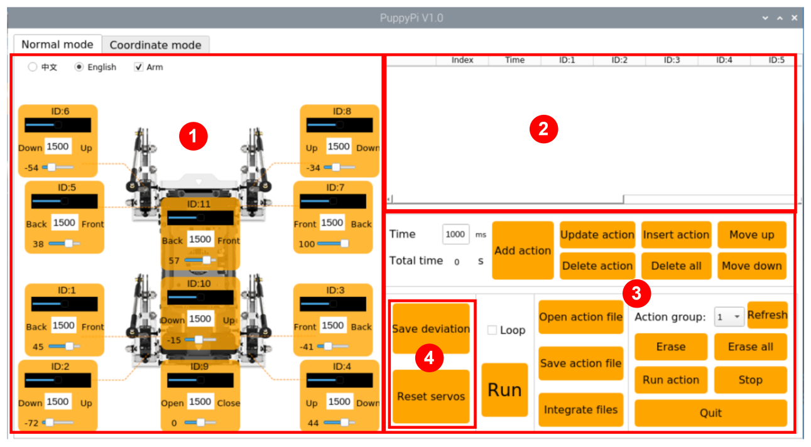

(1) servo control area

You can adjust the posture of the PuppyPi by adjusting the values corresponding to the respective servos.

| **Icon** | **Function** |
|:--:|:--:|
|  | Servo ID number. |
|  | The range of values used to adjust the angle position of the servo is from 500 to 2500. |
|  | The range of values used to adjust the servo deviation is from -100 to 100. |

(2) action details list

You can check the execution time and servo parameter of actions in the action details list.

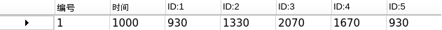

| **Icon** | **Function** |
|:--:|:--:|
| 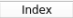 | Action number. |
|  | Action running time refers to the time taken to execute the action. |
|  | You can double-click on the numerical value corresponding to the ID servo to modify it. |
|  | Run the currently selected action. |

(3) action group setting area

| **Icon** | **Function** |
|:--:|:--:|
| 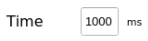 | The time required to run a single action can be directly modified within the corresponding box. |
| 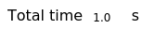 | The time required to run the entire action group. |
| 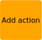 | Add the current servo values from the servo control area as a new action to the last row of the action details list. |
|  | Replace the servo parameters of the selected action in the action details list with the current servo values from the servo control area, and replace the action runtime with the set value of "**action time**". |
|  | Insert a new action above the selected action in the action details list. Set the servo parameters to the values from the servo control area, and set the action time to the value of "**action time**". |
|  | Swap the selected action in the action details list with the action above it. |
| 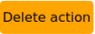 | Delete the selected action from the action details list. |
|  | Delete all the action from the action details list. |
|  | Swap the selected action in the action details list with the action below it. |
| 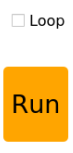 | Run the selected action in the action details list once. Check "**loop**" to indicate looping the action. |
|  | Open the action group file required for the action group. |
|  | Save the action of the action details list to the specified position. |
|  | By clicking the "**Open Action File**" button to open one action group, and then clicking this button again to open another action group, you can link them together. |
| 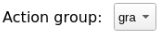 | The saved action groups can be displayed in the PC software. |
|  | Refresh the selected action group. |
|  | Delete the currently selected action group file. |
|  | (Caution) Delete all action group files. |
|  | Execute the selected action group once. |
|  | Stop the currently running action group. |
|  | Exit PC software interface. |

:::{Note}

All action group files are uniformly saved to the directory `/home/ubuntu/software/puppypi_control/ActionGroups`.

:::

**(4) Deviation setting area (The PuppyPi robot dog has been calibrated for deviation before leaving the factory. The functionality of this area's buttons is provided for informational purposes only.)**

| **Icon** | **Function** |
|:--:|:--:|
| 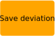 | Save the adjusted deviation to the PuppyPi. |
| 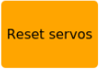 | Restore all servo values in the servo control area to 1500. |

### 28.2.3 Robotic Arm Deviation Adjustment

:::{Note}

PuppyPi has already been adjusted for deviation before leaving the factory, so users not need to adjust it again. However, if any changes occur due to replacing servos or other operations, it may be necessary to recalibrate the deviation.

:::

If the robotic arm on the PuppyPi is perpendicular to the body part, the two links of the robotic arm are in a right-angle position, and the gripper is properly closed, then no deviation adjustment is needed. As shown in the diagram below:

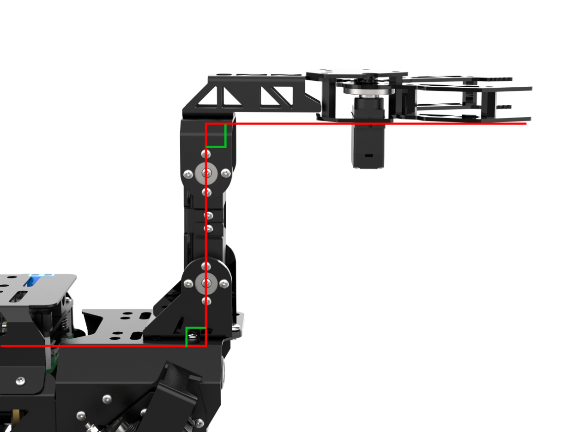

If a situation like the one shown in the diagram below occurs, deviation adjustment is required.

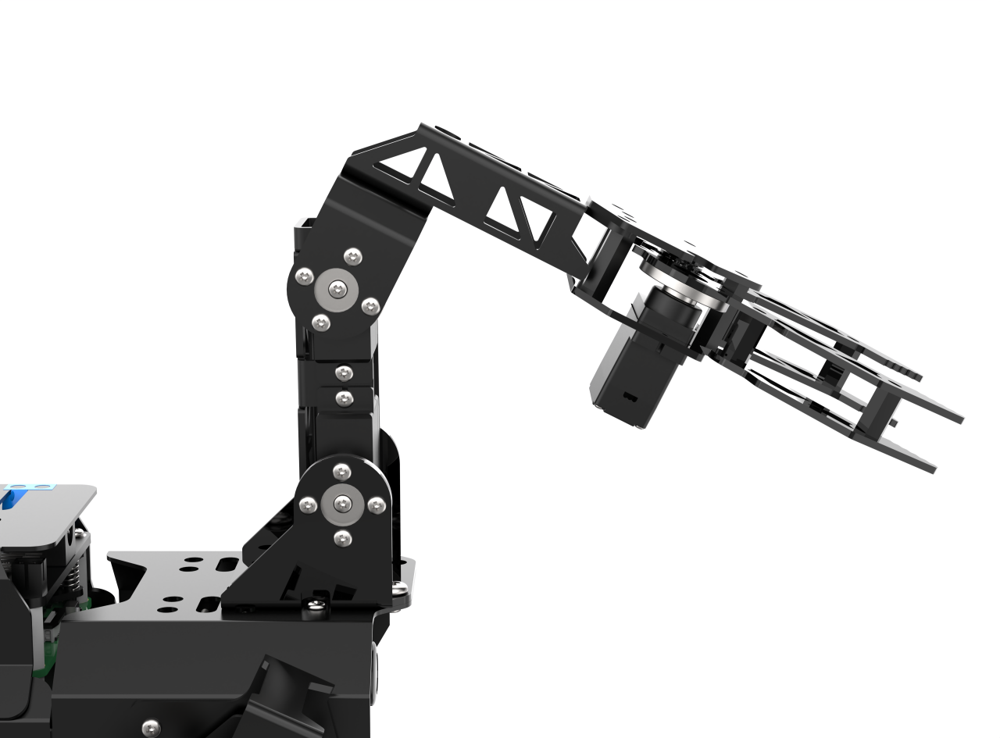

* **Causes of deviation**

Deviation typically occurs under the following circumstances:

(1) When the servos is in the middle position, rotating the servo shaft angle during servo horn installation causes an angle deviation from the initial position (the factory default servo angle is the middle position).

(2) If the servo horn is installed without rotating the shaft angle, but there is a slight offset in the direction or angle fixed to the support bracket, it results in minor deviation. In addition, deviation values within 100 (i.e., within 30°) are considered within the normal adjustable range. If the deviation is larger, exceeding 100, it cannot be adjusted through software. In this case, the servo shaft screw with significant deviation needs to be removed, adjusted to the correct orientation, and then reinstalled.

* **Adjustment method**

This lesson will use adjusting servo 10 as an example for calibration. The "**Reset Servos**" operation has been performed.


(1) In "**Normal Mode**", check "**Robotic Arm**" to observe the posture of each servo in the robotic arm. You can see the deviation value that needs to be adjusted for servo 10.

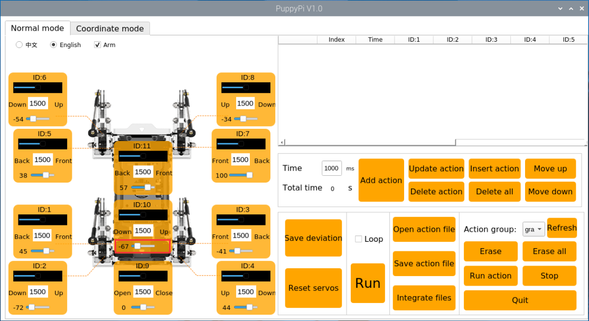

(2) The PC software will automatically read the deviation. Then, based on the actual servo situation, click on the small slider below the ID10 servo icon to make the two links of the robotic arm perpendicular to each other. You can click the left mouse button multiple times or scroll the mouse wheel to fine-tune the slider value.

(3) After adjustment, click on **"Save Deviation"**, then click **"OK"** to save the deviation to the control board.

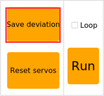

## 28.3 Color Recognition Gripping

### 28.3.1 Program Logic

First, subscribe to the topic messages published by the camera node to obtain real-time image data. Then, convert the RGB color space to grayscale and read the camera's intrinsic parameters.

Next, perform thresholding, erosion, and dilation on the image to obtain the largest contour of the target color within the image, and outline the detected color.

Finally, control the PuppyPi to perform feedback actions. When red is detected, control the robot to perform the "**grasping**" action.

<p id="anchor_28_3_2"></p>
 
### 28.3.2 Operation Steps

:::{Note}

Command input must strictly differentiate between uppercase and lowercase letters as well as spaces.

:::

(1) Turn on PuppyPi, and connect it to Raspberry Pi desktop via VNC.

(2) Click the icon  on the upper left corner to open the Terminator terminal.

(3) Input the following command and press Enter to close auto-start program.

```bash
sudo ./.stop_ros.sh
```

(4) Input the following command and press Enter start robotic arm game.

```bash
cd ros2_ws/src/example/example/puppy_with_arm
```

(5) Open the new terminal. Input color recognition command and press Enter to start the program.

```bash
ros2 launch color_detect_launch.py
```

(6) To close this program, press "**Ctrl+C**" in the LX terminal interface. If closing fails, try pressing multiple times.

(7) After closing the program, you still need to enter the following command and press Enter to start the key detection service.

```bash
sudo systemctl restart button_scan.service
```

### 28.3.3 Program Outcome

:::{Note}

After starting the game, please ensure that there are no other objects with the recognized color within the field of view of the camera, to avoid affecting the implementation effect of the game.

:::

After starting the game, place the color block in front of PuppyPi. When the color block is recognized, it will be identified with a circle in the corresponding color, and the color name will be printed in the center of the window. The program can recognize color blocks of "**red, blue and green**", but only performs "**grasping**" operation on red color blocks.

:::{Note}

If the color recognition is inaccurate, please refer to "[**20. ROS2-AI Vision and Tracking Course -> 20.1 Color Threshold Adjustment**](https://docs.hiwonder.com/projects/PuppyPi/en/latest/docs/27.ros2_ai_vision_and_tracking.html#color-threshold-adjustment)" for adjustment.

:::


###  28.3.4 Program Analysis

:::{Note}

Before making any program modifications, it is essential to backup the original factory program. Avoid directly modifying the source code files to prevent accidentally changing parameters in the wrong way, leading to robot malfunctions that cannot be repaired!

:::

According to the game effect, here is the logical process of this game as pictured:


- **launch file analysis**

  During the execution of the functionality, the launch file of the current package will be started (color_detect_with_arm.launch) as pictured:


From the above diagram, it can be seen that the node name for this game functionality is "**color_detect_with_arm**," and this node is located in the package "**puppy_with_arm**." The node displays the processed information through the terminal.

Finally, the color recognition and gripping function is executed by calling the source code file "**color_detect_with_arm.py**".

- **Source code program analysis**

The source code of this program is stored at : [ros2_ws/src/example/example/puppy_with_arm/include/color_detect_with_arm.py](../_static/source_code/ros2/color_detect_with_arm.zip).

- **Imported Libraries**

(1) Several Python libraries are imported, including:

`yaml`  for YAML file parsing.

`cv2`  (OpenCV library) for image processing.

`numpy` and `math` for numerical computations.

(2) ROS 2-related libraries include:

`rclpy` for ROS2 client library.

`sensor_msgs` and `ros_robot_controller_msgs` for message handling.

The `cv_bridge` library is used for image data conversion between ROS and OpenCV.

- **Node Initialization**

(1) Class Definition:

class ColorDetectWithArm(Node): Defines a class that inherits from Node, representing a ROS 2 node.

(2) Constructor Method:

def \_\_init\_\_(self): The constructor initializes the node with the name color_detect_with_arm.

self.bridge = CvBridge(): Instantiates a CvBridge object to facilitate conversions between ROS image messages and OpenCV image formats.

- **YAML Configuration File Storage Path**

yaml_file_path = '/home/ubuntu/software/lab_tool/lab_config.yaml': Define the YAML color threshold configuration

- **Creating Publishers and Subscribers**

The program subscribes to the /image_raw topic to receive image messages, which are processed by the image_callback function.

A motion control service client and a buzzer publisher are also created.

Execution Flow:

During execution, the program first performs an initial motion operation.

It then enters a loop, waiting to process incoming image messages.

If an exception occurs, the program logs the message: "**Shutting down**".

Overall Functionality:

The program implements image processing and robot motion control within the ROS 2 environment.

{lineno-start=45}
  
```python
        # 创建发布者和服务客户端
        self.buzzer_pub = self.create_publisher(BuzzerState, '/ros_robot_controller/set_buzzer', 1)
        self.runActionGroup_srv = self.create_client(SetRunActionName, '/puppy_control/runActionGroup')

        # 创建图像订阅
        self.create_subscription(Image, '/image_raw', self.image_callback, 10)
        # 使用定时器定期调用 move 函数
        self.create_timer(1.0, self.move)
```

(1) A subscription is created using the create_subscription method to handle camera information.

{lineno-start=50}

```python
        self.create_subscription(Image, '/image_raw', self.image_callback, 10)
```

The first parameter, `'/image_raw'`, specifies the topic name for receiving image data.

The second parameter, `Image`, defines the message type.

The third parameter assigns the image_callback function to process the received image data.

(2) Creating a Publisher for the Buzzer: A publisher named buzzer_pub is created using the create_publisher method to control the buzzer.

{lineno-start=47}

```
        self.buzzer_pub = self.create_publisher(BuzzerState, '/ros_robot_controller/set_buzzer', 1)
```

The first parameter, `/ros_robot_controller/set_buzzer`, specifies the topic name for buzzer control.

The second parameter, `BuzzerState`, defines the message type.

The third parameter, `queue_size=1`, sets the size of the message queue.

- **image_callback Callback Function**

Below is a code snippet from the image_callback function:

{lineno-start=149}

```
    def image_callback(self, ros_image):
        try:
            cv2_img = self.bridge.imgmsg_to_cv2(ros_image, "bgr8")
            cv2_img = cv2.flip(cv2_img, 1)
            frame_result = self.run(cv2_img)
            cv2.imshow('Frame', frame_result)
            cv2.waitKey(1)
        except Exception as e:
            self.get_logger().error(f"Failed to process image: {e}")
```

The  `image_callback`  function is defined to process incoming ROS image messages.

It converts the ROS image messages into OpenCV format, performs image flipping, and displays the processed result.

- **Run Image Processing Function**

Below is a code snippet from the  `run`  function:

{lineno-start=97}
  
```
    def run(self, img):
        size = (320, 240)
        img_copy = img.copy()
        img_h, img_w = img.shape[:2]

        frame_resize = cv2.resize(img_copy, size, interpolation=cv2.INTER_NEAREST)
        frame_gb = cv2.GaussianBlur(frame_resize, (3, 3), 3)
        frame_lab = cv2.cvtColor(frame_gb, cv2.COLOR_BGR2LAB)

        max_area = 0
        color_area_max = None
        areaMaxContour_max = 0

        if self.action_finish:
            for i in self.color_range_list:
                if i in ['red', 'green', 'blue']:
                    frame_mask = cv2.inRange(frame_lab, np.array(self.color_range_list[i]['min']), np.array(self.color_range_list[i]['max']))
                    eroded = cv2.erode(frame_mask, cv2.getStructuringElement(cv2.MORPH_RECT, (3, 3)))
                    dilated = cv2.dilate(eroded, cv2.getStructuringElement(cv2.MORPH_RECT, (3, 3)))
                    dilated[0:120, :] = 0
                    dilated[:, 0:80] = 0
                    dilated[:, 240:320] = 0
                    contours = cv2.findContours(dilated, cv2.RETR_EXTERNAL, cv2.CHAIN_APPROX_NONE)[-2]
                    areaMaxContour, area_max = self.get_area_max_contour(contours)

                    if areaMaxContour is not None and area_max > max_area:
                        max_area = area_max
                        color_area_max = i
                        areaMaxContour_max = areaMaxContour

            if max_area > 4000:
                ((centerX, centerY), radius) = cv2.minEnclosingCircle(areaMaxContour_max)
                centerX = int(Misc.map(centerX, 0, size[0], 0, img_w))
                centerY = int(Misc.map(centerY, 0, size[1], 0, img_h))
                radius = int(Misc.map(radius, 0, size[0], 0, img_w))
                cv2.circle(img, (centerX, centerY), radius, self.draw_color, 2)
                print(f"Detected Color: {color_area_max}, Center: ({centerX}, {centerY}), Radius: {radius}")
                
                self.detect_color = color_area_max
                self.draw_color = (0, 0, 255) if color_area_max == 'red' else (0, 255, 0)
            else:
                print("No valid color detected")

        cv2.rectangle(img, (190, 270), (450, 480), (0, 255, 255), 2)
        if self.detect_color == self.target_color:
            cv2.putText(img, "Target Color", (225, 250), cv2.FONT_HERSHEY_SIMPLEX, 1, self.draw_color, 2)
        else:
            cv2.putText(img, "Not Target Color", (200, 250), cv2.FONT_HERSHEY_SIMPLEX, 1, self.draw_color, 2)

        cv2.putText(img, "Color: " + self.detect_color, (225, 210), cv2.FONT_HERSHEY_SIMPLEX, 1, self.draw_color, 2)
        return img
```

The function first preprocesses the image, including resizing and applying Gaussian blur.

Then, based on predefined color ranges, it identifies color regions in the image and marks them using the minimum enclosing circle.

Next, the function compares the detected color regions with the target color, and displays corresponding text on the image based on the match.

The overall logic involves using image processing and color matching to detect and mark the target color regions, then displaying the results.

(1) Image Preprocessing:

The image is preprocessed by resizing, applying Gaussian blur, and converting RGB colors to the LAB color space.

{lineno-start=99}

```
        img_copy = img.copy()
        img_h, img_w = img.shape[:2]

        frame_resize = cv2.resize(img_copy, size, interpolation=cv2.INTER_NEAREST)
        frame_gb = cv2.GaussianBlur(frame_resize, (3, 3), 3)
        frame_lab = cv2.cvtColor(frame_gb, cv2.COLOR_BGR2LAB)
```

(2) Color Range Masking:

Iterates through the  `color_range_list`  (containing red, green, and blue ranges).

Performs masking on the image based on the specified color ranges.

{lineno-start=110}

```
        if self.action_finish:
            for i in self.color_range_list:
                if i in ['red', 'green', 'blue']:
                    frame_mask = cv2.inRange(frame_lab, np.array(self.color_range_list[i]['min']), np.array(self.color_range_list[i]['max']))
                    eroded = cv2.erode(frame_mask, cv2.getStructuringElement(cv2.MORPH_RECT, (3, 3)))
                    dilated = cv2.dilate(eroded, cv2.getStructuringElement(cv2.MORPH_RECT, (3, 3)))
```

(3) Contour Detection

After masking, the image undergoes erosion and dilation operations.

The image is cropped, and the  `getAreaMaxContour()`  function is called to detect contours.

Identifies the largest contour and its associated color.

{lineno-start=112}

```
                if i in ['red', 'green', 'blue']:
                    frame_mask = cv2.inRange(frame_lab, np.array(self.color_range_list[i]['min']), np.array(self.color_range_list[i]['max']))
                    eroded = cv2.erode(frame_mask, cv2.getStructuringElement(cv2.MORPH_RECT, (3, 3)))
                    dilated = cv2.dilate(eroded, cv2.getStructuringElement(cv2.MORPH_RECT, (3, 3)))
                    dilated[0:120, :] = 0
                    dilated[:, 0:80] = 0
                    dilated[:, 240:320] = 0
                    contours = cv2.findContours(dilated, cv2.RETR_EXTERNAL, cv2.CHAIN_APPROX_NONE)[-2]
                    areaMaxContour, area_max = self.get_area_max_contour(contours)
```

(4) Filtering and Circle Drawing:

Calculates the pixel area of the contour, filtering out areas smaller than 8500 to ensure only target color blocks are identified.

Uses the `cv2.minEnclosingCircle()` function to find the smallest enclosing circle for the largest contour, obtaining its center `(centerX, centerY)` and radius.

Draws the circle on the image using `cv2.circle()` with the corresponding color.

{lineno-start=127}

```
            if max_area > 4000:
                ((centerX, centerY), radius) = cv2.minEnclosingCircle(areaMaxContour_max)
                centerX = int(Misc.map(centerX, 0, size[0], 0, img_w))
                centerY = int(Misc.map(centerY, 0, size[1], 0, img_h))
                radius = int(Misc.map(radius, 0, size[0], 0, img_w))
                cv2.circle(img, (centerX, centerY), radius, self.draw_color, 2)
                print(f"Detected Color: {color_area_max}, Center: ({centerX}, {centerY}), Radius: {radius}")
                
                self.detect_color = color_area_max
                self.draw_color = (0, 0, 255) if color_area_max == 'red' else (0, 255, 0)
            else:
                print("No valid color detected")
```

(4) Displaying Detected Color:

Compares the detected color `(detect_color)` with the target color ` (target_color`)`.

Displays text on the image using `cv2.putText()` in the format `"Color: " + detect_color`.

Text is placed at `(225, 210)`, with font  `cv2.FONT_HERSHEY_SIMPLEX` , size `1`, color  `draw_color`, and thickness `2`.

Returns the processed image.

{lineno-start=140}

```
        cv2.rectangle(img, (190, 270), (450, 480), (0, 255, 255), 2)
        if self.detect_color == self.target_color:
            cv2.putText(img, "Target Color", (225, 250), cv2.FONT_HERSHEY_SIMPLEX, 1, self.draw_color, 2)
        else:
            cv2.putText(img, "Not Target Color", (200, 250), cv2.FONT_HERSHEY_SIMPLEX, 1, self.draw_color, 2)

        cv2.putText(img, "Color: " + self.detect_color, (225, 210), cv2.FONT_HERSHEY_SIMPLEX, 1, self.draw_color, 2)
        return img
```

- **`move` Function Execution**

Below is a code snippet of the `move` function:

{lineno-start=68}

```
    def move(self):
        if self.detect_color == self.target_color:
            msg = BuzzerState()
            msg.freq = 1900
            msg.on_time = 0.1
            msg.off_time = 0.9
            msg.repeat = 1
            self.buzzer_pub.publish(msg)

            self.action_finish = False
            time.sleep(0.8)

            req = SetRunActionName.Request()
            req.name = 'grab.d6a'
            self.runActionGroup_srv.call_async(req)
            time.sleep(0.5)
            self.set_servo_pulse(9, 1200, 300)
            time.sleep(0.3)
            self.set_servo_pulse(9, 1500, 300)

            req.name = 'look_down.d6a'
            self.runActionGroup_srv.call_async(req)
            time.sleep(0.8)
            
            self.detect_color = 'None'
            self.draw_color = (255, 255, 0)

        self.action_finish = True
```

Based on the match between the detected color and the target color, the robot performs the corresponding actions.

If the color matches (e.g., red), a 0.1-second buzzer signal is sent using  `buzzer_pub.publish(0.1)`.

The robot then executes a series of actions (e.g., grasping and placing).

Afterward, the detected color is reset to "**None**".

If the color does not match, the action sequence is not executed.

- **getAreaMaxContour Function**

Below is a code snippet from the `getAreaMaxContour` function:

{lineno-start=159}

```
    def get_area_max_contour(self, contours):
        contour_area_max = 0
        area_max_contour = None
        for c in contours:
            contour_area_temp = math.fabs(cv2.contourArea(c))
            if contour_area_temp > contour_area_max:
                contour_area_max = contour_area_temp
                if contour_area_temp > 50:
                    area_max_contour = c
        return area_max_contour, contour_area_max
```

The function finds the largest contour from a set of contours.

It iterates through all the contours, calculates their areas, and retains the one with the largest area.

During area calculation, a condition is added to only consider contours with an area greater than or equal to 50, filtering out smaller, irrelevant contours.

Finally, the function returns the largest contour and its corresponding area.

### 28.3.5 Function Extension

When recognizing red, PuppyPi executes action of **"gripping"** and **"placing"** color block. To change to color to be detected, such as the **"green"** color block, follow these steps:

(1) Input the following command to edit color recognition gripping program. Then press Enter.

```
vi ros2_ws/src/example/example/puppy_with_arm/color_detect_with_arm.py
```

(2) Find the code as pictured:


:::{Note}

After entering the code position number on the keyboard, press the **"Shift+G"** keys to directly navigate to the corresponding position. The code position number shown in the illustration is for reference only, please refer to the actual position.

:::

(3) Press **"i"** to go to the editing mode. And change **"red"** to **"green"**.


(4) After modification, press Esc and input **":wq"**. Then press Enter to save and exit.

```
:wq
```

(5) Refer to "[**28.3.2 Operation Steps**](#anchor_28_3_2)" to restart the program to check the modified game effects.

## 28.4 Auto Recognition Gripping

### 28.4.1 Program Logic

First, subscribe to the topic messages published by the camera node to obtain real-time image data. Then, convert the RGB color space to grayscale and read the camera's intrinsic parameters.

Next, perform thresholding, erosion, and dilation on the image to obtain the largest contour of the target color within the image, and outline the detected color.

Then, control the PuppyPi to perform feedback actions. When red is detected, control the robot to perform the "**grasping**" action.

Finally, PuppyPi moves forward and then turns left to search for the red placement point. When red is detected, control the robot to perform the "**placement**" action, placing the color block at the red placement point.

<p id="anchor_28_4_2"></p>

### 28.4.2 Operation Steps

Instructions must be entered with strict attention to case sensitivity and spacing.

(1) Turn on PuppyPi, and connect it to Raspberry Pi desktop via VNC.

(2) Click the icon  on the upper left corner to open the Terminator ROS2 terminal, and enter the following command to access the target file.

```
cd ros2_ws/src/example/example/puppy_with_arm/include
```

(3) Click-on the below icon to start the LX terminal, and input the following command:

```
sudo systemctl stop button_scan.service
```


(4) Return to the original ROS 2 terminal and enter the command to start the operation.

```
python3 color_grab.py
```

(5) Pressing KEY1 on the Raspberry Pi expansion board starts autonomous recognition and grasping, while pressing KEY2 can pause the game.


(5) If you need to close this game, you can press "**Ctrl+C**" in the LX terminal interface. If closing fails, you can try pressing multiple times.

(6) After closing the game, you also need to enter the following command and press Enter to start the app auto-start service.

```
sudo systemctl restart start_node.service
```

After the startup is completed, the buzzer will emit a short beep sound **'beep'**.

:::{Note}

If the app auto-start service is not enabled, it will affect the normal implementation of the corresponding gameplay in the app. If the command is not entered for auto-start, restarting the robot dog will also restart the app auto-start service.

:::

(7) Additionally, input the following command and press Enter to open the button detection service.

```
sudo systemctl restart button_scan.service
```

### 28.4.3 Program Outcome

After the game is initiated, the recognized red color block will be outlined in the feedback screen. PuppyPi will move towards the color block, grasp it, take a small step forward after grasping, then turn left, and proceed to search for the placement point. Here, we use a red box as the placement point (you can choose according to your preference). Once the red box is found, the color block will be placed inside the box.

:::{Note}

If the color recognition is inaccurate, please refer to "[**20. ROS2-AI Vision and Tracking Course -> 20.1 Color Threshold Adjustment**](https://docs.hiwonder.com/projects/PuppyPi/en/latest/docs/27.ros2_ai_vision_and_tracking.html#color-threshold-adjustment)" for adjustment.

:::

If the gripping position is inaccurate, you can modify the parameter **block_center_point\[1\]** in the program. A larger value will move the gripper towards the rear, while a smaller value will move it towards the front. Adjusting this parameter will help to fine-tune the gripping position.

### 28.4.4 Program Analysis

- **launch file analysis**

The source code of this program is saved in the Docker container: [ros2_ws/src/example/example/puppy_with_arm/color_grab.py](../_static/source_code/ros2/color_grab.zip)

{lineno-start=1}

```python
from launch import LaunchDescription
from launch.actions import ExecuteProcess

def generate_launch_description():
    commands = []
    for i in range(5):  
        commands.append(
            ExecuteProcess(
                cmd=['sudo', 'chmod', '666', f'/dev/gpiochip{i}'],
                output='screen'
            )
        )
    
    return LaunchDescription(commands)

```

- **Source Code Analysis**

The source code of the program is located in the Docker container at: [/home/ubuntu/ros2_ws/src/example/example/puppy_with_arm/include/color_grab.py](../_static/source_code/ros2/color_grab.zip)

- **Import Related Application Library**

{lineno-start=4}

```python
import sys
import cv2
import time
import math
import threading
import numpy as np
from enum import Enum
from sdk.ArmMoveIK import ArmIK
from sdk import Misc
from sdk import Camera
from sdk import yaml_handle

import gpiod
```

(1) `sys` is used for handling command-line arguments and exiting the program.

(2) `cv2` is used for OpenCV image processing.

(3)  `math` is used for mathematical calculations.

(4) `time` is used for timing and delays.

(5) `threading` is used for implementing parallel processing.

(6) `ArmIK` is imported from `sdk.ArmMoveIK` for inverse kinematics control.

(7) The Raspberry Pi GPIO library is imported for GPIO control.

{lineno-start=19}
  
```python
sys.path.append('/home/ubuntu/software/puppypi_control/') 
from servo_controller import setServoPulse
from action_group_control import runActionGroup, stopActionGroup
from puppy_kinematics import HiwonderPuppy, PWMServoParams

puppy = HiwonderPuppy(setServoPulse = setServoPulse, servoParams = PWMServoParams(), dof = '8')
```

The `setServoPulse` function is imported from the `ServoCmd` module. This indicates that the `ServoCmd` module contains a function named `setServoPulse`, which is used to control the pulse signal of the servo motor.

The `runActionGroup` and `stopActionGroup` functions are imported from the `ActionGroupControl` module. These functions can be used directly in the current code without needing to call them with the full module name.

The `HiwonderPuppy` class and the `PWMServoParams` class are imported from the `HiwonderPuppy` module. Instances of `HiwonderPuppy` and `PWMServoParams` are created in the current code, and their methods and properties are used.

- **Main program**

Initialize the stance and gait configurations by calling the `stance_config` and `gait_config` methods on the `puppy` object. Start the robot dog with `puppy.start()`. Set the Debug mode to determine whether the robot dog should move. Open the camera to capture images. In the main loop, continuously capture images and call the `run()` function for image processing. The overall logic is to complete the program environment initialization, image acquisition and display, and state machine control running loop. Use the Debug mode to decide whether to enable the robot for line following and object grasping tasks.

{lineno-start=320}

```python
if __name__ == '__main__':

    puppy.stance_config(stance(PuppyPose['stance_x'],PuppyPose['stance_y'],PuppyPose['height'],PuppyPose['x_shift']), PuppyPose['pitch'], PuppyPose['roll'])
    puppy.gait_config(overlap_time = GaitConfig['overlap_time'], swing_time = GaitConfig['swing_time']
                            , clearance_time = GaitConfig['clearance_time'], z_clearance = GaitConfig['z_clearance'])
    # overlap_time:4脚全部着地的时间，swing_time：2脚离地时间，z_clearance：走路时，脚抬高的距离(overlap_time: The time when all four feet touch the ground, swing_time: The time when two feet are off the ground, z_clearance: The height at which the feet are lifted during walking)

    puppy.start() # 启动(start)
    puppy.move_stop(servo_run_time = 500)

    AK.setPitchRangeMoving((8.51,0,3.3),500)
    setServoPulse(9,1500,500)
    time.sleep(0.5)
```

(1) Use `puppy.stance_config` to configure the stance of the robot dog's four legs in a stationary state.

{lineno-start=339}

```python
    puppy.stance_config(stance(PuppyPose['stance_x'],PuppyPose['stance_y'],PuppyPose['height'],PuppyPose['x_shift']), PuppyPose['pitch'], PuppyPose['roll'])
        time.sleep(0.5)
```

The first parameter `PuppyPose['stance_x']` indicates the additional separation distance of the four legs on the X-axis, in centimeters.

The second parameter `PuppyPose['stance_y']`indicates the additional separation distance of the four legs on the Y-axis, in centimeters.

The third parameter `PuppyPose['height']` indicates the height of the dog, which is the vertical distance from the tips of the feet to the leg pivot axis, in centimeters.

The fourth parameter `PuppyPose['x_shift']` represents the distance that all legs move in the same direction along the X-axis. The smaller the value, the more the dog leans forward while walking; the larger the value, the more it leans backward.

The fifth parameter `PuppyPose['pitch']` represents the pitch angle of the robot dog's body, in radians.

The sixth parameter `PuppyPose['roll']` represents the roll angle of the robot dog's body, in radians.

(1) Use `puppy.gait_config` to configure the parameters for the gait motion of the robot fog.

{lineno-start=322}

```python
    puppy.stance_config(stance(PuppyPose['stance_x'],PuppyPose['stance_y'],PuppyPose['height'],PuppyPose['x_shift']), PuppyPose['pitch'], PuppyPose['roll'])
    puppy.gait_config(overlap_time = GaitConfig['overlap_time'], swing_time = GaitConfig['swing_time']
                            , clearance_time = GaitConfig['clearance_time'], z_clearance = GaitConfig['z_clearance'])
    # overlap_time:4脚全部着地的时间，swing_time：2脚离地时间，z_clearance：走路时，脚抬高的距离(overlap_time: The time when all four feet touch the ground, swing_time: The time when two feet are off the ground, z_clearance: The height at which the feet are lifted during walking)
```

The first parameter `overlap_time` represents the time during which all four legs are simultaneously in contact with the ground.

The second parameter `swing_time` represents the time duration for a single leg to swing off the ground.

The third parameter `clearace_time` represents the time interval between the front and rear legs.

The fourth parameter `z_clearance` represents the height of the feet off the ground during the gait process.

(2) Start the robot dog, set its initial posture, and trigger the buzzer to sound.

{lineno-start=327}

```python
    puppy.start() # 启动(start)
    puppy.move_stop(servo_run_time = 500)

    AK.setPitchRangeMoving((8.51,0,3.3),500)
    setServoPulse(9,1500,500)
    time.sleep(0.5)
```

(3) Set the Debug variable to toggle between Running modes. If Debug is True, it's a non-real-time mode where only image processing is performed while the robot dog remains stationary. If Debug is False, it's a real-time mode where both image processing and robot dog line following and object grasping tasks are performed simultaneously.

{lineno-start=337}

```python
    if Debug:
        PuppyPose = Bend.copy()
        puppy.stance_config(stance(PuppyPose['stance_x'],PuppyPose['stance_y'],PuppyPose['height'],PuppyPose['x_shift']), PuppyPose['pitch'], PuppyPose['roll'])
        time.sleep(0.5)
        
    else:
        th.start() 
```

(4) Enter the real-time image processing loop. Capture images from the camera, run processing functions on the images, and display the processed images. Additionally, detect the states of two buttons to set the robot dog's state to start or stop. Continue looping until the user presses 'Crtl+C' to exit. Finally, close the camera and release resources.

{lineno-start=351}

```python
    while True:
        img = my_camera.frame
        if img is not None:
            frame = img.copy()
            Frame = run(frame)           
            cv2.imshow('Frame', Frame)
            key = cv2.waitKey(1)
            if key == 27:
                break
        else:
            time.sleep(0.01)

        if key1.get_value() == 0:
            time.sleep(0.05)
            if key1.get_value() == 0:
                puppyStatus = PuppyStatus.START
        if key2.get_value() == 0:
            time.sleep(0.05)
            if key2.get_value() == 0:
                puppyStatus = PuppyStatus.STOP
                stopActionGroup()
    my_camera.camera_close()
    cv2.destroyAllWindows()
```

- **stance function**

{lineno-start=312}

```python
def stance(x = 0.0, y = 0.0, z = -11.0, x_shift = 2.0):# 单位cm(unit: cm)
    # x_shift越小，走路越前倾，越大越后仰,通过调节x_shift可以调节小狗走路的平衡(the smaller the x_shift, the more forward-leaning the walk; the larger, the more backward-leaning. Adjusting x_shift can balance the robot dog's gait)
    return np.array([
                        [x + x_shift, x + x_shift, -x + x_shift, -x + x_shift],
                        [y, y, y, y],
                        [z, z, z, z],
                    ])#此array的组合方式不要去改变(please refrain from altering the combination of this array)
```

By changing the parameters within the function, describe the spatial relationship between the four limbs of the robot dog in various postures. The returned coordinate array serves as a reference for subsequent posture control and motion calculation modules.

- **getAreaMaxContour contour processing function**

By comparing the area of contours and filtering out those with an area less than 50, return the contour object along with its corresponding area value.

{lineno-start=218}

```python
def getAreaMaxContour(contours):
    contour_area_temp = 0
    contour_area_max = 0
    area_max_contour = None

    for c in contours:  # 历遍所有轮廓(iterate through all contours)
        contour_area_temp = math.fabs(cv2.contourArea(c))  # 计算轮廓面积(calculate the contour area)
        if contour_area_temp > contour_area_max:
            contour_area_max = contour_area_temp
            if contour_area_temp >= 5:  # 只有在面积大于300时，最大面积的轮廓才是有效的，以过滤干扰(only when the area is greater than 300, the contour with the maximal area is valid to filter the interference)
                area_max_contour = c

    return area_max_contour, contour_area_max  # 返回最大的轮廓(return the contour with the maximal area)
```

- **run image processing function**

{lineno-start=232}

```python
def run(img):
    
    global puppyStatus, block_center_point
    global block_color
    global color_list
    global Debug
    
    img_copy = img.copy()
    img_h, img_w = img.shape[:2]
    
    frame_resize = cv2.resize(img_copy, size, interpolation=cv2.INTER_NEAREST)
    frame_gb = cv2.GaussianBlur(frame_resize, (3, 3), 3)   
                       
    frame_lab_all = cv2.cvtColor(frame_gb, cv2.COLOR_BGR2LAB)  # 将图像转换到LAB空间(convert the image to LAB space)
    max_area = 0
    color_area_max = None    
    areaMaxContour_max = 0

    for i in lab_data:
        if i in ['red']:
            frame_mask = cv2.inRange(frame_lab_all,
                                            (lab_data[i]['min'][0],
                                            lab_data[i]['min'][1],
                                            lab_data[i]['min'][2]),
                                            (lab_data[i]['max'][0],
                                            lab_data[i]['max'][1],
                                            lab_data[i]['max'][2]))  #对原图像和掩模进行位运算(perform bitwise operation to original image and mask)
            eroded = cv2.erode(frame_mask, cv2.getStructuringElement(cv2.MORPH_RECT, (3, 3)))  #腐蚀(corrosion)
            dilated = cv2.dilate(eroded, cv2.getStructuringElement(cv2.MORPH_RECT, (3, 3))) #膨胀(dilation)
            
            contours = cv2.findContours(dilated, cv2.RETR_EXTERNAL, cv2.CHAIN_APPROX_NONE)[-2]  #找出轮廓(find out the contour)
            areaMaxContour, area_max = getAreaMaxContour(contours)  #找出最大轮廓(find out the contour with the maximal area)
            if areaMaxContour is not None:
                if area_max > max_area:#找最大面积(find the maximal area)
```

Firstly, preprocess the image by resizing and applying Gaussian blur. Then, identify lines in different ROI regions based on predefined color ranges, calculate the center point positions of the line contours, compute the parameters of the circumscribed circles of the largest area color blocks in the image, determine the recognition status, output different recognition results, and display them in the image. The overall logic involves color recognition and contour extraction from the image, calculating key points of lines, and controlling robot dog movement based on recognition results.

(1) Preprocess the image, including resizing and applying Gaussian blur.

{lineno-start=242}

```python
    frame_resize = cv2.resize(img_copy, size, interpolation=cv2.INTER_NEAREST)
    frame_gb = cv2.GaussianBlur(frame_resize, (3, 3), 3)  
```

(2) Segment the preprocessed image ROI into three regions: upper, middle, and lower. Convert the RGB color of the image blocks in these three regions to the LAB color space, and perform bitwise operations with the mask.

{lineno-start=250}

```python
    for i in lab_data:
        if i in ['red']:
            frame_mask = cv2.inRange(frame_lab_all,
                                            (lab_data[i]['min'][0],
                                            lab_data[i]['min'][1],
                                            lab_data[i]['min'][2]),
                                            (lab_data[i]['max'][0],
                                            lab_data[i]['max'][1],
                                            lab_data[i]['max'][2]))  #对原图像和掩模进行位运算(perform bitwise operation to original image and mask)
```

(3) After the mask operation, perform opening and closing operations on the image using mathematical morphology. Extract the outer contours of the targets using the `cv2.findContours()` function, and call the  `getAreaMaxContour()` function to detect contours, filtering out those with smaller areas.

{lineno-start=259}

```python
            eroded = cv2.erode(frame_mask, cv2.getStructuringElement(cv2.MORPH_RECT, (3, 3)))  #腐蚀(corrosion)
            dilated = cv2.dilate(eroded, cv2.getStructuringElement(cv2.MORPH_RECT, (3, 3))) #膨胀(dilation)
            
            contours = cv2.findContours(dilated, cv2.RETR_EXTERNAL, cv2.CHAIN_APPROX_NONE)[-2]  #找出轮廓(find out the contour)
            areaMaxContour, area_max = getAreaMaxContour(contours)  #找出最大轮廓(find out the contour with the maximal area)
```

(4) Find the contours of color blocks in the image and filter out those with a maximum contour area less than 200 to improve recognition accuracy. Finally, use the `cv2.circle()` function to draw the minimum enclosing circle on the image with a yellow color.

{lineno-start=259}

```python
            eroded = cv2.erode(frame_mask, cv2.getStructuringElement(cv2.MORPH_RECT, (3, 3)))  #腐蚀(corrosion)
            dilated = cv2.dilate(eroded, cv2.getStructuringElement(cv2.MORPH_RECT, (3, 3))) #膨胀(dilation)
            
            contours = cv2.findContours(dilated, cv2.RETR_EXTERNAL, cv2.CHAIN_APPROX_NONE)[-2]  #找出轮廓(find out the contour)
            areaMaxContour, area_max = getAreaMaxContour(contours)  #找出最大轮廓(find out the contour with the maximal area)
            if areaMaxContour is not None:
                if area_max > max_area:#找最大面积(find the maximal area)
                    max_area = area_max
                    color_area_max = i
                    areaMaxContour_max = areaMaxContour
    if max_area > 200:  # 有找到最大面积(the maximal area is found)
        ((centerX, centerY), radius) = cv2.minEnclosingCircle(areaMaxContour_max)  # 获取最小外接圆(get the minimum circumcircle)
        centerX = int(Misc.map(centerX, 0, size[0], 0, img_w))
        centerY = int(Misc.map(centerY, 0, size[1], 0, img_h))
        radius = int(Misc.map(radius, 0, size[0], 0, img_w))  
        block_center_point = (centerX,centerY) 
```

(5) Differentiate the largest color block based on color, marking them as 1 (red), 2 (green), or 3 (blue), and assign the result to `block_color`. Then, check if  `weight_sum`  is not equal to 0. If it is, draw the center point of the image based on the calculated center point coordinates. Finally, return the processed image based on the values of  `block_center_point`  and  `line_centerx`.

{lineno-start=281}

```python
        if color_area_max == 'red':  #红色最大(red is the maximal area)
            color = 1
        elif color_area_max == 'green':  #绿色最大(green is the maximal area)
            color = 2
        elif color_area_max == 'blue':  #蓝色最大(blue is the maximal area)
            color = 3
        else:
            color = 0
        color_list.append(color)

        if len(color_list) == 3:  #多次判断(multiple judgements)
            # 取平均值(take average value)
            color = int(round(np.mean(np.array(color_list))))
            color_list = []
            if color == 1:
                block_color = 'red'
                
            elif color == 2:
                block_color = 'green'
                
            elif color == 3:
                block_color = 'blue'
                
            else:
                block_color = 'None'
                
    else:
        block_color = 'None'

    return img
```

- **move execution action function**

During the startup phase (PuppyStatus.START), the robot dog stops moving and initializes its posture. In the normal forward phase (PuppyStatus.NORMAL), the robot dog's movement direction and speed are controlled based on the position relationship between the image center point and the color block center point. If a red color block is detected (PuppyStatus.FOUND_TARGET), execute the grasping action, and then turn the robot dog to the left for a certain distance. During the placing phase (PuppyStatus.PLACE), start searching for red placing points. If a red placing point is found, execute the placing action.

{lineno-start=91}

```python
def move():
    global line_centerx, puppyStatus, puppyStatusLast, block_center_point
    global block_color

    while True:
        while(puppyStatus == PuppyStatus.START) :  # 启动阶段，初始化姿态(startup stage, initialize the posture)
            
            puppy.move_stop(servo_run_time = 500)
            PuppyPose = Bend.copy()
            puppy.stance_config(stance(PuppyPose['stance_x'],PuppyPose['stance_y'],PuppyPose['height'],PuppyPose['x_shift']), PuppyPose['pitch'], PuppyPose['roll'])
            time.sleep(0.5)
            
            puppyStatus = PuppyStatus.NORMAL
            break

        while(puppyStatus == PuppyStatus.NORMAL) : # 
            
            if block_center_point[1] > 355 and block_center_point[1] < 370 and block_color == 'red' and abs(block_center_point[0] - img_centerx) < 50: # 已经发现目标物块,只有物块在线上才满足(target object has been found, it is considered valid only when the block is on the line)
                puppyStatus = PuppyStatus.FOUND_TARGET
                puppy.move_stop(servo_run_time = 500)
                time.sleep(0.5)
                break
```

- **getAreaMaxContour function**

Here is a screenshot of the code for the getAreaMaxContour function:

{lineno-start=218}

```python
def getAreaMaxContour(contours):
    contour_area_temp = 0
    contour_area_max = 0
    area_max_contour = None

    for c in contours:  # 历遍所有轮廓(iterate through all contours)
        contour_area_temp = math.fabs(cv2.contourArea(c))  # 计算轮廓面积(calculate the contour area)
        if contour_area_temp > contour_area_max:
            contour_area_max = contour_area_temp
            if contour_area_temp >= 5:  # 只有在面积大于300时，最大面积的轮廓才是有效的，以过滤干扰(only when the area is greater than 300, the contour with the maximal area is valid to filter the interference)
                area_max_contour = c

    return area_max_contour, contour_area_max  # 返回最大的轮廓(return the contour with the maximal area)
```

From a group of contours, find the contour with the largest area. The function iterates through all the contours, calculates their areas, and retains the contour with the largest area. Additionally, a condition is added during area calculation to consider only contours with an area greater than or equal to 5, filtering out smaller disturbances. Finally, the function returns the found largest contour along with its corresponding area.

### 28.4.5 Function Extension

When recognizing red, PuppyPi executes action of  **"gripping"**  and  **"placing"**  color block. To change to color to be detected, such as the **"green"** color block, follow these steps:

(1) Input the following command to edit color recognition gripping program. Then press Enter.

```bash
cd ros2_ws/src/example/example/puppy_with_arm
```

```bash
vi color_grab.py
```

(2) Find the code:

{lineno-start=108}

```bash
            if block_center_point[1] > 355 and block_center_point[1] < 370 and block_color == 'red' and abs(block_center_point[0] - img_centerx) < 50: # 已经发现目标物块,只有物块在线上才满足(target object has been found, it is considered valid only when the block is on the line)
```

:::{Note}

After entering the code position number on the keyboard, press the **"Shift+G"** keys to directly navigate to the corresponding position. The code position number shown in the illustration is for reference only, please refer to the actual position.

:::

(3) Press "**i**" to go to the editing mode. And change **"red"** to **"green"**.


(4) After modification, press Esc and input `:wq`. Then press Enter to save and exit.

```bash
:wq
```

(5) Refer to "[**28.4.2 Operation Steps**](#anchor_28_4_2)" to restart the program to check the modified game effects.

## 28.5 Line Following Gripping

### 28.5.1 Program Logic

First, it's necessary to recognize the line colors. Here, we're using the Lab color space for processing. We'll convert the image color space from RGB to Lab.

Next, perform operations such as binarization, erosion, and dilation on the image to obtain contours containing only the target color, and mark them with rectangles.

After completing color recognition, calculate based on the feedback of line positions in the image, and control the PuppyPi robot dog to move along the lines, thus achieving autonomous line-following walking.

During line following, if color blocks of the target color are detected, the robot will call action groups to grasp and transport the color blocks. After the transport is completed, it will return to the task of autonomous line following.

<p id="anchor_28_5_2"></p>

### 28.5.2 Operation Steps

:::{Note}

Instructions must be entered with strict attention to case sensitivity and spacing.

:::

(1) Turn on PuppyPi, and connect it to Raspberry Pi desktop via VNC.

(2) Click the icon  to start the Terminator ROS2 terminal, then execute the following command to access the target file.

```bash
cd ros2_ws/src/example/example/puppy_with_arm/include
```


(3) Enter the following command:

```
ros2 launch example color_grab.launch.py
```


(4) Open the LTX terminal at the top-left corner of the desktop, enter the command to stop the button, and press Enter:

```
sudo systemctl stop button_scan.service
```


(5) Return to the original ROS 2 terminal, enter the command to start the operation:

```
python3 visual_patrol_with_arm.py
```

Press the Key1 button on the expansion board to start the operation.

(6) To stop the operation, press "**Ctrl+C**" in the LX terminal window. If it fails to stop, press it multiple times.

(7) After the operation is stopped, enter the following command and press Enter to restart the APP auto-start service:

```bash
sudo systemctl restart start_node.service
```

After restarting, the buzzer will emit a short "**beep**" sound.

:::{Note}

If the APP auto-start service is not started, it may affect the normal operation of the corresponding APP function. If the auto-start command is not entered, restarting the robot dog will also restart the APP auto-start service.

:::

(7) Finally, enter the following command and press Enter to start the button detection service:

```
sudo systemctl restart button_scan.service
```

### 28.5.3 Program Outcome

:::{Note}

After starting the game, please ensure that there are no other objects containing the recognized colors within the field of view of the camera, to avoid affecting the implementation of the game.

:::

After placing the PuppyPi robot dog on a black line, starting the gameplay will prompt the robot dog to move along the black line. If a color block is detected blocking the line ahead, the robot will perform a "**transport**" action. It will pick up red color blocks and place them on the left side of the line, and pick up green or blue color blocks and place them on the right side of the line. After completing the pick-up action, it will continue with the line-following task.

If the color recognition is inaccurate, you can refer to "[**20. ROS2-AI Vision and Tracking Course -> 20.1 Color Threshold Adjustment**](https://docs.hiwonder.com/projects/PuppyPi/en/latest/docs/27.ros2_ai_vision_and_tracking.html#color-threshold-adjustment)" to adjust.

If there are instances of inaccurate gripping positions, you can modify the parameter **"block_center_point\[1\]"** in the program. A larger value will position the gripper further back, while a smaller value will position it further forward.


### 28.5.4 Program Analysis

:::{Note}

Before modifying the program, it is essential to back up the original factory program. Avoid making direct modifications in the source code files to prevent unintentional changes to parameters that could lead to robot malfunctions and be irreparable!

:::

Based on the camera feed, obtain real-time visual information and use color thresholding algorithms to extract the color lines required for line following. Calculate the robot's required movement speed and heading angle based on the offset of the lines in the image, correcting its position to keep the lines centered in the frame in real-time. If a target color block is detected in front of the line-following position, execute a grasping action to place the color block aside and continue with the line-following task.

- **launch file analysis**

During the execution of the functionality, the launch file of the current package will be started (color_detect_with_arm.launch) as pictured:


From the above diagram, it can be seen that the node name for this game functionality is "**color_detect_with_arm**", and this node is located in the package "**puppy_with_arm**". The node displays the processed information through the terminal.

Finally, the line following gripping function is executed by calling the source code file `visual_patrol_with_arm.py`.

- **Source code program analysis**

The source code of this program is stored at: [ros2_ws/src/example/example/puppy_with_arm/include/visual_patrol_with_arm.py](../_static/source_code/ros2/visual_patrol_with_arm.zip).

{lineno-start=4}

```
import sys
import cv2
import time
import math
import threading
import numpy as np
from enum import Enum
from sdk.ArmMoveIK import ArmIK
from sdk import Misc
from sdk import Camera
from sdk import yaml_handle
import gpiod
```

(1) **sys** is used for handling command-line arguments and exiting the program;

(2) **cv2** is used for OpenCV image processing;

(3) **math** is used for mathematical calculations;

(4) **time** is used for timing and delays;

(5) **threading** is used for implementing parallel processing;

(6) **numpy** is used for scientific computing.

(7) **enum** is used to define program running states.

(8) **ArmMoveIK** is used to control robotic arm movement.

(9) **gpiod** is used for GPIO control, facilitating communication with peripheral hardware.

Import functions from **servoCmd** for setting servo pulse width.

Import action groups from **ActionGroupControl**.

- **Main program**

Initialize the posture and gait settings using the `stance_config` and `gait_config` methods of the puppy object, then start the robot dog with `puppy.start()`. Set the Debug mode to control whether the robot dog moves. Next, open the camera to capture images. In the main loop, continuously capture images and call the `run()` function for image processing. The overall logic involves initializing the program environment, acquiring and displaying images, running a state machine control loop, and optionally enabling line-following and object grasping tasks based on the Debug mode.

{lineno-start=409}

```
if __name__ == '__main__':

    puppy.stance_config(stance(PuppyPose['stance_x'],PuppyPose['stance_y'],PuppyPose['height'],PuppyPose['x_shift']), PuppyPose['pitch'], PuppyPose['roll'])
    puppy.gait_config(overlap_time = GaitConfig['overlap_time'], swing_time = GaitConfig['swing_time']
                            , clearance_time = GaitConfig['clearance_time'], z_clearance = GaitConfig['z_clearance'])
    # overlap_time:4脚全部着地的时间，swing_time：2脚离地时间，z_clearance：走路时，脚抬高的距离(overlap_time: The time when all four feet touch the ground, swing_time: The time when two feet are off the ground, z_clearance: The height at which the feet are lifted during walking)

    puppy.start() # 启动(start)
    puppy.move_stop(servo_run_time = 500)

    AK.setPitchRangeMoving((8.51,0,3.3),500)
    setServoPulse(9,1500,500)
    time.sleep(0.5)
    
    
    Debug = False
    
    if Debug:
        PuppyPose = Bend.copy()
        puppy.stance_config(stance(PuppyPose['stance_x'],PuppyPose['stance_y'],PuppyPose['height'],PuppyPose['x_shift']), PuppyPose['pitch'], PuppyPose['roll'])
        time.sleep(0.5)
        puppyStatus = PuppyStatus.NORMAL
    else:
        th.start() 
```

(1) Use `puppy.stance_config` to configure the stance of the robot dog's four legs in a stationary state.

{lineno-start=100}

```
            puppy.stance_config(stance(PuppyPose['stance_x'],PuppyPose['stance_y'],PuppyPose['height'],PuppyPose['x_shift']), PuppyPose['pitch'], PuppyPose['roll'])
```

The first parameter `PuppyPose['stance_x']` indicates the additional separation distance of the four legs on the X-axis, in centimeters.

The second parameter `PuppyPose['stance_y']` indicates the additional separation distance of the four legs on the Y-axis, in centimeters.

The third parameter `PuppyPose['height']` indicates the height of the dog, which is the vertical distance from the tips of the feet to the leg pivot axis, in centimeters.

The fourth parameter `PuppyPose['x_shift']` represents the distance that all legs move in the same direction along the X-axis. The smaller the value, the more the dog leans forward while walking; the larger the value, the more it leans backward.

The fifth parameter `PuppyPose['pitch']` represents the pitch angle of the robot dog's body, in radians.

The sixth parameter `PuppyPose['roll']` represents the roll angle of the robot dog's body, in radians.

(2) Use `puppy.gait_config` to configure the parameters for the gait motion of the robot fog.

{lineno-start=411}

```
  puppy.stance_config(stance(PuppyPose['stance_x'],PuppyPose['stance_y'],PuppyPose['height'],PuppyPose['x_shift']), PuppyPose['pitch'], PuppyPose['roll'])
    puppy.gait_config(overlap_time = GaitConfig['overlap_time'], swing_time = GaitConfig['swing_time']
                            , clearance_time = GaitConfig['clearance_time'], z_clearance = GaitConfig['z_clearance'])
```

The first parameter `overlap_time` represents the time during which all four legs are simultaneously in contact with the ground.

The second parameter `swing_time` represents the time duration for a single leg to swing off the ground.

The third parameter `clearace_time` represents the time interval between the front and rear legs.

The fourth parameter `z_clearance` represents the height of the feet off the ground during the gait process.

(3) Set the Debug variable to toggle between Running modes. If Debug is True, it's a non-real-time mode where only image processing is performed while the robot dog remains stationary. If Debug is False, it's a real-time mode where both image processing and robot dog line following and object grasping tasks are performed simultaneously.

{lineno-start=426}

```
    if Debug:
        PuppyPose = Bend.copy()
        puppy.stance_config(stance(PuppyPose['stance_x'],PuppyPose['stance_y'],PuppyPose['height'],PuppyPose['x_shift']), PuppyPose['pitch'], PuppyPose['roll'])
        time.sleep(0.5)
        puppyStatus = PuppyStatus.NORMAL
    else:
        th.start() 
    #   开启机器狗移动线程(start the moving thread of robot dog)
    #   如果只是想看摄像头画面，调试画面，不想让机器人移动，可以把Debug设置为True，同时不要去按按钮(if you only want to view the camera feed and debug the image without moving the robot, you can set Debug to True, and avoid pressing any buttons)
    #   等调试完再把Debug设置为False，观察实际运行情况(once debugging is complete, set Debug to False, and observe the actual operation)
```

- **Stance function**

The following is a screenshot of the code inside the stance function:

{lineno-start=401}

```
def stance(x = 0, y = 0, z = -11, x_shift = 2):# 单位cm(unit: cm)
    # x_shift越小，走路越前倾，越大越后仰,通过调节x_shift可以调节小狗走路的平衡(the smaller the x_shift, the more forward-leaning the walk; the larger, the more backward-leaning. Adjusting x_shift can balance the robot dog's gait)
    return np.array([
                        [x + x_shift, x + x_shift, -x + x_shift, -x + x_shift],
                        [y, y, y, y],
                        [z, z, z, z],
                    ])#此array的组合方式不要去改变(please refrain from altering the combination of this array)
```

By altering the parameters within the function, describe the spatial relationship of the robot dog's four limbs in various postures. The returned coordinate array provides reference for subsequent posture control and motion calculation modules.

- **run image processing function**

The following is a screenshot of the code inside the run function:

{lineno-start=249}

```
def run(img):
    global line_centerx
    global line_color, puppyStatus, block_center_point
    global block_color
    global color_list
    global Debug
    
    img_copy = img.copy()
    img_h, img_w = img.shape[:2]
    
    
    if line_color == ():
        return img
    
    frame_resize = cv2.resize(img_copy, size, interpolation=cv2.INTER_NEAREST)
    frame_gb = cv2.GaussianBlur(frame_resize, (3, 3), 3)   
            
    centroid_x_sum = 0
    weight_sum = 0
   
    n = 0

    center_x_3 = [None]*3
    #将图像分割成上中下三个部分，这样处理速度会更快，更精确(segment the image into top, middle, and bottom sections. This approach will improve processing speed and accuracy)
    for r in roi:
        roi_h = roi_h_list[n]
        n += 1       
        blobs = frame_gb[r[0]:r[1], r[2]:r[3]]
        frame_lab = cv2.cvtColor(blobs, cv2.COLOR_BGR2LAB)  # 将图像转换到LAB空间(convert the image to LAB space)
```

First, preprocess the image, including resizing and applying Gaussian blur. Then, identify lines in different ROI regions based on predefined color ranges, calculate the center point positions of the line contours, and compute the parameters of the minimum enclosing circle for the largest area color block detected in the image. Based on the judgment of recognition status, output different recognition results such as line center points and color block types, and display them in the image. The overall logic involves color recognition and contour extraction from the image, calculating key points of lines, and outputting recognition results for motion control.

(1) Preprocess the image, including resizing and applying Gaussian blur.

{lineno-start=263}

```
    frame_resize = cv2.resize(img_copy, size, interpolation=cv2.INTER_NEAREST)
    frame_gb = cv2.GaussianBlur(frame_resize, (3, 3), 3) 
```

(2) Segment the preprocessed image ROI into three regions: upper, middle, and lower. Convert the RGB color of the image blocks in these three regions to the LAB color space, and perform bitwise operations with the mask.

{lineno-start=266}

```
    centroid_x_sum = 0
    weight_sum = 0
   
    n = 0

    center_x_3 = [None]*3
    #将图像分割成上中下三个部分，这样处理速度会更快，更精确(segment the image into top, middle, and bottom sections. This approach will improve processing speed and accuracy)
    for r in roi:
        roi_h = roi_h_list[n]
        n += 1       
        blobs = frame_gb[r[0]:r[1], r[2]:r[3]]
        frame_lab = cv2.cvtColor(blobs, cv2.COLOR_BGR2LAB)  # 将图像转换到LAB空间(convert the image to LAB space)
        
        for i in lab_data:
            if i in line_color:
                
                frame_mask = cv2.inRange(frame_lab,
                                             (lab_data[i]['min'][0],
                                              lab_data[i]['min'][1],
                                              lab_data[i]['min'][2]),
                                             (lab_data[i]['max'][0],
                                              lab_data[i]['max'][1],
                                              lab_data[i]['max'][2]))  #对原图像和掩模进行位运算(operate the bitwise operation to original image and mask)
```

(3) After the mask operation, perform opening and closing operations on the image using mathematical morphology. Extract the outer contours of the targets using the `cv2.findContours()` function, and call the `getAreaMaxContour()` function to detect contours, filtering out those with smaller areas.

{lineno-start=289}

```
                opened = cv2.morphologyEx(frame_mask, cv2.MORPH_OPEN, np.ones((6, 6), np.uint8))  # 开运算(opening operation)
                closed = cv2.morphologyEx(opened, cv2.MORPH_CLOSE, np.ones((6, 6), np.uint8))  # 闭运算(closing operation)
               
        cnts = cv2.findContours(closed , cv2.RETR_EXTERNAL, cv2.CHAIN_APPROX_TC89_L1)[-2]#找出所有轮廓(find out all the contours)
        cnt_large = getAreaMaxContour(cnts)[0]#找到最大面积的轮廓(find out the contour with the maximal area)
```

(4) By checking if `cnt_large` is not empty, it indicates the detection of the target color. Using the `cv2.minAreaRect()` function, calculate the minimum bounding rectangle of "**cnt_large**" and assign the processed result to `rect`. Then, use the `cv2.boxPoints()` function to obtain the four vertices of the minimum bounding rectangle and draw this rectangle and its center point on the image. Additionally, add the X-coordinate of the rectangle's center point to `centroid_x_sum` based on the weight value for subsequent calculations.

{lineno-start=295}

```
        if cnt_large is not None:#如果轮廓不为空(if contour is not none)
            rect = cv2.minAreaRect(cnt_large)#最小外接矩形(the minimum bounding rectangle)
            box = np.int0(cv2.boxPoints(rect))#最小外接矩形的四个顶点(the four vertices of the minimum bounding rectangle)
            for i in range(4):
                box[i, 1] = box[i, 1] + (n - 1)*roi_h + roi[0][0]
                box[i, 1] = int(Misc.map(box[i, 1], 0, size[1], 0, img_h))
            for i in range(4):
                box[i, 0] = int(Misc.map(box[i, 0], 0, size[0], 0, img_w))
                
            cv2.drawContours(img, [box], -1, (0,0,255), 2)#画出四个点组成的矩形(draw the rectangle formed by the four points)
            
            #获取矩形的对角点(obtain the diagonal points of the rectangle)
            pt1_x, pt1_y = box[0, 0], box[0, 1]
            pt3_x, pt3_y = box[2, 0], box[2, 1]            
            center_x, center_y = (pt1_x + pt3_x) / 2, (pt1_y + pt3_y) / 2#中心点(center point)
            cv2.circle(img, (int(center_x), int(center_y)), 5, (0,0,255), -1)#画出中心点(draw the center point)
            center_x_3[n-1] = center_x
                                   
            #按权重不同对上中下三个中心点进行求和(sum the weighted values of the top, middle, and bottom centroids, each with a different weight)
            centroid_x_sum += center_x * r[4]
            weight_sum += r[4]
```

(5) By checking the value of `puppyStatus`, it indicates that the robot is currently performing the line-following and object grasping task. Then, the image is converted to the LAB color space. Based on the color threshold ranges defined in "**lab_data**", bitwise operations, erosion, and dilation operations are performed on the image to find color block contours. Contours with a maximum area less than 200 are filtered out to improve recognition accuracy. Finally, the `cv2.circle()` function is used to draw the minimum enclosing circle on the image with the color corresponding to the color block.


(6) Differentiate the largest color block based on color, marking them as 1 (red), 2 (green), or 3 (blue), and assign the result to `block_color`. Then, check if `weight_sum` is not equal to 0. If it is, draw the center point of the image based on the calculated center point coordinates. Finally, return the processed image based on the values of "**block_center_point**" and "**line_centerx**".


- **move execution action function**

The following is a screenshot of the code portion inside the move function:


During the startup phase (PuppyStatus.START), the robot dog stops moving and initializes its posture. During normal line-following phase (PuppyStatus.NORMAL), the robot dog's movement direction and speed are controlled based on the position relationship between the image center point and the block center point. If a color block is detected (PuppyStatus.FOUND_TARGET), the corresponding action group is executed based on the color of the block. If the block is red, the robot first performs the grasping action, then moves to the left side of the line, and finally executes the placing action. If the block is green or blue, the robot first performs the grasping action, then moves to the right side of the line, and finally executes the placing action.

- **getAreaMaxContour function**

The following is a screenshot of the code portion inside the getAreaMaxContour function:


From a group of contours, find the contour with the largest area. The function iterates through all the contours, calculates their areas, and retains the contour with the largest area. Additionally, a condition is added during area calculation to consider only contours with an area greater than or equal to 5, filtering out smaller disturbances. Finally, the function returns the found largest contour along with its corresponding area.
### 28.5.5 Function Extension

When the game default recognizes red, the robot dog executes the **"grasping"** action group and places the red color block on the left side of the line. When the game default recognizes green, the robot dog executes the **"grasping"** action group and places the green color block on the right side of the line. If you need to change the placement position, for example, swapping the positions of the "**red**" and "**green**" color blocks, you can follow these steps:

(1) Input the following command and press Enter to edit the line following gripping program. The command consists of two lines; enter one line at a time.

```
cd ros2_ws/src/example/example/puppy_with_arm
```

```
vi visual_patrol_with_arm.py
```

(2) Find the following code:


:::{Note}

After entering the code position number on the keyboard, press the **"Shift+G"** keys to directly navigate to the corresponding position. The code position number shown in the illustration is for reference only, please refer to the actual position.

:::

(3) Press "**i**" to go to the editing mode. And swap the positions of the "**red**" and "**green**".


(4) After modification, press Esc and input **":wq"**. Then press Enter to save and exit.

```
:wq
```

(5) Refer to "[**28.5.2 Operation Steps**](#anchor_28_5_2)" to restart the program to check the modified game effects.


## 28.6 Gesture Control Robotic Arm

### 28.6.1 Program Logic

First, subscribe to the topic messages published by the camera node to obtain real-time image data.

Next, use the Mediapipe library to connect the recognized keypoints of the hand. Normalize the coordinates of the keypoints of the thumb and index finger, then convert them to pixel coordinates in the image. Calculate the distance between these two points.

Finally, the robotic gripper performs opening and closing movements based on the calculated distance.

### 28.6.2 Operation Steps

Instructions must be entered with strict attention to case sensitivity and spacing.

(1) Turn on PuppyPi, and connect it to Raspberry Pi desktop via VNC.

(2) Click the icon  on the upper left corner to open the Terminator ROS2 terminal. Then execute the following command to start the game.

```
cd ros2_ws/src/example/example/puppy_with_arm
```

```
ros2 launch hand_control_with_arm.launch.py
```

To minimize memory usage and ensure smooth operation, the camera feed is not displayed by default. If you wish to enable the camera feed, follow the steps below:

:::{Note}

Before starting the camera feed, ensure the gesture control feature is running properly. Otherwise, the camera feed may fail to start.

:::

After the feature is activated, the camera feed will not be visible in VNC. To view the camera feed, you can enable the \`web_video_server\` service and access it through a browser.

(3) Use any web browser and enter the address "**192.168.149.1:8080**".


(4) Select the corresponding node's image to view.


(5) Enter the camera feedback interface for gesture-controlled robotic arm game as pictured:


(6) If you need to close this game, you can press "**Ctrl+C**" in the LX terminal interface. If closing fails, you can try pressing multiple times.

(7) After closing the game, you still need to enter the following command and press Enter to start the app auto-start service.

```
sudo systemctl restart start_node.service
```

After the startup is completed, the buzzer will emit a short beep sound 'beep'.

:::{Note}

f the app auto-start service is not enabled, it will affect the normal implementation of the corresponding gameplay in the app. If the command for auto-start is not entered, restarting the robot dog will also restart the app auto-start service.

:::

### 28.6.3 Program Outcome

After the game starts, when hand features are recognized, they will be connected by dots and lines. A yellow line connects the thumb and index finger, and the distance between them is calculated and displayed in the lower-left corner. The mechanical gripper of Puppypi will follow the changes in distance between the thumb and index finger.


### 28.6.4 Program Analysis 

Based on the game's effects, the process logic for this gameplay is summarized as shown in the following diagram:


- **launch file analysis**

The source code of this program is saved in the Docker container: `ros2_ws/src/example/example/puppy_with_arm/hand_control_with_arm.launch`.


**Node:** Launches an arm control node named `hand_control_with_arm`, responsible for managing the robot's arm control logic.

IncludeLaunchDescription: Includes multiple other launch files for modular management of robot control, video stream processing, and USB camera handling.

- **Source Code Analysis**

The source code for this program is located in the Docker container at : [ros2_ws/src/example/example/puppy_with_arm/hand_control_with_arm.py](../_static/source_code/ros2/hand_control_with_arm.zip)


- **Import related application library**

{lineno-start=1}

```
#!/usr/bin/env python3
# encoding: utf-8
import cv2
import sys
import os
import enum
import math  
import time
import queue
import rclpy
import threading
import numpy as np
import faulthandler
import mediapipe as mp
from rclpy.node import Node
from cv_bridge import CvBridge
from sensor_msgs.msg import Image
from sdk.common import vector_2d_angle, distance
from sdk.ArmMoveIK import ArmIK
from collections import deque
sys.path.append('/home/ubuntu/software/puppypi_control/')
from servo_controller import setServoPulse
```

(1) `sys` is used for handling command-line arguments and exiting the program;

(2) `cv2` is used for OpenCV image processing;

(3) `math` is used for mathematical calculations;

(4) `rospy` is used for ROS communication;

(5) `time` is used for timing and delays;

(6) `mediapipe` is used for gesture recognition

(7) `threading` is used for implementing parallel processing.

(8) `Misc`、`PID` are used for PID control of robotic arm movement;

(9) Import service type from  `std_srvs.srv`.

(10) Import ROS image message module from sensor_msgs.msg for handling image messages;

(11) `Import ArmIK from arm_kinematics.ArmMoveIK` for inverse kinematics control;

(12) Import all service types from the std_srvs.srv package.

{lineno-start=21}

```
sys.path.append('/home/ubuntu/software/puppypi_control/')
from servo_controller import setServoPulse
```

A variable named HomePath is defined to represent the main directory path as '/home/pi'. Then, `/home/pi/PuppyPi_PC_Software` is added to Python's module search path using sys.path.append.

The function setServoPulse is imported from the module ServoCmd. This indicates that the ServoCmd module contains a function named setServoPulse, which is used to control the pulse signal of servo motors.

- **Distance calculation between two points**

{lineno-start=26}

```
def distance(point_1, point_2):
    """
    计算两个点间的距离(calculate the distance between two points)
    """
    return math.sqrt((point_1[0] - point_2[0]) ** 2 + (point_1[1] - point_2[1]) ** 2)
```

Using the Python math library, the Euclidean distance between two points is calculated. It computes the distance between two points `(point_1[0], point_1[1]) and (point_2[0], point_2[1])` on a two-dimensional plane.

`(point_1[0] - point_2[0]) ** 2 and (point_1[1] - point_2[1]) ** 2`: These calculate the squares of the differences in the x and y directions, respectively. Then, these squares are added together to obtain the square of the Euclidean distance.

`math.sqrt`：Calculate the square root of the sum to obtain the final Euclidean distance.

- **Coordinates conversion**

{lineno-start=32}

```
def get_hand_landmarks(img, landmarks):
    """
    将landmarks从medipipe的归一化输出转为像素坐标
    """
    h, w, _ = img.shape
    landmarks = [(lm.x * w, lm.y * h) for lm in landmarks]
    return np.array(landmarks)
```

`landmarks = [(lm.x * w, lm.y * h) for lm in landmarks]`：Using list comprehension, multiply each key point's x and y coordinates by the width and height of the image, respectively, to obtain the actual coordinates. Here, "**lm**" represents the object containing key points.

`return np.array(landmarks)`：Convert the mapped key point coordinates to a NumPy array and return it as the function's result.

- **Convert the OpenCV image to the image message of the ROS**

{lineno-start=40}

```
def cv2_image2ros(image, frame_id='', node=None):
    """
    将opencv的图片转换为ROS2 Image消息
    """
    bridge = CvBridge()
    ros_image = bridge.cv2_to_imgmsg(image, encoding="rgb8")
    ros_image.header.stamp = node.get_clock().now().to_msg()
    ros_image.header.frame_id = frame_id
    return ros_image
```

The function `cv2_image2ros` converts an image in OpenCV format to the ROS image message format. It first converts the image channels from BGR to RGB, then creates a ROS image message, setting its header information, dimensions, encoding, and data. Finally, it returns the converted ROS image message.

- **HandControlWithArmNode class initialization**

{lineno-start=50}

```
class HandControlWithArmNode(Node):
    def __init__(self, name):
        super().__init__(name)  # ROS2 中的节点初始化
        self.mpHands = mp.solutions.hands
        self.hands = self.mpHands.Hands(static_image_mode=False,
                                        max_num_hands=1,
                                        min_detection_confidence=0.7,
                                        min_tracking_confidence=0.7)
        self.mpDraw = mp.solutions.drawing_utils
        self.ak = ArmIK()
        self.last_time = time.time()
        self.last_out = 0

        self.frames = 0

        self.window_size = 5  # 定义滑动窗口大小（滤波窗口大小）
        self.distance_measurements = deque(maxlen=self.window_size)  # 创建一个队列用于存储最近的距离测量数据

        self.filtered_distance = 0
        self.image = None

        # 定时器用于定期处理图像和发布数据
        self.timer = self.create_timer(0.05, self.timer_callback)  # 每50ms执行一次

        self.image_subscriber = self.create_subscription(
            Image,
            '/image_raw',
            self.image_callback,
            10  # 缓存队列大小
        )
        self.result_publisher = self.create_publisher(Image, '~/image_result', 10)  # 图像处理结果发布

        # 启动线程用于伺服电机控制
        self.th = threading.Thread(target=self.move, daemon=True)
        self.th.start()
```

(1) `rospy.init_node(name)`: Initialize a ROS noce. The node name is "**name**".

(2) `self.mpHands = mp.solutions.hands`: Import hands module of the mp library.

(3) `self.hands = self.mpHands.Hands(...)`: Create a hand detection object configured with parameters such as whether to use static image mode, maximum number of hands, minimum confidence for detection and tracking.

(4) `self.mpDraw = mp.solutions.drawing_utils`: Import the drawing tool module.

(5) `self.ak = ArmIK()`: Create a ArmIK object, = is used for inverse kinematics computation.

(6) `self.last_time` = time.time(): Record current time.

(7) `self.last_out = 0`: Initialize a variable.

(8) `self.frames` = 0: Initialize a frame counter.

(9) `self.window_size` = 5: Define the size of the sliding window as 5.

`self.distance_measurements = deque(maxlen=self.window_size)`: Create a double-ended queue to store the most recent distance measurement data, with a maximum capacity of 5 data points.

(10) `self.filtered_distance = 0`: Initialize a filtered distance variable.

(11) `self.th = threading.Thread(target=self.move,daemon=True)`: Create a new thread to execute the move method and set it as a daemon thread.

(12) `self.th.start()`: Start new thread.

(13) `self.name = name`: Assign the passed name value to self.name.

(14) `self.image = None`: Initialize a image variable to None.

(15) `rospy.Subscriber('/usb_cam/image_raw', Image, self.image_callback)`: Subscribe to the ROS topic named /usb_cam/image_raw with the message type Image. When a message is received, call the self.image_callback callback function.

(16) `self.result_publisher = rospy.Publisher('~image_result', Image, queue_size=1)`: Create a publisher that publishes on the ROS topic named ~image_result, with the message type Image and a queue size of 1.

- **Image callback function**

{lineno-start=86}

```
    def image_callback(self, ros_image):
        """
        图像订阅回调，接收ROS图像消息并强制转换为RGB8格式的OpenCV图像
        """
        bridge = CvBridge()
        try:
            # 强制转换成 RGB8 格式
            cv_image = bridge.imgmsg_to_cv2(ros_image, desired_encoding='bgr8')
            
            # 将图像保存在 self.image 变量中
            self.image = cv_image

        except Exception as e:
            self.get_logger().info(f"Error converting image: {e}")
```


A callback function named image_callback is defined to handle ROS image messages. It uses NumPy to create an array, converts ROS image data to RGB format, and stores it in the object's image attribute.

- **Set the initial state of robotic arm**

{lineno-start=102}

```
    def init_arm(self):
        """
        初始化机械臂位置
        """
        setServoPulse(9, 1500, 300)
        setServoPulse(10, 800, 300)
        setServoPulse(11, 850, 300)
        time.sleep(0.3)
```

Use `setServoPulse` function to control servo. Take `setServoPulse(9,1500,300)` as example here:

The fist parameter `9` is servo ID; the second parameter `1500` is servo pulse-width; the third parameter `300` is the servo running time in ms.

- **Claw movement function**

{lineno-start=111}

```
    def move(self):
        """
        伺服电机控制线程，根据手指之间的距离移动机械臂
        """
        while rclpy.ok():
            if self.filtered_distance > 0 and self.filtered_distance < 100:
                out = np.interp(self.filtered_distance, [15, 90], [1500, 900])
                setServoPulse(9, int(out), 0)
            else:
                time.sleep(0.01)
```

Within the loop, the code checks if the value of `self.filtered_distance` is between 0 and 100. If it is, some operations are performed:

The `Misc.map` function is used to map `self.filtered_distance` to a new range, specifically mapping \[15, 90\] to \[1500, 900\]. This mapping is used to scale the measured distance between the two fingers into the range of control signals.

The `setServoPulse` function is called, passing the mapped value as a parameter to the servo motor. The function takes three parameters: the servo ID, the pulse width, and the time. Setting the time to 0 indicates that the servo will execute a single movement to the target position. This function is used to adjust the position of the claw servo motor.

If the value of `self.filtered_distance` is not between 0 and 100, the code sleeps for 0.001 seconds using `rospy.sleep(0.001)`.

- **Main function**

{lineno-start=130}

```
            bgr_image = cv2.cvtColor(image_re, cv2.COLOR_RGB2BGR)
            try:
                results = self.hands.process(image_re)
                if results.multi_hand_landmarks:
                    for hand_landmarks in results.multi_hand_landmarks:
                        # 绘制手部关键点连线
                        self.mpDraw.draw_landmarks(bgr_image, hand_landmarks, self.mpHands.HAND_CONNECTIONS)
                        landmarks = get_hand_landmarks(image_re, hand_landmarks.landmark)

                        # 计算拇指和食指尖之间的距离
                        cv2.line(bgr_image, (int(landmarks[4][0]), int(landmarks[4][1])),
                                 (int(landmarks[8][0]), int(landmarks[8][1])), (0, 255, 255), 2)
                        cv2.circle(bgr_image, (int(landmarks[8][0]), int(landmarks[8][1])), 4, (0, 255, 255), -1)
                        cv2.circle(bgr_image, (int(landmarks[4][0]), int(landmarks[4][1])), 4, (0, 255, 255), -1)

                        # 计算手指尖的距离
                        distanceSum = distance(landmarks[8], landmarks[4])

                        distanceSum = max(15, min(distanceSum, 90))
                        self.distance_measurements.append(distanceSum)
                        self.filtered_distance = np.mean(self.distance_measurements)
                        self.filtered_distance = round(self.filtered_distance, 2)

                        cv2.putText(bgr_image, 'DST: ' + str(self.filtered_distance), (5, 220),
                                    cv2.FONT_HERSHEY_PLAIN, 2, (255, 0, 255), 2)
```

`self.init()`：The `init` method is called to perform some parameter settings and initialize ROS-related components.

The main loop `while not rospy.is_shutdown()` executes the loop as long as the ROS node is not shut down.

if self.image is not None: Check if there is image data available. If there is image data, perform the following operations:

(1) Image processing: First, flip the image horizontally. Resize the image to (320, 240). Clear the original image. Finally, convert the RGB format image to BGR format.

(2) Hand pose detection:

Perform hand pose detection using MediaPipe to obtain the coordinates of hand keypoints, then draw the hand keypoints and connecting lines on the image.

Calculate the distance between fingers, update the distance measurement list `self.distance_measurements`, compute the mean distance, update `self.filtered_distance`, and display the distance information on the image.

(3) Compute the frame rate information: Record the frame count and calculate the frame rate, then display the frame rate information on the image.

(4) Publish result image: self.result_publisher.publish(cv2_image2ros(cv2.resize(bgr_image, (640, 480)), self.name))：Publish the processed image via ROS.

## 28.7 Inverse Kinematics Analysis of Robotic Arm

### 28.7.1 Inverse Kinematics Introduction

* **Brief Introduction of Inverse Kinematics**

Inverse kinematics is the process of determining the parameters of the joint movable object to be set to achieve the required posture.

The inverse kinematics of the robotic arm is an important foundation for its trajectory planning and control. Whether the inverse kinematics solution is fast and accurate will directly affect the accuracy of the robotic arm's trajectory planning and control. so it is important to design a fast and accurate inverse kinematics solution method for a six-degree-of-freedom robotic arm.

* **Brief Analysis of Inverse Kinematics**

For the robotic arm, the position and orientation of the gripper are given to obtain the rotation angle of each joint. The three-dimensional motion of the robotic arm is complicated. In order to simplify the model, we remove the rotation joint of the pan-tilt so that the kinematics analysis can be performed on a two-dimensional plane.

Inverse kinematics analysis generally requires a large number of matrix operations, and the process is complex and computationally expensive, so it is difficult to implement. In order to better meet our needs, we use geometric methods to analyze the robotic arm.


We simplify the model of the robotic arm by removing the XOY plane, leaving us with the main body of the arm. From the diagram, we can see that the coordinates of the end effector P of the gripper are (X, Y, Z). Since the robotic arm has no rotation, the coordinates of P can be written as (X, Z). In this case, theta and beta in the diagram represent the rotation angles of the robotic arm that we need to solve for. Based on this, we can formulate the following equations:

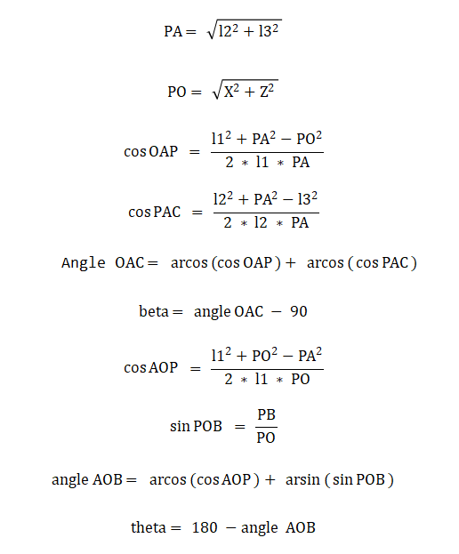

### 28.7.2 Inverse Kinematics Analysis of Robotic Arm 


According to the structure design of the robot dog, we can determine that the length of l1 is 4.21 centimeters, the length of l2 is 3.3 centimeters, and the length of l3 is 12.7 centimeters. Therefore, the length of PA is $\sqrt{{l2}^{2} + {l3}^{2}}$.

The source code of this program is stored at: [/home/ubuntu/ros2_ws/src/driver/sdk/sdk/InverseKinematics.py](../_static/source_code/ros2/InverseKinematics.zip)


### 28.7.3  Inverse Kinematics Solution and Program Implementation

:::{Note}

Instructions must be entered with strict attention to case sensitivity and spacing.

:::

(1) Turn on PuppyPi, and connect it to Raspberry Pi desktop via VNC.

(2) Click the icon  on the upper left corner to open the Terminator ROS2 terminal.


(3) Input the following command and press Enter to switch to the directory containing the inverse kinematics program file.

```
cd ros2_ws/src/driver/sdk/sdk
```


(4) Input the below command and press Enter to open the inverse kinematics program file.

```
vim InverseKinematics.py
```


(5) Here is a screenshot of the code for the InverseKinematics.py function.


* **The Calculation of the Pitch Angle beta**


(1) According to the cosine theorem, calculate the value, then round it to four decimal places.


(2) Because the range of the cosine value is \[-1, 1\], check if the absolute value is greater than 1. If it is greater than 1, it means that the given end coordinates cannot form a linkage structure.


(3) Next, calculate the cos*PAC* value, and then round it to four decimal places.


(4) Check again whether the absolute value exceeds 1.


(5) Next, use the inverse cosine function to find the angle in radians for both OAP and PAC, then add them together to get the angle for OAC.


(6) Finally, convert the angle value of OAC from radians to degrees, and subtract 90 degrees (initial pitch joint angle of the arm) to obtain the pitch joint angle beta rotation.


* **The Calculation of the Base Joint Angle theta**


(1) According to the cosine theorem, calculate the value, then round it to four decimal places.


(2) Because the range of the cosine value is \[-1, 1\], check if the absolute value of cosAOP is greater than 1. If it is greater than 1, it means that the given end coordinates cannot form a linkage structure.


(3) Then calculate the sin*POB* value, round it to four decimal places, and check again whether its absolute value is greater than 1.


(4) Next, use the inverse cosine function and the inverse sine function to find the radians of the angles AOP and POB, then add them together to obtain the value of the angle AOB.


(5) Finally, subtract the angle OAB, converted to degrees, from 180 degrees to obtain the rotation angle of the base joint theta.


## 28.8 Fixed-Point Navigation Handling

 Note: Before starting this game, you should have the map constructed. The completeness of the map will affect the navigation effect. You can refer to "[**26. ROS2-SLAM Mapping Course**](https://docs.hiwonder.com/projects/PuppyPi/en/latest/docs/33.ros2_slam_mapping_course.html)" for mapping. To ensure the mapping effect, you need to disassemble the robotic arm on the robot or use an PC software to change the posture of the robotic arm. Do not obstruct the LiDAR.
    
 ### 28.8.1 Working Principle

Firstly, start the navigation service and obtain the location information of the destination.

Next, perform navigation path planning to drive to the destination.

Then, subscribe to the topic messages published by the camera node to obtain the image, and perform color recognition.

Finally, locate the placement point and execute action group to control the robotic arm to complete the color block placement task.

<p id="anchor_28_8_2"></p>

### 28.8.2 Operation Steps

* **Start Navigation**

(1) Click the icon  on the left upper corner to open Terminator terminal.


(2) Open the PuppyPi system, open the command prompt, enter the command "roslaunch puppy_pi_bringup start_node_nav.launch", and press Enter to start the basic configuration of the robot.


(3) Open the PuppyPi system, open the command prompt, enter the following command, and press Enter to start the navigation service of robot.

```
ros2 launch navigation rviz_navigation.launch.py
```

:::{Note}

By default, the map recorded here is map1.

:::

(4) Open the PuppyPi system, open the command prompt, enter the following command, and press Enter to start navigation transportation. Note: There will be no information printed in the terminal here until the robot reaches the navigation point, at which point messages will be printed.

```
python3 /home/ubuntu/ros2_ws/src/example/example/puppy_with_arm/color_place_nav.py
```


### 28.8.3 Program Outcome

* **Grasp Color Block**

Before starting the navigation, we need to have Puppypi grasp the color block. Here, we need to use the upper computer to control the opening of the mechanical arm gripper and place the color block inside the gripper.


* **Start Navigation**

Based on the content in the red box in the following image, issue commands to the robot dog. When navigating, we need to use the first tool to set the initial position of the robot dog, and the second tool to set the target point. The robot dog will automatically set the route according to the map, avoid obstacles, and reach the target point.

:::{Note}

If you need to interrupt navigation, simply set a new target point using the second tool at the current location of the robot dog. If you pick up the robot dog or its position is altered by external force, you will need to reset its position manually.

:::


After setting the target point, two lines will be generated: one green and one red. The green line represents the global route that the robot dog will take to reach the target, while the red line represents the local route planned by the robot dog.


* **Begin Placing the Color Blocks**

After reaching the navigation point, the robot dog enters the next state and begins to search for the red box. Once the red box is found, it executes action group control to move the mechanical arm and place the color block into the red box.


### 28.8.4 Program Analysis

(1) The source code for this program is located in the Docker container at: `/home/ubuntu/ros2_ws/src/navigation/launch/navigation.launch`


This file launches the AMCL (Adaptive Monte Carlo Localization) algorithm package and provides initial pose parameters to the AMCL node. These parameters aid in precise robot localization within the environment.


- **Set Paths**

Retrieve the paths for the \`slam\` and \`navigation\` functional packages.


- **Launch Supporting Files**

base_launch: Manages hardware components.

navigation_launch: Starts the navigation algorithm.

puppy_control: Handles motion control.


### 28.8.5 Function Extension

The default game recognizes red color, and the robot dog performs 'grab' and 'place' actions for the color blocks. If you need to change the recognized color, for example, to 'green' color blocks, you can follow the steps below:

(1) Click the icon  on the left upper corner of the desktop to open the Terminator terminal.


(2) Enter the below command to edit the color recognition and grabbing game program, and press Enter.

```
rosed puppy_with_arm color_grab.py
```

(3) Find the following code:


:::{Note}

After entering the code position number on the keyboard, press 'Shift+G' to directly jump to the corresponding position. (The numbering of code positions in the diagram is for reference only, please refer to the actual positions.)

:::

(4) Press the **'i'** key to enter edit mode, and change **'red'** to **'green'**.


(5) After making the modifications, press the 'Esc' key, enter the command "**:wq**", and press Enter to save and exit.

```
:wq
```


(6) Refer to "[**28.8.2 Operation Steps**](#anchor_28_8_2)" to restart the game and view the effects of the modification.

### 28.8.6 Feature Pack Description

The navigation package is located in the Docker container at: `/home/ubuntu/ros2_ws/src/navigation/`


Config: Contains configuration parameters related to navigation, as shown in the figure below.


Launch: Includes launch files related to navigation, such as localization, map loading, navigation modes, and simulation models, as shown in the figure below.


rviz: Contains configuration files for RViz, a visualization tool. These files include RViz settings for different navigation algorithms and navigation configurations, as shown in the figure below.


Package.xml: This is the package configuration file for the current navigation package.

- **Source Code Analysis**

  The source code for this program is located in the Docker container at: [/home/ubuntu/ros2_ws/src/example/example/puppy_with_arm/color_place_nav.py](../_static/source_code/ros2/color_place_nav_new.zip).

- **Import related application library**


(1) sys is used for handling command-line arguments and exiting the program;

(2) cv2 is used for OpenCV image processing;

(3) math is used for mathematical calculations;

(4) time is used for timing and delays;

(5) enum is used for defining program running state;

(6) threading is used for implementing parallel processing.

(7) Import ArmIK from arm_kinematics.ArmMoveIK for inverse kinematics control;

(8) Import Velocity, Pose, and Gait message types from puppy_control.msg for controlling the velocity, pose, and gait of the robot dog.

(9) Import ArmIK from arm_kinematics.ArmMoveIK for inverse kinematics control.


A variable named HomePath is defined, representing the home directory path as '/home/pi'. Then, '/home/pi/PuppyPi_PC_Software' is added to the Python module search path using sys.path.append.

The function setServoPulse is imported from the module ServoCmd. This indicates that the ServoCmd module contains a function named setServoPulse, which is used to control the pulse signal of servo motors.

- **Main function**


In the main program, initialize the ROS node, set up ROS topic publishers and subscribers, and perform some initialization actions.

\- Create ROS topic publishers: used to control the robot dog's gait, velocity, and pose.

\- Create ROS topic subscribers: used to obtain the status of navigation targets and image data, set the initial pose of the robot dog, and publish it.

\- If the debug mode is enabled, start two threads, th and th1.

- **state call back function goal_status_callback**


Listen to the /move_base/status topic. When the received target status is 3 (target has been reached), output information through ROS logging, and start two threads named th and th1. At the same time, set the global variable nav_status to True to indicate that the target has been reached.

- **Function image_callback**


Convert the ROS image message ros_image data to a NumPy array for later use in image processing.

- **Run image processing function**


First, preprocess the image, including resizing and Gaussian blurring. Then, identify lines in different regions of interest (ROIs) based on predefined color ranges, calculate the center point positions of the line contours, calculate the parameters of the minimum enclosing circle for the largest area color block, output different recognition results based on judgment, and display the recognition results in the image. The overall logic is to control the motion of the robot dog by identifying colors, extracting contours, finding the largest area, and outputting recognition results based on the image.

(1) Preprocess the image, including resizing and Gaussian blurring.


(2) Convert the image from BGR to LAB format, then segment the preprocessed image into three regions: upper, middle, and lower. Convert the RGB color of the image blocks in the three regions to LAB color space, and then perform bitwise operations with the mask.


(3) After masking, perform erosion and dilation operations on the image. Extract the outer contours of the target using the cv2.findContours() function, and call the getAreaMaxContour() function to detect contours and find the largest contour.


(4) Find the contours of color blocks in the image. Filter out contours with an area less than 200 for higher recognition accuracy. Finally, use the cv2.circle() function to draw the minimum enclosing circle on the image with a yellow color.


- **move perform action function**


During the startup phase (PuppyStatus.START), the robot dog stops moving and initializes its posture. During normal forward movement (PuppyStatus.NORMAL), it moves control based on the position information of the target block. If the target block is found within the specified area, it executes the "**place.d6a**" action group to place the block at the target point and switches to the PuppyStatus.STOP status. Otherwise, it adjusts the robot dog's movement speed and angular velocity based on the position of the target block. If puppyStatus is PuppyStatus.STOP, the robot dog's posture is switched to the standing posture (Stand), and the corresponding posture information is published.

- **getAreaMaxContour function**


To find the contour with the largest area from a group of contours, the function iterates through all contours, calculates their areas, and retains the contour with the largest area. It also adds a condition to only consider contours with an area greater than or equal to 5 to filter out smaller disturbances. Finally, the function returns the found largest contour along with its corresponding area.

- **cv2_image2ros image information processing**


The function converts OpenCV format image data to a ROS Image message (sensor_msgs/Image). It reverses the channel colors of the image and then creates and sets the relevant attributes of the ROS Image message, including height, width, encoding format, etc. Finally, it returns the created ROS Image message. This function is useful for processing OpenCV image data in ROS and publishing it as ROS Image messages.
