# Docker容器基础课程

## 1.  Docker介绍及安装

### 1.1 Docker介绍

Docker 是一个开源的应用容器引擎，基于Go语言并遵从 Apache2.0 协议开源。

Docker 可以让开发者打包他们的应用以及依赖包到一个轻量级、可移植的容器中，然后发布到任何流行的 Linux 机器上，也可以实现虚拟化。

容器是完全使用沙箱机制，相互之间不会有任何接口（类似 iPhone 的 app）,更重要的是容器性能开销极低。


Docker标志

关于Docker容器的更多内容可在下方链接中自行查阅学习

Docker官网：http://www.docker.com

Docker中文网站：https://www.docker-cn.com

Docker Hub（仓库）官网：https://hub.docker.com

### 1.2 Docker安装

官网安装参考手册：[Install Docker Engine on Debian\ Docker Docs](https://docs.docker.com/engine/install/debian/)

:::{Note}

树莓派默认出厂镜像已经安装好Docker，下面的步骤仅供学习参考。

:::

这里使用阿里源进行下载

1)  按下“**Ctrl+Alt+T**”，打开命令行终端，输入“**sudo apt-get update**”，然后按下回车，更新apt软件包列表。


2)  安装所需的证书、工具和 GPG（GnuPG）密钥管理工具。

```commandline
sudo apt-get install ca-certificates curl gnupg
```

3) 创建目录用于存储 GPG 密钥环。

```commandline
sudo install -m 0755 -d /etc/apt/keyrings
```

4)  从 Docker 官方获取 GPG 密钥并保存到密钥环中。

```commandline
curl -fsSL https://download.docker.com/linux/debian/gpg | sudo gpg --dearmor -o /etc/apt/keyrings/docker.gpg
```

5)  添加权限。

```commandline
sudo chmod a+r /etc/apt/keyrings/docker.gpg
```


将 Docker 存储库添加到 Apt 软件包源列表中。

```commandline
echo  "deb [arch=$(dpkg --print-architecture) signed-by=/etc/apt/keyrings/docker.gpg] https://download.docker.com/linux/debian \ $(. /etc/os-release && echo "$VERSION_CODENAME") stable" | \
  sudo tee /etc/apt/sources.list.d/docker.list > /dev/null
```

6)  更新apt软件包列表。

```commandline
sudo apt-get update
```

7)  输安装 Docker 及相关组件。

```commandline
sudo apt-get install docker-ce docker-ce-cli containerd.io docker-buildx-plugin docker-compose-plugin
```

8)  创建 docker 用户组。

```commandline
sudo groupadd docker
```

9)  当前用户添加到这个docker用户组中，避免每次运行 Docker 命令时都要输入sudo。

```commandline
sudo gpasswd -a $USER docker
```

10) 重启树莓派。

```commandline
sudo reboot
```

11) 下载完成之后，输入“**docker version**”查看docker版本。

```commandline
docker version
```


12) 输入“**docker run hello-world**”，若出现以下内容则表示Docker安装成功。

```commandline
docker run hello-world
```


## 2. Docker hello-world

Docker 官方提供的 hello-world 是一个轻量级的容器，用于测试 Docker 是否成功

安装和运行。这个容器非常小，主要用于展示 Docker 的基本用法和验证 Docker 运行环境的正确性。

1)  按下“**Ctrl+Alt+T**”，打开命令行终端，输入**指令**，Docker 将下载 hello-world 镜像（如果本地不存在）。

```commandline
docker run hello-world
```


2)  在终端输入指令，列出本地主机上的所有镜像 。

```commandline
docker images
```


在这里我们可以查看到“**Hello_World**”的相关信息，对应参数含义：

REPOSITORY： 镜像的仓库源

TAG:镜像的标签

IMAGE ID：镜像的ID

CREATED：镜像创建时间

SIZE: 镜像大小

3)  在终端输入指令运行hello-world镜像，终端会打印出相关的提示信息 。

```commandline
docker run -it hello-world
```

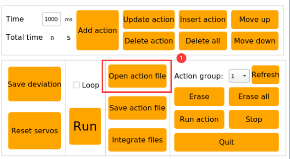

4)  在终端输入指令，输出包含有关hello-world镜像详细信息的 JSON 数据。

```commandline
docker inspect ee301c921b8a
```


## 3. Docker容器使用

### 3.1 帮助命令 

docker info ：用于显示 Docker 系统的信息，包括 Docker 的配置和当前状态。它提供了有关 Docker 镜像、容器数、守护进程、存储驱动、网络和其他相关信息的详细概要。

docker --help： 用于获取 Docker 命令的帮助信息。执行此命令会列出所有可用 Docker 命令及其选项，以供参考。

### 3.2 镜像命令 

1)  docker images：列出本地主机上的所有镜像 。


对应参数含义：

REPOSITORY： 镜像的仓库源

TAG:镜像的标签

IMAGE ID：镜像的ID

CREATED：镜像创建时间

SIZE: 镜像大小

（ 同一个仓库源可以有多个TAG，代表这个仓库源的不同版本，使用REPOSITORY：TAG 定义不同的镜像，如果不定义镜像的标签版本，docker将默认使用 lastest镜像）

该命令还提供了一些可选项

-a： 列出本地所有镜像

-q： 只显示镜像id

--digests： 显示镜像的摘要信息

2)  docker pull：从选定的仓库下载镜像


使用方法 ：

docker pull 镜像仓库地址/镜像名：版本

示例（无法下载，仅做参考）： docker pull hiwonder/ros-foxy:1.0.0

例如下载debian镜像,按下“**Ctrl+Alt+T**”，打开命令行终端，输入指令，然后按下回车。

```commandline
docker pull debian
```

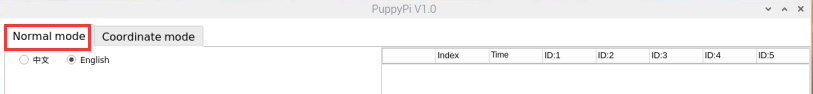

输入指令，查看主机上的镜像，可以看到这里多了一个“**debian**”的镜像。

```commandline
docker images
```


3)  docker search：搜索对应DockerHub仓库中的镜像。

例如搜索ROS镜像,按下“**Ctrl+Alt+T**”，打开命令行终端，输入指令，然后按下回车。

```commandline
docker search ros
```


该命令还提供了一些可选项


-f, --filter filter: 根据提供的条件过滤输出结果。

--format string: 使用 Go 模板格式化输出。

--limit int: 限制搜索结果的最大数量。

--no-trunc: 不截断输出。

4)  docker rmi： 删除镜像

docker rmi -f \[镜像id\] ： 删除单个镜像

docker rmi -f \[镜像名:tag\] \[镜像名:tag\] ： 删除多个镜像

docker rmi -f \$(docker images -qa) ： 删除全部镜像

### 3.3 容器命令

有镜像才能创建容器，这里使用 debian 的镜像来测试，按下“**Ctrl+Alt+T**”，打开命令行终端，输入指令，然后按下回车。

```commandline
docker pull debian
```


- #### 3.3.1 docker run 运行镜像启动容器

命令参数说明 ：docker run \[OPTIONS\] IMAGE \[COMMAND\]\[ARG...\]

常用参数：

--name="Name" ：给容器指定一个名字

-d ：后台方式运行容器，并返回容器的id！

-i ：以交互模式运行容器，通过和 -t 一起使用

-t ：给容器重新分配一个终端，通常和 -i 一起使用

-P ：随机端口映射（大写）

-p ：指定端口映射（小写），一般可以有四种写法

ip:hostPort:containerPort

ip::containerPort

hostPort:containerPort (常用)

这里以运行debian镜像为例，在命令行终端，输入指令，然后按下回车。

```commandline
docker run -it debian /bin/bash
```

pi@raspberry：是主机系统界面，root@9aeb4cc795e6：则是在docker容器内界面。

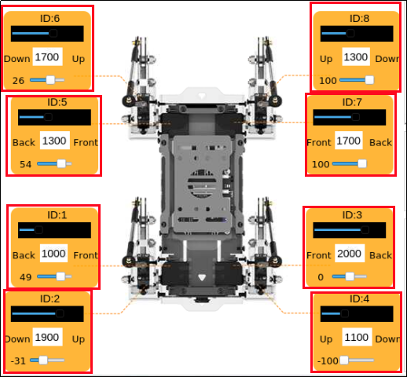

参数说明：

-i: 交互式操作。

-t: 终端。

**debian** : **debian** 镜像。

/bin/bash：放在镜像名后的是命令，这里我们希望有个交互式 Shell，因此用的是 /bin/bash。

要退出终端，直接在终端输入指令，按下回车。

```commandline
exit
```


- #### 3.3.2 docker ps 列出所有运行的容器

命令参数说明 ：docker ps \[OPTIONS\]

常用参数说明 ：

-a ：列出当前所有正在运行的容器 + 历史运行过的容器

-l ：显示最近创建的容器

-n=? ：显示最近n个创建的容器

-q ：静默模式，只显示容器编号。

在命令行终端，输入“**docker ps -a**”，然后按下回车，显示出正在运行和历史运行过的容器。其中container id是容器的ID，image是该容器使用的镜像名称，created是容器创建时间，status是容器当前状态


- #### 3.3.3 退出容器

一共有两种退出容器的指令：

1)  直接在终端输入指令，按下回车，此时容器会停止运行并退出。

```commandline
exit
```

2)  使用快捷键组合“**crtl+P+Q**”，此时容器会直接退出但不停止运行，我们可以在终端输入指令,查看到正在运行的容器。

```commandline
docker ps
```

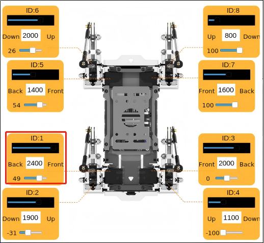

- #### 3.3.4 多终端进入正在运行的容器

用两个指令可以进入其他终端正在运行的容器：

docker attach ：直接进入容器启动命令的终端，不会启动新的进程，如果从这个容器退出，会导致容器停止运行。

docker exec： 是在容器中打开新的终端，并且可以启动新的进程，如果从这个容器退出，容器还可以正常运行，一般使用该方法进入容器。

- **docker attach**

1)  按下“**Ctrl+Alt+T**”，打开命令行终端，在终端输入指令，显示当前正在运行的容器。

```commandline
docker ps
```


2)  在终端输入指令，进入正在运行的容器中。

```commandline
docker attach 004c
```

容器的id可以简写，只要是该容器唯一标识就行


3)  在终端输入指令，按下回车，此时容器会停止运行并退出。

```commandline
exit
```

4)  在终端输入指令，显示当前正在运行的容器，可以看到刚才退出容器的同时也关闭了容器。

```commandline
docker ps
```


- **docker exec**

1)  按下“**Ctrl+Alt+T**”，打开命令行终端，在终端输入指令，显示当前正在运行的容器。

```commandline
docker ps
```


2)  在终端输入指令，进入正在运行的容器中。

```commandline
docker exec -it efe9 /bin/bash
```
容器的id可以简写，只要是该容器唯一标识就行


3)  在终端输入指令，按下回车，此时会退出容器。

```commandline
exit
```

4)  在终端输入，显示当前正在运行的容器，可以看到刚才退出容器后，容器并没有关闭。

```commandline
docker ps
```

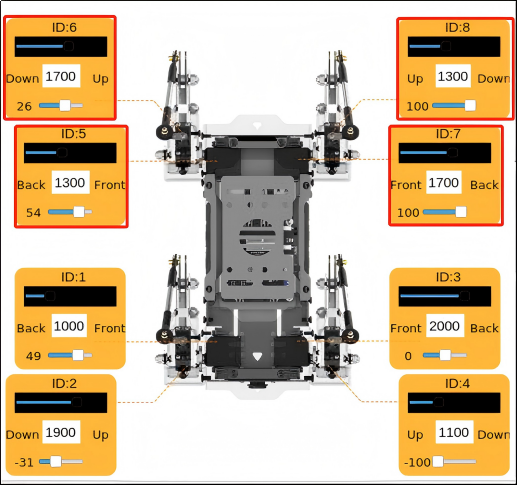

- #### 3.3.5启动停止容器

docker start \[ 容器id or 容器名 \] ：启动容器

docker restart \[ 容器id or 容器名 \] ：重启容器

docker stop \[ 容器id or 容器名 \] ：停止容器

docker kill \[ 容器id or 容器名 \] ：强制停止容器

- #### 3.3.6 删除容器

docker rm \[容器id\] ：删除指定容器

docker rm -f \$(docker ps -a -q) ：删除所有容器

docker ps -a -q\|xargs docker rm ：删除所有容器

### 3.4 常用其他命令 

- #### 3.4.1 查看容器中运行的进程信息

1)  按下“**Ctrl+Alt+T**”，打开命令行终端，在终端输入指令，显示当前正在运行的容器。

```commandline
docker ps
```


2)  在终端输入指令，显示容器内运行的进程信息。

```commandline
docker top efe9
```


相关参数具体解释如下：

UID: 进程的用户标识符 (User ID)。

PID: 进程的进程标识符 (Process ID)。

PPID: 父进程的进程标识符 (Parent Process ID)。

C: 进程的 CPU 利用率。

STIME: 进程的启动时间。

TTY: 与进程关联的终端设备。

TIME: 进程的累计 CPU 使用时间。

CMD: 进程的命令行。

- #### 3.4.2 查看容器/镜像的元数据

1)  按下“**Ctrl+Alt+T**”，打开命令行终端，在终端输入指令，显示当前正在运行的容器。

```commandline
docker ps
```


2)  在终端输入指令，输出包含有关容器或镜像详细信息的 JSON 数据。

```commandline
docker inspect efe9
```


##  4. Docker镜像深入理解和制作

### 4.1 镜像的理解 

1. 镜像是一种轻量级、可执行的独立软件包，它包含运行某个软件所需要的所有内容。我们将应用程序、配置打包成一个成型的、可交付、可部署的运行环境，包括代码、运行时所需要的库、环境变量和配置文件等，这个大包好的运行环境就是image镜像文件。

2. 只有通过镜像文件才能生成docker容器实例。

### 4.2 UnionFS（联合文件系统） 

1、Union文件系统（UnionFS）是一种分层的、轻量级的、高性能的文件系统，它是docker镜像的基础，并且支持对文件系统的修改作为一次提交来一层层的叠加，同时可以将不同目录挂在到同一个虚拟文件系统下。

2、镜像可以通过分层来进行继承，基于基础镜像，可以制作各种具体的应用镜像。

Union文件系统的特性：一次性同时加载多个文件系统，但是从外面来看，只能看到一个文件系统；联合加载会把各层文件系统叠加起来，这样最终的文件系统会包含所有分层的文件和目录。

### 4.3 镜像分层 

下载一个镜像时，注意观察下载的日志输出，可以看到是一层一层的在下载：


可以通过在终端输入指令查看镜像分层。

```commandline
docker image inspect mysql
```


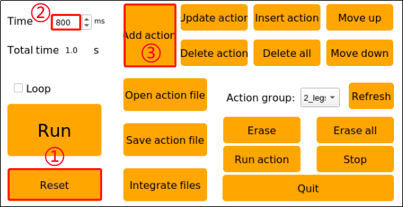

- #### 4.3.1分层理解

所有的 docker 镜像都起始于一个基础镜像层，当进行修改或增加新的内容时，就会在当前镜像层之上，创建新的镜像层。

举一个简单的例子，假如基于debian创建一个新的镜像，这就是新镜像的第一层；如果在该镜像中添加 python包，就会在基础镜像层之上创建第二个镜像层；如果继续添加一个安全补丁，就会创建第三个镜像层，每一层一层的叠加。

docker镜像都是只读的，当容器启动时，一个新的可写层被加载到镜像的顶部，这一层就是我们通常说的容器层，容器之下的都叫镜像层。

- #### 4.3.2 docker镜像采用分层的好处

资源共享，比如有多个镜像都从相同的Base镜像构建而来，那么宿主机只需在磁盘上保留一份base镜像，同时内存中也只需要加载一份base镜像，这样就可以为所有的容器服务了，而且镜像的每一层都可以被共享。

### 4.4 制作镜像 

当我们从 docker 镜像仓库中下载的镜像不能满足我们的需求时，我们可以通过以下两种方式对镜像进行更改。

1.  使用docker commit从已经创建的容器中更新镜像，并且提交这个镜像。

2.  使用 **Dockerfile** 指令来创建一个新的镜像。

- #### 4.4.1 从容器中提交一个镜像

**指令解释：docker commit -m="提交的描述信息" -a="作者" 容器ID要创建的目标镜像名:\[标签名\] 【也可省略 -m -a 参数】**

1)  按下“**Ctrl+Alt+T**”，打开命令行终端，在终端输入指令，显示所有运行过的容器，找到需要提交容器的ID。

```commandline
docker ps -a
```


2)  在终端输入指令，提交容器ID **9aeb4cc795e6** 的镜像并命名为 **debian**，标签名为1.0。

```commandline
docker commit 9aeb4cc795e6 debain:1.0
```


3)  在终端输入指令，查看主机中的镜像，可以看到现在多了一个debain镜像。

```commandline
docker images
```


- #### 4.4.2 dockerfile制作镜像

**指令解释：docker build -f dockerfile 文件路径 -t 新镜像名字:TAG . \# docker build 命令最后有一个 . 表示当前目录**

使用命令 **docker build**，从零开始来创建一个新的镜像。为此，我们需要创建一个 **Dockerfile** 文件，其中包含一组指令来告诉 Docker 如何构建我们的镜像。

关于dockerfile的编写请参考：https://docs.docker.com/develop/develop

images/dockerfile_best-practices/

1)  按下“**Ctrl+Alt+T**”，打开命令行终端，在终端输入指令，创建并打开文件。

```commandline
vim Dockerfile
```

2)  在终端输入下图内容，按下“**ESC**”键，输入指令退出并保存文件。

```commandline
:wq
```


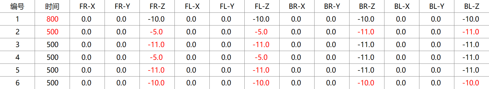

3)  在终端输入指令，构建一个新镜像。

```commandline
docker build -f dockerfile -t debain:1.1 .
```

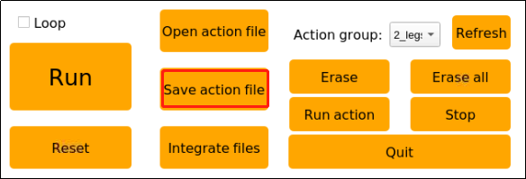

4)  在终端输入指令，可以看到我们刚刚构建的新镜像。

```commandline
docker images
```


## 5. Docker硬件交互和数据处理

### 5.1 硬件挂载（端口绑定） 

将自己需要挂载的设备接到主板上，在宿主机中建立udev规则（/etc/udev/rules.d/）

以下是以USB摄像头挂载为例，实际情况根据自己的设备挂载 。

1) 按下“**Ctrl+Alt+T**”，打开命令行终端，在终端输入 指令，启动debian容器并将USB摄像头挂载。

```commandline
docker run -it --device=/dev/video0 debian:latest /bin/bash
```

2) 在终端输入指令，按下回车，查看当前容器下挂载的设备，可以看到刚刚的USB摄像头设备“**video0**”已经挂载上了。

```commandline
ls /dev/
```

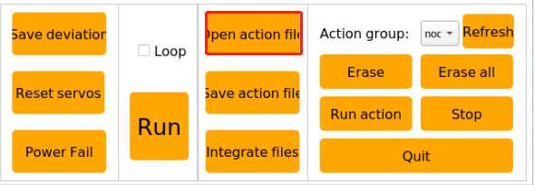

### 5.2 docker中GUI的显示 

在宿主机中安装：

1) 按下“**Ctrl+Alt+T**”，打开命令行终端，在终端输入 指令，按下回车，输入“**y**”进行下载。

```commandline
sudo apt-get install tigervnc-standalone-server tigervnc-viewer
```

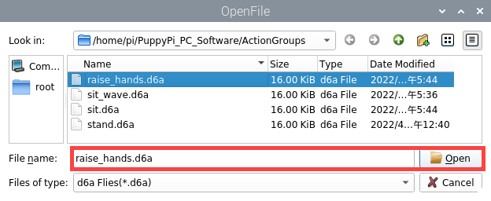

2)  在终端输入指令，按下回车，进行下载。

```commandline
sudo apt-get install x11-xserver-utils
```


3)  在终端输入指令，按下回车，进行下载。

```commandline
xhost +
```


4)  在终端输入 指令，按下回车，进入容器。

```commandline
docker run -it --env="DISPLAY" --env="QT_X11_NO_MITSHM=1" -v /tmp/.X11-unix:/tmp/.X11-unix debian:latest /bin/bash
```

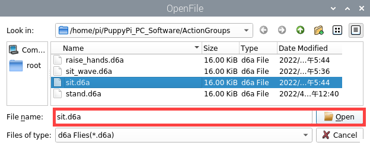

5)  在终端输入指令，按下回车，更新软件列表。

```commandline
apt-get update
```

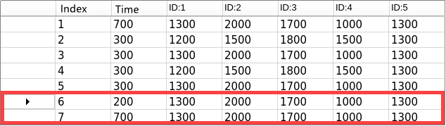

6)  在终端输入指令，按下回车，安装X11图像界面。

```commandline
apt-get install -y x11-apps
```

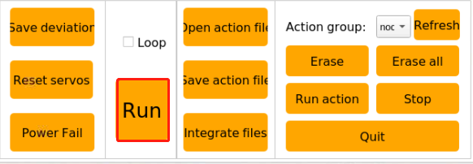

7)  在终端输入指令，按下回车，会出现一双眼睛，它会跟着鼠标移动。

```commandline
xeyes
```

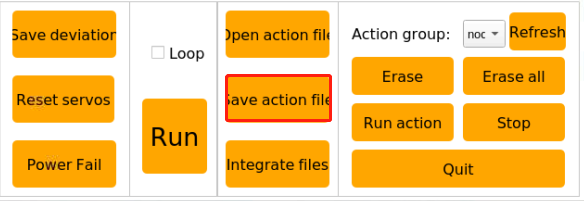

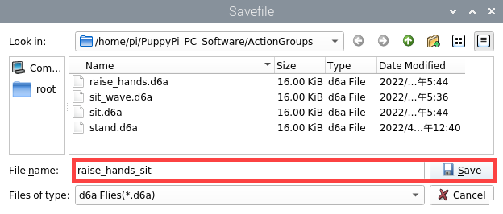

### 5.3 docker容器和宿主机互传文件

- #### 5.3.1 使用cp指令拷贝文件

- ##### 从容器内拷贝文件到主机上

**指令：docker cp \[容器id:容器内路径\] \[目的主机路径\]**

1)  在终端输入指令，进入容器。

```commandline
docker run -it debian /bin/bash
```

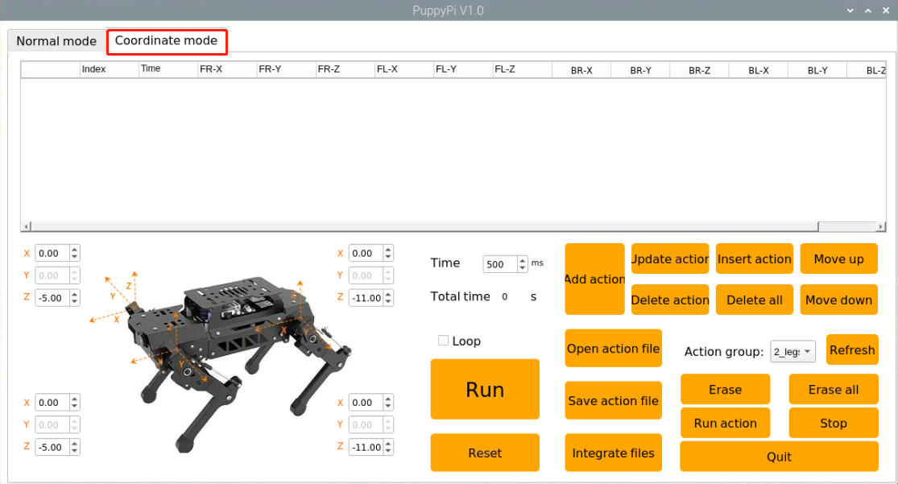

2)  在终端输入指令，切换到用户的主目录。

```commandline
cd
```


3)  在终端输入指令，查看路径下的目录，这里可以看到在该路径下是一个空目录。

```commandline
ls
```


4)  在终端输入**指令**，创建一个txt文件。

```commandline
touch test.txt
```


5)  在终端输入指令，查看当前路径。

```commandline
pwd
```


6)  按下“crtl+P+Q”，退出容器但不停止。

7)  在终端输入指令，将刚刚创建好的test.txt文件复制到宿主机中。

```commandline
docker cp d2d0e43b41eb:/root/test.txt ~/
```


8)  在终端输入指令，进入到文件路径下。

```commandline
cd /home/pi
```


9)  在终端输入指令，可以看到test.txt已经在路径下了。

```commandline
ls
```


- ##### 从宿主机拷贝文件到容器上

**指令：docker cp \[宿主机文件路径\] \[容器id:容器内路径\]**

1)  在终端输入指令，创建test_1.txt文件。

```commandline
touch test_1.txt
```


2)  在终端输入指令，将test_1.txt文件复制到容器d2d0e43b41eb的/root/路径下（注意：这里的容器d2d0e43b41eb需要保持运行状态）。

```commandline
docker cp test_1.txt d2d0e43b41eb:/root/
```


3)  在终端输入指令，进入容器。

```commandline
docker exec -it d2d0e43b41eb /bin/bash
```


4)  在终端输入指令，切换到用户的主目录。

```commandline
cd
```


5)  在终端输入指令，查看路径下的目录，这里可以看到在文件已经从宿主机复制到容器中了。

```commandline
ls
```


### 5.4 使用数据卷 

- #### 5.4.1 数据卷概述

将应用和运行的环境打包形成容器运行，运行可以伴随着容器，但是我们对于数据的要求是希望能够持久化的。就好比，安装一个mysql，结果把容器删了，就相当于删库跑路了，这肯定不行。所以我们希望容器之间有可能可以共享数据，docker容器产生的数据，如果不通过docker commit 生成新的镜像，使得数据作为镜像的一部分保存下来，那么当容器删除后，数据自然也就没有了。

为了能保存数据在docker中我们就可以使用数据卷。让数据挂载到我们本地，这样数据就不会因为容器删除而丢失了。

特点：

1. 数据卷可在容器之间共享或重用数据。

2. 数据卷中的更改可以直接生效。

3. 数据卷中的更改不会包含在镜像的更新中。

4. 数据卷的生命周期一直持续到没有容器使用它为止。

- #### 5.4.2 数据卷使用

**指令：docker run -it -v \[宿主机绝对路径目录:容器内目录\] \[镜像名\]**

1) 在终端输入 指令，将宿主机中的/home/jetson/temp目录和容器内的/root/temp目录就可以共享数据了。

```commandline
docker run -it -v /home/pi/temp:/root/temp debian:latest /bin/bash
```


2)  在终端输入指令，进入指定目录下。

```commandline
cd root/temp/
```

3)  在终端输入指令，创建一个touch text_2.txt文件。

```commandline
touch text_2.txt
```

4)  在终端输入指令，退出容器。

```commandline
exit
```

5)  在终端输入指令，进入指定目录下。

```commandline
cd /home/pi/temp/
```

6)  在终端输入指令，可以看到在容器中创建的文件已经共享到指定目录下。

```commandline
ls
```

## 6. 容器的日常管理

Docker已经成为了现代应用程序开发和部署的核心工具之一。然而，为了确保容器环境的稳定性和可靠性，日常维护和故障排除是必不可少的任务。本文将介绍一些关键的Docker容器维护和故障排除技巧，以帮助大家应对各种常见问题。

### 6.1 定期清理无用容器和镜像

在长时间的使用过程中，Docker主机上可能会积累大量无用的容器和镜像，占用宝贵的磁盘空间。定期清理无用资源是容器环境维护的第一步。

按下“**Ctrl+Alt+T**”，打开命令行终端，在终端输入指令， 按下回车，输入“**y**”开始

清理无用的停止容器。

```commandline
docker container prune
```


按下“**Ctrl+Alt+T**”，打开命令行终端，在终端输入指令， 按下回车，输入“**y**”开始

清理无用的镜像。

```commandline
docker image prune
```


### 6.2 监控容器性能

监控容器的性能是确保容器正常运行的重要任务。使用Docker自带的stats命令可以实时查看容器的CPU、内存、网络和磁盘使用情况。

按下“**Ctrl+Alt+T**”，打开命令行终端，在终端输入指令， 按下回车， 查看ID 0cfc6a98a68c 的容器实时性能数据。

```commandline
docker stats 0cfc6a98a68c
```


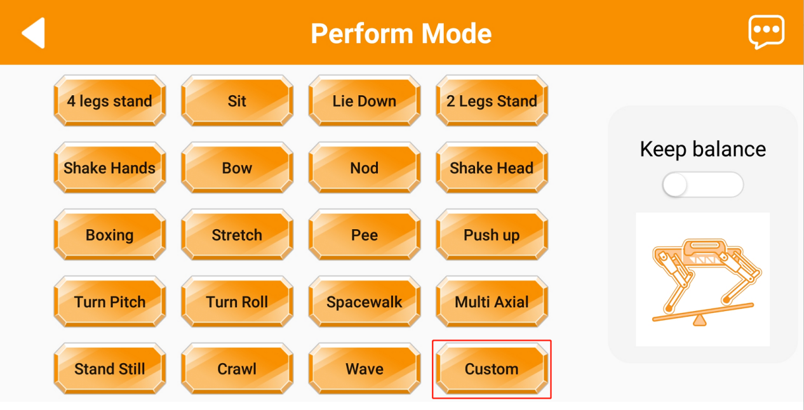

### 6.3 查看容器日志

容器的日志记录对于排查问题和诊断故障非常重要。使用docker logs命令可以查看容器的标准输出日志。

按下“**Ctrl+Alt+T**”，打开命令行终端，在终端输入指令， 按下回车， 查看ID

0cfc6a98a68c 的容器的标准输出日志。

```commandline
docker logs 0cfc6a98a68c
```

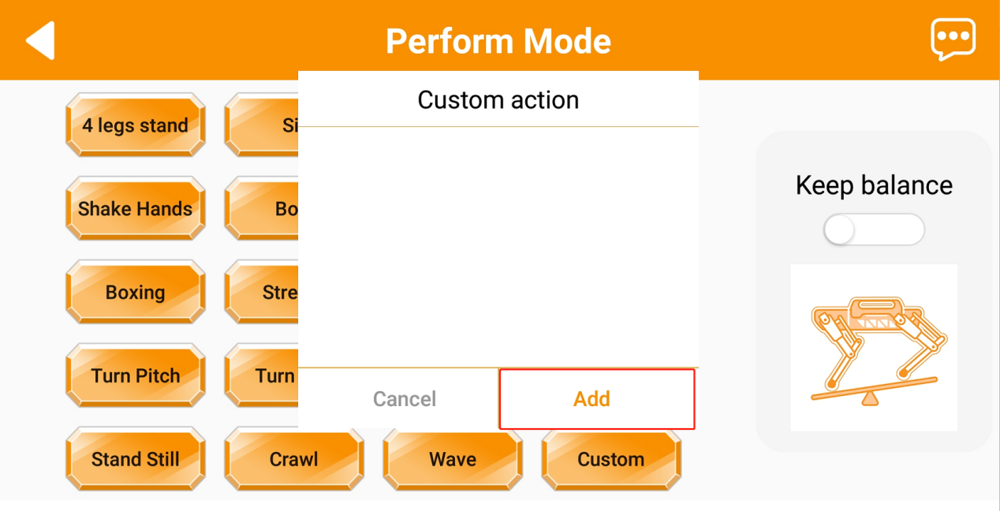

### 6.4 重启容器

容器在运行过程中可能会出现各种问题，包括应用程序崩溃或资源耗尽。在这种情况下，重启容器可能是解决问题的一种有效方法。

按下“**Ctrl+Alt+T**”，打开命令行终端，在终端输入**指令**”， 按下回车， 重启容器。

```commandline
docker restart 0cfc6a98a68c
```


### 6.5 处理容器网络问题

容器之间的网络问题可能会导致应用程序无法通信。使用docker network命令可以管理容器网络，查看容器的IP地址和端口映射情况。

按下“**Ctrl+Alt+T**”，打开命令行终端，在终端输入， 按下回车，查看容器网络信息。

```commandline
docker inspect -f '{{range .NetworkSettings.Networks}}{{.IPAddress}}{{end}}' 0cfc6a98a68c
```


### 6.6 处理容器存储问题

容器的存储问题可能包括磁盘空间耗尽或数据丢失。使用数据卷和存储驱动程序可以更好地管理容器的存储。

按下“**Ctrl+Alt+T**”，打开命令行终端，在终端输入指令， 按下回车，创建数据卷。

```commandline
docker volume create my-data
```


创建成功后，你可以将这个数据卷挂载到容器中，以实现数据的共享。


### 6.7 总结

Docker容器的日常维护和故障排除是确保容器环境稳定性和可靠性的关键任务。通过定期清理无用资源、监控容器性能、查看容器日志、进入运行中容器、重启容器、构建自定义镜像、备份和恢复容器数据、处理容器网络和存储问题、以及使用容器编排工具等技巧，可以更好地管理和维护容器化的应用程序。

## 7. Docker安装ROS

:::{Note}

我们的树莓派镜像出厂时已经安装好ROS1/ROS2环境，这里只供学习参考。

:::

### 7.1 ROS1安装

- #### 7.1.1 这里以melodic版本为例（需联网）

1)  按下“**Ctrl+Alt+T**”，打开命令行终端，在终端输入指令，下载ROS1镜像，镜像下载需要一些时间，请耐心等待一会。

```commandline
docker pull ros:melodic
```


1)  镜像下载完成后，在终端输入指令，运行容器并指定名称为 melodic。

```commandline
docker run -it --network=host -d -v=/dev:/dev -v /tmp/.X11-unix:/tmp/.X11-unix --name melodic -e DISPLAY=\${DISPLAY} --restart=always ros:melodic /bin/bash
```


2)  在终端输入指令,开启 X Server 的访问控制。

```commandline
xhost +
```


3)  在终端输入指令查看新创建容器的ID。

```commandline
docker ps -a
```


4)  在终端输入指令进入容器。

```commandline
docker exec -it 75b6634e6227 /bin/bash
```


5)  在终端输入指令，创建一个新用户。

```commandline
useradd -m -s /bin/bash ubuntu
```


6)  在终端输入指令，设置“**ubuntu**”的密码，输入密码按下之后，需要重新输入一遍密码。

```commandline
passwd ubuntu
```


7)  在终端输入指令，将新用户 ubuntu 添加sudo ，使其具有超级用户权限。

```commandline
usermod -aG sudo ubuntu
```


8)  在终端输入指令，更新可用软件包列表并升级系统上已安装的软件包。

```commandline
sudo apt-get update -y && sudo apt-get upgrade -y
```


9)  在终端输入指令，安装 Vim 文本编辑器。

```commandline
sudo apt-get install vim -y
```


10) 在终端输入指令，安装 ROS Melodic 版本的完整桌面环境，下载需要一些时间，请耐心等待一会。

```commandline
sudo apt-get install ros-melodic-desktop-full -y
```


- #### 7.1.2 测试ROS1环境

1)  输入指令，进入容器。

:::{Note}

**75b6**是装有ROS1环境的容器ID

:::

```commandline
docker exec -it -u ubuntu -w /home/ubuntu 75b6 /bin/bash
```


2)  输入指令，手动配置ROS1环境。

```commandline
source /opt/ros/melodic/setup.bash
```


3)  每一次打开都执行 7）步骤加载工作空间，可以在终端输入指令，将该指令写入.bashrc文件中。

```commandline
echo “source /opt/ros/melodic/setup.bash” >> ~/.bashrc
```


4)  然后输入指令，让**.bashrc**文件生效。这样就不需要每一次加载工作空间环境。

```commandline
source ~/.bashrc
```


5)  输入指令，启动小海龟GUI界面，启动成功即说明ROS1安装成功。

```commandline
rosrun turtlesim turtlesim_node
```


### 7.2 ROS2安装

- #### 7.2.1 这里以humble版本为例（需联网）

1)  按下“**Ctrl+Alt+T**”，打开命令行终端，在终端输入指令，下载ROS2镜像，镜像下载需要一些时间，请耐心等待一会。

```commandline
docker pull ros:humble
```


2)  镜像下载完成后，在终端输入指令，运行容器并指定名称为 humble。

```commandline
docker run -it --network=host -d -v=/dev:/dev -v /tmp/.X11-unix:/tmp/.X11-unix --name humble -e DISPLAY=\${DISPLAY} --restart=always ros:humble /bin/bash
```


3)  在终端输入指令,开启 X Server 的访问控制。

```commandline
xhost +
```


4)  在终端输入指令查看新创建容器的ID。

```commandline
docker ps -a
```


5)  在终端输入指令进入容器。

```commandline
docker exec -it 76a092503f2e /bin/bash
```


6)  在终端输入指令，创建一个新用户。

```commandline
useradd -m -s /bin/bash ubuntu
```


7)  在终端输入指令，设置“**ubuntu**”的密码，这里我们设置为“**ubuntu**”输入密码按下之后，需要重新输入一遍密码。

```commandline
passwd ubuntu
```


8)  在终端输入指令，将新用户 ubuntu 添加sudo ，使其具有超级用户权限。

```commandline
usermod -aG sudo ubuntu
```


9) 在终端输入指令，更新可用软件包列表并升级系统上已安装的软件包。

```commandline
sudo apt-get update -y && sudo apt-get upgrade -y
```


10) 在终端输入指令，安装 Vim 文本编辑器。

```commandline
sudo apt-get install vim -y
```


11) 在终端输入指令，安装 ROS Humble 版本的完整桌面环境。

```commandline
sudo apt-get install ros-humble-desktop-full -y
```


- #### 7.2.2 测试ROS2环境

1)  输入指令，进入容器。（注意：55ce是装有ROS2环境的容器ID）

```commandline
docker exec -it -u ubuntu -w /home/ubuntu 55ce /bin/bash
```


2)  输入指令，手动配置ROS2环境。

```commandline
source /opt/ros/humble/setup.bash
```


3)  每一次打开都执行7）步骤加载工作空间，可以在终端输入指令，将该指令写入.bashrc文件中。

```commandline
echo “source /opt/ros/humble/setup.bash” \>\> ~/.bashrc
```


4)  然后输入指令，让**.bashrc**文件生效。这样就不需要每一次加载工作空间环境。


```commandline
source ~/.bashrc
```


5)  输入指令，启动小海龟GUI界面，启动成功即说明ROS2安装成功。

```commandline
ros2 run turtlesim turtlesim_node
```


## 8. Docker仓库

docker仓库（repository）是集中存放镜像文件的场所。最大的公开仓库是docker hub(https://hub.docker.com/)，存放了数量庞大的镜像供用户下载。国内的公开仓库包括阿里云 、网易云等。

### 8.1 发布镜像到docker hub

1.  地址：https://hub.docker.com/ ，先注册账号

2.  保证账号可以正常登录


3.  使用 tag命令修改镜像名称

发布镜像到docker hub的规范是：docker push 注册用户名/镜像名

这里的注册用户名是:tao082，那就要先修改镜像名称

- 1. 按下“**Ctrl+Alt+T**”，打开命令行终端，在终端输入指令，查看主机上的镜像。

```commandline
docker images
```


- 2. 在终端输入指令，修改镜像名。

```commandline
docker tag 30555f5a4f74 tao082/debian:1.1
```


- 3.  在终端输入指令，可以看到镜像名称已经修改成功了。

```commandline
docker images
```


4.  登录docker hub发布镜像：


- 1. 在终端输入指令，按下回车，输入密码，进行登录。

```commandline
docker login -u tao082
```


- 2.  在终端输入指令，按下回车，发布镜像。

```commandline
docker push tao082/debian:1.1
```


5.  访问docker hub可查看到已经发布成功


### 8.2 发布镜像生成tar压缩包

**以下方法都是在宿主机中操作，而非docker里面操作**

1. **方式一：docker export 和 docker import（从容器中导出压缩包）**

- 1)  按下“**Ctrl+Alt+T**”，打开命令行终端，在终端输入指令，显示当前主机中的容器。

```commandline
docker ps
```


- 2)  在终端输入指令，将“**efe969b704a7**”容器导出为“**debian.tar**”。

```commandline
docker export efe969b704a7 > debian.tar
```


可以在当前路径下看到导出的容器。


- 3)  在终端输入指令导入容器所在路径，“**test/debian**”为镜像名，“**v1**”为标签名。

```commandline
cat /home/pi/debian.tar | docker import - test/debian:v1
```


- 4)  在终端输入指令，按下回车，查看主机中的容器信息。

```commandline
docker images
```


2. **方式二：docker save 和 docker load（从镜像中导出压缩包）**

- 1)  按下“**Ctrl+Alt+T**”，打开命令行终端，在终端输入指令，查看当前主机中的镜像。

```commandline
docker images
```


- 2)  在终端输入指令，按下回车，将镜像生成压缩包。

```commandline
docker save -o debian_1.1.tar debian:latest
```


可以在当前路径下看到导出的容器。


3)  在终端输入**指令，将**生成压缩包后使用docker load导入到镜像库 。

```commandline
docker load -i debian_1.1.tar
```


3. **两种方式的区别：**

docker export 是从容器（container)中生成，docker save 是镜像（image）中生成。docker export比 docker save 保存的包要小，原因是 save 保存的是一整个分层的文件系统，export 导出的只是容器一层文件系统。docker import 和 docker load 导入都会生成镜像。docker import 可以对镜像指定新名称及版本号，docker load 无法对镜像重命名。


