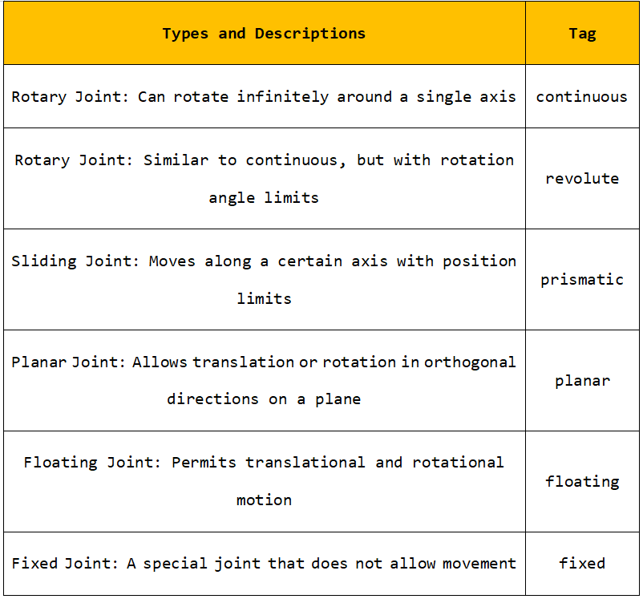
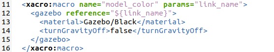

# ROS基础课程

## 1. ROS系统介绍

### 1.1 ROS操作系统介绍

在学习ROS系统前，我们需要先了解操作系统的定义。操作系统，顾名思义，即提供部分软件和硬件的接口，以供用户直接使用。因此，针对不同的平台、不同的功能，需要采用不同的操作系统来完成底层操作。

ROS系统是适用于机器人的开源操作系统。它提供类似于操作系统的服务，包括硬件抽象描述、底层驱动程序管理、共用功能的执行、程序间消息传递、程序发行包管理，它也提供一些工具和库，用于获取、编译、编写和执行多机融合的程序。

另外，ROS具备进程之间的通信，这是它与其他操作系统之间最大的区别。传统的操作系统，进程之间的通信需要系统来调用，这会消耗大量的系统资源，不适用于作为机器人的操作系统。

一个机器人的构成可能会包含多种传感器，以通过各模块间的通信协作来完成指定任务。因此进程之间有效快速的通信，是一个机器人必备的要求，而ROS则提供了这样的功能。




### 1.2 ROS的特点

1.  点对点设计，各个功能独立；

2.  结构简单，集成度高；

3.  工具包丰富，多语言支持，各个包可以采用不同的编程语言；

4.  免费且开源；

5.  社区丰富。

ROS官网：**https://wiki.ros.org**

## 2. ROS系统安装和环境搭建

本节课适用于Jetson Nano官方镜像下从0开始搭建ROS环境，这里提供两种ROS系统的安装方式，“方法一”为一键安装，只需要一条指令即可自动安装整个ROS系统；“方法二”则需要设置下载源配置、设置环境变量等步骤。

如果你是初次接触ROS的用户，建议选择“方法一”一键即可快速安装，在后续根据个人需求可选择“方法二”进行体验。

### 2.1 方法一：一键安装（推荐）

点击系统桌面的图标，打开命令行终端。在终端输入指令“**wget http://fishros.com/install -O fishros && . fishros**”，按下回车，然后输入密码。


接下来输入数字1，选择一键安装ROS。


在首次安装时需要换源并清理第三方源，所以输入数字1选择更换系统源再安装。


输入数字2选择更换系统源并清理第三方源。


输入数字1选择安装melodic(ROS1)版本。


输入数字1选择安装melodic(ROS1)桌面版，等待安装成功即可。


### 2.2 方法二：逐步安装（常规安装方式）

- #### 2.2.1 版本选择

不同的Ubuntu安装的ROS版本不同，其中Ubuntu18.04的ROS对应版本为Melodic。


- #### 2.2.2 检查Ubuntu的软件和更新源

1)  找到系统中的“**软件和更新**”。


2)  确保勾上互联网下载的选项，下载源更换成国内的，以阿里云为例。


- #### 2.2.3 设置ROS的下载源

1. 设置国内下载源

打开命令行终端，输入指令：

```commandline
sudo sh -c '. /etc/lsb-release && echo "deb http://mirrors.ustc.edu.cn/ros/ubuntu/ \`lsb_release -cs\` main" \> /etc/apt/sources.list.d/ros-latest.list'
```

按下回车，接着输入虚拟机的密码“**ubuntu**”（此密码为用户自行设置的，我们这里的密码为ubuntu）。


2. 设置公匙

输入指令

```commandline
sudo apt-key adv --keyserver 'hkp://keyserver.ubuntu.com:80' --recv-key C1CF6E31E6BADE8868B172B4F42ED6FBAB17C654
```

按下回车，如下图所示则设置成功。


3. 更新软件包

```commandline
sudo apt update
```

- #### 2.2.4 安装ROS

打开命令行终端，输入指令“**sudo apt install ros-melodic-desktop-full**”，等待下载安装完成，根据网络状况不同，安装过程大概要10分钟。

```commandline
sudo apt install ros-melodic-desktop-full
```

- #### 2.2.5 设置环境变量

打开命令行终端，依次输入指令“**echo "source /opt/ros/melodic/setup.bash" \>\> ~/.bashrc**”和“**source ~/.bashrc**”，完成环境变量配置。

```commandline
echo "source /opt/ros/melodic/setup.bash" >> ~/.bashrc
```

```commandline
source ~/.bashrc
```


- #### 2.2.6 安装rosdep

输入指令“**sudo apt-get install python3-rosdep**”按下回车，安装rosdep；出现安装确认提示，输入“**Y**”即可。

```commandline
sudo apt-get install python3-rosdep
```


- #### 2.2.7 初始化

1)  输入指令“**cd /etc/ros/rosdep/sources.list.d**”进入“**sources.list.d**”文件夹。

```commandline
cd /etc/ros/rosdep/sources.list.d
```

2)  输入指令“**sudo gedit 20-default.list**”，编辑此文件。

```commandline
sudo gedit 20-default.list
```

3)  将原文件中的内容替换为以下内容（**直接复制、粘贴，不需要换行，也不要手动输入**）。

```commandline
# os-specific li# os-specific listings first yaml https://gitee.com/wybros/rosdistro/raw/master/rosdep/osx-homebrew.yaml osx \# generic yaml https://gitee.com/wybros/rosdistro/raw/master/rosdep/base.yaml yaml https://gitee.com/wybros/rosdistro/raw/master/rosdep/python.yaml yaml https://gitee.com/wybros/rosdistro/raw/master/rosdep/ruby.yaml gbpdistro https://gitee.com/wybros/rosdistro/raw/master/releases/fuerte.yaml fuerte \# newer distributions (Groovy, Hydro, ...) must not be listed anymore, they are being fetched from the rosdistro index.yaml instead
```

4)  修改过程中，终端会出现警告，属于正常现象，不必理会。


5)  替换完成后，直接点击保存再关闭文件。


6)  输入指令“**cd /usr/lib/python2.7/dist-packages/rosdep2/**”,进入到“**rosdep2**”目录下。

```commandline
cd /usr/lib/python2.7/dist-packages/rosdep2/
```

7)  输入指令“**sudo gedit gbpdistro_support.py**”按下回车，若提示有输入虚拟机密码的提示，我们输入“**ubuntu**”（此密码为用户自行设置的，我们这里的密码为ubuntu），按下回车，即可打开“**gbpdistro_support.py**”文 件，找到“FUERTE_GBPDISTRO_URL”代码。


8)  将“ **https://raw.githubusercontent.com/ros/rosdistro/** ”修改为“ **https://gitee.com/wybros/rosdistro/raw/** ”，（只修改下图红框所示内容,后续内容无需更改）修改完成后点击保存，关闭即可。


9)  接着输入指令“**sudo gedit rep3.py**”，打开“**rep3.py**”文件，找到“REP3_TARGETS_URL”代码。


10) 将“ **https://raw.githubusercontent.com/ros/rosdistro/** ”修改为“ **https://gitee.com/wybros/rosdistro/raw/** ”，（只修改下图红框所示内容,后续内容无需更改）修改完成后点击保存，关闭即可。


11) 接着输入指令“**sudo gedit sources_list.py**”，打开“**sources_list.py**”文件，找到“**DEFAULT_SOURCES_LIST_URL**”代码。


12) 将“ **https://raw.githubusercontent.com/ros/rosdistro/** ”修改为“ **https://gitee.com/wybros/rosdistro/raw/** ”，（只修改下图红框所示内容,后续内容无需更改）修改完成后点击保存，关闭即可。



13) 输入指令“**cd /usr/lib/python2.7/dist-packages/rosdistro/**”，进入“**rosdistro**”目录下。


14) 输入指令“**sudo gedit \_\_init\_\_.py**”，进入“**\_\_init\_\_.py**”文件，找到“DEFAULT_INDEX_URL”代码。


15) 将“ **https://raw.githubusercontent.com/ros/rosdistro/** ”修改为“ **https://gitee.com/wybros/rosdistro/raw/** ”，（只修改下图红框所示内容,后续内容无需更改）修改完成后点击保存，关闭即可。


- #### 2.2.8更新

打开新的命令行终端，输入指令“**rosdep update**”更新。


出现如下信息，则代表更新成功了。


若出现下图读取超时的提示，可能是网络原因，用户可多输入几次“**rosdep update**”尝试更新；若还是更新不了，用户可检查“[2.2.7 初始化]()”的内容，确保修改的内容无误，后再次输入“**rosdep update**”进行更新。


## 3. ROS常用术语及命令说明

### 3.1 ROS文件系统的组成

ROS文件是由Packages和Manifests（package.xml）组成。

Packages：功能包，是ROS软件中的基本单元，包含节点源码、配置文件、数据定义等。

Manifest（package xml）：功能包的描述文件，用于定义功能包相关元信息之间的依赖关系，这些信息包括版本、维护者和许可协议等。

### 3.2 了解ROS的基本术语

> 下表是对ROS的部分基本术语的解释说明：

<table class="docutils" border="1">
<colgroup>
<col style="width: 28%" />
<col style="width: 71%" />
</colgroup>
<tbody>
<tr>
<td style="text-align: center;"><strong>术语名称</strong></td>
<td style="text-align: center;"><strong>说明</strong></td>
</tr>
<tr>
<td style="text-align: center;"><p>节点管理器</p>
<p>（ROS Master）</p></td>
<td style="text-align: left;">负责节点之间的连接与消息通信。</td>
</tr>
<tr>
<td style="text-align: center;">节点（Node）</td>
<td style="text-align: left;">在ROS中运行的最小处理单元，通常是一个可执行文件。每个节点可使用话题或服务与其它节点进行通信。</td>
</tr>
<tr>
<td style="text-align: center;">消息（Message）</td>
<td style="text-align: left;">是int、float和boolean等数据类型的变量。</td>
</tr>
<tr>
<td style="text-align: center;">话题（Topic）</td>
<td style="text-align: left;">一种单向异步通信机制。通过发布消息到话题或订阅话题的形式，可以在节点之间实现数据的传输。话题的类型由对应消息的类型决定。</td>
</tr>
<tr>
<td style="text-align: center;">发布（Publish）</td>
<td style="text-align: left;">以与话题内容对应的消息类型发送数据。</td>
</tr>
<tr>
<td style="text-align: center;">发布者（Publisher）</td>
<td style="text-align: left;">为执行发布，发布者节点在主节点上注册自己的话题等多种信息，并向希望订阅的订阅者节点发送消息。</td>
</tr>
<tr>
<td style="text-align: center;">订阅（Subscrib）</td>
<td style="text-align: left;">以与话题内容对应的消息类型接收数据。</td>
</tr>
<tr>
<td style="text-align: center;">订阅者（Subscriber）</td>
<td style="text-align: left;">为执行订阅，订阅者节点在主节点上注册自己的话题等多种信息，并从主节点接收所有发布了此节点需订阅话题的发布者节点的信息。</td>
</tr>
<tr>
<td style="text-align: center;">服务（Service）</td>
<td style="text-align: left;">一种双向同步通信机制。服务客户端请求对应于特定目的任务的服务，服务服务端进行服务响应。</td>
</tr>
<tr>
<td style="text-align: center;"><p>服务服务器</p>
<p>（Service Server）</p></td>
<td style="text-align: left;">以请求作为输入，响应作为输出的节点。</td>
</tr>
<tr>
<td style="text-align: center;"><p>服务客户端</p>
<p>（Service Client）</p></td>
<td style="text-align: left;">以响应作为输入，请求作为输出的节点。</td>
</tr>
</tbody>
</table>

### 3.3 了解ROS的常用文件

> 下表是对ROS中部分常用文件的介绍说明：

| **术语名称** | **说明** |
|:--:|:--:|
| urdf文件 | 描述机器人所有元素的模型文件，包含连杆（link）、关节（joint）、运动学参数（axis）、动力学参数（dynamics）、可视化模型（visual）和碰撞检测模型（collision）。 |
| srv文件 | 存放在srv文件夹下，用于定义ROS服务消息，包含请求和响应两个部分，请求与响应之间使用符号“---”进行分隔。 |
| msg文件 | 存放在msg文件夹下，用于定义ROS话题消息。 |
| package.xml | 描述功能包的属性，包含功能包的名字、版本号、作者等。 |
| CmakeLists.txt | 编译配置文件，使用Cmake编译。 |
| launch文件 | 启动文件，包含系统性启动机器人所需的node和services。 |

### 3.4 了解常用命令

ROS命令可以大致分为五个类型：ROS shell命令、ROS执行命令、ROS信息命令、ROS catkin命令、ROS功能包命令。下面是部分常用的基本命令，大家可简单学习一下：

> **ROS shell命令**

| **命令** |       **命令释义**        |       **详细说明**        |
|:--------:|:-------------------------:|:-------------------------:|
|  roscd   | ros+cd(changes directory) | 移动到指定的ROS功能包目录 |
|  rosls   |    ros+ls(lists files)    | 显示ROS功能包的文件和目录 |
|  rosed   |      ros+ed(editor)       |    编辑ROS功能包的文件    |
|  roscp   |   ros+cp(copies files)    |    复制ROS功能包的文件    |
|  rospd   |         ros+pushd         |   添加目录至ROS目录索引   |
|   rosd   |       ros+directory       |  显示ROS目录索引中的目录  |

> **ROS执行命令**

| **命令**  | **命令释义** |       **详细说明**       |
|:---------:|:------------:|:------------------------:|
|  roscore  |   ros+core   | 启动ROS Master节点管理器 |
|  rosrun   |   ros+run    |       启动ROS节点        |
| roslaunch |  ros+launch  |      启动launch文件      |
| rosclean  |   rosclean   |  检查或删除ROS日志文件   |

> **ROS信息命令**

|  **命令**  |     **命令释义**     |      **详细说明**       |
|:----------:|:--------------------:|:-----------------------:|
|  rostopic  |      ros+topic       |     确认ROS话题信息     |
| rosservice |     ros+service      |     确认ROS服务信息     |
|  rosnode   |       ros+node       |     确认ROS节点信息     |
|  rosparam  | ros+param(parameter) |  确认和修改ROS参数信息  |
|   rosbag   |       ros+bag        |    记录和回放ROS消息    |
|   rosmsg   |       ros+msg        |     显示ROS消息类型     |
|   rossrv   |       ros+srv        |     显示ROS服务类型     |
| rosversion |     ros+version      | 显示ROS功能包的版本信息 |
|   roswtf   |       ros+wtf        |       检查ROS系统       |

> **ROS catkin命令**

| **命令** | **详细说明** |
|:--:|:--:|
| catkin_create_pkg | 自动生成功能包 |
| catkin_make | 基于catkin构建系统，构建目录中所有的功能包 |
| catkin_eclipse | 修改以catkin构建系统生成的功能包，使其能在Eclipse环境中使用 |
| catkin_prepare_release | 更新由命令“catkin_generate_changelog”生成的CHANGELOG.rst文件 |
| catkin_generate_changelog | 在发布时生成或更新CHANGELOG.rst文件 |
| catkin_init_workspace | 初始化catkin构建系统的工作目录 |
| catkin_find | 搜寻所有正在使用的工作目录 |

> **ROS功能包命令**

|   **命令**    |    **命令释义**    |               **详细说明**                |
|:-------------:|:------------------:|:-----------------------------------------:|
|    rospack    |   ros+pack(age)    |         查看与ROS功能包相关的信息         |
|  rosinstall   |    ros+install     |             安装ROS附加功能包             |
|    rosdep     | ros+dep(endencies) |        安装指定功能包的依赖性文件         |
|   roslocate   |     ros+locate     |           显示ROS功能包相关信息           |
| roscreate-pkg |   ros+create-pkg   | 自动生成ROS功能包（用于旧的rosbuild系统） |
|    rosmake    |      ros+make      |   构建ROS功能包（用于旧的rosbuild系统）   |


## 4. 创建工作空间与功能包

消息和服务的创建、发布器和订阅器的编写、服务端和客户端的编写都是基于Ros功能包进行操作的，因此在进行上述操作前，需要先创建工作空间及功能包。

### 4.1 工作环境的创建

1)  打开命令行终端。

2)  输入指令“**mkdir -p ~/catkin_ws/src**”，并按下回车，在指定目录下创建一个名为catkin_ws的工作空间。

```commandline
mkdir -p ~/catkin_ws/src
```


### 4.2 ROS功能包的创建

1)  输入指令“**cd ~/catkin_ws/src**”，并按下回车，进入catkin_ws的源文件空间（src）目录。

```commandline
cd ~/catkin_ws/src
```

2)  输入指令“**catkin_create_pkg beginner_hiwonder std_msgs rospy roscpp**”，并按下回车，创建一个名为“**beginner_hiwonder**”的功能包，添加依赖关系（msgs、rospy、roscpp）。

```commandline
catkin_create_pkg beginner_hiwonder std_msgs rospy roscpp
```


3)  输入指令“**cd ~/catkin_ws**”，并按下回车，返回catkin工作空间。

```commandline
cd ~/catkin_ws
```

4)  输入指令“**catkin_make**”，并按下回车，完成catkin工作区中功能包的构建。

```commandline
catkin_make
```


5)  输入指令“**echo "source ~/catkin_ws/devel/setup.bash" \>\> ~/.bashrc**”，将catkin_ws工作空间添加到ROS环境中，即完成工作空间的创建。

```commandline
echo "source ~/catkin_ws/devel/setup.bash" \>\> ~/.bashrc
```

6)  输入指令“**source ~/.bashrc**”，并按下回车，即完成路径的添加。

```commandline
source ~/.bashrc
```

7)  输入进入功能包所在目录的指令“**roscd beginner_hiwonder**”，并按下回车，验证功能包是否创建成功。

```commandline
roscd beginner_hiwonder
```

## 5. 编写简单的发布器Publisher

本节以创建一个**velocity_publisher.py**的（发布者）节点为例进行讲解。

1)  输入指令“**roscd beginner_hiwonder**”，回车。进入beginner_hiwonder软件包。

```commandline
roscd beginner_hiwonder
```

2)  输入指令“**mkdir scripts**”，回车。新建一个scripts目录存放Python脚本。

```commandline
mkdir scripts
```

3)  输入指令“**cd scripts/**”，回车。

```commandline
cd scripts/
```

4)  输入指令“**vi velocity_publisher.py**”编辑程序，复制下面程序。如需修改，再按下“**i**”即可修改。修改完成，按下“**Esc**”，输入“**：wq**”保存并退出。

```commandline
vi velocity_publisher.py
```

```python

    #!/usr/bin/env python
    
    # -*- coding: utf-8 -*-
    
    # 该例程将发布turtle1/cmd_vel话题，消息类型geometry_msgs::Twist
    
    import rospy
    
    from geometry_msgs.msg import Twist
    
    def velocity_publisher():
    
        # ROS节点初始化
    
        rospy.init_node('velocity_publisher', anonymous=True)
    
        # 创建一个Publisher，发布名为/turtle1/cmd_vel的topic，消息类型为geometry_msgs::Twist，队列长度10
    
        turtle_vel_pub = rospy.Publisher('/turtle1/cmd_vel', Twist, queue_size=10)
    
        
        #设置循环的频率
    
        rate = rospy.Rate(10)
    
        while not rospy.is_shutdown():
    
            # 初始化geometry_msgs::Twist类型的消息
    
            vel_msg = Twist()
    
            vel_msg.linear.x = 0.5
                
            vel_msg.angular.z = 0.2
                
            # 发布消息
                
            turtle_vel_pub.publish(vel_msg)
                
            rospy.loginfo("Publsh turtle velocity command\[%0.2f m/s, %0.2f rad/s\]",
                
                vel_msg.linear.x, vel_msg.angular.z)
                    
            # 按照循环频率延时
                    
            rate.sleep()
    
    if __name__ == '__main__':
    
        try:
    
            velocity_publisher()
    
        except rospy.ROSInterruptException:
    
            pass
```


5)  输入指令“**chmod +x velocity_publisher.py**”回车，为保存的velocity_publisher.py赋予可执行权限。

```commandline
chmod +x velocity_publisher.py
```

到此，发布器编辑完成。


## 6. 编写简单的订阅器Subscriber

订阅器是基于编辑了发布器的基础上创建的，只有发布了消息，才有可能订阅。若未编辑发布器，可前往目录“**[5. 编辑简单的发布器Publisher]()**”查看编辑教程。

### 6.1 编写订阅者节点

这里我们以创建一个的pose_subscriber.py节点为例进行讲解。

1)  输入指令“**cd catkin_ws/src/beginner_hiwonder/scripts/**”，回车。

```commandline
cd catkin_ws/src/beginner_hiwonder/scripts/
```

2)  输入指令“**vi pose_subscriber.py**”编辑程序，复制下面程序。如需修改，再按下“**i**”即可修改。修改完成，按下“**Esc**”，输入“**：wq**”保存并退出。

```commandline
vi pose_subscriber.py
```

```python
    #!/usr/bin/env python

    # -*- coding: utf-8 -*-

    import rospy

    from turtlesim.msg import Pose

    def poseCallback(msg):

        rospy.loginfo("Turtle pose: x:%0.6f, y:%0.6f", msg.x, msg.y)

    def pose_subscriber():
    
        # ROS节点初始化

        rospy.init_node('pose_subscriber', anonymous=True)

        # 创建一个Subscriber，订阅名为/turtle1/pose的topic，注册回调函数poseCallback

        rospy.Subscriber("/turtle1/pose", Pose, poseCallback)

        # 循环等待回调函数

        rospy.spin()

    if __name__ == '__main__':

        pose_subscriber()
```


3)  输入指令“**chmod +x pose_subscriber.py**”回车，为保存的pose_subscriber.py赋予可执行权限。

```commandline
chmod +x pose_subscriber.py
```

### 6.2 测试发布者和订阅者

1)  输入指令“**roscore**”，启动节点管理器。

```commandline
roscore
```

若已开启，则会出现以下提示：


2)  再输入指令“**rosrun turtlesim turtlesim_node**”，回车，开启小乌龟。

```commandline
rosrun turtlesim turtlesim_node
```


3)  再打开一个新的终端，输入指令“**rosrun beginner_hiwonder velocity_publisher.py**”运行velocity_publisher.py的发布者。按下“Ctrl+C”即可停止发布者节点的运行。

```commandline
rosrun beginner_hiwonder velocity_publisher.py
```


4)  重新打开一个命令行终端，输入指令

“**rosrun beginner_hiwonder pose_subscriber.py**”运行pose_subscriber.py的订阅者。按下“**Ctrl+C**”即可停止订阅者节点的运行。

```commandline
rosrun beginner_hiwonder pose_subscriber.py
```

:::{Note}

1. 启动发布者节点后，订阅者节点才能订阅消息。

2. 若需要完全接收发布者消息，可以先启动订阅者节点再启动发布者节点。

:::

## 7. 话题消息的自定义与使用

### 7.1 自定义话题消息

:::{Note}

在自定义话题消息之前，需要先创建工作空间和功能包，具体操作过程可前往目录“**[3. 创建工作空间与功能包]()**”查看文档。

:::

自定义话题消息的具体操作步骤如下：

1)  打开命令行终端。

2)  输入进入功能包所在目录的指令“**roscd beginner_hiwonder**”，并按下回车。

```commandline
roscd beginner_hiwonder
```

:::{Note}

若出现提示“**No such package/stack ‘beginner_hiwonder’**”，即功能包不存在于环境变量ROS_PACKAGE_PATH中，具体解决方法可前往目录“**[3. 创建工作空间与功能包]()**”查看文档，解决此问题后，请重复一次当前步骤的操作。

:::

注意：

3)  输入指令“**mkdir msg**”，并按下回车，新建用于存放文本文件的文件夹“**msg**”。

```commandline
mkdir msg
```

4)  输入指令“**cd msg**”，回车。

```commandline
cd msg
```

5)  输入指令“**vi Person.msg**”编辑程序，复制下面程序。如需修改，再按下“**i**”即可修改。修改完成，按下“**Esc**”，输入“**：wq**”保存并退出。

```commandline
vi Person.msg
```

```
string name

uint8 age

uint8 sex

uint8 unknown = 0

uint8 male = 1

uint8 female = 2
```


6)  输入“**vi package.xml**”，复制下面程序，在下图所示位置添加功能包依赖。如需修改，再按下“**i**”即可修改。修改完成，按下“**Esc**”，输入“**：wq**”保存并退出。

```commandline
vi package.xml
```

7)  在下图所示位置添加功能包依赖：

```commandline
<build_depend>message_generation</build_depend>

<exec_depend>message_runtime</exec_depend>
```


8)  输入“**vi CMakeLists.txt**”，再按下“**i**”，修改“**CMakeLists.txt**”文件。

```commandline
vi CMakeLists.txt
```

9)  在下图所示位置添加所需的编译选项“**message_generation**”。


10) 找到下图所示代码，将红框部分进行反注释，并添加所需的编译选项“**Person.msg**”。


11) 找到下图所示代码，将红框部分进行反注释，确保所需的编译选项生效。


12) 找到下图所示代码，将红框部分进行反注释，并添加所需的编译选项“**message_runtime**”。


13) 修改完成，按下“**Esc**”，输入“**：wq**”保存并退出。


14) 输入指令“**rosmsg show beginner_hiwonder/Person**”，并按下回车，查看写入的消息字段能否被系统识别。当出现下图红框所示字样，即代表识别成功。

```commandline
rosmsg show beginner_hiwonder/Person
```


### 7.2 话题消息的使用

- #### 7.2.1 创建发布者和订阅者代码

1)  打开命令行终端。

2)  输入进入功能包所在目录的指令“**roscd beginner_hiwonder**”，并按下回车。

```commandline
roscd beginner_hiwonder
```

3)  输入指令“**cd scripts**”，并按下回车，进入用于存放Python脚本的文件夹“**scripts**”。

```commandline
cd scripts
```

4)  输入指令“**vi person_publisher.py**”编辑程序，复制下面程序。如需修改，再按下“**i**”即可修改。修改完成，按下“**Esc**”，输入“**：wq**”保存并退出。

```commandline
vi person_publisher.py
```

```python

    #!/usr/bin/env python

    # -\*- coding: utf-8 -\*-

    # 该例程将发布/person_info话题，自定义消息类型beginner_hiwonder::Person

    import rospy

    from beginner_hiwonder.msg import Person

    def velocity_publisher():

        # ROS节点初始化

        rospy.init_node('person_publisher', anonymous=True)

        # 创建一个Publisher，发布名为/person_info的topic，消息类型为beginner_hiwonder::Person，队列长度10

        person_info_pub = rospy.Publisher('/person_info', Person, queue_size=10)

        #设置循环的频率

        rate = rospy.Rate(10)

        while not rospy.is_shutdown():

            # 初始化beginner_hiwonder::Person类型的消息

            person_msg = Person()
            
            person_msg.name = "Tom";
            
            person_msg.age = 18;
            
            person_msg.sex = Person.male;

            # 发布消息
            
            person_info_pub.publish(person_msg)
            
            rospy.loginfo("Publsh person message\[%s, %d, %d\]",

                person_msg.name, person_msg.age, person_msg.sex)

            # 按照循环频率延时

            rate.sleep()

    if __name__ == '__main__':
    
        try:
        
            velocity_publisher()
        
        except rospy.ROSInterruptException:
        
            pass
```


5)  输入指令“**vi person_subscriber.py**”编辑程序，复制下面程序。如需修改，再按下“**i**”即可修改。修改完成，按下“**Esc**”，输入“**：wq**”保存并退出。

```commandline
vi person_subscriber.py
```

```python

    #!/usr/bin/env python
    
    # -\*- coding: utf-8 -\*-
    
    # 该例程将订阅/person_info话题，自定义消息类型beginner_hiwonder::Person
    
    import rospy
    
    from beginner_hiwonder.msg import Person
    
    def personInfoCallback(msg):

        rospy.loginfo("Subcribe Person Info: name:%s age:%d sex:%d",

            msg.name, msg.age, msg.sex)

    def person_subscriber():

        # ROS节点初始化

        rospy.init_node('person_subscriber', anonymous=True)

        # 创建一个Subscriber，订阅名为/person_info的topic，注册回调函数personInfoCallback

        rospy.Subscriber("/person_info", Person, personInfoCallback)

        # 循环等待回调函数

        rospy.spin()

    if __name__ == '__main__':

        person_subscriber()

```


6)  输入指令“**chmod +x person_publisher.py**”回车，为保存的person_publisher.py赋予可执行权限。

```commandline
chmod +x person_publisher.py
```

7)  输入指令“**chmod +x person_subscriber.py**”回车，为保存的person_publisher.py赋予可执行权限。

```commandline
chmod +x person_subscriber.py
```

- #### 7.2.2 运行发布者和订阅者节点

1)  输入指令“**cd ~/catkin_ws**”，并按下回车，进入catkin工作空间。

```commandline
cd ~/catkin_ws
```

2)  输入指令“**catkin_make**”，并按下回车，构建目录中所有的功能包。

```commandline
catkin_make
```

3)  输入指令“**source ./devel/setup.bash**”，并按下回车，刷新工作空间的环境。

```commandline
source ./devel/setup.bash
```

4)  输入指令“**roscore**”，启动节点管理器。

```commandline
roscore
```

若已开启，则会出现以下提示：


5)  输入指令“**rosrun beginner_hiwonder person_publisher.py**”，并按下回车，运行发布者节点。如需停止节点的运行，可按下快捷键“**Ctrl+C**”。

```commandline
rosrun beginner_hiwonder person_publisher.py
```


6)  打开一个新的命令行终端，输入指令 “**rosrun beginner_hiwonder person_subscriber.py**”，并按下回车，运行订阅者节点。如需停止节点的运行，可按下快捷键“**Ctrl+C**”。

```commandline
rosrun beginner_hiwonder person_subscriber.py
```


:::{Note}

1. 需要先启动发布者节点，订阅者节点才可订阅消息；
2. 若需完全接收发布者消息，可以先启动订阅者节点，再启动发布者节点。

:::

## 8. 编写简单的客户端Client

本节以创建简单的服务（Client）节点turtle_spawn.py为例进行讲解。该节点通过程序的形式发布一个让客户端产生一个新的小乌龟的请求。

### 8.1 配置客户端代码编译规则

1)  输入指令“**cd catkin_ws/src/beginner_hiwonder/scripts/**”，回车。

```commandline
cd catkin_ws/src/beginner_hiwonder/scripts/
```

2)  输入指令“**vi turtle_spawn.py**”编辑程序，复制下面程序。如需修改，再按下“**i**”即可修改。修改完成，按下“**Esc**”，输入“**：wq**”保存并退出。

```commandline
vi turtle_spawn.py
```

```python

    #!/usr/bin/env python
    
    # -\*- coding: utf-8 -\*-
    
    # 该例程将请求/spawn服务，服务数据类型turtlesim::Spawn
    
    import sys
    
    import rospy
    
    from turtlesim.srv import Spawn
    
    def turtle_spawn():

        # ROS节点初始化
        
        rospy.init_node('turtle_spawn')
        
        # 发现/spawn服务后，创建一个服务客户端，连接名为/spawn的service

        rospy.wait_for_service('/spawn')
        
        try:

            add_turtle = rospy.ServiceProxy('/spawn', Spawn)

            # 请求服务调用，输入请求数据
            
            response = add_turtle(2.0, 2.0, 0.0, "turtle2")
            
            return response.name

        except rospy.ServiceException:

            pass

    if __name__ == "__main__":

        #服务调用并显示调用结果
        
        name = turtle_spawn()
        
        print("Spwan turtle successfully \[name:{}\]".format(name))
```


3)  输入指令“**chmod +x turtle_spawn.py**”回车，为保存的turtle_spawn.py赋予可执行权限。

```commandline
chmod +x turtle_spawn.py
```

### 8.2 运行客户端

1)  输入指令“**roscore**”，启动节点管理器。


若已开启，则会出现以下提示：


2)  输入指令“**rosrun turtlesim turtlesim_node**”，回车，开启小乌龟。

```commandline
rosrun turtlesim turtlesim_node
```

此时，界面会弹出小乌龟运行窗口，如下图所示：


3)  重新打开一个命令行终端，输入指令“**rosrun beginner_hiwonder turtle_spawn.py**”回车，运行客户端。

```commandline
rosrun beginner_hiwonder turtle_spawn.py
```


这时，客户端发送请求至服务端，并应答开启另一个小乌龟，如下图所示：


## 9. 编写简单的服务端Server

### 9.1 创建服务器代码

:::{Note}

在创建服务器代码之前，需要先创建工作空间和功能包，具体操作过程可前往目录“**[3. 创建工作空间与功能包]()**”查看文档。

:::

1)  输入指令“**cd catkin_ws/src/beginner_hiwonder/scripts/**”，回车。

```commandline
cd catkin_ws/src/beginner_hiwonder/scripts/
```

2)  输入指令“**vi turtle_command_server.py**”编辑程序，复制下面程序。如需修改，再按下“**i**”即可修改。修改完成，按下“**Esc**”，输入“**：wq**”保存并退出。

```commandline
vi turtle_command_server.py
```
```python
    #!/usr/bin/env python
    
    # -*- coding: utf-8 -*-
    
    import rospy
    
    import thread,time
    
    from geometry_msgs.msg import Twist
    
    from std_srvs.srv import Trigger, TriggerResponse
    
    pubCommand = False;
    
    turtle_vel_pub = rospy.Publisher('/turtle1/cmd_vel', Twist, queue_size=10)
    
    def command_thread():

        while True:
        
            if pubCommand:
            
                vel_msg = Twist()
                
                vel_msg.linear.x = 0.5
                
                vel_msg.angular.z = 0.2
                
                turtle_vel_pub.publish(vel_msg)

            time.sleep(0.1)

    def commandCallback(req):

        global pubCommand
        
        pubCommand = bool(1-pubCommand)
        
        rospy.loginfo("Publish turtle velocity command\![%d\]", pubCommand)
        
        return TriggerResponse(1, "Change turtle command state!")

    def turtle_command_server():
    
        rospy.init_node('turtle_command_server')
        
        s = rospy.Service('/turtle_command', Trigger, commandCallback)
        
        print "Ready to receive turtle command."
        
        thread.start_new_thread(command_thread, ())
        
        rospy.spin()

    if __name__ == "__main__":
    
        turtle_command_server()
```


3)  输入指令“**chmod +x turtle_command_server.py**”，并按下回车，为保存的turtle_command_server.py赋予可执行权限。

```commandline
chmod +x turtle_command_server.py
```

### 9.2 运行服务器节点

1)  输入指令“**roscore**”，启动节点管理器。

```commandline
roscore
```

若已开启，则会出现以下提示：


2)  输入指令“**rosrun turtlesim turtlesim_node**”，并按下回车，启动小乌龟仿真器。

```commandline
rosrun turtlesim turtlesim_node
```

3)  打开一个新的命令行终端，输入指令“**rosrun beginner_hiwonder turtle_command_server.py**”，并按下回车，运行服务器节点。如需停止节点的运行，可按下快捷键“**Ctrl+C**”。

```commandline
rosrun beginner_hiwonder turtle_command_server.py
```

4)  再次打开一个新的命令行终端，输入指令“**rosservice call /turtle_command "{}"**”，并按下回车，令小乌龟沿着圆形轨迹移动。


## 10. 服务数据的自定义与使用

### 10.1 自定义服务数据

:::{Note}

在自定义服务数据之前，需要先创建工作空间和功能包，具体操作过程可前往目录“**3. 创建工作空间与功能包**”查看文档。

:::

自定义服务数据的具体操作步骤如下：

1)  打开命令行终端。

2)  输入进入功能包所在目录的指令“**roscd beginner_hiwonder**”，并按下回车。

```commandline
roscd beginner_hiwonder
```

:::{Note}

若出现提示“**No such package/stack ‘beginner_hiwonder’**”，即功能包不存在于环境变量ROS_PACKAGE_PATH中，具体解决方法可前往目录“**第2章 ROS开发入门-\>ROS基础课程-\>第3课 创建工作空间与功能包**”查看文档，解决此问题后，请重复一次当前步骤的操作。

:::

3)  输入指令“**mkdir srv**”，并按下回车，新建用于存放文本文件的文件夹“**srv**”。

```commandline
mkdir srv
```

4)  输入指令“**vi Person.srv**”编辑程序，复制下面程序。如需修改，再按下“**i**”即可修改。修改完成，按下“**Esc**”，输入“**：wq**”保存并退出。

```commandline
vi Person.srv
```

```commandline
string name
int8 age
int8 sex

int8 unknown = 0
int8 male = 1
int8 female = 2

---
string result
```


5)  输入“**cd ~/catkin_ws/src/beginner_hiwonder/**”，按下回车。

```commandline
cd ~/catkin_ws/src/beginner_hiwonder/
```

6)  输入“**vi package.xml**”，复制下面程序，在下图所示位置添加功能包依赖。如需修改，再按下“**i**”即可修改。修改完成，按下“**Esc**”，输入“**：wq**”保存并退出。

```commandline
vi package.xml
```

```commandline
<build_depend>message_generation</build_depend>

<exec_depend>message_runtime</exec_depend>
```


7)  输入“**vi CMakeLists.txt**”，再按下“**i**”，修改“**CMakeLists.txt**”文件。

```commandline
vi CMakeLists.txt
```

8)  在下图所示位置添加所需的编译选项“**message_generation**”。


9)  找到下图所示代码，将红框部分进行反注释，并添加所需的编译选项“**Person.srv**”。


10) 找到下图所示代码，将红框部分进行反注释，确保所需的编译选项生效。


11) 找到下图所示代码，将红框部分进行反注释，并添加所需的编译选项“**message_runtime**”。


12) 修改完成，按下“**Esc**”，输入“**：wq**”保存并退出。


13) 输入指令“**rossrv show beginner_hiwonder/Person**”，并按下回车，查看写入的消息字段能否被系统识别。当出现下图红框所示字样，即代表识别成功。

```commandline
rossrv show beginner_hiwonder/Person
```


### 10.2 服务数据的使用

- #### 10.2.1 创建服务器和客户端代码

1)  打开Linux命令行终端。

2)  输入指令“**cd catkin_ws/src/beginner_hiwonder/scripts/**”，并按下回车，进入用于存放Python脚本的文件夹“**scripts**”。

```commandline
cd catkin_ws/src/beginner_hiwonder/scripts/
```

3)  输入指令“**vi person_server.py**”编辑程序，复制下面程序。如需修改，再按下“**i**”即可修改。修改完成，按下“**Esc**”，输入“**：wq**”保存并退出。

```commandline
vi person_server.py
```
```python
    #!/usr/bin/env python
    
    # -*- coding: utf-8 -*-
    
    # 该例程将执行/show_person服务，服务数据类型beginner_hiwonder::Person
    
    import rospy
    
    from beginner_hiwonder.srv import Person, PersonResponse
    
    def personCallback(req):

        # 显示请求数据
        
        rospy.loginfo("Person: name:%s age:%d sex:%d", req.name, req.age, req.sex)
        
        # 反馈数据
        
        return PersonResponse("OK")

    def person_server():
    
        # ROS节点初始化
        
        rospy.init_node('person_server')
        
        # 创建一个名为/show_person的server，注册回调函数personCallback
        
        s = rospy.Service('/show_person', Person, personCallback)
        
        # 循环等待回调函数
        
        print "Ready to show person informtion."
        
        rospy.spin()

    if __name__ == "__main__":
    
        person_server()
```


4)  输入指令“**vi person_client.py**”编辑程序，复制下面程序。如需修改，再按下“**i**”即可修改。修改完成，按下“**Esc**”，输入“**：wq**”保存并退出。

```commandline
vi person_client.py
```
```python
    #!/usr/bin/env python
    
    # -*- coding: utf-8 -*-
    
    # 该例程将请求/show_person服务，服务数据类型beginner_hiwonder::Person
    
    import sys
    
    import rospy
    
    from beginner_hiwonder.srv import Person, PersonRequest
    
    def person_client():

        # ROS节点初始化
        
        rospy.init_node('person_client')
        
        # 发现/spawn服务后，创建一个服务客户端，连接名为/spawn的service
        
        rospy.wait_for_service('/show_person')

        try:

            person_client = rospy.ServiceProxy('/show_person', Person)
            
            # 请求服务调用，输入请求数据
            
            response = person_client("Tom", 20, PersonRequest.male)
            
            return response.result
            
        except rospy.ServiceException, e:

            print "Service call failed: %s"%e
            

    if __name__ == "__main__":
    
        #服务调用并显示调用结果
        
        print "Show person result : %s" %(person_client())
```


5)  输入指令“**chmod +x person_server.py**”和“**chmod +x person_client.py**”，并按下回车，赋予文件可执行权限。

```commandline
chmod +x person_server.py
```

## 运行服务器和客户端节点

1)  输入指令“**cd ~/catkin_ws**”，并按下回车，进入catkin工作空间。

```commandline
cd ~/catkin_ws
```

2)  输入指令“**catkin_make**”，并按下回车，构建目录中所有的功能包。

```commandline
catkin_make
```

3)  输入指令“**source ./devel/setup.bash**”，并按下回车，刷新工作空间的环境。

```commandline
source ./devel/setup.bash
```

4)  输入指令“**roscore**”，并按下回车，启动节点管理器。

```commandline
roscore
```

若已开启，则会出现以下提示：


5)  输入指令“**rosrun beginner_hiwonder person_server.py**”，并按下回车，运行服务器节点。如需停止节点的运行，可按下快捷键“**Ctrl+C**”。

```commandline
rosrun beginner_hiwonder person_server.py
```

6)  打开一个新的命令行终端，输入指令“**rosrun beginner_hiwonder person_client.py**”，并按下回车，运行客户端节点。

```commandline
rosrun beginner_hiwonder person_client.py
```


7)  运行客户端节点后，启动服务器节点的终端窗口会打印下图红框所示内容。


## 11. 参数的使用与编程方法

### 11.1 服务模型

在ROS master当中有一个参数服务器，它是一个全局字典，用来保存各个节点之间的配置参数的。例如里面有Parameter server保存我们的名字、半径和高度，是各个节点都可以全局访问的。

比如说我在Node A点里面来访问robot name，然后就会获取得到一个“my_rot”的值，它只要给我们的ROS master去发送一个查询的请求，然后就会返回“my_rot”的结果。Node B、Node C和Node D也是一样。

Parameter server参数服务器模型如下图所示：


### 11.2 rosparam参数

- #### 11.2.1 rosparam详细参数

这里我们先来了解下rosparam参数，详细参数如下图：


- #### 11.2.2 运行海龟例程

这里以海龟案例为例，先运行海龟例程，步骤如下：

1)  输入指令“**roscore**”，回车。

```commandline
roscore
```

若已开启，则会出现以下提示：


2)  输入指令“**rosrun turtlesim turtlesim_node**”，回车，打开小海龟的仿真器。

```commandline
rosrun turtlesim turtlesim_node
```


- #### 11.2.3 rosparam的使用

再打开一个终端， rosparam的使用，步骤如下：

1)  输入指令“**rosparam**”，回车。

```commandline
rosparam
```


2)  输入指令“**rosparam list**”，回车，查询海龟参数个数。

```commandline
rosparam list
```

3)  输入指令“**rosparam get /turtlesim/background_b**”，回车，获取“**background_b**”数值，其他数值获取方法类似。

```commandline
rosparam get /turtlesim/background_b
```

4)  输入指令“**rosparam set /turtlesim/background_b 100**”，回车，设置“**background_b**”数值，其他数值设置方法类似。

```commandline
rosparam set /turtlesim/background_b 100
```

5)  输入指令“**rosparam get /turtlesim/background_b**”，回车，看到数值改为100了。

```commandline
rosparam get /turtlesim/background_b
```


6)  输入指令“**rosservice call clear "{}"**”，回车，发送请求，更改颜色。

```commandline
rosservice call clear "{}"
```


7)  输入指令“**rosparam dump param.yaml**”，回车，保存到文件。

```commandline
rosparam dump param.yaml
```

8)  文件打开在默认路径，我们保存在主文件路径，直接打开。


9)  输入指令“**vi param.yaml**”，回车。按下“**i**”修改“**param.yaml**”。

```commandline
vi param.yaml
```


10)  可以将颜色都改为0，也就是黑色，修改完成，按下“**Esc**”，输入“**：wq**”保存并退出。


11) 输入指令“**rosparam load param.yaml**”，回车，加载文件。

```commandline
rosparam load param.yaml
```

12) 输入指令“**rosparam get /turtlesim/background_b**”，回车，检查加载效果。

```commandline
rosparam get /turtlesim/background_b
```

13) 输入指令“**rosservice call clear "{}"**”，回车，发送请求，更改颜色，背景颜色为黑色。

```commandline
rosservice call clear "{}"
```


14) 输入指令“**rosparam delete /turtlesim/background_g**”，回车，删除g的颜色。

```commandline
rosparam delete /turtlesim/background_g
```

15) 输入指令“**rosparam list**”，回车，查看效果。

```commandline
rosparam list
```

16) 输入指令“**rosservice call clear "{}"**”，回车，重新刷新背景颜色，查看效果。

```commandline
rosservice call clear "{}"
```


### 11.3 编程方法

创建功能包，步骤如下：

1)  输入指令“**cd catkin_ws/src/**”，回车，进入工作空间。

```commandline
cd catkin_ws/src/
```

输入指令“**catkin_create_pkg parameter_hiwonder rospy std_msgs**”，回车，创建功能包。

```commandline
catkin_create_pkg parameter_hiwonder rospy std_msgs
```

- #### 11.3.1 编写控制程序

1)  打开Linux命令行终端。

2)  输入进入功能包所在目录的指令“**roscd parameter_hiwonder**”，并按下回车。

```commandline
roscd parameter_hiwonder
```

3)  输入指令“**mkdir scripts**”，并按下回车，新建用于存放Python脚本的文件夹“**scripts**”。

```commandline
mkdir scripts
```

4)  输入指令“**cd scripts/**”，并按下回车，进入用于存放Python脚本的文件夹“**scripts**”。

```commandline
cd scripts/
```

5)  输入指令“**vi parameter_config.py**”编辑程序，复制下面程序。如需修改，再按下“**i**”即可修改。修改完成，按下“**Esc**”，输入“**：wq**”保存并退出。

```commandline
vi parameter_config.py
```
```python
    #!/usr/bin/env python
    
    # -*- coding: utf-8 -*-
    
    # 该例程设置/读取海龟例程中的参数
    
    import sys
    
    import rospy
    
    from std_srvs.srv import Empty
    
    def parameter_config():

        # ROS节点初始化
        
        rospy.init_node('parameter_config', anonymous=True)
        
        # 读取背景颜色参数
        
        red = rospy.get_param('/turtlesim/background_r')
        
        green = rospy.get_param('/turtlesim/background_g')
        
        blue = rospy.get_param('/turtlesim/background_b')
        
        rospy.loginfo("Get Backgroud Color\[%d, %d, %d\]", red, green, blue)
        
        # 设置背景颜色参数
        
        rospy.set_param("/turtlesim/background_r", 255);
        
        rospy.set_param("/turtlesim/background_g", 255);

        rospy.set_param("/turtlesim/background_b", 255);
        
        rospy.loginfo("Set Backgroud Color\[255, 255, 255\]");
        
        # 读取背景颜色参数
        
        red = rospy.get_param('/turtlesim/background_r')
        
        green = rospy.get_param('/turtlesim/background_g')
        
        blue = rospy.get_param('/turtlesim/background_b')
        
        rospy.loginfo("Get Backgroud Color\[%d, %d, %d\]", red, green, blue)

        # 发现/spawn服务后，创建一个服务客户端，连接名为/spawn的service
        
        rospy.wait_for_service('/clear')
        
        try:
        
            clear_background = rospy.ServiceProxy('/clear', Empty)
            
            # 请求服务调用，输入请求数据
            
            response = clear_background()

            return response
        
        except rospy.ServiceException:

            pass

    if __name__ == "__main__":
    
        parameter_config()
```


6)  输入指令“**chmod +x parameter_config.py**”回车，为保存的parameter_config.py赋予可执行权限。

```commandline
chmod +x parameter_config.py
```

### 11.4 运行程序

1)  输入指令“**roscore**”，并按下回车，启动节点管理器。


```commandline
roscore
```

若已开启，则会出现以下提示：


2)  输入指令“**rosrun turtlesim turtlesim_node**”，回车，打开小海龟的仿真器。

```commandline
rosrun turtlesim turtlesim_node
```


3)  输入指令“**rosrun parameter_hiwonder parameter_config.py**”，并按下回车，运行程序，它将海龟的背景颜色改为白色，显示如下图：

```commandline
rosrun parameter_hiwonder parameter_config.py
```


4)  如需停止程序，可按下快捷键“**Ctrl+C**”。

## 12. Launch启动文件的使用方法

### 12.1 本节前言

我们在前面的教程里面通过命令行来尝试运行新的节点。但随着创建越来越复杂的机器人系统中，打开多个终端且重新输入设置就变得越来越麻烦。

因此我们可以通过创建一个Launch文件，可以同时启动并配置多个需执行的ROS节点，启动更多的功能，另外还可自动启动Ros Master。

### 12.2 Lanuch文件基本语法

- #### 12.2.1 标签说明

Lanuch文件：通过XML文件实现多节点的配置和启动。

```xml
<launch>
    <node pkg="turtlesim" name="sim1" type="turtlesim_node"/>
    <node pkg="turtlesim" name="sim2" type="turtlesim_node"/>
</launch>
```

上方为最简单的Lanuch文件示例，Lanuch文件中的根元素采用\<Lanuch\>标签定义。

其中node标签是Lanuch文件中最常使用的标签之一。

\<node pkg=”package-name”type=”executable-name”name=”node-name”/\>

1)  \<node\>：表示启动节点。

2)  pkg：节点所在的功能包名称；

3)  type：节点可执行的文件名称。如果是python编写，则需写出.py后缀；如果是C++编写，则直接写可执行文件的名字，无需.cpp后缀。

4)  name：节点运行时的名称，每个节点都需要有自己一个独一无二的名字。如果想启动两个相同的文件，可以在这里写两个不同的名字，比如启动两个小乌龟。

\<node\>中除了pkg、type、name外还可设置更多参数，如下：

```xml
<launch>

    <node
    
        pkg=""
        
        type=""
        
        name=""
        
        respawn="true"
        
        required="true"
        
        launch-prefix="xterm -e"
        
        output="screen"
        
        ns="some_namespace"
        
        args=""
    
    />

</launch>
```

| **参数** | **作用** |
|:--:|:--:|
| output | 默认情况下，launch 启动 node 的信息会存入下面的 log 文件中（/.ros/log/run_id/node_name-number-stdout.log），可以通过此处参数设置，令信息显示在屏幕上，例如，output = “screen”。 |
| required | 是否关闭其他所有launch启动的节点。 |
| respawn | 若该节点意外关闭，是否自动重新启动。 |
| ns | 将 node 归入不同的 namespace，即在 node name 前边加 ns 指定的前缀。 |

- #### 12.2.2 参数设置

\<param\>/：设置ROS系统运行中的参数，存储在参数服务器中。

\<param name=”output_frame”value=”odom”/\>

1)  name：参数名

2)  value：参数值

\<rosparam\>：加载参数文件中的多个参数。

\<rosparam file=”params.yaml”command=”load”ns=”params” /\>

\<arg\>：Launch文件内部的局部变量，仅限于Launch文件使用。

\<arg name=”arg-name” default=”arg-value” /\>

1)  name：参数名

2)  value：参数值

- #### 12.2.3 重映射嵌套

\<remap\>：重映射Ros计算图资源的命名。

\<remap from=”/turtlebot/cmd_vel”to=”/cmd_vel”/”\>

1)  from：原命名

2)  to：映射之后的命名

\<include\>：包含其它Lanuch文件，类似C语言中的头文件包含。

\<include file=”\$(dirname)/other.launch”\>

file：包含的其它Launch文件路径。

### 12.3 实操练习

我们以通过单个Launch文件来启动小乌龟运动程序为例，步骤如下：

1.  打开命令行终端，输入指令“**cd catkin_ws/src/beginner_hiwonder**”。

```commandline
cd catkin_ws/src/beginner_hiwonder
```

2.  输入指令“**mkdir lanuch**”，建立lanuch文件夹。

```commandline
mkdir lanuch
```

3.  输入指令“**cd lanuch**”，进入lanuch文件夹。

```commandline
cd lanuch
```

4.  输入指令“**vi turtlesim_launch_test.lanuch**”，通过vi编辑器打开所创建文件。

```commandline
vi turtlesim_launch_test.lanuch
```


5.  复制下方内容至的文件内。

```xml
<launch>
    <node pkg="turtlesim" type="turtlesim_node" name="turtlesim" />
    <node pkg="turtlesim" type="turtle_teleop_key" name="turtle_teleop_key" output="screen" />
</launch>
```


6.  按下“**Esc**”键，输入“**:**”，然后输入“**wq**”保存并退出。


7.  输入指令“**roslaunch beginner_hiwonder turtlesim_launch_test.lanuch**”，即可启动小乌龟程序。

```commandline
roslaunch beginner_hiwonder turtlesim_launch_test.lanuch
```


## 13.  TF坐标系广播与监听的编程实现

### 13.1 TF介绍

- #### 13.1.1 TF概念

TF(TransForm)，就是坐标转换（是一个坐标在不同坐标系下的表示），包括了位置和姿态两个方面的变换。


ROS中机器人模型包含大量的部件，每一个部件统称之为link（比如手部、头部、某个关节、某个连杆），每一个link上面对应着一个frame（坐标系），用frame表示该部件的坐标系，frame和link是绑定在一起的。

TF是一个树状结构，维护坐标系之间的关系，靠话题通信机制来持续地发布不同link之间的坐标关系。作为树状结构，要保证父子坐标系都有某个节点在持续地发布他们之间的位姿关系，才能使树状结构保持完整。只有父子坐标系的位姿关系能被正确的发布，才能保证任意两个frame之间的连通。

如果出现某一环节的断裂，就会引发error系统报错．所以完整的tf tree不能有任何断层的地方，这样我们才能查清楚任意两个frame之间的关系。

每两个相邻frame之间靠节点发布它们之间的位姿关系，这种节点称为broadcaster。broadcaster就是一个发布器publisher,如果两个frame之间发生了相对运动，broadcaster就会发布相关消息。

- #### 13.1.2 TF坐标系表示规范

每个坐标系都有一个父坐标系，可以有多个子坐标系。TF树就是以父子坐标系的形式来组织的，最上面是父坐标系，往下是子坐标系。

在TF树中具有父子关系的坐标系是相邻的，用带箭头的线连接起来。在TF树中用箭头表示这种父子关系。


上图所表示的TF树中base_link坐标系是base_footprint的子坐标系，base_cover_link坐标系也是base_footprint的子坐标系。

- #### 13.1.3 TF树的通信规范

TF树的建立和维护是基于Topic通信机制的。

根据TF树的原理，它是靠建立与维护每个父子坐标系的变换关系来维护整个系统的所有坐标系的变换关系的。每个parent 坐标系到child坐标系变换关系是靠被称为broadcastor的发布器节点来持续发布的。

虽然是靠Topic通信机制发布的parent 坐标系到child坐标系的变换，但并不是让每一对父子坐标系都发布一个话题，实际上发布的唯一个话题是/topic，该话题集合了所有发布的父子坐标系的变换关系。

也就是说TF机制并不是让每一对父子坐标系都发布一个话题，而是将所有的父子坐标系都集合到到一个话题上，该话题的消息中传递的数据是所有父子坐标系的变换关系，是父子坐标系变换关系的一个大数组。

使用TF的tflisener就可以监听从任意两个坐标系的变换。前提是TF的树上能把这两个联通。

### 13.2 机器人的坐标变换

在进行编程前，先需要了解机器人的坐标变换。这里以运行海龟案例来进行解说，步骤如下：

1)  输入指令“**sudo apt-get install ros-melodic-turtle-tf**”，安装功能包。

```commandline
sudo apt-get install ros-melodic-turtle-tf
```

其中“**melodic**”对应的是ROS版本。

2)  输入指令“**roslaunch turtle_tf turtle_tf_demo.launch**”，启动launch文件。

```commandline
roslaunch turtle_tf turtle_tf_demo.launch
```


3)  输入指令“**rosrun turtlesim turtle_teleop_key**”，运行海龟键盘控制节点。

```commandline
rosrun turtlesim turtle_teleop_key
```


4)  输入指令“**rosrun rqt_tf_tree rqt_tf_tree**”，可视化框架。

可以看到当前系统TF坐标之间的位置关系，如下图：


# 3.创建功能包

下面，就开始创建功能包，步骤如下：

1)  输入指令“**cd catkin_ws/src/**”，回车，进入工作空间。

```commandline
cd catkin_ws/src/
```

5)  输入指令“**catkin_create_pkg tf_hiwonder rospy std_msgs**”，回车，创建功能包。

```commandline
catkin_create_pkg tf_hiwonder rospy std_msgs
```

### 13.4 编程方法

- #### 13.4.1 编写广播和监听程序

1)  打开Linux命令行终端。

2)  输入进入功能包所在目录的指令“**roscd tf_hiwonder**”，并按下回车。

```commandline
roscd tf_hiwonder
```

3)  输入指令“**mkdir scripts**”，并按下回车，新建用于存放Python脚本的文件夹“**scripts**”。

```commandline
mkdir scripts
```

4)  输入指令“**cd scripts/**”，并按下回车，进入用于存放Python脚本的文件夹“**scripts**”。

```commandline
cd scripts/
```

5)  输入指令“**vi turtle_tf_broadcaster.py**”编辑程序，复制下面程序。如需修改，再按下“**i**”即可修改。修改完成，按下“**Esc**”，输入“**：wq**”保存并退出。

```commandline
vi turtle_tf_broadcaster.py
```
```python
    #!/usr/bin/env python
    
    # -*- coding: utf-8 -*-
    
    # 该例程将请求/show_person服务，服务数据类型learning_service::Person
    
    import tf
    
    import rospy
    
    import turtlesim.msg
    
    def handle_turtle_pose(msg, turtlename):

        br = tf.TransformBroadcaster()
        
        br.sendTransform((msg.x, msg.y, 0),

            tf.transformations.quaternion_from_euler(0, 0, msg.theta),
            
            rospy.Time.now(),
            
            turtlename,
            
            "world")

    if __name__ == '__main__':
    
        rospy.init_node('turtle_tf_broadcaster')
        
        turtlename = rospy.get_param('~turtle')
        
        rospy.Subscriber('/%s/pose' % turtlename,
        
            turtlesim.msg.Pose,
            
            handle_turtle_pose,
            
            turtlename)
        
        rospy.spin()
```


6)  输入指令“**vi turtle_tf_listener.py**”编辑程序，复制下面程序。如需修改，再按下“**i**”即可修改。修改完成，按下“**Esc**”，输入“**：wq**”保存并退出。

```commandline
vi turtle_tf_listener.py
```

```python
    #!/usr/bin/env python
    
    # -*- coding: utf-8 -*-
    
    # 该例程将请求/show_person服务，服务数据类型learning_service::Person
    
    import roslib
    
    import rospy
    
    import math
    
    import tf
    
    import geometry_msgs.msg
    
    import turtlesim.srv
    
    if __name__ == '__main__':

        rospy.init_node('turtle_tf_listener')
        
        listener = tf.TransformListener()
        
        rospy.wait_for_service('spawn')
        
        spawner = rospy.ServiceProxy('spawn', turtlesim.srv.Spawn)
        
        spawner(4, 2, 0, 'turtle2')

        turtle_vel = rospy.Publisher('turtle2/cmd_vel', geometry_msgs.msg.Twist,queue_size=1)
        
        rate = rospy.Rate(10.0)
        
        while not rospy.is_shutdown():
        
            try:

                (trans,rot) = listener.lookupTransform('/turtle2', '/turtle1', rospy.Time(0))
            
            except (tf.LookupException, tf.ConnectivityException, tf.ExtrapolationException):
            
                continue

            angular = 4 \* math.atan2(trans\[1\], trans\[0\])
            
            linear = 0.5 \* math.sqrt(trans\[0\] \*\* 2 + trans\[1\] \*\* 2)
            
            cmd = geometry_msgs.msg.Twist()
            
            cmd.linear.x = linear
            
            cmd.angular.z = angular
            
            turtle_vel.publish(cmd)

            rate.sleep()
```


6)  输入指令“**chmod +x turtle_tf_broadcaster.py**”和“**chmod +x turtle_tf_listener.py**”，并按下回车，赋予文件可执行权限。

```commandline
chmod +x turtle_tf_broadcaster.py
```

```commandline
chmod +x turtle_tf_listener.py
```

7)  输入指令“**cd ..**”和“**mkdir launch**”，新建用于存放launch脚本的文件夹“**launch**”。

```commandline
cd ..
```

```commandline
mkdir launch
```

8)  输入指令“**cd launch/**”，并按下回车，进入用于存放Python脚本的文件夹“**launch**”。

```commandline
cd launch/
```

9)  输入指令“**vi start_tf_demo_py.launch**”编辑程序，复制下面程序。如需修改，再按下“**i**”即可修改。修改完成，按下“**Esc**”，输入“**：wq**”保存并退出。

```commandline
vi start_tf_demo_py.launch
```
```xml
<launch>

    <!-- Turtlesim Node-->
    
    <node pkg="turtlesim" type="turtlesim_node" name="sim"/>
    
    <node pkg="turtlesim" type="turtle_teleop_key" name="teleop" output="screen"/>
    
    <node name="turtle1_tf_broadcaster" pkg="tf_hiwonder" type="turtle_tf_broadcaster.py" respawn="false" output="screen" >
    
        <param name="turtle" type="string" value="turtle1" />
    
    </node>
    
    <node name="turtle2_tf_broadcaster" pkg="tf_hiwonder" type="turtle_tf_broadcaster.py" respawn="false" output="screen" >
    
        <param name="turtle" type="string" value="turtle2" />
    
    </node>
    
    <node pkg="tf_hiwonder" type="turtle_tf_listener.py" name="listener" />

</launch>
```


- #### 13.4.2运行程序

1)  输入指令“**source ./devel/setup.bash**”，并按下回车，设置工作环境。

```commandline
source ./devel/setup.bash
```

2)  输入指令“**roslaunch tf_hiwonder start_tf_demo_py.launch**”，并按下回车，运行launch程序。

```commandline
roslaunch tf_hiwonder start_tf_demo_py.launch
```

一只海龟自动行走到另一只海龟位置，显示如下图：


3)  如需程序，可按下快捷键“**Ctrl+C**”。

## 14. 常用可视化工具的使用

### 14.1 RQT工具介绍

- #### 14.1.1 概述

RQT是ROS提供的一个图形化用户接口框架，它允许以插件的形式来实现各种图形工具和接口。

RQT中能够以可停靠窗口的形式运行所有存在的GUI工具。使用时，可以通过命令“**rqt**”来运行RQT工具和插件。这个GUI允许用户载入并运行任何插件。此外，用户还可以以独立窗口的形式运行插件。

- #### 14.1.2 组件的结构

RQT包含三个metapackages，分别是：

1.  rqt：核心的基础结构模块

2.  rqt_common_plugins：用于build的后端工具

3.  rqt_robot_plugins：用于与机器人交互的工具

- #### 14.1.3 框架的优点

相比于自己从零构建GUI，有如下优点：

1.  具有标准化的公共的GUI例程（start-shutdown钩子，保持之前状态等）；

2.  多个widgets可以停靠在单一的窗口中；

3.  可以很容易将已有的Qt widgets变为RQt插件；

4.  可从ROS Answers得到支撑。

从系统构架的观点：

1.  支撑跨平台和多编程语言（Python, C++）；

2.  可管理生命周期，RQT插件使用公共的API，使得其易维护和重用。

### 14.2 RQT的运行

:::{Note}

ROS安装成功后，自带RQT工具，无需重新安装。

:::

打开终端，输入命令“**rosrun rqt\_**”，按下“**Tab**”键即可展开以下指令：

```commandline
rosrun rqt\_
```


rqt_image_view用来显示回传图像。


这里给大家介绍以下几个工具：

1)  rqt_console：日志输出工具箱


2)  rqt_graph：计算图可视化工具


3)  rqt_plot：计算图可视化工具


### 14.3 插件功能介绍

>下面就简单列举一些十分有用的插件功能：

| **插件** | **功能描述** |
|:--:|:--:|
| topics monitor | 可以监视当前的某一话题的传输数据、占用带宽和话题频率等信息，相当于原来的rostopic echo msg_name。 |
| message publisher | 可以自定义名称发布一个话题，并指定话题发布的消息类型、发布数据以及发布频率。 |
| message type brower | 可以查看当前所有已定义的消息类型，包括自定义的msg，功能与rosmsg show msg_name 基本相同。 |
| robot steering | 可以发布/cmd_vel类型的消息，发布Twist话题消息，可以可视化地修改速度，转角变量，用于测试一些控制指令十分方便。 |
| bag | 可以用于录制一个bag文件包，可以任意选择录制的话题。也可以打开一个bag文件包，里面可以很方便地控制bag包play的播放或暂停，同时可以指定播放前一帧或下一帧。 |

>bag插件如下表所示：

| **插件** | **功能描述** |
|:--:|:--:|
| node_graph | 查看当前节点运行的所有节点。 |
| process monitor | 查看当前的所有节点，以及节点的PID、占用CPU和占用内存。 |
| launch | 可以方便地在可视化界面下选择package和launch文件， 以及运行或停止launch一个节点。 |
| image view | 可以很方便地查看ROS话题中传递的图片消息，这点便于我们观察机器人当前看到的图像。 |
| plot | 可以将某一话题的数据（全部数据或部分数据）进行绘图显示，这样可以更加直观地看到话题消息的变化，便于调试。 |
| tf tree | 可以显示当前的tf树的结构。 |
| rviz | rqt里集成了rviz工具，可以很方便地从这里打开rviz工具。 |


