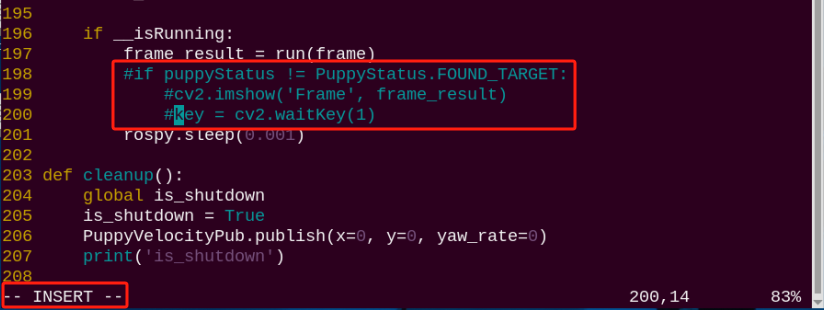
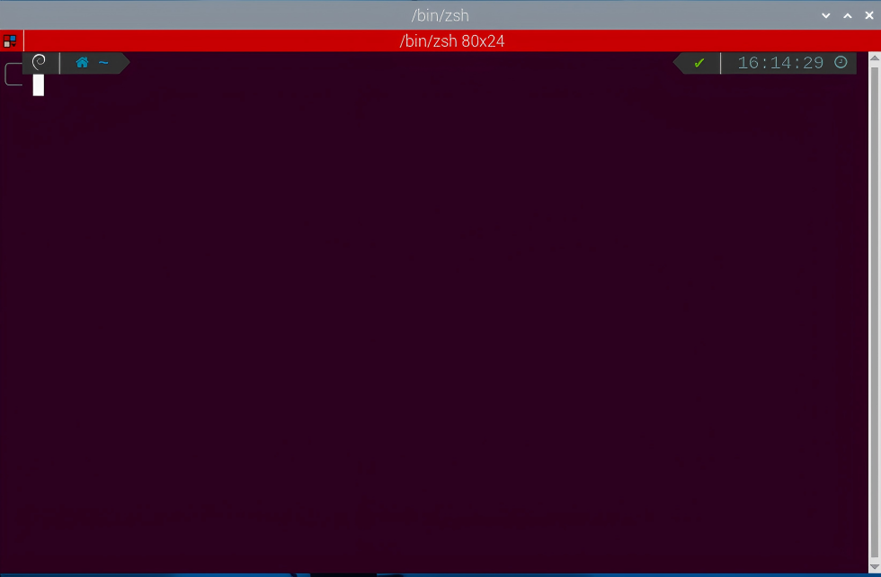

#  3. Remote Tool Installation and Docker Entry Method

<p id="anchor_3_1"></p>

## 3.1. VNC Installation and Connection

**3.1.1 Preparation**

* **Hardware**

Prepare a computer. If you are using desktop computer, wireless network card is required. The network card should support 5G band.

* **Install VNC**

VNC is a graphical remote desktop control software. Through connecting your computer to the WiFi generated by Raspberry Pi, you can control Raspberry Pi. Installation of VNC is as below.

(1) Double-click the installation program **"VNC-Viewer-6.17.731-Windows"** in the same directory as this section. Select the installation language as "**English**" and lick "**OK**".


(2) Click "**Next**".


(3) Tick **"I accept the terms in the License Agreement"**. Then click **"Next"**.


(4) Remain default location where the software is installed. Click **"Next"** to proceed next interface. Then directly click **"Install"**.


(5) When the installation completes, click **"Finish"**.


(6) Click  to open VNC.

* **Start Robot**

Start Robot When LED1 on expansion board starts flickering and buzzer emits one beep, robot boots up successfully.

**3.1.2 Connect to Robot**

(1) After turning Robot on successfully, the default mode is AP direct connection mode. Robot generates a WiFi starting with HW. Connect your computer to this WiFi.


(2) Input password. The password is **"hiwonder"**.


(3) After connection, open VNC Viewer. Input the default IP address of Raspberry Pi, **192.168.149.1**, and then press Enter. If you receive security warning, select **"Continue"**.


(4) Input username and password. **(Username: pi;Password: raspberrypi)**. Click **"OK"** to enter Raspberry Pi desktop.


(5) The desktop is as pictured. If black screen occurs or only cursor leaves on the screen, restart Raspberry Pi.


**3.1.3 Introduction to Desktop**

The desktop is as pictured after connecting Robot through VNC successfully.


The following table demonstrates common functions:

<table  class="docutils-nobg" border="1" style="text-align:center;">
<colgroup>
<col  />
<col  />
</colgroup>
<tbody>
<tr>
<td >Icon</td>
<td >Function</td>
</tr>
<tr>
<td ></td>
<td ><p>Application menu. Click to select different applications.</p>
<p></p></td>
</tr>
<tr>
<td ></td>
<td >Browser.</td>
</tr>
<tr>
<td ></td>
<td >File manager.</td>
</tr>
<tr>
<td ></td>
<td >LX terminal. Click to input command line in the opened interface.</td>
</tr>
<tr>
<td ></td>
<td >Trash. You can find the files deleted here.</td>
</tr>
<tr>
<td ></td>
<td >PC software. You can adjust pan tilt and adjust color threshold on it.</td>
</tr>
<tr>
<td ></td>
<td >Full screen or exit full screen.。</td>
</tr>
<tr>
<td ></td>
<td >Exit full screen.</td>
</tr>
<tr>
<td ></td>
<td ><p>Shut down, reboot and logout</p>
<p></p></td>
</tr>
</tbody>
</table>


## 3.2 Brief Instruction to System Directory

### 3.2.1 Desktop Layout

After remotely connecting to VNC, Raspberry Pi system desktop is as follow:


Desktop mainly includes the following programs:

|                                                 Icon                                              | Function |
|:-------------------------------------------------------------------------------------------------------:|:--:|
|   | PuppyPi PC Software contains action programming and calling functions, etc. |
|   | Color model parameter adjustment tool |
|   | Command line terminal, which is used to input command to operate |
|   | Trash |
|   | Application menu |
|  | System file management |

### 3.2.2 Program Structure

:::{Note}

The entered command should be case sensitive, as well as spaces. And **"TAB"** key can auto-complement key words.

:::

(1) Click the icon on the top left corner of the desktop to open the command line terminal.

(2) Input "**ls**" command, then press enter to list all the current files.

```bash
ls
```



|     **Name**     |                      Function                      |
| :--------------: | :------------------------------------------------: |
|     puppypi      | Store PuppyPi's debugging scripts and other files. |
| hiwonder-toolbox |               Wi-Fi management tool                |

Since the functionalities, play features, and source code of PuppyPi are all stored in a Docker container, you need to enter the container to view them.

(1)  Click the icon  on the upper left corner to open the Terminator terminal.



(2) In the command line terminal, enter the command "**docker ps -a**" and press Enter to display the currently running and previously run containers. The container id is the ID of the container, the image is the name of the image used by the container, created is the container creation time, and status is the current state of the container.

```bash
docker ps -a
```


(3) Based on the obtained container ID (unique), enter the command "**docker exec -it -u ubuntu -w /home/ubuntu 82df /bin/bash**" (The container ID can be abbreviated as long as it uniquely identifies the container) to access the container containing the functional programs.

```bash
docker exec -it -u ubuntu -w /home/ubuntu 82df /bin/bash
```


(4) Enter the command "**ls**" and press Enter to list all the current files. Focus on these two directories, as shown below:

```bash
ls
```


|   Name   |                           Function                           |
| :------: | :----------------------------------------------------------: |
| puppypi  | The ROS workspace storing PuppyPi's functionalities and play features |
|  share   |        The shared drive with the Raspberry Pi system         |
| softwave | Store the upper computer and color threshold adjustment tools, etc. |

(5) Next, you will proceed the game and program source code directory. Input command to list all the folders and files of this directory.

```bash
cd puppypi/src/
```

```bash
ls
```


The following table is the program directory:

|           Name           |                           Function                           |
| :----------------------: | :----------------------------------------------------------: |
| puppy_advanced_functions | Store the program used in "**9. Ros Robot Comprehensive Development Course**" |
|      puppy_control       |           Store gait, joystick and other programs.           |
| puppy_standard_functions |            Store "**8. ROS Robot AI Visual Course**".            |

The following table lists game files and their corresponding descriptions:

|      Name       |       Function        |
| :-------------: | :-------------------: |
| apriltag_detect |    Tag recognition    |
|  color_detect   |   Color recognition   |
|   face_detect   |    Face detection     |
| object_tracking |    Target tracking    |
|  visual_patrol  | Visual Line Following |

## 3.3 Docker Container Introduction and Entry

### 3.3.1 Docker Introduction

Docker, an open-source platform and tool, helps you to package, distribute, and run apps within containers. Container is a lightweight, independent, executable software package that includes the application code, runtime environment, system tools, system libraries and settings. Docker allows developers to package applications along with their dependencies, not just the application itself, facilitating rapid and consistent deployment across different environments. 
In technical terms, Docker utilizes Linux containerization technology of operating system, making the isolation between applications more efficient. And it can run multiple containers on the same physical machine, with each container being independent and not affecting each other.
After all, Docker can be understood as a tool that makes applications and their dependencies more portable and easier to manage, bringing great convenience to software development and deployment.


<p style="margin:0 auto 24px">Docker Sign</p>

You can go to "**Docker Container Basic Course**" or relevant Docker websites to learn Docker.

Docker official website：[http://www.docker.com](http://www.docker.com)

Docker Chinese website：[https://www.docker-cn.com](https://www.docker-cn.com)

Docker Hub (warehouse) official website：[https://hub.docker.com](https://hub.docker.com)

### 3.3.2 Docker General Commands

All the games and programs of this product will be run in the Docker container. In order to help users to quickly understand and get started with this product, the following introduces the general commands of Docker. 

(1) Start up the device and connect it with VNC remote connection tool according to "[**3.1 VNC Installation and Connection**](#anchor_3_1)".

(2)  Click the icon  on the left top corner of the system desktop to open Terminator terminal. 

<p id="anchor_3_3_2_1"></p>

* **Check Containers**

Command parameters instruction：`docker ps [OPTIONS]`

General parameters instruction:

(1) -a ：list all currently running containers + containers that have been run in the past.

(2) -l ：display recently created containers

(3) -n=? ：display recently created n containers

(4) -q ：silent mode, only display container number

In the command line terminal, enter "**docker ps -a**" to display running and previously run containers. "**container id**" is the ID of containers, "**image**" is the image name of this container, "**created**" is the created time of the container, "**status**" is current state of container.

```bash
docker ps -a
```


* **Enter Containers**

According to "[**3.3.2 Docker General Commands -> Check Containers**](#anchor_3_3_2_1)" to get container ID (the only one). Input command "**docker exec -it -u ubuntu -w /home/ubuntu 82df /bin/bash**" to enter the container where the functional program is installed. The container ID can be abbreviated as long as it is the unique identification of this container.

```bash
docker exec -it -u ubuntu -w /home/ubuntu 82df /bin/bash
```


* **Exit Containers**

There are two commands to exit containers:

(1) Input "**exit**" directly in terminal and press enter key. While the container will stop running and exit.

```bash
exit
```


(2)  Use the shortcut key combination **"ctrl+P+Q"**. The container will exit directly but remain running. You can input command "**docker ps**" in terminal to check the running containers. 

```bash
docker ps
```


### 3.3.3 Convenient Tool Usage (MUST READ)

It is inconvenient to input command in the terminator terminal every time. Therefore, you can set command to enter the container in the terminator tool. 


(1)  Right-click the terminator window, and click "**Preference**".


(2) Select **"Profiles->Command"**.


(3)  In the  column, input command **"xhost + && docker exec -it -u ubuntu -w /home/ubuntu puppypi /bin/zsh"** to enter the container. 

:::{Note}

82df is the container ID of the container with the functional games.

:::

```bash
xhost + && docker exec -it -u ubuntu -w /home/ubuntu puppypi /bin/zsh
```


(4)  Then click to close. In this way, every time you open the terminal, you can enter directly to the container with the functional program. 


