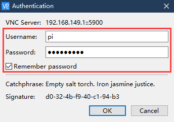
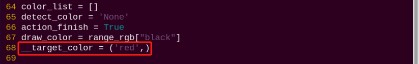
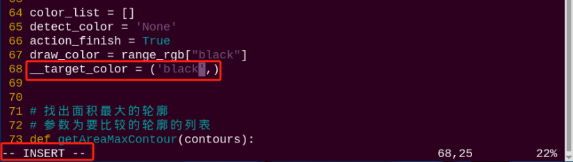

# 远程工具安装及容器进入方法

<p id="anchor_1"></p>

## 1. 远程桌面工具安装与连接

### 1.1 准备工作

- #### 硬件准备

准备一台笔记本电脑，如使用台式电脑请自备无线网卡 (需支持5G频段) 。

- ####  VNC远程工具的安装

VNC是一款图形化远程控制软件。通过连接树莓派的Wi-Fi热点，可以直接在电脑端控制树莓派，VNC的安装步骤如下：

1)  双击本节目录下的安装程序"**VNC-Viewer-6.17.731-Windows**"，将安装语言选择为"**English**"，并点击"**OK**"按键。


2)  点击"**Next**"按键。


3)  勾选同意协议，并点击"**Next**"按键。


4)  保持默认安装位置，并点击"**Next**"按键。跳转至下一界面时，直接点击"**Install**"按键。


5)  等待片刻后，出现安装完成的提示界面，点击"**Finish**"按键即可。


6)  安装完成，点击图标即可打开VNC。

1.3 设备开机

参照"**[学前先看\2. 首次开机](https://docs.hiwonder.com/projects/PuppyPi/en/latest/docs/1_read_before_studying.html#id4)**"课程，打开设备开关，将设备开机。稍等片刻后，扩展板上的LED1会开始闪烁，蜂鸣器会鸣叫一次，代表设备开机成功。

### 1.2 设备连接

1)  PuppyPi开机成功后，默认连接模式是AP直连模式，此时将会产生一个以"HW"开头的热点，我们可以在电脑端搜索并连接这个热点，如下图所示：


2)  点击连接，输入密码"**hiwonder**"。


3)  连接成功后，打开VNC Viewer，在地址栏输入树莓派默认的IP地址：192.168.149.1，按下回车。如果出现安全连接相关的提示框，点击"Continue"按键即可。  


4)  在账号登录窗口填写所需信息，账号栏（Username）输入"**pi**"，密码栏（Password）输入"**raspberrypi**"，并勾选记住密码（Remember password）。点击"OK"按键后，便可远程打开树莓派桌面。



5)  桌面如下图所示。（如果出现黑屏，只显示鼠标指针，可尝试重启树莓派。）


### 2.3 界面介绍

通过VNC成功连接PuppyPi之后，操作界面如下所示：


下表为常用功能说明：

<table class="docutils-nobg" border="1">
<tbody>
<tr>
<td style="text-align: center;">图标</td>
<td style="text-align: center;">功能</td>
</tr>
<tr>
<td style="text-align: center;"></td>
<td style="text-align: center;"><p>应用菜单，点击之后可选择不同应用。</p>
<p></p></td>
</tr>
<tr>
<td style="text-align: center;"></td>
<td style="text-align: left;">系统自带浏览器</td>
</tr>
<tr>
<td style="text-align: center;"></td>
<td style="text-align: left;">文件管理器</td>
</tr>
<tr>
<td style="text-align: center;"></td>
<td style="text-align: left;">LX终端，点击之后，可在打开界面输入命令行。</td>
</tr>
<tr>
<td style="text-align: center;"></td>
<td style="text-align: left;">回收站，可找回近期删除的文件。</td>
</tr>
<tr>
<td style="text-align: center;"></td>
<td style="text-align: left;">PuppyPi上位机，集动作编辑、调用等功能</td>
</tr>
<tr>
<td style="text-align: center;"></td>
<td style="text-align: left;">上位机软件，可通过此软件调整云台舵机位置、调节颜色阈值。</td>
</tr>
<tr>
<td style="text-align: center;"></td>
<td style="text-align: left;">点击可使系统桌面显示全屏或退出全屏。</td>
</tr>
<tr>
<td style="text-align: center;"></td>
<td style="text-align: left;">退出全屏。</td>
</tr>
<tr>
<td style="text-align: center;"></td>
<td style="text-align: center;"><p>电源，点击可选择关机、重启、退出</p>
<p></p></td>
</tr>
</tbody>
</table>


## 2. 系统目录简要说明

### 2.1.桌面分布

通过VNC远程连接后，树莓派系统桌面如下图所示：


其中我们主要看下面这6个图标：

|                                                 **图标**                                                  | **功能说明** |
|:-------------------------------------------------------------------------------------------------------:|:--:|
|   | PuppyPi上位机，集动作编辑及调用、坐标设置等功能 |
|   | 颜色模型参数调节工具 |
|   | 命令行终端，用于输入指令进行操作 |
|   | 回收站 |
|   | 树莓派菜单栏 |
|  | 系统文件夹 |

### 2.2 程序结构说明

指令的输入需严格区分大小写及空格，关键词支持"**TAB**"键补齐。

1)  点击桌面左上角终端图标，或者按下"**Ctrl+Alt+T**"，打开命令行终端。


2)  输入指令，然后按下回车，列出当前所有文件。主要来看这两个目录，如下图所示：

```commandline
ls
```


|    **目录名**    |          **作用**           |
|:----------------:|:---------------------------:|
|     puppypi      | 存放puppypi的调试脚本等文件 |
| hiwonder-toolbox |        Wi-Fi管理工具        |

由于puppypi的功能玩法和程序源码都存放于Docker容器中，需要进入容器后进行查看。

1)  点击系统桌面左上角的图标，打开Terminator终端。


2)  在命令行终端，输入指令，然后按下回车，显示出正在运行和历史运行过的容器。其中container id是容器的ID，image是该容器使用的镜像名称，created是容器创建时间，status是容器当前状态。

```commandline
docker ps -a
```



3)  根据得到容器ID（唯一），输入指令，进入装有功能程序的容器中。（容器的ID可以简写，只要是该容器唯一标识即可）

```commandline
docker exec -it -u ubuntu -w /home/ubuntu 82df /bin/bash
```



4)  输入指令，然后按下回车，列出当前所有文件。主要来看这两个目录，如下图所示：

```commandline
ls
```


| **目录名** |             **作用**             |
|:----------:|:--------------------------------:|
|  puppypi   | 存放puppypi功能玩法的ROS工作空间 |
|   share    |      与树莓派系统的共享盘符      |
|  softwave  |  存放上位机和颜色阈值调节工具等  |

5)  接下来进入玩法及程序源码目录，输入指令，列出该目录下的所有文件夹及文件。

```commandline
cd puppypi/src/
```

```commandline
ls
```


下表是程序目录：

|        **目录名**        |              **目录作用**               |
|:------------------------:|:---------------------------------------:|
| puppy_advanced_functions | 存放ROS机器狗台阶攀爬、追踪踢球等课程。 |
|      puppy_control       |         存放步态、手柄等程序。          |
| puppy_standard_functions |        存放ROS机器狗AI视觉课程。        |

下表是玩法文件及其对应说明：

|   **目录名**    | **目录作用** |
|:---------------:|:------------:|
| apriltag_detect |   标签识别   |
|  color_detect   |   颜色识别   |
|   face_detect   |   人脸检测   |
| object_tracking |   目标追踪   |
|  visual_patrol  |   视觉巡线   |

## 3. Docker容器介绍及进入

### 3.1 Docker介绍

Docker是一种开源平台和工具，它可以帮助您在容器中打包、发布和运行应用程序。容器是一种轻量级、独立、可执行的软件打包，包含了应用程序的代码、运行时、系统工具、库以及设置。Docker允许开发者将应用程序与其依赖项一起打包（而不仅仅是应用本身），以便在不同的环境中快速而一致地部署。

在技术上，Docker使用了Linux操作系统的容器化技术，使得应用程序之间的隔离更高效，并且可以在同一台物理机器上运行多个容器，每个容器相互独立，相互之间不会产生影响。

总而言之，Docker可以被理解为一种使应用程序和其依赖变得更加可移植和易于管理的工具，为软件开发和部署带来了很大的便利性。


<p style="margin:0 auto 24px">Docker标志</p>

关于Docker的学习，用户可前往课程资料的"**通用课程\ Docker容器基础课程**"的相关课程或Docker相关网站进行了解和学习。

Docker官网：http://www.docker.com

Docker中文网站：https://www.docker-cn.com

Docker Hub（仓库）官网：https://hub.docker.com

### 3.2 Docker常用指令

本产品的所有功能玩法和程序，都会放置在Docker容器中运行。为了用户能快速了解和上手该产品，以下进行Docker常用指令的介绍。

1)  将设备开机，并参照课程资料的"**[远程工具安装及容器进入方法\1. 远程桌面工具安装与连接](#anchor_1)**"内容，通过VNC远程连接工具连接。


2)  点击系统桌面左上角的图标，打开Terminator终端。


当前为树莓派系统的终端。

<p id="anchor_3_2_1"></p>

- #### 3.2.1 查看容器

:::{Note}

设备出厂时已设定进入了容器，此处用户仅作了解即可。

:::

命令参数说明 ：**docker ps \[OPTIONS\]**

常用参数说明 ：

1.  -a ：列出当前所有正在运行的容器 + 历史运行过的容器

2.  -l ：显示最近创建的容器

3.  -n=? ：显示最近n个创建的容器

4.  -q ：静默模式，只显示容器编号

在命令行终端，输入指令，然后按下回车，显示出正在运行和历史运行过的容器。其中container id是容器的ID，image是该容器使用的镜像名称，created是容器创建时间，status是容器当前状态。

```commandline
docker ps -a
```


- #### 3.2.2 进入容器

:::{Note}

设备出厂时已设定进入了容器，此处用户仅作了解即可。

:::

根据 [3.2.1 查看容器](#anchor_3_2_1) 得到容器ID（唯一），输入指令，进入装有功能程序的容器中。（容器的ID可以简写，只要是该容器唯一标识即可）

```commandline
docker exec -it -u ubuntu -w /home/ubuntu 82df /bin/bash
```


- #### 3.2.3 退出容器

一共有两种退出容器的指令：

1)  直接在终端输入指令，按下回车，此时容器会停止运行并退出。

```commandline
exit
```


2)  使用快捷键组合"**crtl+P+Q**"，此时容器会直接退出但不停止运行，我们可以在终端输入指令,查看到正在运行的容器。

```commandline
docker ps
```


### 3.3 便捷工具使用（必看）

每次进入容器之前都需要输入在terminator终端输入指令，这就很麻烦，可以在terminator工具里面设置进入容器的指令。


1)  在terminator窗口右键，选择"**Preference**"点击。


2)  选择**Profiles→Command**。


3)  在方框内"**√**"中，输入"**host + && docker exec -it -u ubuntu -w /home/ubuntu puppypi /bin/zsh**"进入容器的指令。（注意：**puppypi** 是装有功能玩法的容器名称）

```commandline
host + && docker exec -it -u ubuntu -w /home/ubuntu puppypi /bin/zsh
```


4)  然后点击关闭，这样每次开启terminal，可以直接进入装功能程序的容器中。


