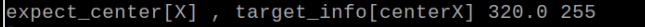
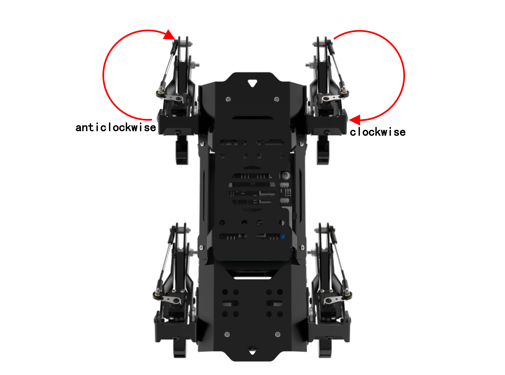
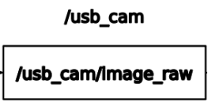
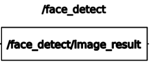
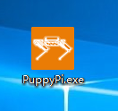
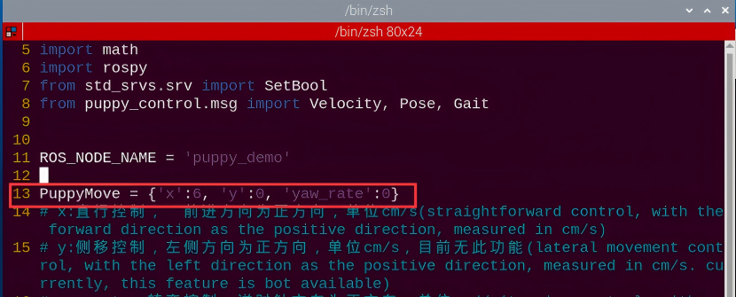
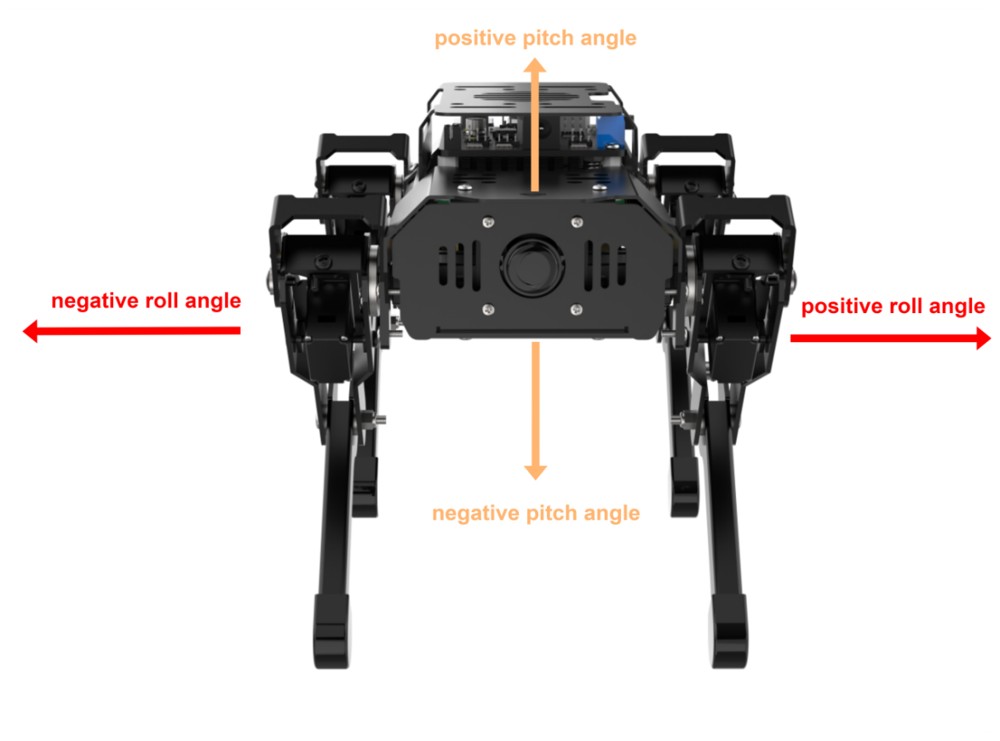
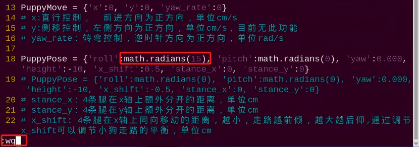
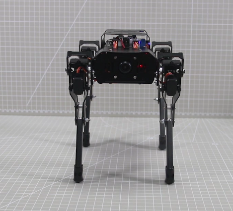

# ROS机器狗运动控制课程

<p id="anchor_1"></p>

## 1. Trot步态了解

### 1.1 步态概念说明

步态是对动物走路特征进行周期性的总结描述。通俗而言，就是描述动物是如何走路的。四足动物常见的步态特征有小跑（Trot）、行走（Walk）、缓行（Amble）和踱步（Pace）等。

下表列举了步态说明中部分常见名词：

| **名词** |                          **说明**                          |
|:--------:|:----------------------------------------------------------:|
|   相位   |            最直接理解是角度，周期运动中的位置。            |
|  相位差  |              不同腿之间运动超前或滞后的差异。              |
|  摆动相  |                  腿部抬起，处于腾空状态。                  |
|  支撑相  |                     腿部处于着地状态。                     |
|   周期   | 行进过程中，一侧足跟从着地到下一次着地的全过程是一个周期。 |
| 步态频率 |                单位时间内完成的步态周期数。                |
|   步长   |         一个周期内，从抬腿到着地，足端移动的距离。         |
|   步幅   |                一个周期内，机身移动的距离。                |
|  占空比  |           单腿处于支撑相的时间与步态周期的比值。           |

### 1.2 Trot步态说明 

Trot步态是一种中低速的动步态，通俗而言就是前后交叉的腿，同时抬起与落地。该步态具有较大的运动速度范围，兼具稳定性与速度，是最常用的四足步态。

当PuppyPi机器狗处于Trot步态，其对角线上的脚同时着地。接下来会以下图为例，对Trot步态进行分析说明：


如图（a）所示，PuppyPi机器狗的1、2号腿抬起并向前摆动，3、4号腿则用于支撑机身，确保机器狗重心位于对角线交汇处。此时，1、2号腿为摆动相，3、4号腿为支撑相。

如图（b）所示，4条腿同时着地，1、2、3、4号腿都为支撑相。

如图（c）所示，3、4号腿抬起并向前摆动，1、2号腿则用于支撑机身，确保机器狗重心位于对角线交汇处。此时，3、4号腿为摆动相，1、2号腿为支撑相。

如图（d）所示，4条腿同时着地，1、2、3、4号腿都为支撑相。

当完成（a）、（b）、（c）和（d）4组动作时。此时，PuppyPi机器狗即完成了一个完整周期的动作。

### 1.3 玩法开启及关闭步骤

:::{Note}
输入指令时需要严格区分大小写，且可使用"Tab"键补齐关键词。
:::

(1)  启动PuppyPi机器狗，通过VNC远程连接树莓派桌面。

(2)  点击系统桌面左上角的图标，打开Terminator终端。

(3)  输入指令，并按下回车，打开程序文件。

```bash
rosed puppy_control puppy_demo.py
```

(4)  可以在下图所示位置中找到调用步态的代码，程序默认是执行Trot步态，所以可以直接调用运行。


(5)  这里我们无需任何修改，按下"**Esc**"，输入指令，退出并保存。

```bash
:wq
```

(6)  输入指令，并按下回车，启动玩法。

```bash
rosrun puppy_control puppy_demo.py
```

(7) 如需关闭此玩法，可在终端界面按下"**Ctrl+C**"。若关闭失败，请反复尝试。

### 1.4 实现效果

玩法开启后，PuppyPi机器狗会以Trot步态行进，对角的两腿成对运动，同时抬起或着地。下图是相位关系：


### 1.5 程序参数说明

[下载源代码（puppy_demo.py）](https://store.hiwonder.com.cn/docs/PuppyPi/pi5/source_code/9/puppy_demo.py)

(1) **步态选择**

程序内提供了三种步态：Trot步态、Amble步态、Walk步态。其中，Trot步态是程序默认的初始步态。


若需要修改步态选择，可将当前步态对应的代码进行修改操作，比如更改为Walk步态，直接在红框内将"**Trot**"修改为"**Walk**"即可。


(2) **行走频率调节**

通过修改下方对应参数，可调整该步态下的行走频率。时间越短，频率越快，时间越长，频率越慢。


其中，括号内的参数含义如下：

第一个参数"**overlap_time**"是4脚全部着地的时间，单位为秒；

第二个参数"**swing_time**"是单脚离地的时间，单位为秒；

第三个参数"**clearance_time**"是前后交叉脚相位的间隔时间，单位为秒；

第四个参数"**z_clearance**"是机器狗走路时，脚尖要抬高的距离，单位为厘米。

Trot步态下需要注意，设置的时候，clearance_time必须为0。

Trot步态下需要注意，设置的时候需遵循clearance_time=0，overlap_time＞0，swing_time＞0条件。如果想要更好的观察，我们可以延长swing_time和overlap_time时间，但频率变慢以后，走路稳定性会受到影响。例如我们这里将swing_time改为5，overlap_time改为2。


## 2. Walk步态了解

### 2.1 步态概念说明

步态是对动物走路特征进行周期性的总结描述。通俗而言，就是描述动物是如何走路的。四足动物常见的步态特征有小跑（Trot）、行走（Walk）、缓行（Amble）和踱步（Pace）等。

下表列举了步态说明中部分常见名词：

| **名词** |                          **说明**                          |
|:--------:|:----------------------------------------------------------:|
|   相位   |            最直接理解是角度，周期运动中的位置。            |
|  相位差  |              不同腿之间运动超前或滞后的差异。              |
|  摆动相  |                  腿部抬起，处于腾空状态。                  |
|  支撑相  |                     腿部处于着地状态。                     |
|   周期   | 行进过程中，一侧足跟从着地到下一次着地的全过程是一个周期。 |
| 步态频率 |                单位时间内完成的步态周期数。                |
|   步长   |         一个周期内，从抬腿到着地，足端移动的距离。         |
|   步幅   |                一个周期内，机身移动的距离。                |
|  占空比  |           单腿处于支撑相的时间与步态周期的比值。           |

### 2.2 Walk步态说明

Walk步态是静步态，即任何时刻至少有3条腿着地，至多有1条腿摆动。

PuppyPi机器狗的摆动腿轮换顺序为：右前-\>左后-\>左前-\>右后，对应下图序号为：1-\>2-\>3-\>4。接下来会以下图为例，对Walk步态进行分析说明：


如图（a）所示，PuppyPi机器狗的1号腿抬起并向前摆动，2、3、4号腿则用于支撑机身。此时，1号腿为摆动相，2、3、4号腿为支撑相。

如图（b）所示，4条腿同时着地，1、2、3、4号腿都为支撑相。

如图（c）所示，PuppyPi机器狗的2号腿抬起并向前摆动，1、3、4号腿则用于支撑机身。此时，2号腿为摆动相，1、3、4号腿为支撑相。

如图（d）所示，4条腿同时着地，1、2、3、4号腿都为支撑相。

如图（e）所示，PuppyPi机器狗的3号腿抬起并向前摆动，1、2、4号腿则用于支撑机身。此时，3号腿为摆动相，1、2、4号腿为支撑相。

如图（f）所示，4条腿同时着地，1、2、3、4号腿都为支撑相。

如图（g）所示，PuppyPi机器狗的4号腿抬起并向前摆动，1、2、3号腿则用于支撑机身。此时，4号腿为摆动相，1、2、3号腿为支撑相。

如图（h）所示，4条腿同时着地，1、2、3、4号腿都为支撑相。

当完成（a）、（b）、（c）、（d）、（e）、（f）、（g）和（h）8组动作时。此时，PuppyPi机器狗即完成了一个完整周期的动作。

### 2.3 玩法开启及关闭步骤

:::{Note}
输入指令时需要严格区分大小写，且可使用"Tab"键补齐关键词。
:::

(1)  启动PuppyPi机器狗，通过VNC远程连接树莓派桌面。

(2)  点击系统桌面左上角的图标，打开Terminator终端。

(3)  输入指令，并按下回车，打开程序文件。

```bash
rosed puppy_control puppy_demo.py
```

(4)  可以在下图所示位置中找到调用步态的代码，程序默认是执行Trot步态。按下"I"键，进入编辑模式。



(5)  将"**Trot**"修改为"**Walk**"。


(6)  修改完成后，按下"Esc"键，输入"指令并按下回车，进行保存与退出。

```bash
:wq
```

(7)  输入指令，并按下回车，启动玩法。

```bash
rosrun puppy_control puppy_demo.py
```

(8)  如需关闭此玩法，可在终端界面按下"**Ctrl+C**"。若关闭失败，请反复尝试。

### 2.4 实现效果

玩法开启后，PuppyPi机器狗会以Walk步态前进，任意时刻始终有三条腿着地，至多有一条腿抬起。下图是相位关系：


### 2.5 程序参数说明

[下载源代码（puppy_demo.py）](https://store.hiwonder.com.cn/docs/PuppyPi/pi5/source_code/9/puppy_demo.py)

(1) **步态选择**

程序内提供了三种步态：Trot步态、Amble步态、Walk步态。其中，Trot步态是程序默认的初始步态。


若需要修改步态选择，可将当前步态对应的代码进行修改操作，比如更改为Walk步态，直接在红框内将"**Trot**"修改为"**Walk**"即可。


(2) **行走频率调节**

通过修改对应参数。可以调整PuppyPi机器狗的行走频率。时间越短，频率越快。时间越长，频率越慢。


其中，括号内的参数含义如下：

第一个参数"**overlap_time**"是4脚全部着地的时间，单位为秒；

第二个参数"**swing_time**"是单脚离地的时间，单位为秒；

第三个参数"**clearance_time**"是前后交叉脚相位的间隔时间，单位为秒；

第四个参数"**z_clearance**"是机器狗走路时，脚尖要抬高的距离，单位为厘米。

Walk步态下需要注意，设置的时候需遵循clearance_time＞swing_time，overlap_time＞0条件。如果想要更好的观察，我们可以延长clearance_time、swing_time和overlap_time时间，但频率变慢以后，走路稳定性会受到影响。例如我们这里将clearance_time改为5，swing_time改为3，overlap_time改为2。


## 3. Amble步态了解

### 3.1 步态概念说明

步态是对动物走路特征进行周期性的总结描述。通俗而言，就是描述动物是如何走路的。四足动物常见的步态特征有小跑（Trot）、行走（Walk）、缓行（Amble）和踱步（Pace）等。

下表列举了步态说明中部分常见名词：

| **名词** |                          **说明**                          |
|:--------:|:----------------------------------------------------------:|
|  相位差  |              不同腿之间运动超前或滞后的差异。              |
|  摆动相  |                  腿部抬起，处于腾空状态。                  |
|  支撑相  |                     腿部处于着地状态。                     |
|   周期   | 行进过程中，一侧足跟从着地到下一次着地的全过程是一个周期。 |
| 步态频率 |                单位时间内完成的步态周期数。                |
|   步长   |         一个周期内，从抬腿到着地，足端移动的距离。         |
|   步幅   |                一个周期内，机身移动的距离。                |
|  占空比  |           单腿处于支撑相的时间与步态周期的比值。           |

### 3.2 Amble步态说明

Amble步态是静步态，可以将其视为加速后的Walk步态。在运动过程中至少有两台条腿处于支撑相，最多有两条腿处于摆动相。

由于Amble步态的实现过程与Walk步态的相同类似，所以摆动腿轮换顺序依然为：右前-\>左后-\>左前-\>右后，对应下图序号为：1-\>2-\>3-\>4。


同Walk的区别在于：Walk步态是在第1条腿放下后再抬起第2条腿。而Amble步态则是在第1条腿抬起后，还未放下时，就开始抬起第2条腿。比如说右前腿抬起后，在还未放下时，左后腿即开始抬起。

### 3.3 玩法开启及关闭步骤

:::{Note}
输入指令时需要严格区分大小写，且可使用"Tab"键补齐关键词。
:::

(1)  启动PuppyPi机器狗，通过VNC远程连接树莓派桌面。

(2)  点击系统桌面左上角的图标，打开Terminator终端。

(3)  输入指令，并按下回车，打开程序文件。

```bash
rosed puppy_control puppy_demo.py
```

(4)  可以在下图所示位置中找到调用步态的代码，程序默认是执行Trot步态。按下"**I**"键，进入编辑模式。


(5)  将"**Trot**"修改为"**Amble**"。


(6)  修改完成后，按下"**Esc**"键，输入指令并回车，进行保存与退出。

```bash
:wq
```

(7)  输入指令，并按下回车，启动玩法。

```bash
rosrun puppy_control puppy_demo.py
```

(8)  如需关闭此玩法，可在终端界面按下"**Ctrl+C**"。若关闭失败，请反复尝试。

### 3.4 实现效果

PuppyPi机器狗会以Amble步态行进，至少有两台条腿处于支撑相，最多有两条腿处于摆动相。Amble步态相当于加速后的Walk步态。下图是相位关系：


### 3.5 程序参数说明

[下载源代码（puppy_demo.py）](https://store.hiwonder.com.cn/docs/PuppyPi/pi5/source_code/9/puppy_demo.py)

该程序的源代码位于Docker容器中的：**/home/ubuntu/puppypi/src/puppy_control/scripts/puppy_demo.py**

(1) **步态选择**

程序内提供了三种步态：Trot步态、Amble步态、Walk步态。其中，Trot步态是程序默认的初始步态。


若需要修改步态选择，可将当前步态对应的代码进行修改操作，比如更改为Amble步态，直接在红框内将"**Trot**"修改为"**Amble**"即可。


(2) **行走频率调节**

通过修改对应参数。可以调整PuppyPi机器狗的行走频率。时间越短，频率越快。时间越长，频率越慢。


其中，括号内的参数含义如下：

第一个参数"**overlap_time**"是4脚全部着地的时间，单位为秒；

第二个参数"**swing_time**"是单脚离地的时间，单位为秒；

第三个参数"**clearance_time**"是前后交叉脚相位的间隔时间，单位为秒；

第四个参数"**z_clearance**"是机器狗走路时，脚尖要抬高的距离，单位为厘米。

Amble步态下需要注意，设置的时候需遵循0\<clearance_time\<swing_time，overlap_time＞0条件。如果想要更好的观察，我们可以延长clearance_time、swing_time和overlap_time时间，但频率变慢以后，走路稳定性会受到影响。例如我们这里将clearance_time改为3，swing_time改为5，overlap_time改为2。


## 4. Trot步态原地踏步

关于Trot步态的详细说明，可前往目录"**[ROS机器狗运动控制课程\ 1. Trot步态了解](#anchor_1)**"查看文档。

### 4.1 玩法开启及关闭步骤

:::{Note}
输入指令时需要严格区分大小写，且可使用"Tab"键补齐关键词。
:::

(1)  启动PuppyPi机器狗，通过VNC远程连接树莓派桌面。

(2)  点击系统桌面左上角的图标，打开Terminator终端。

(3)  输入指令，并按下回车，打开程序文件。

```bash
rosed puppy_control puppy_demo.py
```


(4)  找到下图所示代码：


(5)  点击"**i**"键进入编辑模式。将代码修改为"**set_mark_time_srv(True)**"。


(6)  修改完成后，按下"**Esc**"键，输入指令并回车，进行保存与退出。

```bash
:wq
```

(7)  输入指令，并按下回车，启动玩法。

```bash
rosrun puppy_control puppy_demo.py
```

(8)  如需关闭此玩法，可在终端界面按下"**Ctrl+C**"。若关闭失败，请反复尝试。

### 4.2 实现效果 

玩法开启后，PuppyPi机器狗会以Trot步态下进行原地踏步，对角的两腿成对运动，同时原地抬起或着地。下图是相位关系：


### 4.3 程序参数说明 

该程序的源代码位于Docker容器中的：**/home/ubuntu/puppypi/src/puppy_control/scripts/puppy_demo.py**

通过发送对应的服务请求，可使PuppyPi机器狗进行原地踏步。


其中，括号内的参数用于控制是否发送服务，初始默认为"**False**"，即不发送服务，启动玩法后，PuppyPi机器狗会以当前选择步态行进。值为"**True**"时，机器狗会执行原地踏步。

此外，在原地踏步的过程中，PuppyPi机器狗若出现位置偏移，可以通过调整其中心来解决此问题，关于重心调节详细内容，可参考"**[ROS机器狗运动控制课程\ 6. 机器狗重心调节](#anchor_6)**"。

## 5. Trot步态转弯

关于Trot步态的详细说明，可前往目录"**[ROS机器狗运动控制课程\1. Trot步态了解](#anchor_1)**"查看文档。

本节课会以Trot步态为基础，通过修改对应参数，令PuppyPi机器狗在Trot步态下进行前进转弯。

### 5.1 玩法开启及关闭步骤

:::{Note}
输入指令时需要严格区分大小写，且可使用"Tab"键补齐关键词。
:::

(1)  启动PuppyPi机器狗，通过VNC远程连接树莓派桌面。

(2)  点击系统桌面左上角的图标，打开Terminator终端。

(3)  输入指令，并按下回车，打开程序文件。

```bash
rosed puppy_control puppy_demo.py
```

(4)  找到下图所示代码：


(5)  点击"**i**"键进入编辑模式。例如将机器狗逆时针转0.18rad/s，转换后代码应修改为"**PuppyMove = {'x':6, 'y':0, 'yaw_rate':0.18}**"。


(6)  修改完成后，按下"**Esc**"键，输入指令并按下回车，进行保存与退出。

```bash
:wq
```

(7)  输入指令，并按下回车，启动玩法。

```bash
rosrun puppy_control puppy_demo.py
```

(8)  如需关闭此玩法，可在终端界面按下"Ctrl+C"。若关闭失败，请反复尝试。

### 5.2 实现效果

PuppyPi机器狗会在Trot步态下，且持续朝设定的方向前进转弯。

### 5.3 程序参数说明

[下载源代码（puppy_demo.py）](https://store.hiwonder.com.cn/docs/PuppyPi/pi5/source_code/9/puppy.py)

- #### 5.3.1 移动参数调节

通过设置对应参数，可以调整PuppyPi机器狗的行进方向。


其中，括号内的参数含义如下：

第三个参数"yaw_rate"用于控制机器狗转弯，设置为正数，逆时针转弯。为负数，则顺时针转弯，数值范围为"-0.89~0.89，单位为rad/s。数值的绝对值越大，机器狗的转弯幅度越大。

这里的转动方向是以机器狗正前方摄像头为第一视角，如下图所示：



设置时，1rad/s对应57.3°/s，例如，如果转动速度设置为30°/s，"yaw_rate"的数值就是30/57.3≈0.52。

- #### 5.3.2步态调节

(1) **步态选择**

程序内提供了三种步态：Trot步态、Amble步态、Walk步态。其中，Trot步态是程序默认的初始步态。


若需要修改步态选择，可将当前步态对应的代码进行修改操作，比如更改为Walk步态，直接在红框内将"**Trot**"修改为"**Walk**"即可。


(2) **行进速度调节**

通过修改对应参数。可以调整PuppyPi机器狗的行进速度。


其中，括号内的参数含义如下：

第一个参数"**overlap_time**"是PuppyPi机器狗四条腿全部着地的时间，单位为秒。

第二个参数"**swing_time**"是机器狗单脚离地的时间，单位为秒。

第三个参数"**clearance_time**"是机器狗前后交叉脚相位间隔时间，单位为秒。

第四个参数"**z_clearance**"是走路时，机器狗脚尖要抬高的距离，单位为厘米。

<p id="anchor_6"></p>

## 6. 机器狗重心调节

### 6.1 重心说明

机器狗的重心位于机身前后左右都能平均分配的一点，所以在行走的过程中，是处于一个动态平衡状态，需要不断的调整身体其它部位以保持重心在稳定阈内。

在一般情况下，无需对机器狗的默认重心进行调节，当其需要承担其它开发需求时，则需通过将重心维持在稳定阈内，从而避免机体发生偏转、倾倒等情况。

这点可以理解为人正常走路时，抱着东西或背着东西走路时的重心是不同的，所以这是调节重心的意义。

### 6.2 程序设置说明

[下载源代码（puppy_demo.py）](https://store.hiwonder.com.cn/docs/PuppyPi/pi5/source_code/9/puppy_demo.py)

我们以默认的Trot步态为例进行说明：


如上图在程序中，参数"**x_shift**"是机器狗四条腿在X轴上同向移动的距离，范围是"**-10~10**"，单位为厘米，可通过调节该值来改变机器狗行走时的平衡。

需要注意的是数值"**-0.6**"，可称为Trot步态下默认的平衡值，由于不同步态下行走方式不一样，所以 x_shift 的平衡点值不同。

在调整该参数时，步态平衡点的值越小，机器狗向前倾幅度越大；值越大，则后仰幅度越大。

### 6.3 玩法开启及关闭步骤

此处以**PuppyPi机器狗向前倾2cm**为例，具体的操作步骤如下：

:::{Note}
输入指令时需要严格区分大小写，且可使用"Tab"键补齐关键词。
:::

(1)  启动PuppyPi机器狗，通过VNC远程连接树莓派桌面。

(2)  点击系统桌面左上角的图标，打开Terminator终端。

(3)  输入指令，并按下回车，打开程序文件。

```bash
rosed puppy_control puppy_demo.py
```

(4)  "**PuppyPose\[‘x_shift’\]**"的参数，Trot 步态默认平衡值为-0.6，我们这里把数值修改为-2，比平衡值小，所以机器狗会向前倾。更改完成后，按下"**Esc**"键，接着按下指令进行保存。

```bash
:wq
```


:::{Note}
① 该修改方法不只是适用于 Trot 步态，其他步态也同样适用。
② 本次示例大幅度调整是为了让变化效果更明显，以方便观察。实际调节时则建议小幅度范围调整。
:::

(5) 输入指令，并按下回车，即可查看调整效果。

```bash
rosrun puppy_control puppy_demo.py
```

(6)  如需关闭此玩法，可在终端界面按下"**Ctrl+C**"。若关闭失败，请反复尝试。

### 6.4 功能实现

玩法开启后，PuppyPi 机器狗就会在Trot步态下向前倾的行走。

## 7. ROS机器人基本通讯

### 7.1 通讯方式介绍

ROS系统是一个分布式计算环境，它不仅可以在一台机器人上运行多个节点，而且还可以在多台相互通信的机器人上运行，只需要这些机器在同一个网络上。

所以ROS的通信架构是ROS的灵魂，也是整个ROS能够正常运行的关键。ROS的通信方式有四种：Topic（话题）、Service（服务）、Parameter Service（参数服务器）、Actionlib（动作库）。

ROS中 话题(Topic)采用异步通信机制，它使用发布/订阅模型，数据由发布者传输到订阅者，同一个话题的订阅者或发布者可以不唯一。话题模型如下图所示：


服务(Service)采用同步通信机制，它使用客户端/服务器（C/S）模型，客户端发送请求数据，服务器完成处理后返回应答数据。服务模型如下图所示：


### 7.2 话题通讯

- #### 7.2.1 查看话题通讯

ROS机器人系统能自带RQT工具，可以通过调用对应工具，查看机器狗节点之间的通讯过程，具体的操作步骤如下：

:::{Note}
输入指令时需要严格区分大小写，且可使用"Tab"键补齐关键词。
:::

(1)  启动PuppyPi机器狗，通过VNC远程连接树莓派桌面。

(2)  点击系统桌面左上角的图标，打开Terminator终端。

(3)  输入指令，并按下回车，打开工具。

```bash
rqt_graph
```

(4)  找到下图所示代码，在界面中设置为"Nodes/Topics(all)"，显示如下图：


界面中包含当前环境下的通讯流程图，其中方框图片里的是话题信息，椭圆图片里的是节点信息。里面的通讯流程是机器人开机后，自动开启通讯的流程图。

图片中，有些节点没有发布话题，例如，这代表代码相关功能没有开启。这里开启人脸识别玩法后，再次观察通讯的流程图，显示如下：


- #### 7.2.2 话题通讯分析

为了方便理解，这里以人脸识别玩法的流程为例进行分析，所涉流程如下图：


具体步骤如下：

(1) 节点发布话题。

(2) 节点订阅节点发布的话题，同时发布话题。

(3) 节点订阅节点发布的话题。

### 7.3 服务通讯

- #### 7.3.1查看服务通讯

通过观察"**puppy.py**"文件，可以查看到机器狗的服务通讯。

[下载源代码（puppy.py）](https://store.hiwonder.com.cn/docs/PuppyPi/pi5/source_code/9/puppy.py)

通过观察，可以知道，服务通讯中主要发送"**set_running**"、"**go_home**"、"**set_self_balancing**"、"**runActionGroupFun**"和"**set_mark_time**"这些请求，如下图：


对应功能如下表格：

|      **服务**      |         **功能**         |
|:------------------:|:------------------------:|
|    set_running     |  设置机器狗的停止和启动  |
|      go_home       | 设置机器狗恢复到初始姿态 |
| set_self_balancing |     设置机器狗自平衡     |
| runActionGroupFun  |    设置机器狗的动作组    |
|   set_mark_time    |    设置机器狗原地踏步    |

## 8. ROS机器狗上位机遥控

:::{Note}
(1) 为了避免操控冲突及出现问题，在使用电脑端控制软件时，请断开手机APP控制。
(2) 如无法打开软件，可在本节目录下安装驱动包。
:::

### 8.1 上位机软件打开

在本节文件夹下将电脑端控制软件解压至任意英文路径下，然后打开文件夹内的图示应用（在打开应用时请关闭防火墙）。



### 8.2 上位机软件连接

(1)  打开机器狗的开关。

(2)  等待Ros系统启动完成以后，蜂鸣器会发出"**滴**"的一声。打开电脑（台式电脑需自备无线网卡）网络设定，选择该热点。


(3)  然后打开上位机软件，点击"**连接**"，等待片刻，上位机即可连接完成。


### 8.3 界面说明


(1) **移动控制区域**

| **图标** | **功能说明** |
|:--:|:--:|
|  | 机器狗行走时，脚尖能抬升的最大距离，单位为mm。 |
|  | 机器狗行走的速度设置，单位为mm/s。 |
|  | 一个步态完整的周期时间，单位为ms。 |
|  | 可切换Trot、Amble、Walk三种任意一个步态。 |
|  | 移动操控按钮，鼠标点按或使用对应按键皆可。 |

(2) **姿态控制区域**

| **图标** | **功能说明** |
|:--:|:--:|
|  | 调节机器狗高中低三种站立姿态。 |
|  | 俯视仰视的角度，以机器狗为第一视角；设置为正数时，机器狗仰视；负数时，机器狗俯视。数值的绝对值越大，仰视或俯视的角度越大。 |
|  | 左右倾斜的角度，以机器狗为第一视角；设置为正数时，机器狗向右倾斜；负数时，机器狗向左倾斜。数值的绝对值越大，倾斜的角度越大。 |

(3) **重心调节区域**

| **图标** | **功能说明** |
|:--:|:--:|
|  | 默认值为-5，相对默认值越小，机器狗走路越往前倾；值越大，就越往后仰。 |

## 9. 机器狗坐标系的建立

### 9.1 坐标系介绍

在控制PuppyPi机器狗运动时，可通过输入机器狗4条腿的落脚点坐标，使用逆运动学，输出所有舵机的转动角度，达到控制机器狗行走的目的。

所以说，首先需要建立机器狗的坐标体系。建立坐标系时，以机器狗的4个髋关节的中心点为原点坐标（0,0,0），设置4条腿的落脚点坐标，如下图所示：

 

设置坐标时，只需设置4条腿落脚点坐标的X轴和Z轴数值。由于Y轴方向没有舵机控制，因此控制Y轴数值设置无效。

### 9.2 坐标说明

为方便理解，这里以机器狗的站立姿态坐标为例进行说明。 机器狗的站立时对应的坐标如下图：


图片中FR、FL、BR和BL代表了机器狗的4条腿的位置。这里以机器狗为第一视角，对应位置如下表格：

|   FR   |   FL   |   BR   |   BL   |
|:------:|:------:|:------:|:------:|
| 右前方 | 左前方 | 右后方 | 左后方 |

坐标中坐标值对应的是单位为厘米的距离，站立时，PuppyPi机器狗四肢坐标皆为（0，0，-10），Z轴的坐标-10代表机器狗的落脚点和原点的垂直距离是10cm。

X轴的坐标为0，代表机器狗落脚点和原点的连线与地面垂直。 如果需要向前移动，例如移动2厘米，X轴的坐标就改为2。

## 10. 逆运动学简要分析

### 10.1 逆运动学简介

机器狗的逆运动学是其轨迹规划与控制的重要基础，逆运动学求解是否快速准确，将直接影响到机器狗轨迹规划与控制的精度，因此设计一种快速准确的逆运动学求解方法是十分重要的。

对于PuppyPi机器狗而言，逆运动学就是根据其足端坐标，求解髋关节与膝关节的旋转角度，关节位置如下图所示：


PuppyPi机器狗髋关节的旋转角度由机器狗机身上的4个舵机控制，如下图所示：


PuppyPi机器狗膝关节的旋转角度由机器狗机髋关节上的4个舵机控制，控制时使用了二连杆结构，如下图所示：


根据逆运动学分析，其求解步骤如下：

(1)  根据足端坐标，计算膝关节和髋关节的运动位置，进而求解对应舵机的旋转角度。

(2)  通过舵机的旋转角度，计算出对应数值，直接控制舵机转动，达到控制机器狗的目的。

### 10.2 案例分析

(1) **源码路径**

为方便理解，这里结合控制程序，对机器狗的逆运动学进行分析。

[下载源代码（puppy_IK_demo.py）](https://store.hiwonder.com.cn/docs/PuppyPi/pi5/source_code/9/puppy_IK_demo.py)

### 10.3 玩法开启及关闭步骤

:::{Note}
指令的输入需严格区分大小写，另外可按键盘"Tab"键进行关键词补齐。
:::

(1)  启动PuppyPi机器狗，通过VNC远程连接树莓派桌面。

(2)  点击系统桌面左上角的图标，打开Terminator终端。

(3)  输入运行程序的指令并按下回车。

```bash
rosrun puppy_control puppy_IK_demo.py
```

(4)  如需关闭此玩法，只需要在LX终端界面中按下"Ctrl+C"。如果关闭失败，可多次按下。

(5) **功能实现**

玩法开启后，PuppyPi机器狗上所有舵机会根据设置好的坐标，转动到对应角度，并在终端打印出所有舵机的转动角度。


### 10.4 程序分析

(1) **设置坐标值**

在控制机器狗状态时，需要设置4个条腿的黑色落脚点坐标，如下图：


图片中FR、FL、BR和BL代表了机器狗的4条腿的位置。这里以机器狗为第一视角，对应位置如下表格：

|   FR   |   FL   |   BR   |   BL   |
|:------:|:------:|:------:|:------:|
| 右前方 | 左前方 | 右后方 | 左后方 |

:::{Note}
设置坐标时，X轴的坐标范围为"-15 ~ +15"，Z轴的坐标范围为"-15 ~ -1"。
:::

X轴坐标设置为0时，落脚点和原点的连线与地面垂直；如果X轴坐标为正数，落脚点则在前面，如下图（绿色箭头）：


Z轴坐标设置为越大，落脚点越向上抬起，即落脚点和原点竖直方向上距离越近。

(2) **获取舵机角度值**

通过逆运动学，计算出舵机的角度值，如下图：


(3) **控制舵机转动**

根据舵机角度值，计算舵机的脉冲值，直接控制舵机转动，如下图：


(4) **显示舵机角度**

并且在终端显示舵机的角度，如下图：


数值"**joint_angles**"的单位是弧度，程序中显示"**joint_angles\*57.3**"，是将弧度转换为度数。

所有舵机对应角度，位置如下图：


下面来看下机器狗舵机角度和姿态的对应关系，以ID1和ID2舵机为例，其他舵机类似。

实验中ID1的舵机角度为57.33238425，对应的姿态如下图：


ID1舵机的角度为正数数，对应的腿部往后摆；为负数时，腿部往前摆。

ID2的舵机角度为14.31023196，对应的姿态如下图：


ID2舵机的角度为正数时，对应舵机的摆臂在水平方向下方；为负数时，摆臂在水平方向上方。

<p id="anchor_11"></p>

## 11. 姿态参数说明

### 11.1 简介

PuppyPi机器狗的姿态参数，就是指机器狗静止不动时的参数，比如站立时的高度、俯仰角、翻滚角等。

通过调节机器狗4条腿落脚点的坐标值，可以改变机器狗的姿态。设置姿态时，我们需要调用"**puppy_demo.py**"文件。

[下载源代码（puppy_demo.py）](https://store.hiwonder.com.cn/docs/PuppyPi/pi5/source_code/9/puppy_demo.py)

### 11.2 参数说明

通过更改参数，可以调节机器狗姿态（静态），参数调节位置如下所示：

```python
PuppyPose = {'roll':math.radians(0), 'pitch':math.radians(0), 'yaw':0.000, 'height':-10, 'x_shift':-0.6, 'stance_x':0, 'stance_y':0}
```

主要设置x_shift、height、pitch和roll参数，具体参数介绍，如下表格：

<table class="docutils" border="1">
<colgroup>
<col style="width: 15%" />
<col style="width: 84%" />
</colgroup>
<tbody>
<tr>
<td style="text-align: center;"><strong>参数</strong></td>
<td style="text-align: center;"><strong>说明</strong></td>
</tr>
<tr>
<td style="text-align: center;">x_shift</td>
<td><p>4个膝关节末端在x轴上同向移动的距离，用来调节机器狗移动时的平衡。相对于本身值越小，移动越前倾，越大，移动越后仰，单位为cm，范围为</p>
<p>"<strong>-10 ~ +10</strong>"。</p></td>
</tr>
<tr>
<td style="text-align: center;">height</td>
<td>机身的高度，膝关节末端到髋关节中心点的垂直距离，单位为cm，范围为"<strong>-15 ~ -5</strong>"。设置时，数值越小，高度越高</td>
</tr>
<tr>
<td style="text-align: center;">pitch</td>
<td>机身的俯仰角，单位为度（角度），范围为"<strong>-31 ~ +31</strong>"。以机器狗为第一视角，设置为正数时，机器狗仰视，负数时，机器狗俯视。数值的绝对值越大，仰视或俯视的角度越大。</td>
</tr>
<tr>
<td style="text-align: center;">roll</td>
<td>机身的滚转角，单位为度（角度），范围为"<strong>-31 ~ +31</strong>"。以机器狗为第一视角；设置为正数时，机器狗向右倾斜；负数时，机器狗向左倾斜。数值的绝对值越大，倾斜的角度越大。</td>
</tr>
</tbody>
</table>

以机器狗高度设置为10cm，俯视20°，向右倾斜15°为例，参数设置如下：

```python
PuppyPose = {'roll':math.radians(15), 'pitch':math.radians(-20), 'yaw':0.000, 'height':-10, 'x_shift':-0.6, 'stance_x':0, 'stance_y':0}
```

## 12. 站立角度调节

### 12.1 简介

通过调节参数，可以调节PuppyPi 机器狗的姿态，具体参数可以参考"**[ROS机器狗运动控制课程\11. 姿态参数说明](#anchor_11)**"文档。

这里结合控制程序，对机器狗的站立角度进行调节。

[下载源代码（puppy_demo.py）](https://store.hiwonder.com.cn/docs/PuppyPi/pi5/source_code/9/puppy_demo.py)

### 12.2 玩法开启及关闭步骤

:::{Note}
指令的输入需严格区分大小写，另外可按键盘"Tab"键进行关键词补齐。
:::

(1)  启动PuppyPi机器狗，通过VNC远程连接树莓派桌面。

(2)  点击系统桌面左上角的图标，打开Terminator终端。

(3)  输入编辑"**puppy_demo.py**"的指令，并按下回车。

```bash
rosed puppy_control puppy_demo.py
```

4)  按下"**i**"开始更改，为方便观察，需要把速度设置为0，即将"**PuppyMove**"中的参数"**x**"修改为0，如下图：




5)  修改"**PuppyPose**"中的"**roll**"和"**pitch**"参数，其中"**roll**"代表翻转角，"**pitch**"代表俯仰角，两者角度范围都是"**-31°~31°**"，单位为度。




:::{Note}
调节以机器狗为第一视角，"**roll**"设置为正数时，机器狗向左倾斜；设置为负数时，机器狗向右倾斜。"**pitch**"代表俯仰角，设置为正数时，机器狗向上仰视前方；设置为负数时，机器狗向下俯视前方。
:::

6)  我们这里让机器狗实现向左倾斜15度为例，把"**roll**"修改为15，更改完成后，按下"**Esc**"键，接着输入指令并按下回车进行保存。

```bash
:wq
```



其他方向的修改也是相同的操作，大家可以自行按需修改。

7)  输入运行程序的指令，并按下回车。

```bash
rosrun puppy_control puppy_demo.py
```

8)  如需关闭此玩法，只需要在LX终端界面中按下"**Ctrl+C**"。如果关闭失败，可多次按下。

### 12.3 功能实现

玩法开启后，PuppyPi机器狗就会按照设置的角度站立。


## 13. 步态参数说明

### 13.1 步态的概念

步态就是描述动物走路的一种周期性现象。（描述动物是怎样走的）

### 13.2 种类简介

按照平衡方式来分，PuppyPi机器狗的步态可以分为静态步态，动态步态和准静态步态三种。

其中PuppyPi机器狗使用的静态步态是Walk步态（行走），动态步态是Trot步态（小跑），准静态步态是Amble（缓行）步态。


### 13.3 位置编号

PuppyPi机器狗的4条腿位置编号如下图：


### 13.4 动态步态的控制方式

(1) **控制简介**

Trot步态是一种动态步态，其特征是以对角的两条腿成对运动，即腿1和腿2运动一致，腿3和腿4运动一致，理想情况下对角腿同时抬起并同时着地。

这里结合机器狗的控制程序，来看下动态步态的控制方式。

(2) **玩法开启及关闭步骤**

:::{Note}
输入指令时需要严格区分大小写，且可使用"**Tab**"键补齐关键词。
:::

①  启动PuppyPi机器狗，通过VNC远程连接树莓派桌面。

②  点击系统桌面左上角的图标，打开Terminator终端。

③  输入编辑"**puppy_demo.py**"的指令并按下回车。

```bash
rosed puppy_control puppy_demo.py
```

④ 可以在下图所示位置中找到调用步态的代码，程序默认是执行Trot步态，所以可以直接调用运行。


(3) **动态步态的设置**

设置时，需设置4条腿全部着地的时间、单条腿脱离地面的时间和前后脚间隔时间3个参数。

设置代码如下所示：


参数中overlap_time是4条腿全部着地的时间，swing_time是单条腿脱离地面的时间，clearance_time是前后脚间隔时间，单位为秒。

其设置条件为：前后脚间隔时间为0，全部着地的时间和脱离地面的时间大于0。即：clearance_time=0，overlap_time＞0，swing_time＞0。

机器狗在Trot步态四条腿的轮换顺序为1 2→3 4→1 2，控制方式如下图：


图中凸起部分代表腿部抬起，②代表4条腿全部着地的时间，③代表单条腿脱离地面的时间。

### 13.5 静态步态的控制方式

(1) **控制简介**

Walk步态是一种静态步态，其特征是在运动过程中始终有三条腿处于支撑相，至多只有一条腿处于摆动相。

这里结合机器狗的控制程序，来看下静态步态的控制方式。

(2) **玩法开启及关闭步骤**

:::{Note}
输入指令时需要严格区分大小写，且可使用"**Tab**"键补齐关键词。
:::

① 启动PuppyPi机器狗，通过VNC远程连接树莓派桌面。

② 点击系统桌面左上角的图标，打开Terminator终端。

③ 输入指令，并按下回车，打开程序文件。

```bash
rosed puppy_control puppy_demo.py
```

④ 可以在下图所示位置中找到调用步态的代码，程序默认是执行Trot步态。按下"**i**" 键，进入编辑模式。


⑤ 将"**Trot**"修改为"**Walk**"。


(3) **静态步态的设置**

设置时，需设置4条腿全部着地的时间、单条腿脱离地面的时间和前后脚间隔时间3个参数。

设置代码如下所示：


参数中overlap_time是4条腿全部着地的时间，swing_time是单条腿脱离地面的时间，clearance_time是前后脚间隔时间，单位为秒。

其设置条件为：前后脚间隔时间大于脱离地面的时间，全部着地的时间大于0。即clearance_time＞swing_time，overlap_time＞0。

机器狗在Walk步态中四条腿的轮换顺序为1→2→3→4→1，控制方式如下图：


图中凸起部分代表腿部抬起，①代表前后脚间隔时间，②代表4条腿全部着地的时间，③代表单条腿脱离地面的时间。

### 13.6 准静态步态的控制方式

(1) **控制简介**

Amble步态是一种准静态步态，可视为加速后的Walk步态，其特征是在运动过程中至少有两台条腿处于支撑相，最多有两条腿处于摆动相。

这里结合机器狗的控制程序，来看下静态步态的控制方式。

(2) **玩法开启及关闭步骤**

:::{Note}
输入指令时需要严格区分大小写，且可使用"**Tab**"键补齐关键词。
:::

① 启动PuppyPi机器狗，通过VNC远程连接树莓派桌面。

② 点击系统桌面左上角的图标，打开Terminator终端。

③ 输入指令，并按下回车，打开程序文件。

```bash
rosed puppy_control puppy_demo.py
```

④ 可以在下图所示位置中找到调用步态的代码，程序默认是执行Trot步态。按下"**i**" 键，进入编辑模式。


⑤ 将"**Trot**"修改为"**Amble**"。


(3) **准静态步态的设置**

设置时，需设置4条腿全部着地的时间、单条腿脱离地面的时间和前后脚间隔时间3个参数。

设置代码如下所示：


参数中overlap_time是4条腿全部着地的时间，swing_time是单条腿脱离地面的时间，clearance_time是前后脚间隔时间，单位为秒。

其设置条件为：脱离地面的时间大于前后脚间隔时间，所有时间都大于0。即0\<clearance_time\<swing_time，overlap_time＞0。

机器狗在Amble步态中四条腿的轮换顺序为1→2→3→4→1，控制方式如下图：


图中凸起部分代表腿部抬起，①代表前后脚间隔时间，②代表4条腿全部着地的时间，③代表单条腿脱离地面的时间。

### 13.7 程序相关参数说明

机器狗运动时的参数，主要包含运动参数和步态参数两部分。其中步态参数包含全部着地时间、全部脱离地面时间和前后脚间隔时间，运动参数包含前进速度和转弯速度。

设置时，我们需要调用"**puppy_demo.py**"文件，

[下载源代码（puppy_demo.py）](https://store.hiwonder.com.cn/docs/PuppyPi/pi5/source_code/9/puppy_demo.py)

通过更改参数，可以调节机器狗的运动状态。

参数调节位置如下方二图所示：

其中图一红框所示为运动参数，图二红框所示为步态参数：

 


具体参数介绍，如下表格：

| **参数** | **说明** |
|:--:|:--:|
| overlap_time | 4个膝关节末端全部着地的时间，单位为s。 |
| swing_time | 2个膝关节末端全部脱离地面的时间，单位为s。 |
| clearance_time | 前后脚间隔时间，单位为s。 |
| z_clearance | 移动时，膝关节所抬起的末端高度距离，单位为cm。 |
| x | 机器狗向前移动时的速度，单位为cm/s，范围为"-20 ~ +20"。设置为正数时，机器狗前进；负数时，机器狗后退。数值的绝对值越大，运动速度越快。 |
| yaw_rate | 机器狗更改方向时的速度，单位为rad/s，范围为"-0.89 ~ +0.89"。以机器狗为第一视角；设置为正数时，机器狗顺时针转弯；负数时，机器狗逆时针转弯。数值的绝对值越大，转弯的速度越快。 |

**以控制机器狗在Trot步态下逆时针转弯，向转弯速度为30°/s，前进速度为5cm/s为例**，参数设置如下：


这里的0.52单位为rad/s，转换为角度速度为0.52\*57.3°/s≈30°/s

## 14. 行走高度调节

### 14.1 简介

控制PuppyPi 机器狗行走过程中，可通过调节参数，达到调节行走高度的目的，具体参数可以参考"**[ROS机器狗运动控制课程\11. 姿态参数说明](#anchor_11)**"文档。

这里结合控制程序，对机器狗的行走高度进行调节。

[下载源代码（puppy_demo.py）](https://store.hiwonder.com.cn/docs/PuppyPi/pi5/source_code/9/puppy_demo.py)

### 14.2 玩法开启及关闭步骤

:::{Note}
输入指令时需要严格区分大小写，且可使用"**Tab**"键补齐关键词。
:::

(1)  启动PuppyPi机器狗，通过VNC远程连接树莓派桌面。

(2)  点击系统桌面左上角的图标，打开Terminator终端。

(3)  输入编辑"**puppy_demo.py**"的指令并按下回车。

```bash
rosed puppy_control puppy_demo.py
```

(4)  按下"**i**"开始更改，为方便观察，需要把速度设置为0，即将"**PuppyMove**"中的参数"**x**"修改为0，此时，机器狗会停止运动，后续需要设置行走高度时，将其再改为默认值即可。如下图：


(5)  修改"**PuppyPose**"中"**height**"参数，该参数用于调节机器狗的高度，调节范围为"**-15 ~ -5**"，单位为cm。


:::{Note} 
调节时，数值越小，高度越高，-15为最大高度，-5为最小高度。
:::

(6)  我们这里让机器狗高度增加为例，把"**height**"修改为-15，更改完成后，按下"**Esc**"键，接着输入指令并按下回车进行保存。

```bash
:wq
```


其他的高度调节也是同样的操作，大家可以自行尝试。

(7)  输入运行程序的指令，并按下回车。

```bash
rosrun puppy_control puppy_demo.py
```

(8)  如需关闭此玩法，只需要在LX终端界面中按下"**Ctrl+C**"。如果关闭失败，可多次按下。

### 14.3 功能实现

玩法开启后，PuppyPi机器狗就会调整到设置的高度。



## 15. 行走速度调节

### 15.1 简介

控制PuppyPi 机器狗行走过程中，可通过调节参数，达到调节行走速度的的目的，具体参数可以参考"**[ROS机器狗运动控制课程\11. 姿态参数说明](#anchor_11)**"文档。

这里结合控制程序，对机器狗的行走速度进行调节。

[下载源代码（puppy_demo.py）](https://store.hiwonder.com.cn/docs/PuppyPi/pi5/source_code/9/puppy_demo.py)

### 15.2 玩法开启及关闭步骤

:::{Note}
输入指令时需要严格区分大小写，且可使用"**Tab**"键补齐关键词。
:::

(1)  启动PuppyPi机器狗，通过VNC远程连接树莓派桌面。

(2)  点击系统桌面左上角的图标，打开Terminator终端。

(3)  输入编辑"**puppy_demo.py**"的指令并按下回车。

```bash
rosed puppy_control puppy_demo.py
```

(4)  我们需要更改"**PuppyMove**"中的"**x**"参数，该参数可以调节机器狗的速度，调整范围是"**-20~20**"，单位为cm/s。


:::{Note}
① 数为正数时，机器狗前进；参数为负数时，机器狗后退。
② 调节时，数值绝对值越大，机器狗速度越快。
③ 不同步态下，速度的调节会对机器狗的稳定性有一定的影响，需根据实际的情况进行调节。
:::

(5)  我们这里让机器狗前进的速度调整为12cm/s为例，把"**x**"修改为12，更改完成后，按下"**Esc**"键，接着按下指令进行保存。

```bash
:wq
```


后退的速度修改也是同样的操作，大家可以自行尝试不同速度的设置，对比机器狗速度的变化。

(6)  输入运行程序的指令，并按下回车。

```bash
rosrun puppy_control puppy_demo.py
```

(7)  如需关闭此玩法，只需要在LX终端界面中按下"**Ctrl+C**"。如果关闭失败，可多次按下。

### 15.3 功能实现

玩法开启后，PuppyPi机器狗就会按照设置的速度行走。

## 16. Trot步态俯身前行

### 16.1 简介

控制PuppyPi 机器狗运动时，通过程序，可同时调整机器狗的姿态（静态）和运动参数，如站立角度（静态）、运动速度（动态）和运动步态（动态）等。

这里结合机器狗的控制程序，来看下Trot步态俯身前行的控制方式。

[下载源代码（puppy_demo.py）](https://store.hiwonder.com.cn/docs/PuppyPi/pi5/source_code/9/puppy_demo.py)

### 16.2 玩法开启及关闭步骤

:::{Note}
输入指令时需要严格区分大小写，且可使用"**Tab**"键补齐关键词。
:::

(1)  启动PuppyPi机器狗，通过VNC远程连接树莓派桌面。

(2)  点击系统桌面左上角的图标，打开Terminator终端。

(3)  输入编辑"**puppy_demo.py**"的指令并按下回车。

```bash
rosed puppy_control puppy_demo.py
```

(4)  按下"**i**"开始更改，为方便观察，需要把速度设置为0，即将"**PuppyMove**"中的参数"**x**"修改为0，此时，机器狗会停止运动，后续需要设置机械狗行走时，将其再改为默认值即可。，如下图：


(5)  修改"**PuppyPose**"中的"**pitch**"参数，该参数代表俯仰角，角度范围是"**-31°~31°**"，单位为度。设置为正数时，机器狗向上仰视前方；设置为负数时，机器狗向下俯视前方。我们这里让机器狗实现向下俯视15度为例，把"**pitch**"修改为-15。


(6)  接着设置机器狗为Trot步态，找到并查看"**gait**"的参数是否为"**Trot**",程序默认是Trot步态，无需修改，如果不是则需修改为"**Trot**"。


(7)  最后更改"**PuppyMove**"中的参数"**x**"，这里以把数值修改为默认的5为例，让机器狗以5cm/s的速度俯身前进。更改完成后，按下"**Esc**"键，接着输入指令进行保存。

```bash
:wq
```


:::{Note}
① 该修改方法不只是适用于Trot步态，其他步态也同样适用。
② 俯视角度的调整要根据实际情况来修改，避免影响实际运行效果。
:::

(8)  输入运行程序的指令，并按下回车。

```bash
rosrun puppy_control puppy_demo.py
```

(9)  如需关闭此玩法，只需要在LX终端界面中按下"**Ctrl+C**"。如果关闭失败，可多次按下。

### 16.3 功能实现

玩法开启后，PuppyPi机器狗就会按照Trot步态俯身前行。


