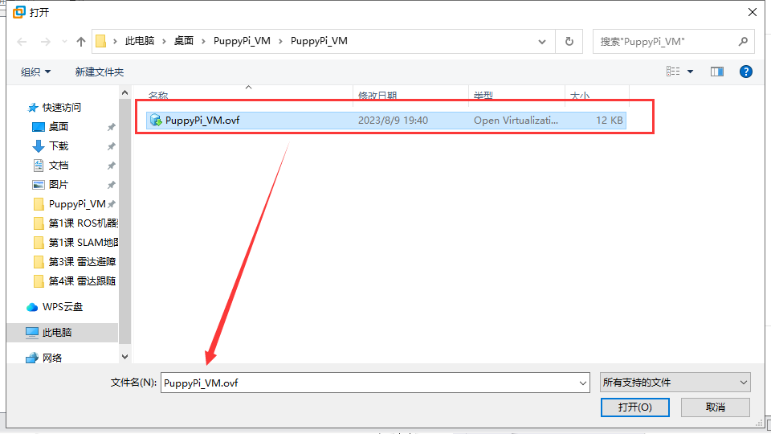
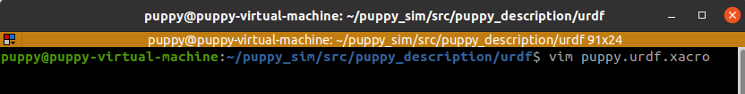
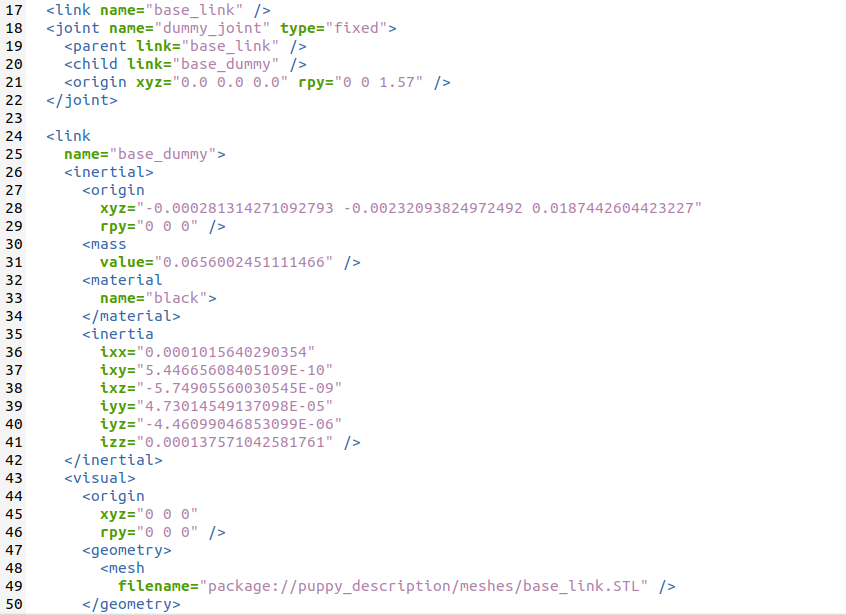
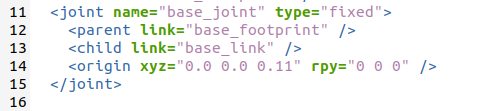
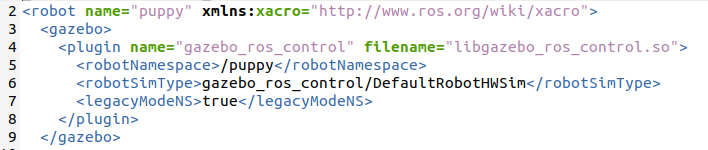

# ROS基础课程

## 1. ROS系统介绍

### 1.1 ROS操作系统介绍

在学习ROS系统前，我们需要先了解操作系统的定义。操作系统，顾名思义，即提供部分软件和硬件的接口，以供用户直接使用。因此，针对不同的平台、不同的功能，需要采用不同的操作系统来完成底层操作。

ROS系统是适用于机器人的开源操作系统。它提供类似于操作系统的服务，包括硬件抽象描述、底层驱动程序管理、共用功能的执行、程序间消息传递、程序发行包管理，它也提供一些工具和库，用于获取、编译、编写和执行多机融合的程序。

另外，ROS具备进程之间的通信，这是它与其他操作系统之间最大的区别。传统的操作系统，进程之间的通信需要系统来调用，这会消耗大量的系统资源，不适用于作为机器人的操作系统。

一个机器人的构成可能会包含多种传感器，以通过各模块间的通信协作来完成指定任务。因此进程之间有效快速的通信，是一个机器人必备的要求，而ROS则提供了这样的功能。


### 1.2 ROS的特点

1.  点对点设计，各个功能独立；

2.  结构简单，集成度高；

3.  工具包丰富，多语言支持，各个包可以采用不同的编程语言；

4.  免费且开源；

5.  社区丰富。

ROS官网：**https://wiki.ros.org**

## 2. ROS系统安装和环境搭建

本节课适用于Jetson Nano官方镜像下从0开始搭建ROS环境，这里提供两种ROS系统的安装方式，“方法一”为一键安装，只需要一条指令即可自动安装整个ROS系统；“方法二”则需要设置下载源配置、设置环境变量等步骤。

如果你是初次接触ROS的用户，建议选择“方法一”一键即可快速安装，在后续根据个人需求可选择“方法二”进行体验。

### 2.1 方法一：一键安装（推荐）

点击系统桌面的图标，打开命令行终端。在终端输入指令“**wget http://fishros.com/install -O fishros && . fishros**”，按下回车，然后输入密码。


接下来输入数字1，选择一键安装ROS。



在首次安装时需要换源并清理第三方源，所以输入数字1选择更换系统源再安装。


输入数字2选择更换系统源并清理第三方源。


输入数字1选择安装melodic(ROS1)版本。


输入数字1选择安装melodic(ROS1)桌面版，等待安装成功即可。


### 2.2 方法二：逐步安装（常规安装方式）

- #### 2.2.1 版本选择

不同的Ubuntu安装的ROS版本不同，其中Ubuntu18.04的ROS对应版本为Melodic。


- #### 2.2.2 检查Ubuntu的软件和更新源

1)  找到系统中的“**软件和更新**”。


2)  确保勾上互联网下载的选项，下载源更换成国内的，以阿里云为例。


- #### 2.2.3 设置ROS的下载源

1. 设置国内下载源

打开命令行终端，输入指令：

```commandline
sudo sh -c '. /etc/lsb-release && echo "deb http://mirrors.ustc.edu.cn/ros/ubuntu/ \`lsb_release -cs\` main" \> /etc/apt/sources.list.d/ros-latest.list'
```

按下回车，接着输入虚拟机的密码“**ubuntu**”（此密码为用户自行设置的，我们这里的密码为ubuntu）。


2. 设置公匙

输入指令

```commandline
sudo apt-key adv --keyserver 'hkp://keyserver.ubuntu.com:80' --recv-key C1CF6E31E6BADE8868B172B4F42ED6FBAB17C654
```

按下回车，如下图所示则设置成功。


3. 更新软件包

```commandline
sudo apt update
```

- #### 2.2.4 安装ROS

打开命令行终端，输入指令“**sudo apt install ros-melodic-desktop-full**”，等待下载安装完成，根据网络状况不同，安装过程大概要10分钟。

```commandline
sudo apt install ros-melodic-desktop-full
```

- #### 2.2.5 设置环境变量

打开命令行终端，依次输入指令“**echo "source /opt/ros/melodic/setup.bash" \>\> ~/.bashrc**”和“**source ~/.bashrc**”，完成环境变量配置。

```commandline
echo "source /opt/ros/melodic/setup.bash" >> ~/.bashrc
```

```commandline
source ~/.bashrc
```


- #### 2.2.6 安装rosdep

输入指令“**sudo apt-get install python3-rosdep**”按下回车，安装rosdep；出现安装确认提示，输入“**Y**”即可。

```commandline
sudo apt-get install python3-rosdep
```



- #### 2.2.7 初始化

1)  输入指令“**cd /etc/ros/rosdep/sources.list.d**”进入“**sources.list.d**”文件夹。

```commandline
cd /etc/ros/rosdep/sources.list.d
```

2)  输入指令“**sudo gedit 20-default.list**”，编辑此文件。

```commandline
sudo gedit 20-default.list
```

3)  将原文件中的内容替换为以下内容（**直接复制、粘贴，不需要换行，也不要手动输入**）。

```commandline
# os-specific li# os-specific listings first yaml https://gitee.com/wybros/rosdistro/raw/master/rosdep/osx-homebrew.yaml osx \# generic yaml https://gitee.com/wybros/rosdistro/raw/master/rosdep/base.yaml yaml https://gitee.com/wybros/rosdistro/raw/master/rosdep/python.yaml yaml https://gitee.com/wybros/rosdistro/raw/master/rosdep/ruby.yaml gbpdistro https://gitee.com/wybros/rosdistro/raw/master/releases/fuerte.yaml fuerte \# newer distributions (Groovy, Hydro, ...) must not be listed anymore, they are being fetched from the rosdistro index.yaml instead
```

4)  修改过程中，终端会出现警告，属于正常现象，不必理会。


5)  替换完成后，直接点击保存再关闭文件。


6)  输入指令“**cd /usr/lib/python2.7/dist-packages/rosdep2/**”,进入到“**rosdep2**”目录下。

```commandline
cd /usr/lib/python2.7/dist-packages/rosdep2/
```

7)  输入指令“**sudo gedit gbpdistro_support.py**”按下回车，若提示有输入虚拟机密码的提示，我们输入“**ubuntu**”（此密码为用户自行设置的，我们这里的密码为ubuntu），按下回车，即可打开“**gbpdistro_support.py**”文 件，找到“FUERTE_GBPDISTRO_URL”代码。




8)  将“ **https://raw.githubusercontent.com/ros/rosdistro/** ”修改为“ **https://gitee.com/wybros/rosdistro/raw/** ”，（只修改下图红框所示内容,后续内容无需更改）修改完成后点击保存，关闭即可。


9)  接着输入指令“**sudo gedit rep3.py**”，打开“**rep3.py**”文件，找到“REP3_TARGETS_URL”代码。




10) 将“ **https://raw.githubusercontent.com/ros/rosdistro/** ”修改为“ **https://gitee.com/wybros/rosdistro/raw/** ”，（只修改下图红框所示内容,后续内容无需更改）修改完成后点击保存，关闭即可。



11) 接着输入指令“**sudo gedit sources_list.py**”，打开“**sources_list.py**”文件，找到“**DEFAULT_SOURCES_LIST_URL**”代码。


12) 将“ **https://raw.githubusercontent.com/ros/rosdistro/** ”修改为“ **https://gitee.com/wybros/rosdistro/raw/** ”，（只修改下图红框所示内容,后续内容无需更改）修改完成后点击保存，关闭即可。


13) 输入指令“**cd /usr/lib/python2.7/dist-packages/rosdistro/**”，进入“**rosdistro**”目录下。


14) 输入指令“**sudo gedit \_\_init\_\_.py**”，进入“**\_\_init\_\_.py**”文件，找到“DEFAULT_INDEX_URL”代码。


15) 将“ **https://raw.githubusercontent.com/ros/rosdistro/** ”修改为“ **https://gitee.com/wybros/rosdistro/raw/** ”，（只修改下图红框所示内容,后续内容无需更改）修改完成后点击保存，关闭即可。


- #### 2.2.8更新

打开新的命令行终端，输入指令“**rosdep update**”更新。


出现如下信息，则代表更新成功了。


若出现下图读取超时的提示，可能是网络原因，用户可多输入几次“**rosdep update**”尝试更新；若还是更新不了，用户可检查“[2.2.7 初始化]()”的内容，确保修改的内容无误，后再次输入“**rosdep update**”进行更新。


## 3. ROS常用术语及命令说明

### 3.1 ROS文件系统的组成

ROS文件是由Packages和Manifests（package.xml）组成。

Packages：功能包，是ROS软件中的基本单元，包含节点源码、配置文件、数据定义等。

Manifest（package xml）：功能包的描述文件，用于定义功能包相关元信息之间的依赖关系，这些信息包括版本、维护者和许可协议等。

### 3.2 了解ROS的基本术语

> 下表是对ROS的部分基本术语的解释说明：

<table class="docutils" border="1">
<colgroup>
<col style="width: 28%" />
<col style="width: 71%" />
</colgroup>
<tbody>
<tr>
<td style="text-align: center;"><strong>术语名称</strong></td>
<td style="text-align: center;"><strong>说明</strong></td>
</tr>
<tr>
<td style="text-align: center;"><p>节点管理器</p>
<p>（ROS Master）</p></td>
<td style="text-align: left;">负责节点之间的连接与消息通信。</td>
</tr>
<tr>
<td style="text-align: center;">节点（Node）</td>
<td style="text-align: left;">在ROS中运行的最小处理单元，通常是一个可执行文件。每个节点可使用话题或服务与其它节点进行通信。</td>
</tr>
<tr>
<td style="text-align: center;">消息（Message）</td>
<td style="text-align: left;">是int、float和boolean等数据类型的变量。</td>
</tr>
<tr>
<td style="text-align: center;">话题（Topic）</td>
<td style="text-align: left;">一种单向异步通信机制。通过发布消息到话题或订阅话题的形式，可以在节点之间实现数据的传输。话题的类型由对应消息的类型决定。</td>
</tr>
<tr>
<td style="text-align: center;">发布（Publish）</td>
<td style="text-align: left;">以与话题内容对应的消息类型发送数据。</td>
</tr>
<tr>
<td style="text-align: center;">发布者（Publisher）</td>
<td style="text-align: left;">为执行发布，发布者节点在主节点上注册自己的话题等多种信息，并向希望订阅的订阅者节点发送消息。</td>
</tr>
<tr>
<td style="text-align: center;">订阅（Subscrib）</td>
<td style="text-align: left;">以与话题内容对应的消息类型接收数据。</td>
</tr>
<tr>
<td style="text-align: center;">订阅者（Subscriber）</td>
<td style="text-align: left;">为执行订阅，订阅者节点在主节点上注册自己的话题等多种信息，并从主节点接收所有发布了此节点需订阅话题的发布者节点的信息。</td>
</tr>
<tr>
<td style="text-align: center;">服务（Service）</td>
<td style="text-align: left;">一种双向同步通信机制。服务客户端请求对应于特定目的任务的服务，服务服务端进行服务响应。</td>
</tr>
<tr>
<td style="text-align: center;"><p>服务服务器</p>
<p>（Service Server）</p></td>
<td style="text-align: left;">以请求作为输入，响应作为输出的节点。</td>
</tr>
<tr>
<td style="text-align: center;"><p>服务客户端</p>
<p>（Service Client）</p></td>
<td style="text-align: left;">以响应作为输入，请求作为输出的节点。</td>
</tr>
</tbody>
</table>

### 3.3 了解ROS的常用文件

> 下表是对ROS中部分常用文件的介绍说明：

| **术语名称** | **说明** |
|:--:|:--:|
| urdf文件 | 描述机器人所有元素的模型文件，包含连杆（link）、关节（joint）、运动学参数（axis）、动力学参数（dynamics）、可视化模型（visual）和碰撞检测模型（collision）。 |
| srv文件 | 存放在srv文件夹下，用于定义ROS服务消息，包含请求和响应两个部分，请求与响应之间使用符号“---”进行分隔。 |
| msg文件 | 存放在msg文件夹下，用于定义ROS话题消息。 |
| package.xml | 描述功能包的属性，包含功能包的名字、版本号、作者等。 |
| CmakeLists.txt | 编译配置文件，使用Cmake编译。 |
| launch文件 | 启动文件，包含系统性启动机器人所需的node和services。 |

### 3.4 了解常用命令

ROS命令可以大致分为五个类型：ROS shell命令、ROS执行命令、ROS信息命令、ROS catkin命令、ROS功能包命令。下面是部分常用的基本命令，大家可简单学习一下：

> **ROS shell命令**

| **命令** |       **命令释义**        |       **详细说明**        |
|:--------:|:-------------------------:|:-------------------------:|
|  roscd   | ros+cd(changes directory) | 移动到指定的ROS功能包目录 |
|  rosls   |    ros+ls(lists files)    | 显示ROS功能包的文件和目录 |
|  rosed   |      ros+ed(editor)       |    编辑ROS功能包的文件    |
|  roscp   |   ros+cp(copies files)    |    复制ROS功能包的文件    |
|  rospd   |         ros+pushd         |   添加目录至ROS目录索引   |
|   rosd   |       ros+directory       |  显示ROS目录索引中的目录  |

> **ROS执行命令**

| **命令**  | **命令释义** |       **详细说明**       |
|:---------:|:------------:|:------------------------:|
|  roscore  |   ros+core   | 启动ROS Master节点管理器 |
|  rosrun   |   ros+run    |       启动ROS节点        |
| roslaunch |  ros+launch  |      启动launch文件      |
| rosclean  |   rosclean   |  检查或删除ROS日志文件   |

> **ROS信息命令**

|  **命令**  |     **命令释义**     |      **详细说明**       |
|:----------:|:--------------------:|:-----------------------:|
|  rostopic  |      ros+topic       |     确认ROS话题信息     |
| rosservice |     ros+service      |     确认ROS服务信息     |
|  rosnode   |       ros+node       |     确认ROS节点信息     |
|  rosparam  | ros+param(parameter) |  确认和修改ROS参数信息  |
|   rosbag   |       ros+bag        |    记录和回放ROS消息    |
|   rosmsg   |       ros+msg        |     显示ROS消息类型     |
|   rossrv   |       ros+srv        |     显示ROS服务类型     |
| rosversion |     ros+version      | 显示ROS功能包的版本信息 |
|   roswtf   |       ros+wtf        |       检查ROS系统       |

> **ROS catkin命令**

| **命令** | **详细说明** |
|:--:|:--:|
| catkin_create_pkg | 自动生成功能包 |
| catkin_make | 基于catkin构建系统，构建目录中所有的功能包 |
| catkin_eclipse | 修改以catkin构建系统生成的功能包，使其能在Eclipse环境中使用 |
| catkin_prepare_release | 更新由命令“catkin_generate_changelog”生成的CHANGELOG.rst文件 |
| catkin_generate_changelog | 在发布时生成或更新CHANGELOG.rst文件 |
| catkin_init_workspace | 初始化catkin构建系统的工作目录 |
| catkin_find | 搜寻所有正在使用的工作目录 |

> **ROS功能包命令**

|   **命令**    |    **命令释义**    |               **详细说明**                |
|:-------------:|:------------------:|:-----------------------------------------:|
|    rospack    |   ros+pack(age)    |         查看与ROS功能包相关的信息         |
|  rosinstall   |    ros+install     |             安装ROS附加功能包             |
|    rosdep     | ros+dep(endencies) |        安装指定功能包的依赖性文件         |
|   roslocate   |     ros+locate     |           显示ROS功能包相关信息           |
| roscreate-pkg |   ros+create-pkg   | 自动生成ROS功能包（用于旧的rosbuild系统） |
|    rosmake    |      ros+make      |   构建ROS功能包（用于旧的rosbuild系统）   |


